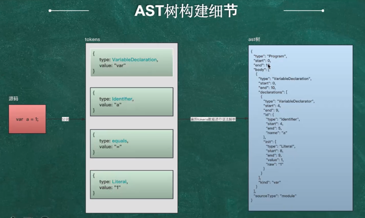

# 概述

## ast 构建过程

源码--》词法分析--》生成词法数组--》语法分析--》ast树

1. 源码：首先有源代码，它是你要分析和构建AST的输入。
2. 词法分析（Lexical Analysis）：源代码经过词法分析器（Lexer）处理，将源代码分解为一个个的词法单元（tokens）。每个词法单元代表了源代码中的一个基本语义单元，例如关键字、标识符、运算符、常量等。词法分析器会生成词法单元数组。
3. 语法分析（Parsing）：词法单元数组传递给语法分析器（Parser），它根据语法规则进行处理，构建AST。语法分析器使用上下文无关文法（Context-Free Grammar）来分析源代码的语法结构，并根据语法规则将词法单元组织成一个层次结构的树形数据结构，即AST。
4. AST构建：在语法分析的过程中，根据语法规则和语法分析器的规则，构建AST的节点。每个节点代表了源代码中的一个语法结构，例如表达式、语句、函数等。每个节点包含了相应的属性，例如节点类型、操作符、操作数等。AST的构建是递归进行的，从最底层的词法单元开始构建，逐步组合形成更复杂的语法结构。
5. 语义分析（Semantic Analysis）：AST构建完成后，进行语义分析。语义分析器对AST进行遍历，检查代码的语义正确性，例如类型检查、变量声明检查、作用域检查等。在这个过程中，可以进行符号表的构建，以记录变量和函数的信息。
6. 代码生成或解释执行：在完成语义分析后，可以进行代码生成或解释执行。代码生成将AST转换为目标机器代码或字节码，以便直接在计算机上执行。解释执行则是逐行解释AST，并按照语义执行对应的操作。这取决于具体的编程语言和编译器/解释器。
7. 计算机执行：最终，计算机根据生成的目标机器代码或通过解释执行AST，执行程序并产生相应的结果。


## ast 构建细节

遍历源码进行分词算法生成`tokens`数组，再遍历`tokens`数组进行语法解析，最终生成ast树，顶层是一个`Program`程序，
start代码开始位置，end是代码结束位置，body是具体代码内容。



主要的代码映射关系`Identifier`标识符是a,`init`初始化为1

```json
{
  "type": "VariableDeclaration",
  "start": 0,
  "end": 10,
  "declarations": [
    {
      "type": "VariableDeclarator",
      "start": 4,
      "end": 9,
      "id": {
        "type": "Identifier",
        "start": 4,
        "end": 5,
        "name": "a"
      },
      "init": {
        "type": "Literal",
        "start": 8,
        "end": 9,
        "value": 1,
        "raw": "1"
      }
    }
  ],
  "kind": "var"
}
```

为什么要分词生成`tokens`数组


## babel 核心模块


## 理解path和node

path就是路径，node就是节点，找到某个node节点必须通过path，所有node节点都是绝对路径


## path api

node可以通过path上api进行操作的


