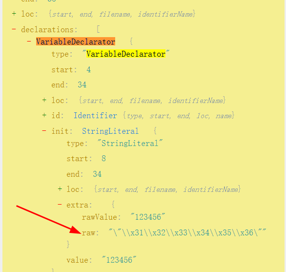

# AST操作之删除节点

需求：还原十六进制字符串,比如需要处理的这样一个字串:

```javascript
var a = "\x31\x32\x33\x34\x35\x36";
```

这里可以看到raw字段显示的是十六进制字符串



删除raw字段，就恢复十进制字符串

```javascript
const fs = require('fs');
const {parse} = require("@babel/parser");
const traverse = require("@babel/traverse").default;
const generator = require("@babel/generator").default;
let encode_file = "./encode.js";

let js_code = fs.readFileSync(encode_file, {encoding: "utf-8"});
let ast = parse(js_code, {
    sourceType: 'module',
});


const visitor = {
    StringLiteral(path) {
        delete path.node.extra.raw;
    },
};

traverse(ast, visitor);

// 将修改后的AST重新生成为代码
const modifiedCode = generator(ast).code;
console.log(modifiedCode);
```