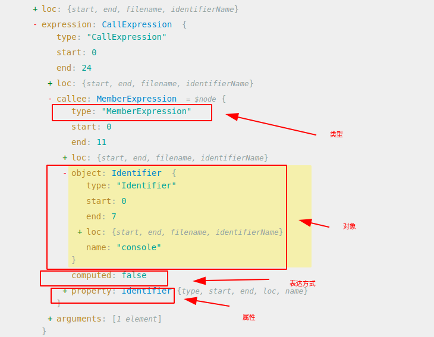
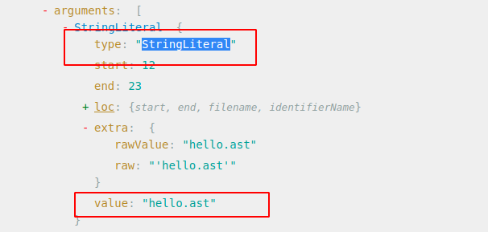

# 通过在线解析网站认识AST结构

这是在线的ast结构解析网站

https://astexplorer.net/

如何设置：因为我们使用的是babel库来操作AST，因此我们在这里需要选择 @babel/parse

测试代码
```javascript
console.log('hello.ast')
```


具体结构解释如下


type：当节点的类型属性为 "File" 时，它表示该节点代表整个代码文件的根节点。这种节点通常作为 AST 的最顶层节点。

start：在 AST 中通常表示起始节点或入口节点。

end：属性可以用于指示该结构在源代码中的结束位置。

loc：节点常常用于存储 AST 中各个节点在源代码中的位置信息，包括起始位置和结束位置。这些位置信息通常以行号和列号的形式表示，或者使用偏移量来表示。

具体而言，一个 "loc" 节点可能包含以下属性：

* "start"：表示节点在源代码中的起始位置，通常由行号和列号或偏移量组成。
* "end"：表示节点在源代码中的结束位置，也是由行号和列号或偏移量组成。

comments：节点通常用于表示代码中的注释信息。

errors：节点通常用于表示代码中的语法或语义错误信息。

program：节点通常表示整个程序的根节点，它是 AST 中的最顶层节点，包含了程序的全部内容。

**AST 节点类型对照表**

| 序号 | 类型原名称                | 中文名称      | 描述                                         |
|----|----------------------|-----------|--------------------------------------------|
| 1  | Program              | 程序主体      | 整段代码的主体                                    |
| 2  | VariableDeclaration  | 变量声明      | 声明一个变量，例如 var let const                    |
| 3  | FunctionDeclaration  | 函数声明      | 声明一个函数，例如 function                         |
| 4  | ExpressionStatement  | 表达式语句     | 通常是调用一个函数，例如 console.log()                 |
| 5  | BlockStatement       | 块语句       | 包裹在 {} 块内的代码，例如 if (condition){var a = 1;} |
| 6  | BreakStatement       | 中断语句      | 通常指 break                                  |
| 7  | ContinueStatement    | 持续语句      | 通常指 continue                               |
| 8  | ReturnStatement      | 返回语句      | 通常指 return                                 |
| 9  | SwitchStatement      | Switch 语句 | 通常指 Switch Case 语句中的 Switch                |
| 10 | IfStatement          | If 控制流语句  | 控制流语句，通常指 if(condition){}else{}            |
| 11 | Identifier           | 标识符       | 标识，例如声明变量时 var identi = 5 中的 identi        |
| 12 | CallExpression       | 调用表达式     | 通常指调用一个函数，例如 console.log()                 |
| 13 | BinaryExpression     | 二进制表达式    | 通常指运算，例如 1+2                               |
| 14 | MemberExpression     | 成员表达式     | 通常指调用对象的成员，例如 console 对象的 log 成员           |
| 15 | ArrayExpression      | 数组表达式     | 通常指一个数组，例如 [1, 3, 5]                       |
| 16 | NewExpression        | New 表达式   | 通常指使用 New 关键词                              |
| 17 | AssignmentExpression | 赋值表达式     | 通常指将函数的返回值赋值给变量                            |
| 18 | UpdateExpression     | 更新表达式     | 通常指更新成员值，例如 i++                            |
| 19 | Literal              | 字面量       | 字面量                                        |
| 20 | BooleanLiteral       | 布尔型字面量    | 布尔值，例如 true false                          |
| 21 | NumericLiteral       | 数字型字面量    | 数字，例如 100                                  |
| 22 | StringLiteral        | 字符型字面量    | 字符串，例如 vansenb                             |
| 23 | SwitchCase           | Case 语句   | 通常指 Switch 语句中的 Case                       |

接下来分析`program`的`body`子节点，如下图


`ExpressionStatement`类型节点必然有`expression`节点其类型是`CallExpression`，它同时又包含了`callee`和`arguments`两个子节点。
* "callee" 节点：表示被调用的函数，简单理解就是函数名，如`console.log`。
* "arguments" 节点：表示传递给函数的参数列表，如`hello.ast`。


`callee`节点类型`MemberExpression`表示（成员表达式，通常指调用对象的成员，例如 console 对象的 log 成员），`callee`包含了`object`，
`property`和`computed`节点。

* "object" 节点：表示函数调用的对象或引用。它可以是一个标识符、成员访问表达式或其他可调用的表达式。"object" 节点通常表示函数所属的对象或命名空间。
* "property" 节点：表示被调用函数的属性或方法名称。它通常是一个标识符节点，表示函数在对象中的属性或方法名。
* "computed" 节点：表示属性名是否为动态计算的结果。如果 "computed" 为 true，则表示属性名是根据运行时的表达式计算得出的；如果为 false，则表示属性名是静态的。



`arguments`节点下有一个`StringLiteral`其类型是字符串。

