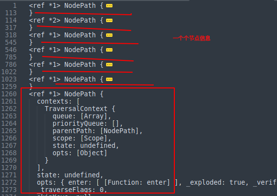
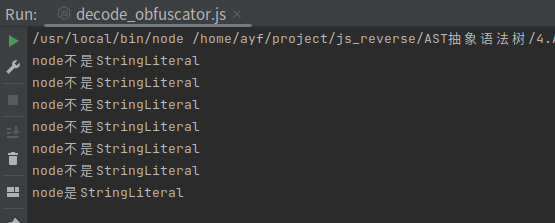

# AST初次尝试

## 将JavaScript源代码转换成一棵AST树

**读取JavaScript源文件**

`fs`是一个内置模块，用于处理文件系统操作。它提供了一组方法，使你能够读取、写入、修改和删除文件，以及执行其他与文件系统相关的操作。

```javascript
// 从文件获取js的源代码 fs 库
const fs = require('fs');

// 源文件名默认为 encode.js,生成处理后的目标文件名默认为 decode_result.js
let encode_file = "./encode.js", decode_file = "./decode_result.js";

// node decode_obfuscator.js encode.js decode_result.js
// encode.js 混淆前js源代码的路径
// decode_result.js 生成新js代码的路径
if (process.argv.length > 2) {
encode_file = process.argv[2];
}
if (process.argv.length > 3) {
decode_file = process.argv[3];
}

// 再保存到一个变量中，对这个变量进行处理即可:
let js_code = fs.readFileSync(encode_file, {encoding: "utf-8"});
```

**打印ast树**

`@babel/parser`解析器（parser）用于将源代码转换为抽象语法树（AST）。

```javascript
// 花括号 {} 表示解构赋值（Destructuring Assignment）语法，它用于从导入的模块中选择性地提取需要的属性或方法。
const {parse} = require("@babel/parser");
let ast = parse(js_code);

// 打印ast树
console.log(ast)
// 打印整个ast树
console.log(JSON.stringify(ast,null,'\t'))
```

**效果**


## 遍历各个节点的函数

`@babel/traverse`指的是遍历或遍历抽象语法树的过程，通过遍历 AST，可以分析程序的结构、执行静态分析、进行代码生成等操作。

```javascript
const traverse = require("@babel/traverse").default;
const visitor =
{
// 在 Babel 的 AST 遍历过程中，enter 是一个回调函数，用于在进入每个节点时执行特定的操作
enter(path) {
// 输出该节点的信息
console.log(path);
},
}


//调用插件，处理源代码
traverse(ast, visitor);
```
**效果**



## 节点的类型判断及构造等操作

`@babel/types`是Babel工具链中的一个模块，它提供了一组用于创建、操作和检查AST节点的函数和工具。

这里就可以配合`@babel/traverse`遍历语法树，打印出`StringLiteral`类型的节点

```javascript
const types = require("@babel/types");
const traverse = require("@babel/traverse").default;
const visitor =
    {
        // 在 Babel 的 AST 遍历过程中，enter 是一个回调函数，用于在进入每个节点时执行特定的操作
        enter(path) {
            // 判断节点类型是否是StringLiteral
            if (types.isStringLiteral(path)) {
                console.log("node是StringLiteral");
            } else {
                console.log("node不是StringLiteral");
            }
        },
    }

traverse(ast, visitor);
```
**效果**



## 将处理完毕的AST转换成JavaScript源代码

`@babel/generator`的default方法来将AST转换回可执行的JavaScript代码

```javascript
const generator = require("@babel/generator").default;
const generatedCode = generator(ast, {});
console.log(generatedCode);

// 写入文件
let {code} = generator(ast);
fs.writeFile('decode.js', code, (err) => {});
```

**效果**

