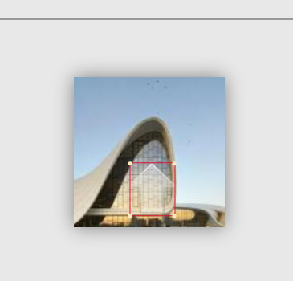
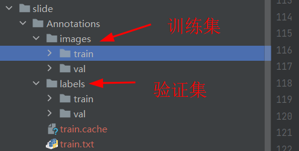
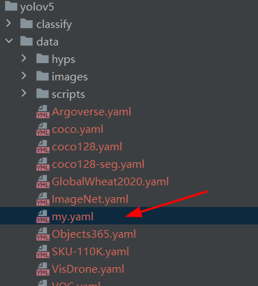
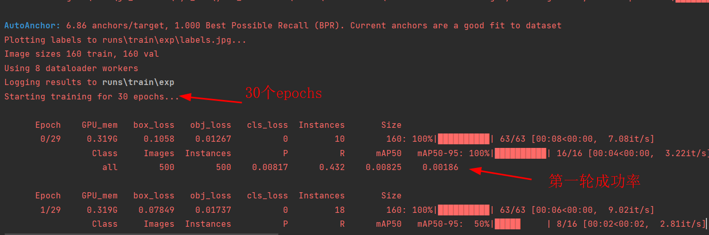
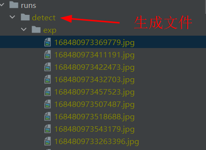
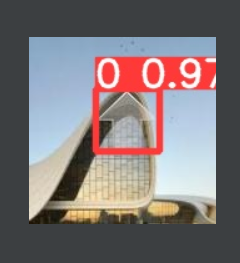

# 知识点：数据标注，yolov5目标检测框架

## voc数据集

     VOC2012
         ├── Annotations               所有的图像标注信息(XML文件)
         ├── ImageSets    
         │   ├── Action                人的行为动作图像信息
         │   ├── Layout                人的各个部位图像信息
         │   │
         │   ├── Main                  目标检测分类图像信息
         │   │     ├── train.txt       训练集(5717)
         │   │     ├── val.txt         验证集(5823)
         │   │     └── trainval.txt    训练集+验证集(11540)
         │   │
         │   └── Segmentation          目标分割图像信息
         │         ├── train.txt       训练集(1464)
         │         ├── val.txt         验证集(1449)
         │         └── trainval.txt    训练集+验证集(2913)
         │ 
         ├── JPEGImages                所有图像文件
         ├── SegmentationClass         语义分割png图（基于类别）
         └── SegmentationObject        实例分割png图（基于目标）

### 如何数据标注

精灵标注助手

http://www.jinglingbiaozhu.com/

创建标注项目

手动标注

导出voc数据，导出数据到Annotations文件夹

查看导出的xml数据信息

    <?xml version="1.0" ?>
    <annotation>
    <folder>JPEGImages</folder>
    <filename>16329967796329784.jpg</filename>
    <path>E:\code\js_reverse\ayf_ocr\yolo_databases\VOC2012\JPEGImages\16329967796329784.jpg</path>
    <source>
        <database>Unknown</database>
    </source>
    <size>
        <width>150</width>
        <height>150</height>
        <depth>3</depth>
    </size>
    
    <segmented>0</segmented>
        <object>
        <name>缺口</name>
        <pose>Unspecified</pose>
        <truncated>0</truncated>
        <difficult>0</difficult>
        <bndbox>
            <xmin>56</xmin>
            <ymin>86</ymin>
            <xmax>100</xmax>
            <ymax>135</ymax>
        </bndbox>
    </object>
    </annotation>

## 目标检测框架 yolov5

github下载

https://github.com/ultralytics/yolov5

Python>=3.7.0和PyTorch>=1.7

    git clone https://github.com/ultralytics/yolov5  # clone
    cd yolov5
    pip install -r requirements.txt  # install

这里的 yolov5 数据集不支持中文路径

创建数据集目录`VOC2012/1_makedir.py`

    import os
    
    # 第一步。对目录环境进行检查，是否满足处理要求
    def file_exists(filename, message):
        if not os.path.exists(filename):
            raise FileExistsError(message)
    def make_dirs(dirs):
        try:
            os.makedirs(dirs)
        except FileExistsError:
            print(dirs + ' 目录存在，自动跳过')
    
    # 第二步。创建关键目录
    file_exists('Annotations', 'VOC标注，Annotations目录不存在')
    file_exists('JPEGImages', 'VOC标注，JPEGImages 图片目录不存在')
    make_dirs('images/train')
    make_dirs('images/val')
    make_dirs('labels/train')
    make_dirs('labels/val')

生成需要训练的数据`VOC2012/2_movefiles.py`，执行时修改类别

    # ------------------------------------------------------------
    # ↓↓标注的类别，很重要很重要，这里必须要改，按照自己的类别去改|
    
    classes = ['缺口']
    
    # ↑↑标注的类别，很重要很重要，这里必须要改，按照自己的类别去改|
    # ------------------------------------------------------------

训练集/验证集图片数据

训练集/验证集标签数据（坐标数据归一化）

## 生成yolov5所需要的训练数据

为了快速上手yolov5，直接生成数据进行测试，这里直接生成500张数据，运行yolov5需要数据集，

运行`\slide\pic_product.py`,两种模式`train/val`

    number = input('输入要生成的数量')
    style = input('输入模式：train/val')
    for i in range(int(number)):
        print('正在生成{}，第{}/{}张'.format(style, i + 1, number))
        img = Image.open("drag/{}".format(random.choice(os.listdir('drag'))))
        path = addText(img,
                       path='./Annotations/images/{}/{}.jpg'.format(style, str(time.time()).replace('.', '')),
                       pic_size=(img.size[0], img.size[1]),
                       size=24,
                       style=style
                       )

生成的数据如下

## 开始训练yolov5

**一、设置训练参数 yolov5\train.py**

1.训练模型`yolov5s.pt`

    parser.add_argument('--weights', type=str, default=ROOT / 'yolov5s.pt', help='initial weights path')

github可以下载weights

2.训练数据`data`

    parser.add_argument('--data', type=str, default=ROOT / 'data/my.yaml', help='dataset.yaml path')

my.yaml文件

    train: E:\code\js_reverse\ayf_ocr\yolo_databases\slide\Annotations\train.txt
    val: E:\code\js_reverse\ayf_ocr\yolo_databases\slide\Annotations\val.txt
    
    
    # Classes
    names:
      0: 0

3.训练数据迭代次数`epochs`

    parser.add_argument('--epochs', type=int, default=30, help='total training epochs')

4.训练图片大小`imgsz`

    parser.add_argument('--imgsz', '--img', '--img-size', type=int, default=150, help='train, val image size (pixels)')

**二、将训练的分类修改成1 yolov5\models\yolov5s.yaml**
    
    nc: 1  # number of classes

**三、启动训练 yolov5\train.py**

会生成一个run文件

**四、启动推理 yolov5\detect.py**

1.训练模型`best.pt`

    parser.add_argument('--weights', nargs='+', type=str, default=ROOT / 'runs/train/exp/weights/best.pt', help='model path or triton URL')

2.资源内容`source`

    parser.add_argument('--source', type=str, default=ROOT / '../slide/Annotations/images/val', help='file/dir/URL/glob/screen/0(webcam)')

3.图片大小`imgsz`

    parser.add_argument('--imgsz', '--img', '--img-size', nargs='+', type=int, default=[150], help='inference size h,w')

生成的文件夹

推理效果

