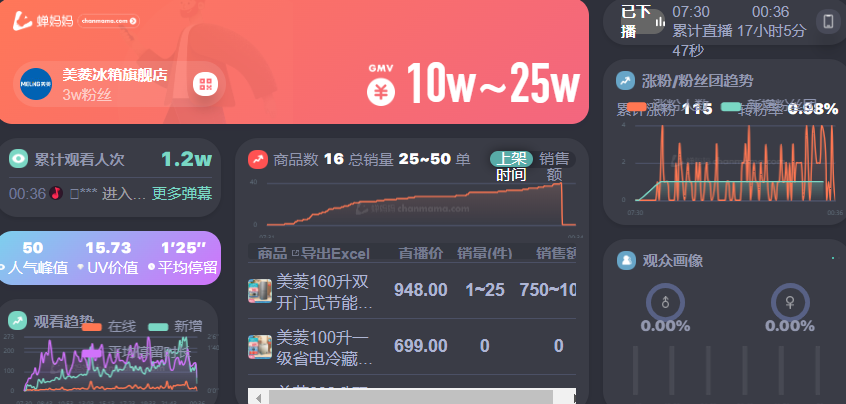
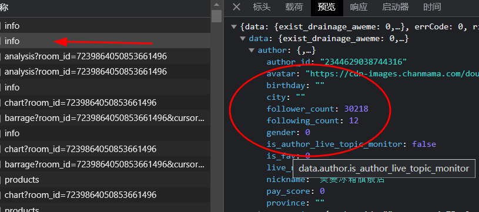
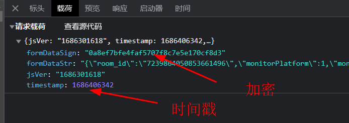
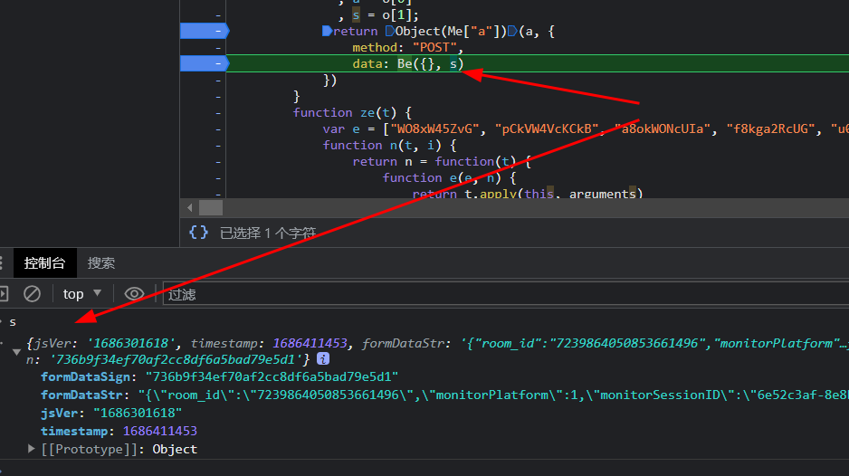
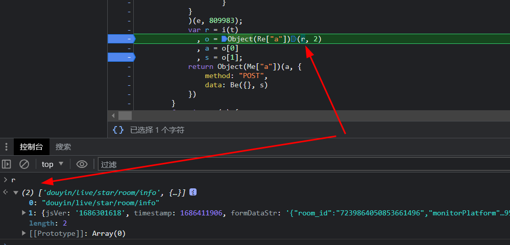
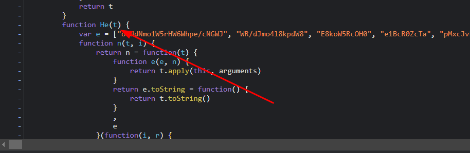
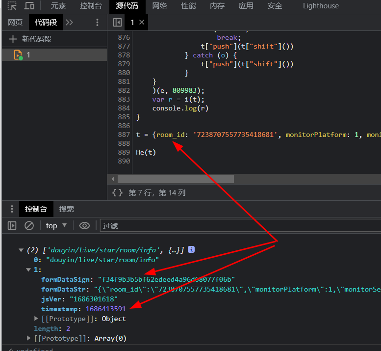

# 知识点: webpack打包

蝉妈妈大屏抖音直播实时数据是抓取抖音直播间数据的实时数据，有类似需求的公司但没有能力去搞定抖音，抓取蝉妈妈数据也是一个不错的选择。

观察请求接口内容

查看请求参数，可以看到`formDataSign`加密参数、`timestamp`和`jsVer`时间戳 ，经过观察发现加密参数是实时变化的。

打断点找到变量`s`，控制台输出发现`post`请求的内容，那么这个`s`怎么来的？

继续打断点向上找又发现了`r`，接下来就是`r`如何生成的。

以此类推`r`是`i(t)`生成了，`t`怎么来的呢？是通过`He(t)`传入的

把`He(t)`这个函数扣下来，在浏览器控制台中测试一下

成功生成加密参数
