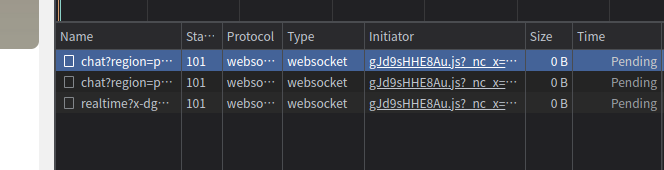

fb测试地址

    https://www.facebook.com/profile.php?id=100055837744229

打开f12，刷新页面，发现fb存在 `pending` 连接。

先发送点内容测试一下 `”在最早在最早在最早在”`，单击 hex viewer 命令切换到utf-8显示格式

发送的内容有了。分别用以下变量进行全局搜索，发现 `version_id` 只存在一处

    {
    "request_id" : 135 ,
    "type" : 3 ,
    "payload" : "{\"version_id\":\"5374491402668733\",\"tasks\":[{\"label\":\"46\",\"payload\":\"{\\"thread_id\\":100010764288690,\\"otid\\":\\"6967764888584867991\\",\\"source\\":1966082,\\"send_type\\":1,\\"text\\":\\"在最早在最早在最早在\\n\\",\\"initiating_source\\":0,\\"skip_url_preview_gen\\":0}\",\"queue_name\":\"100010764288690\",\"task_id\":59,\"failure_count\":null},{\"label\":\"21\",\"payload\":\"{\\"thread_id\\":100010764288690,\\"last_read_watermark_ts\\":1661244604250,\\"sync_group\\":1}\",\"queue_name\":\"100010764288690\",\"task_id\":60,\"failure_count\":null}],\"epoch_id\":6967764888764024872,\"data_trace_id\":\"#/Fg8S8JQS66+1KJPWt0yig\"}" ,
    "app_id" : "2220391788200892"
    }

断点调试看看

果然内容在 `tasks` 中

以下是 WebSocket 对象的相关事件。

    open	Socket.onopen	连接建立时触发
    message	Socket.onmessage	客户端接收服务端数据时触发
    error	Socket.onerror	通信发生错误时触发
    close	Socket.onclose	连接关闭时触发
    Socket.send()	使用连接发送数据
    Socket.close()	关闭连接
    
先对 `Socket.send()` 打断点，看能不能找到 `”在最早在最早在最早在”`的位置