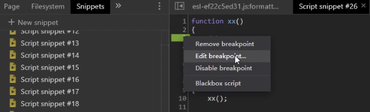

## 分类
### 显性

debugger

        非虚拟机 右键编辑当前断点的类型，置成 false，
        重写代码，谷歌内核默认提供
        浏览器插件：油猴
        代理替换： fiddler 
        虚拟机 （eval Function） 运行后进入虚拟机状态VM4746 瑞数，
        debugger 可以被 hook
        
死循环（打开新页面，写你的历史记录，url）

    写法：循环语句，无限制递归，两个方法相互调用
    for(;;)
    while(true)
    

### 隐性（暗桩）

    引向错误的逻辑
    浏览器正常的堆栈

### 检测方法

    按下f2的建，键盘监听
    检测浏览器内外的高度差值
    检测开发者人员工具变量是否为true
    利用代码断点时间差
    检测conslog调用的次数
    利用toString
    检测非浏览器环境
    
案例中国移动的 debugger
       
    # 重写原形链 Function.prototype.constructor
    var aaa = Function.prototype.constructor
    
    Function.prototype.constructor = function(x){
        if(x=="debugger"){
                return AAA(x);
            }
        return function(){};
    }