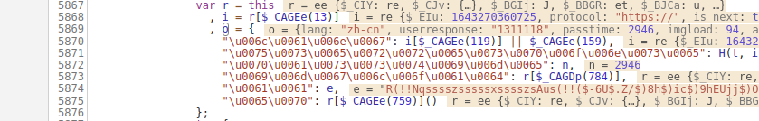
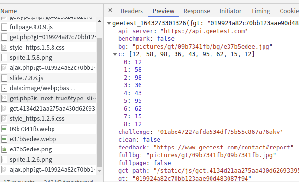
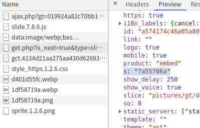
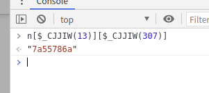

## 找出 l 值

    l = V[$_CAGEe(342)](gt[$_CAGEe(209)](o), r[$_CAGEe(742)]())
    
分析代码-字符串还原

    l = V["encrypt"](gt["stringify"](o), random_())
    
找到 gt[$_CAGEe(209)](o) 中的 o 值在哪里

这里的 o 值是

    aa: "N-./.020320/.,(!!Outtt(((((c(((((((tyyttssysyy)pttt(!!(G91r1201204.205-213/2/w2011511/2/M"
    ep: {v: "7.8.6", $_BHR: false, me: true, tm: {…}, td: -1}
    imgload: 87
    lang: "zh-cn"
    passtime: 307
    qyjx: "1125717085"
    rp: "d78cb570ccb72efc772b94129c32dfbe"
    userresponse: "444444a444a4449db"
    
刷新以下测试 o 值

    aa: "H----/0r..-,(!!Its(((((!*yy(((t~stst*~ttytttvysstvssyvvs(p!!($)I020202020202111202/111111119w1111119cc0$)0$,T"
    ep: {v: "7.8.6", $_BHR: false, me: true, tm: {…}, td: -1}
    imgload: 87
    lang: "zh-cn"
    passtime: 750
    qyjx: "1125717085"
    rp: "9f9fdd22bdf7b64bc7624690d3974e17"
    userresponse: "4a444444aaa4a898833"

测试 gt[$_CAGEe(209)](o) 值

    {
    "lang":"zh-cn",
    "userresponse":"4a444444aaa4a898833",
    "passtime":750,
    "imgload":87,
    "aa":"H----/0r..-,(!!Its(((((!*yy(((t~stst*~ttytttvysstvssyvvs(p!!($)I020202020202111202/111111119w1111119cc0$)0$,T",
    "ep":{
    "v":"7.8.6",
    "$_BHR":false,
    "me":true,
    "tm":{
    "a":1643272129938,
    "b":1643272130234,
    "c":1643272130235,
    "d":0,
    "e":0,
    "f":1643272129940,
    "g":1643272129940,
    "h":1643272129940,
    "i":1643272129955,
    "j":1643272130009,
    "k":1643272129984,
    "l":1643272130009,
    "m":1643272130104,
    "n":1643272130115,
    "o":1643272130238,
    "p":1643272131773,
    "q":1643272131773,
    "r":1643272131775,
    "s":1643272131781,
    "t":1643272131781,
    "u":1643272131781
    },
    "td":-1
    },
    "qyjx":"1125717085",
    "rp":"9f9fdd22bdf7b64bc7624690d3974e17"
    }
    
    {
    "lang":"zh-cn",
    "userresponse":"ddd6eeee6d6ed6dbf8",
    "passtime":590,
    "imgload":80,
    "aa":"H(!*!Xsssstsssyytustttsysw(?!,!($*@0EM21E189N203.128$,/)",
    "ep":{
    "v":"7.8.6",
    "$_BHR":false,
    "me":true,
    "tm":{
    "a":1643273283436,
    "b":1643273283590,
    "c":1643273283590,
    "d":0,
    "e":0,
    "f":1643273283438,
    "g":1643273283438,
    "h":1643273283438,
    "i":1643273283447,
    "j":1643273283501,
    "k":1643273283484,
    "l":1643273283501,
    "m":1643273283571,
    "n":1643273283577,
    "o":1643273283595,
    "p":1643273288664,
    "q":1643273288664,
    "r":1643273288666,
    "s":1643273288672,
    "t":1643273288672,
    "u":1643273288672
    },
    "td":-1
    },
    "qyjx":"1125717085",
    "rp":"0a7460fff791147dc72273e20a2aa070"
    }
    
这里判断这个 aa 值可能就是轨迹线了，进行跟踪栈

找到 l 生成的代码

    l = n[$_CJJIW(1078)][$_CJJJd(1069)](n[$_CJJIW(1078)][$_CJJJd(1051)](), n[$_CJJJd(13)][$_CJJIW(1045)], n[$_CJJIW(13)][$_CJJIW(307)]);

进行字符串转换

    l = n["$_CIBw"]["$_BBCA"](n["$_CIBw"]["$_GEy"](), n["$_CIY"]["c"], n["$_CIY"]["s"]);
    
对参数进行打印

    n["$_CIBw"]["$_GEy"]()
    "O(!!Mssysststysssttsts(!!($*.820120111111111V$*/"
    
    n["$_CIY"]["c"]
    (9) [12, 58, 98, 36, 43, 95, 62, 15, 12]

    n["$_CIY"]["s"]
    "3f2c2a75"
    
这里的 n["$_CIY"]["c"] 值，在点击验证码中可以在以下地址得到

    https://api.geetest.com/get.php?is_next=true&type=slide3&gt=019924a82c70bb123aae90d483087f94&challenge=574174c46a05a80900ac2befab3868b3&lang=zh-cn&https=true&protocol=https%3A%2F%2F&offline=false&product=embed&api_server=api.geetest.com&isPC=true&autoReset=true&width=100%25&callback=geetest_1643275273597

这里的 n["$_CIY"]["s"] 值，同样在上面的地址中得到

并且验证是正确的

最后的 n["$_CIBw"]["$_GEy"]() 值,大概是轨迹值

    "\u0024\u005f\u0047\u0045\u0079": function() {
        var $_BEGIH = lTloj.$_CX
          , $_BEGHL = ['$_BEHBT'].concat($_BEGIH)
          , $_BEGJJ = $_BEGHL[1];
        $_BEGHL.shift();
        var $_BEHAr = $_BEGHL[0];
        function n(t) {
            var $_DBEIz = lTloj.$_DP()[0][4];
            for (; $_DBEIz !== lTloj.$_DP()[2][3]; ) {
                switch ($_DBEIz) {
                case lTloj.$_DP()[0][4]:
                    var e = $_BEGJJ(430)
                      , n = e[$_BEGJJ(182)]
                      , r = $_BEGIH(33)
                      , i = Math[$_BEGIH(383)](t)
                      , o = parseInt(i / n);
                    n <= o && (o = n - 1),
                    o && (r = e[$_BEGIH(122)](o));
                    var s = $_BEGIH(33);
                    return t < 0 && (s += $_BEGJJ(456)),
                    r && (s += $_BEGJJ(459)),
                    s + r + e[$_BEGIH(122)](i %= n);
                    break;
                }
            }
        }
        var t = function(t) {
            var $_BEHDi = lTloj.$_CX
              , $_BEHCK = ['$_BEHGM'].concat($_BEHDi)
              , $_BEHEF = $_BEHCK[1];
            $_BEHCK.shift();
            var $_BEHFx = $_BEHCK[0];
            for (var e, n, r, i = [], o = 0, s = 0, a = t[$_BEHEF(182)] - 1; s < a; s++)
                e = Math[$_BEHEF(156)](t[s + 1][0] - t[s][0]),
                n = Math[$_BEHDi(156)](t[s + 1][1] - t[s][1]),
                r = Math[$_BEHDi(156)](t[s + 1][2] - t[s][2]),
                0 == e && 0 == n && 0 == r || (0 == e && 0 == n ? o += r : (i[$_BEHEF(140)]([e, n, r + o]),
                o = 0));
            return 0 !== o && i[$_BEHDi(140)]([e, n, o]),
            i;
        }(this[$_BEGJJ(361)])
          , r = []
          , i = []
          , o = [];
        return new ct(t)[$_BEGIH(84)](function(t) {
            var $_BEHIs = lTloj.$_CX
              , $_BEHHw = ['$_BEIBE'].concat($_BEHIs)
              , $_BEHJy = $_BEHHw[1];
            $_BEHHw.shift();
            var $_BEIAO = $_BEHHw[0];
            var e = function(t) {
                var $_BEIDv = lTloj.$_CX
                  , $_BEICk = ['$_BEIGW'].concat($_BEIDv)
                  , $_BEIEU = $_BEICk[1];
                $_BEICk.shift();
                var $_BEIFh = $_BEICk[0];
                for (var e = [[1, 0], [2, 0], [1, -1], [1, 1], [0, 1], [0, -1], [3, 0], [2, -1], [2, 1]], n = 0, r = e[$_BEIDv(182)]; n < r; n++)
                    if (t[0] == e[n][0] && t[1] == e[n][1])
                        return $_BEIEU(413)[n];
                return 0;
            }(t);
            e ? i[$_BEHIs(140)](e) : (r[$_BEHJy(140)](n(t[0])),
            i[$_BEHJy(140)](n(t[1]))),
            o[$_BEHJy(140)](n(t[2]));
        }),
        r[$_BEGJJ(444)]($_BEGIH(33)) + $_BEGIH(407) + i[$_BEGIH(444)]($_BEGJJ(33)) + $_BEGIH(407) + o[$_BEGIH(444)]($_BEGIH(33));
    }
    
发现是平坦流，线开头结尾断点
