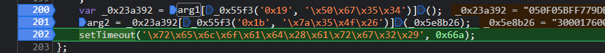

## 问题

在JS逆向系列课的第6课《初窥⻔径 阻挠爬⾍⼯程师的⽆限 debugger》中，我们学会了如何处理无限 debugger。 那么这是一道综合题，在过掉无限 debugger 后找出关键加密逻辑，并模拟。请运用你所学到的或是积累的知识，尝试做一下这道题吧~ 提示：注意Cookie

如果关键参数 arg1 为 5D6DBFF4776ED19E013868C0663AC4A6FD3C2FEB，那么 set 的关键 cookie arg2 是多少？

1.打开浏览器开发者工具全局搜索,清除cookie数据，刷新页面

2.过掉 debugger , 调试F11进入内部执行函数

3.搜索 arg1 ，很容易就定位代码位置

    var _0x23a392 = arg1[_0x55f3('0x19', '\x50\x67\x35\x34')]();
    arg2 = _0x23a392[_0x55f3('0x1b', '\x7a\x35\x4f\x26')](_0x5e8b26);
    setTimeout('\x72\x65\x6c\x6f\x61\x64\x28\x61\x72\x67\x32\x29', 0x66a);
    
4.控制台测试输出

5.结果

    a3c0e93f77bfd38a6be3e0d72665bdfd2cead199