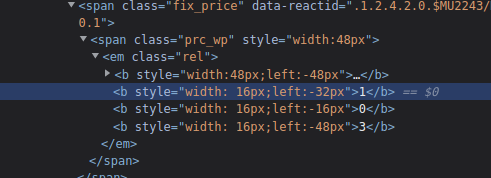

在 JS 逆向课程第 14 课《插翅难逃 纵然 CSS 加身，也难逃命运的安排》，我们学习关于 CSS 反爬的原理与反爬措施。

请问：

请运用您所学到的知识，在本题的实战中获取机票列表所有机票价格的平均值，取 2 位小数，并四舍五入。

看 width: 16px;left:-32px 中的 left 偏移量就可以知道正确的排序方式

代码

    from lxml import etree
    import requests
    
    url = "https://js-crack-course-14-1.crawler-lab.com/"
    headers = {
        'authority': 'js-crack-course-14-1.crawler-lab.com',
        'accept': 'text/html,application/xhtml+xml,application/xml;q=0.9,image/avif,image/webp,image/apng'
                  ',*/*;q=0.8,application/signed-exchange;v=b3;q=0.9',
        'accept-language': 'zh-CN,zh;q=0.9',
        'cache-control': 'no-cache',
        'cookie': '__yjs_duid=1_e50e958c4a3901641bd9faf6f163dfcc1658477764669; crawlerlab_token=eyJhbGc'
                  'iOiJIUzI1NiIsInR5cCI6IkpXVCJ9.eyJleHAiOjE2NjM2NDIwNjMsImlkIjoxODE1LCJuYW1lIjoiMTgyNjI'
                  'wMzE3MjUifQ.fInkCVCQh-hT7Yq-DGB0vcf4pVvO9Sy-lBbYZMXw_zs',
        'pragma': 'no-cache',
        'referer': 'https://www.crawler-lab.com/',
        'sec-ch-ua': '" Not A;Brand";v="99", "Chromium";v="101", "Google Chrome";v="101"',
        'sec-ch-ua-mobile': '?0',
        'sec-ch-ua-platform': '"Linux"',
        'sec-fetch-dest': 'document',
        'sec-fetch-mode': 'navigate',
        'sec-fetch-site': 'same-site',
        'sec-fetch-user': '?1',
        'upgrade-insecure-requests': '1',
        'user-agent': 'Mozilla/5.0 (X11; Linux x86_64) AppleWebKit/537.36 '
                      '(KHTML, like Gecko) Chrome/101.0.0.0 Safari/537.36'
    }
    response = requests.request("GET", url, headers=headers)
    html = etree.HTML(response.text)
    res = html.xpath('//span[@class="prc_wp"]/em')
    num_sum = 0
    for result in res:
        data = etree.tostring(result)
        html = etree.HTML(data)
        datas = html.xpath('//b')
        item_dict = {}
        num_str = ''
        for data in datas:
            data = etree.tostring(data)
            html = etree.HTML(data)
            num_list = html.xpath('//b/text()')
            num_i_list = html.xpath('//b/i/text()')
            if num_i_list:
                i = 0
                for num in num_i_list:
                    left = html.xpath('//b/@style')[0].replace('width:48px;left:', '').replace('px', '') \
                        .replace('width: 16;left:', '')
                    left = str(int(left) + i)
                    item_dict[left] = num
                    i += 16
    
            if num_list:
                for num in num_list:
                    left = html.xpath('//b/@style')[0].replace('width:48px;left:', '').replace('px', '') \
                        .replace('width: 16;left:', '')
                    item_dict[left] = num
    
        num_str = ''
        for i in item_dict.values():
            num_str = num_str + i
    
        num_sum = num_sum + int(num_str)
    print(num_sum/20)
