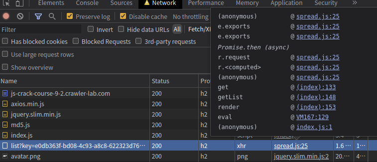

在JS逆向系列课的第9课《一击即中 处理常见代码混淆的方法》中，我们见到了5中看起来很厉害的混淆字符串，也学会了如何轻松干掉它们。
那么现在，请运用你在第9课第3节中学到的知识，尝试做一下这道题吧~

第2个帖子（以1为起始）的HTML中id为content的部分中一共有多少个br标签？

进入 `eval` 

明文

    ba9f5e5d-7e71-4298-882c-57cd2ea1b4d8MTY3NjcxNDc5NzY=nightteam
    
密文

    00fd56664d646e12758c991bdbaeacb50e3b1321

python 代码

    """
    使用sha1加密算法，返回str加密后的字符串
    """
    
    
    def sha1_secret_str(s: str):
        import hashlib
        sha = hashlib.sha1(s.encode('utf-8'))
        encrypts = sha.hexdigest()
        return encrypts
    
    
    if __name__ == '__main__':
        # 待加密的字符串
        s = 'ba9f5e5d-7e71-4298-882c-57cd2ea1b4d8MTY3NjcxNDc5NzY=nightteam'
        res = sha1_secret_str(s)
        print("预期结果:", "00fd56664d646e12758c991bdbaeacb50e3b1321")
        print("实际结果:", res)
