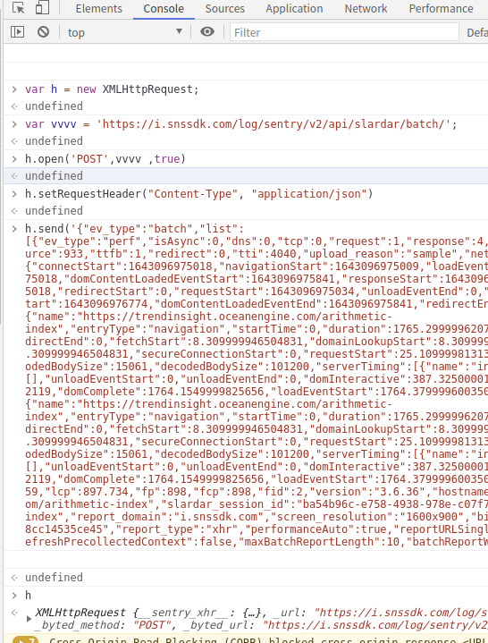

## 在 console 中进行调试请求

    var h = new XMLHttpRequest;
        undefined
    
    var vvvv = 'https://i.snssdk.com/log/sentry/v2/api/slardar/batch/';
        undefined
    
    h.open('POST',vvvv ,true)
        undefined
    
    h.setRequestHeader("Content-Type", "application/json")
        undefined
    
    h.send('{"ev_type":"batch","list":[{"ev_type":"perf","isAsync":0,"dns":0,"tcp":0,"request":1,"response":4,"processing":1722,"blank":30,"domready":388,"load":1766,"has_resource":0,"domparse":358,"resource":933,"ttfb":1,"redirect":0,"tti":4040,"upload_reason":"sample","network_type":"4g","timing":{"connectStart":1643096975018,"navigationStart":1643096975009,"loadEventEnd":1643096976775,"domLoading":1643096975051,"secureConnectionStart":0,"fetchStart":1643096975018,"domContentLoadedEventStart":1643096975841,"responseStart":1643096975035,"responseEnd":1643096975039,"domInteractive":1643096975397,"domainLookupEnd":1643096975018,"redirectStart":0,"requestStart":1643096975034,"unloadEventEnd":0,"unloadEventStart":0,"domComplete":1643096976773,"domainLookupStart":1643096975018,"loadEventStart":1643096976774,"domContentLoadedEventEnd":1643096975841,"redirectEnd":0,"connectEnd":1643096975018},"navigation_timing":{"name":"https://trendinsight.oceanengine.com/arithmetic-index","entryType":"navigation","startTime":0,"duration":1765.2999996207654,"initiatorType":"navigation","nextHopProtocol":"h2","workerStart":0,"redirectStart":0,"redirectEnd":0,"fetchStart":8.309999946504831,"domainLookupStart":8.309999946504831,"domainLookupEnd":8.309999946504831,"connectStart":8.309999946504831,"connectEnd":8.309999946504831,"secureConnectionStart":0,"requestStart":25.10999981313944,"responseStart":25.384999811649323,"responseEnd":29.759999830275774,"transferSize":0,"encodedBodySize":15061,"decodedBodySize":101200,"serverTiming":[{"name":"inner","duration":133,"description":""}],"workerTiming":[],"unloadEventStart":0,"unloadEventEnd":0,"domInteractive":387.3250000178814,"domContentLoadedEventStart":831.4699996262789,"domContentLoadedEventEnd":831.5799999982119,"domComplete":1764.1549999825656,"loadEventStart":1764.3799996003509,"loadEventEnd":1765.2999996207654,"type":"navigate","redirectCount":0},"navigation":{"name":"https://trendinsight.oceanengine.com/arithmetic-index","entryType":"navigation","startTime":0,"duration":1765.2999996207654,"initiatorType":"navigation","nextHopProtocol":"h2","workerStart":0,"redirectStart":0,"redirectEnd":0,"fetchStart":8.309999946504831,"domainLookupStart":8.309999946504831,"domainLookupEnd":8.309999946504831,"connectStart":8.309999946504831,"connectEnd":8.309999946504831,"secureConnectionStart":0,"requestStart":25.10999981313944,"responseStart":25.384999811649323,"responseEnd":29.759999830275774,"transferSize":0,"encodedBodySize":15061,"decodedBodySize":101200,"serverTiming":[{"name":"inner","duration":133,"description":""}],"workerTiming":[],"unloadEventStart":0,"unloadEventEnd":0,"domInteractive":387.3250000178814,"domContentLoadedEventStart":831.4699996262789,"domContentLoadedEventEnd":831.5799999982119,"domComplete":1764.1549999825656,"loadEventStart":1764.3799996003509,"loadEventEnd":1765.2999996207654,"type":"navigate","redirectCount":0},"mpfid":474,"fmp":2359,"lcp":897.734,"fp":898,"fcp":898,"fid":2,"version":"3.6.36","hostname":"trendinsight.oceanengine.com","protocol":"https","url":"https://trendinsight.oceanengine.com/arithmetic-index","slardar_session_id":"ba54b96c-e758-4938-978e-c07f76f96dfc","sample_rate":1,"pid":"/arithmetic-index","report_domain":"i.snssdk.com","screen_resolution":"1600x900","bid":"trendinsightbusiness","context":"{}","slardar_web_id":"28c29df5-58e6-4b20-a22d-8cc14535ce45","report_type":"xhr","performanceAuto":true,"reportURLSingle":"https://i.snssdk.com/log/sentry/v2/api/slardar/main/","region":"cn","env":"production","refreshPrecollectedContext":false,"maxBatchReportLength":10,"batchReportWait":1000,"client_time":1643097002436}],"timestamp":1643097003443}')
    acrawler.js:1 
        undefined
    
    h
        XMLHttpRequest {__sentry_xhr__: {…}, _url: "https://i.snssdk.com/log/sentry/v2/api/slardar/bat…y7QG.v1IYlUOqpTtglTibXzrFdkLV6o8Oqwk15zXRmHHn8X73", _method: "post", _byted_method: "POST", _byted_url: "https://i.snssdk.com/log/sentry/v2/api/slardar/bat…y7QG.v1IYlUOqpTtglTibXzrFdkLV6o8Oqwk15zXRmHHn8X73", …}
    

## 接下来进行代码编写