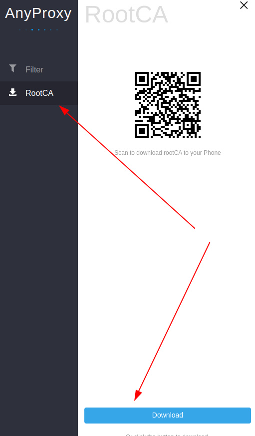
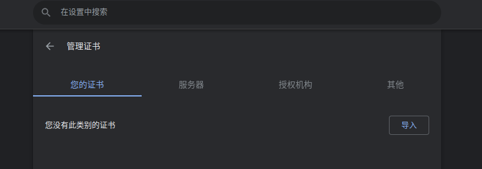
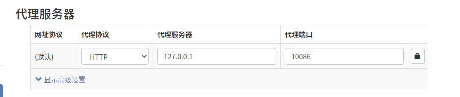
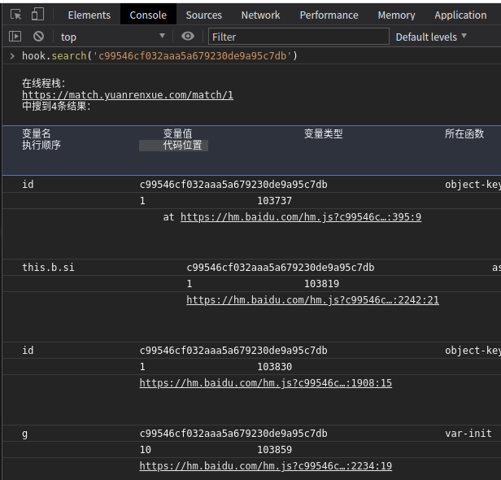

## 项目地址

    https://github.com/CC11001100/ast-hook-for-js-RE
    
在js逆向里面最麻烦的是跟值，比如搜索 password ，如果我们搜索一个password搜不出来的时候，我们可不可以搜索key或者value值，
基于AST访问目标网站时设置浏览器走我们自定义的代理服务器，这个代理服务器要支持能够使用代码处理请求，这里选择的是anyproxy。

### 克隆本项目到本地：

    git clone https://github.com/CC11001100/ast-hook-for-js-RE.git
    
### 下载到本地之后安装依赖：
    
    sudo npm install -g anyproxy
    sudo npm install anyproxy
    npm install shelljs
    npm install cheerio
    npm install '@babel/core'
    
### 启动代理获取ca

    anyproxy ca
    
    [AnyProxy Log][2022-02-22 16:23:10]: Http proxy started on port 8001
    [AnyProxy Log][2022-02-22 16:23:10]: web interface started on port 8002

要用anyproxy抓取https请求需要信任它的证书，在运行这个文件之前，先用anyproxy ca选项启动，访问它的web管理界面：
    
    http://localhost:8002/

接下来就是浏览器安装

### 启动项目

    node proxy-server.js
    
    /home/aiyingfeng/.nvm/versions/node/v16.14.0/bin/node /home/aiyingfeng/spider/js_reverse/ast-hook-for-js-RE/src/proxy-server/proxy-server.js
    mkdir ./js-file-cache
    [AnyProxy Log][2022-02-22 17:39:32]: throttle :10000kb/s
    [AnyProxy Log][2022-02-22 17:39:33]: Http proxy started on port 10086
    [AnyProxy Log][2022-02-22 17:39:33]: web interface started on port 8002

### 设置代理

    SwitchyOmega

### 挂上代理后，打开目标网站

    hook.search('c99546cf032aaa5a679230de9a95c7db')
    

很轻松就定位到加密参数在内存中的位置