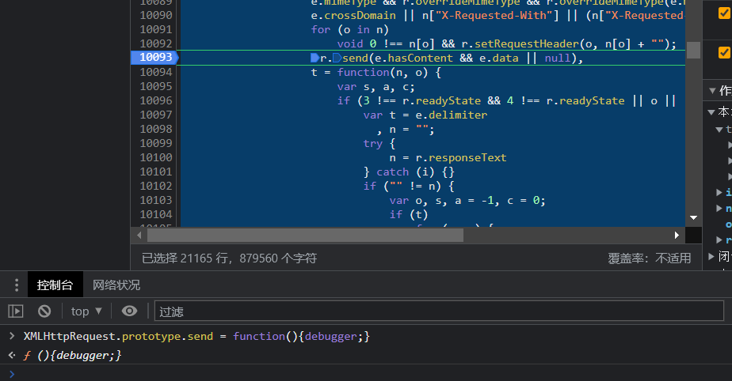
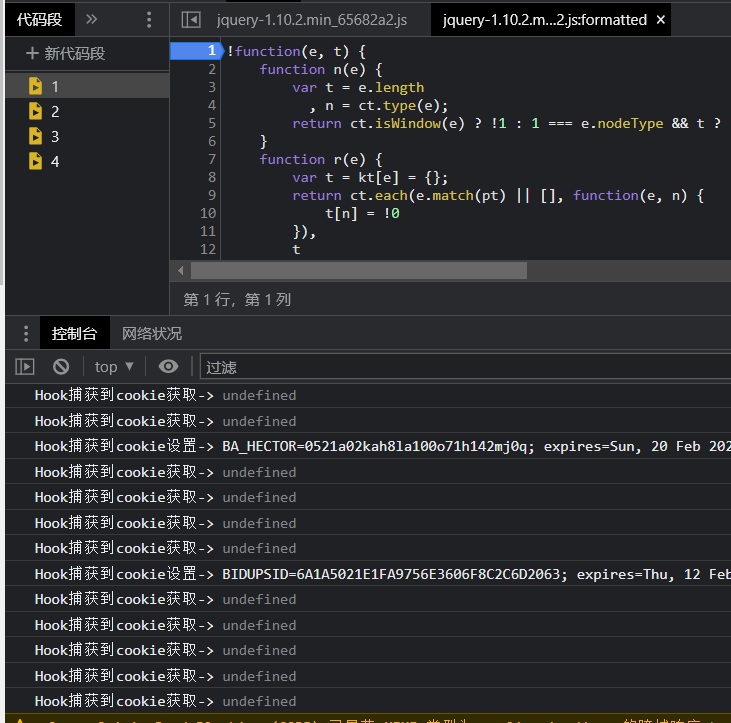

## hook 基础

连接服务器--》拿回资源--》渲染解析资源--》js运行流程 初始化--》页面逻辑--》等待用户输入--》加密数据--》提交数据

hook就是在上面流程插入任意的代码，然后在执行原本的网站代码

js 作用域： 变量所生效的位置

js 山下文： 一个环境（js v8虚拟机）浏览器不同的页面在不同的上下文

## 作用域

    var ayf = 1;
    function zz() {
        var ayf = 2;
        console.log(1, ayf);
    };
    
    zz();
    console.log(1, ayf);
    
    输出
    
    1 2
    1 1
    
解释器

    //声明一个全局作用域变量数组,全局方法
    var glArr = {ayf:1} 
    var glArr = {zz:function...}
    执行方法(glArr.zz);
    
    //进入方法作用域
    声明一个“glArr.zz”方法作用域变量数组
    Arr.zz.Arr = {}
    Arr.zz.Arr.ayf = 2;
    取当前作用域的ayf值，如果当前没有去上一个作用域找
    
    //退出方法
    设置当前作用域 “Arr”
    取当前作用域的ayf的值1，如果当前没有去上一个作用域找
    
简单的说就是变量生效的范围

在不是全局作用域下，写了一个变量，没有用var定义，直接赋值，解释器会先看当前作用域和上级有没有这个变量，
有的会直接赋值，没有的话给全局作用域定义这个变量。

代码案例

    var ayf = 1;
    function zz() {
        var ayf = 2;
        ayf1 = 3;
        console.log(1, ayf);
    };
    
    zz();
    console.log(1, ayf, ayf1);
    
    输出
    1 2
    1 1 3
    
结果表明没有被作用域定义的变量，会污染全局作用域。
    
## 学习hook必须知道this指向

在一个全局作用域下 this = window

    function xxx() {
        console.log(this)
    }
    
    window.xxx();

在方法作用域 this = 调用者

    location.xxx = function () {
        console.log(this)
    }
    
    location.xxx();

类的方法里面 this = 类自己

hook 就是改变原方法或者原代码执行流程，覆盖原方法

es6 语法 Object.defineProperty 重新定义属性，相当于覆盖原方法

    给对象重新定义属性
    监听属性的设置值盒获取值
    
es6 代理 Proxy
    
    给对像整体监听，属性初始化，设置值和获取值，构造函数
    js Proxy https://www.jianshu.com/p/77eaaf34e732
    
我们用hook的方式实现XHR断点，ajax 其实底层封装的是 XMLHttpRequest

    XMLHttpRequest.prototype.send_ = XMLHttpRequest.prototype.send
    XMLHttpRequest.prototype.send = function(){debugger;}
    
测试百度网站，当我们在翻页的时候

上面的测试是需要我在浏览器运行后，请求还未提交，进行手动hook，如果我想要在浏览器初始化的时候hook，油猴[浏览器插件]，fd插件[代理]。

    //当前版本hook工具只支持Content-Type为html的自动hook
             //下面是一个示例:这个示例演示了hook全局的cookie设置点
             (function() {
                 //严谨模式 检查所有错误
                 'use strict';
                 //document 为要hook的对象   这里是hook的cookie
                 var cookie_ = "";
                 Object.defineProperty(document, 'cookie', {
                 //hook set方法也就是赋值的方法 
                 //当前也可以hook get方法
                  set: function(val) {
                         //这样就可以快速给下面这个代码行下断点
                         //从而快速定位设置cookie的代码
                         console.log('Hook捕获到cookie设置->', val);
                         cookie_ = val;
                         return val;
                           },
                  get: function(val) {
                         //这样就可以快速给下面这个代码行下断点
                         //从而快速定位设置cookie的代码
                         console.log('Hook捕获到cookie获取->', val);
                         return cookie_;
                           }
                   });
             })();

测试效果，找到js，在资源面板中打开，在顶部打上断点，控制台输入以上代码，测试效果。

