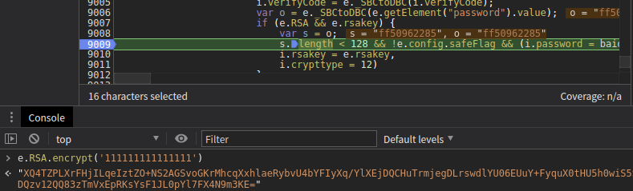
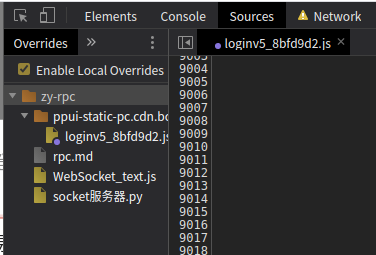

通讯+调用

程序A（加密） 程序B

内存共享  （本地RPC）

窗口消息 （本地RPC）长度有限制

串口通讯 com口

通讯管道 （本地RPC） （防止多开） 对我们不可见

网络 tcp/ip （远程RPC）

程序a 浏览器（http ws） 任意语言开发的软件

打开浏览器 --》控制浏览器（开发者人员工具 谷歌远程调试协议）--》注入js代码（window 加密算法（作用域不是全局的））

    https://www.cnblogs.com/breakyizhan/p/13282613.html
    
远程弊端：对于环境检测效果不好，容易被检测，多线程不如扣代码，出去没法装逼
优点：省略扣代码的过程

rpc  任意语言开发的软件控制浏览器调用网站的加密结果

## python 编写 websockets

    import asyncio
    import websockets
    
    
    async def echo(websocket, path):
        async for message in websocket:
            message = "I got your message: {}".format(message)
            await websocket.send(message)
    
    
    asyncio.get_event_loop().run_until_complete(websockets.serve(echo, 'localhost', 8765))
    asyncio.get_event_loop().run_forever()
    
测试网站

    http://coolaf.com/tool/chattest
    
websockets 地址

    ws://127.0.0.1:8765

## 案例百度登陆

找到RSA加密地方

    e.RSA.encrypt('111111111111111')

将js保存到本地替换

进行js注入

    if (e.RSA && e.rsakey) {
        var s = o;

        !function () {
            window.ayf = e;
            var ws = new WebSocket("ws://127.0.0.1:9999");
    
            ws.onopen = function (evt) {
            };
    
            ws.onmessage = function (evt) {
                ws.send(window.ayf.RSA.evcrypt(evt.data))
            };
    
            ws.onclose = function (evt) {
            };
    
        }();
        
        s.length < 128 && !e.config.safeFlag && (i.password = baidu.url.escapeSymbol(e.RSA.encrypt(s)),
        i.rsakey = e.rsakey,
        i.crypttype = 12)
    }

python 服务端代码

    import asyncio
    import websockets
    import time
    
    
    async def echo(websocket, path):
        while True:
            t = time.strftime("%Y-%m-%d %H:%M:%S", time.localtime())
            await websocket.send(t)
            msg = await websocket.recv()
            print(msg)
            await asyncio.sleep(10)
    
    
    asyncio.get_event_loop().run_until_complete(
        websockets.serve(echo, '127.0.0.1', 9999))
    asyncio.get_event_loop().run_forever()

