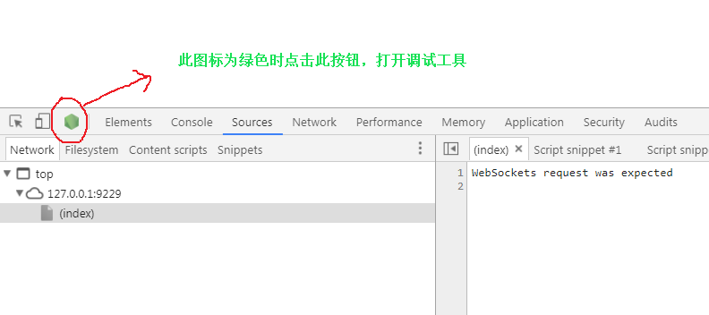

## 安装中文包  

    Chinese (Simplified) (简体中文)

## 配置vscode

        {
            // 使用 IntelliSense 了解相关属性。 
            // 悬停以查看现有属性的描述。
            // 欲了解更多信息，请访问: https://go.microsoft.com/fwlink/?linkid=830387
            "version": "0.2.0",
            "configurations": [
                {
                    "type": "pwa-node",
                    "request": "launch",
                    "name": "启动程序",
                    "skipFiles": [
                        "<node_internals>/**"
                    ],
                    "program": "${workspaceFolder}/test.js"
                }
            ]
        }

## 安装插件 npm install -g

    //  Node调试之node-inspect工具
    npm install -g  node-inspect

##  添加运行时可执行文件
                {
                    "type": "pwa-node",
                    "request": "launch",
                    "name": "无环境浏览器联调",
                    "skipFiles": [
                        "<node_internals>/**"
                    ],
                    "runtimeExecutable": "node-inspect",
                    "program": "${workspaceFolder}/test.js"
                }

## launch.json 配置文件

    {
        // 使用 IntelliSense 了解相关属性。 
        // 悬停以查看现有属性的描述。
        // 欲了解更多信息，请访问: https://go.microsoft.com/fwlink/?linkid=830387
        "version": "0.2.0",
        "configurations": [
            
            {
                "type": "pwa-node",
                "request": "launch",
                "name": "启动程序",
                "skipFiles": [
                    "<node_internals>/**"
                ],
                "program": "${workspaceFolder}/test.js"
            },
            {
                "type": "pwa-node",
                "request": "launch",
                "name": "无环境浏览器联调",
                "skipFiles": [
                    "<node_internals>/**"
                ],
                "runtimeExecutable": "node-inspect",
                "program": "${workspaceFolder}/test.js"
            }
        ]
    }

## 开启谷歌实验室功能

1. vscode启动程序
2. 在谷歌浏览器中打开之后，按F12打开谷歌开发者工具可以看到下图所示内容

这样就可以无环境联调了