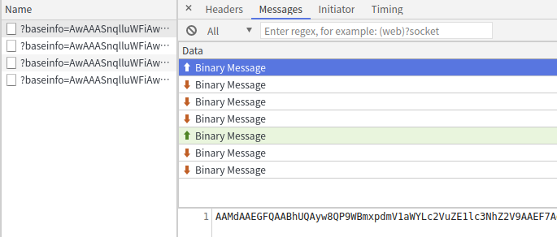
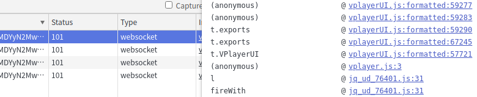
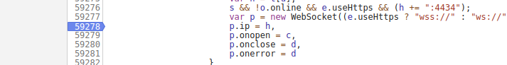
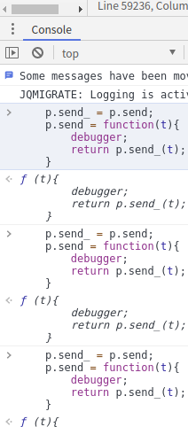
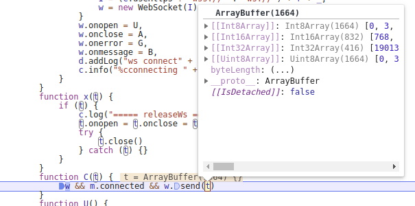
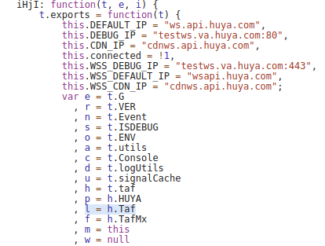

## 调试虎牙 

发现找到 pending 正在连接中 WebSocket

并发送一条测试信息

进入js代码，发现new WebSocket

这里就要注意，无论js代码怎么混淆 new WebSocket 肯定会出现

    s && !o.online && e.useHttps && (h += ":4434");
    var p = new WebSocket((e.useHttps ? "wss://" : "ws://") + h + _);
    p.ip = h,
    p.onopen = c,
    p.onclose = d,
    p.onerror = d
    
通过搜索发现很多 onmessage 和 send 方法

一个个打断点非常麻烦，直接hook
    
    p.send_ = p.send;
    p.send = function(t){
        debugger;
        return p.send_(t);
    }

hook

发送弹暮测试，定位到加密函数

    w && m.connected && w.send(t)

这里的 && 如果 w为true， m.connected为true，w.send(t)为true。执行w.send(t)

这里可以看到t是发送的二进制的数据

r 值序列化数据 

    a = JSON.stringify(r)
    b = JSON.parse(a)

r中间存在我发送的代码内容，打上断点

    d.writeStruct("tReq", r)

这里能发现 d 存在方法做加密，d是由 var d = new l.Wup; 得到的，那么现在需要搞定 l 值。

l 值是 h.Taf 得到的， h 值是 t.taf 得到的，那买t值？t值是传入的