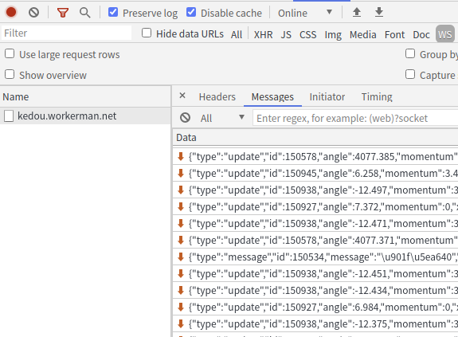
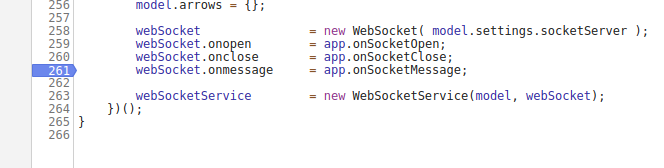
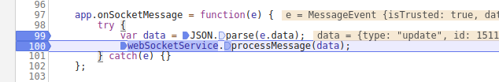
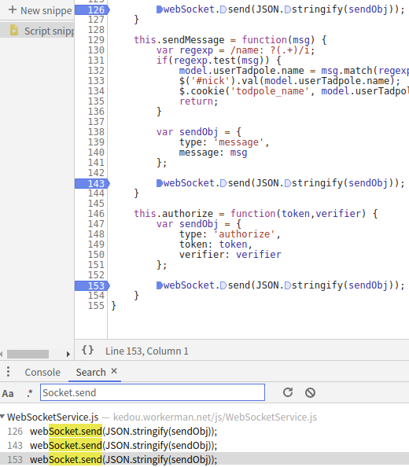
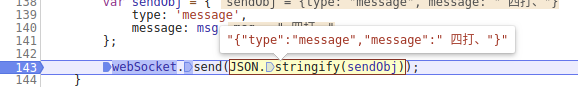

## wss

WebSocket使得客户端和服务器之间的数据交换变得更加简单，允许服务端主动向客户端推送数据。在WebSocket API中，浏览器和服务器只需要完成一次握手，两者之间就直接可以创建持久性的连接，并进行双向数据传输。
    
发送的数据可能是字节码（protobuf(游戏)， TLV(通用)）

套接字 tcp/udp 粘包（同时发了2个数据，中间间隔时间短，同时拿到了2个数据）

websocket html5 不是v8引擎自带的，本身就是关键词

    // 创建一个Socket实例
    var socket = new WebSocket('ws://localhost:8080'); 
    
以下是 WebSocket 对象的相关事件。假定我们使用了以上代码创建了 Socket 对象：

    open	Socket.onopen	连接建立时触发
    message	Socket.onmessage	客户端接收服务端数据时触发
    error	Socket.onerror	通信发生错误时触发
    close	Socket.onclose	连接关闭时触发
    Socket.send()	使用连接发送数据
    Socket.close()	关闭连接

练习网站

    http://kedou.workerman.net/

心跳包：客户端每隔30秒（不固定）发送给服务端信号，服务端就回认为客户端还是在线

## 调试 onmessage

WebSocket 一但连接一值存在，向下的箭头是客户端发给服务器的，向上的箭头是服务器发给客户端的

给 webSocket.onmessage 下断点

找到处理函数，这里一般都会存在解密函数，但这里没有做

## 调试 send

这里就能直接断到发送的数据

