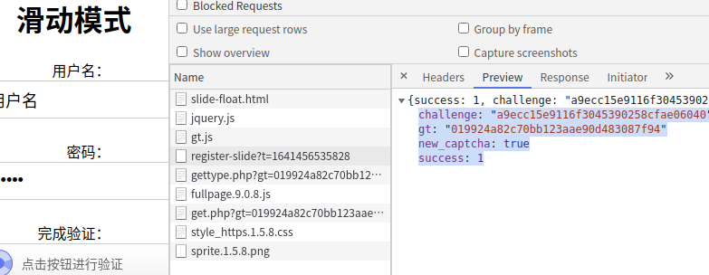
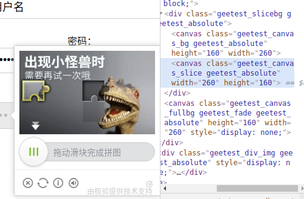
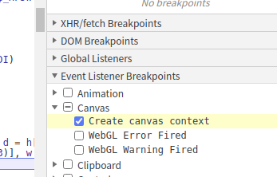
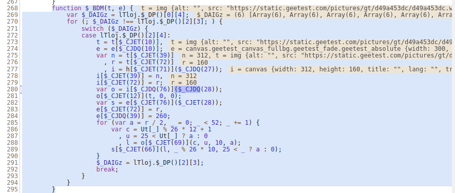
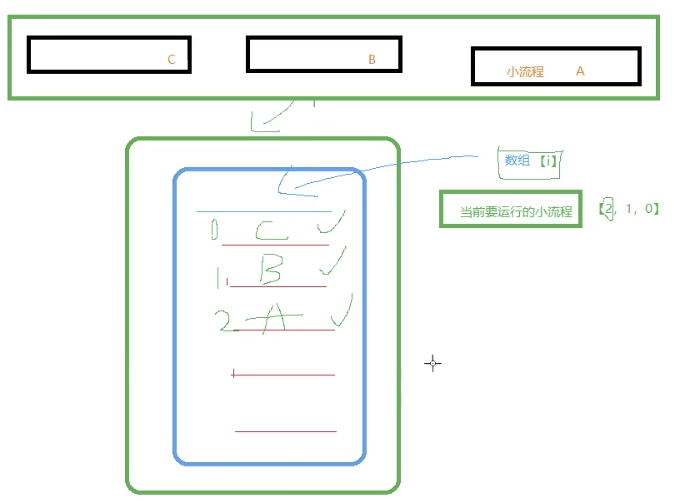

# 极验demo地址
https://www.geetest.com/demo/

# 案例
https://www.geetest.com/demo/slide-float.html

## 通过抓包的流程



### 1.获取了
    challenge: "a9ecc15e9116f3045390258cfae06040"
    gt: "019924a82c70bb123aae90d483087f94"
    new_captcha: true
    success: 1
    
### 2.通过上面的gt获得了js代码 fullpage.9.0.8.js

    geetest_1641456537007({status: "success",…})
    data: {type: "fullpage", static_servers: ["static.geetest.com/", "dn-staticdown.qbox.me/"],…}
    aspect_radio: {slide: 103, click: 128, voice: 128, pencil: 128, beeline: 50}
    beeline: "/static/js/beeline.1.0.1.js"
    click: "/static/js/click.3.0.2.js"
    fullpage: "/static/js/fullpage.9.0.8.js"
    geetest: "/static/js/geetest.6.0.9.js"
    pencil: "/static/js/pencil.1.0.3.js"
    slide: "/static/js/slide.7.8.6.js"
    static_servers: ["static.geetest.com/", "dn-staticdown.qbox.me/"]
    type: "fullpage"
    voice: "/static/js/voice.1.2.0.js"
    status: "success
    
    9.0.8
    大版本.中版本.小版本
    一般情况小版本更新算法是不会改变的

### 3.最后请求https://apiv6.geetest.com/get.php

提交

    gt: 019924a82c70bb123aae90d483087f94
    challenge: a9ecc15e9116f3045390258cfae06040
    lang: zh-cn
    pt: 0
    client_type: web
    w: 9DUewz7mJWnFi4uk1tr......
    
返回

    geetest_1641456537329({status: "success", data: {theme: "wind", theme_version: "1.5.8",…}})
        data: {theme: "wind", theme_version: "1.5.8",…}
            api_server: "api.geetest.com"
            c: [12, 58, 98, 36, 43, 95, 62, 15, 12]
                0: 12
                1: 58
                2: 98
                3: 36
                4: 43
                5: 95
                6: 62
                7: 15
                8: 12
            feedback: "https://www.geetest.com/contact#report"
            i18n_labels: {copyright: "由极验提供技术支持", error: "网络不给力", error_content: "请点击此处重试", error_title: "网络超时",…}
                copyright: "由极验提供技术支持"
                error: "网络不给力"
                error_content: "请点击此处重试"
                error_title: "网络超时"
                fullpage: "智能检测中"
                goto_cancel: "取消"
                goto_confirm: "前往"
                goto_homepage: "是否前往验证服务Geetest官网"
                loading_content: "智能验证检测中"
                next: "正在加载验证"
                next_ready: "请完成验证"
                read_reversed: false
                ready: "点击按钮进行验证"
                refresh_page: "页面出现错误啦！要继续操作，请刷新此页面"
                reset: "请点击重试"
                success: "验证成功"
                success_title: "通过验证"
                logo: true
                s: "65386e31"
            static_servers: ["static.geetest.com", "dn-staticdown.qbox.me"]
                0: "static.geetest.com"
                1: "dn-staticdown.qbox.me"
            theme: "wind"
            theme_version: "1.5.8"
        status: "success"

### 4.ajax.php 

提交

    gt: 019924a82c70bb123aae90d483087f94
    challenge: a414df099537d238cb7ca3c487414ff4
    lang: zh-cn
    pt: 0
    client_type: web
    w: BjLmPs34hYB(EhN88sI....
    
返回

    geetest_1641458409189({status: "success", data: {result: "slide"}})
        data: {result: "slide"}
            result: "slide"
        status: "success"
    
### 5.get.php 

提交

    is_next: true
    type: slide3
    gt: 019924a82c70bb123aae90d483087f94
    challenge: a414df099537d238cb7ca3c487414ff4
    lang: zh-cn
    https: true
    protocol: https://
    offline: false
    product: embed
    api_server: api.geetest.com
    isPC: true
    autoReset: true
    width: 100%
    callback: geetest_1641458405510
    
返回

    geetest_1641458405510({gt: "019924a82c70bb123aae90d483087f94", challenge: "a414df099537d238cb7ca3c487414ff449",…})
        api_server: "https://api.geetest.com"
        benchmark: false
        bg: "pictures/gt/a3e9020a7/bg/653d0c160.jpg"
        c: [12, 58, 98, 36, 43, 95, 62, 15, 12]
        challenge: "a414df099537d238cb7ca3c487414ff449"
        clean: false
        feedback: "https://www.geetest.com/contact#report"
        fullbg: "pictures/gt/a3e9020a7/a3e9020a7.jpg"
        fullpage: false
        gct_path: "/static/js/gct.e6dfc00e5bffe92123ca60b88da1e708.js"
        gt: "019924a82c70bb123aae90d483087f94"
        height: 160
        hide_delay: 800
        https: true
        i18n_labels: {cancel: "取消", close: "关闭验证", error: "请重试", fail: "请正确拼合图像", feedback: "帮助反馈", forbidden: "怪物吃了拼图，请重试",…}
        id: "aa414df099537d238cb7ca3c487414ff4"
        link: ""
        logo: true
        mobile: true
        product: "embed"
        s: "432f3165"
        show_delay: 250
        show_voice: true
        slice: "pictures/gt/a3e9020a7/slice/653d0c160.png"
        so: 0
        static_servers: ["static.geetest.com/", "dn-staticdown.qbox.me/"]
        template: ""
        theme: "ant"
        theme_version: "1.2.6"
        type: "multilink"
        version: "6.0.9"
        width: "100%"
        xpos: 0
        ypos: 28
        
发现里面有原始图片（乱码），遮照图（乱码），滑动图

### 6.ajax.php 

提交

    gt: 019924a82c70bb123aae90d483087f94
    challenge: a414df099537d238cb7ca3c487414ff449
    lang: zh-cn
    $_BBF: 0
    client_type: web
    w: )2aL(q5MW10p8S......
    
返回

    geetest_1641458615294({success: 1, message: "success", validate: "dfd89b03f32cc4f88ab6e58b31bd9a46", score: "6"})
        message: "success"
        score: "6"
        success: 1
        validate: "dfd89b03f32cc4f88ab6e58b31bd9a46"
        
一共6布信息，w的值是加密过的，需要破解

## js调试

### 1. 找到乱码原图还原



点击图片html查看，发现有 ```<canvas>``` 标签定义图形

    什么是 canvas?
    HTML5 <canvas> 元素用于图形的绘制，通过脚本 (通常是JavaScript)来完成.
    <canvas> 标签只是图形容器，您必须使用脚本来绘制图形。
    你可以通过多种方法使用 canvas 绘制路径,盒、圆、字符以及添加图像。
    


进行调试canvas创建图片断点



这里能看到 canvas 的 width:312 height:160 等其他信息

这里涉及的知识点的控制流平坦化

    for(xxxxxx){
        switch
        
        case
    }

平坦流不改变代码源代码执行流程，但是改变了源代码书写流程

    function XX(x){
        return X+2;
    }
    
    var u = 1;
    a = XX(a);
    a = a-1;
    


1. switch 通过case判断是否是哪个下标执行流程化，我们可以找到数组内容就可以判断流程。

2. 或者给每个case下断点，给switch下断点进行单部运行


UT是个数组就是图片的摆放的顺序

寻找UT定义代码

    var Ut = function() {
        var $_BJDDE = lTloj.$_CX
          , $_BJDCY = ['$_BJDGD'].concat($_BJDDE)
          , $_BJDEu = $_BJDCY[1];
        $_BJDCY.shift();
        var $_BJDFY = $_BJDCY[0];
        for (var t, e = $_BJDDE(626)[$_BJDEu(56)]($_BJDEu(682)), n = [], r = 0; r < 52; r++)
            t = 2 * parseInt(e[parseInt(r % 26 / 2)]) + r % 2,
            parseInt(r / 2) % 2 || (t += r % 2 ? -1 : 1),
            t += r < 26 ? 26 : 0,
            n[$_BJDDE(140)](t);
        return n;
    }()
    
特征码 代码

    var c = Ut[_] % 26 * 12 + 1
    
图片顺序

    "[39,38,48,49,41,40,46,47,35,34,50,51,33,32,28,29,27,26,36,37,31,30,44,45,43,42,12,13,23,22,14,15,21,20,8,9,25,24,6,7,3,2,0,1,11,10,4,5,19,18,16,17]"
    
取出小快代码

    _ % 26 * 10