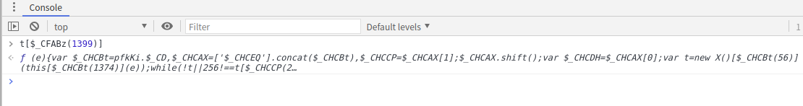
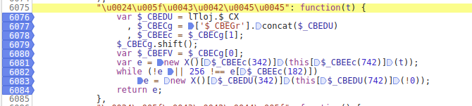
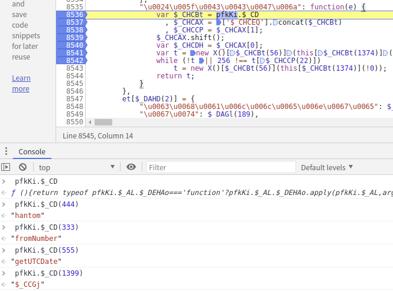
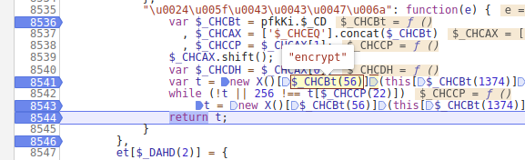
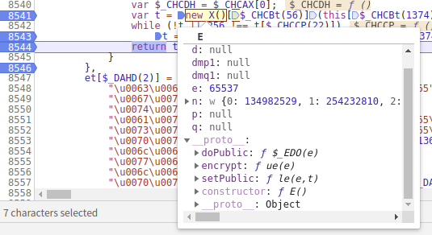
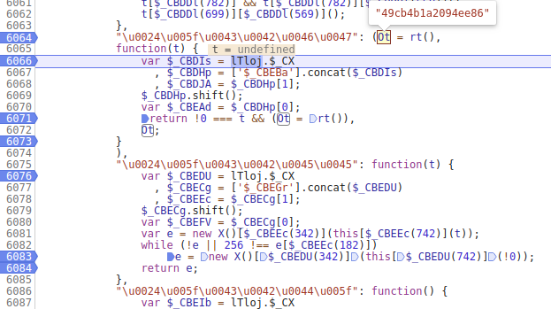
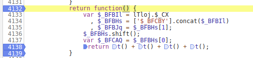
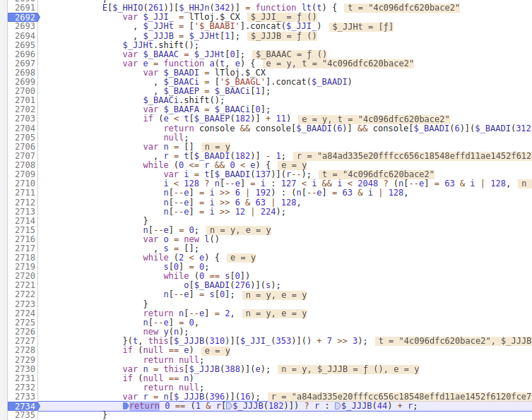

## 发现 w 生成代码

    var u = r[$_CAGEe(750)]()
    , l = V[$_CAGEe(342)](gt[$_CAGEe(209)](o), r[$_CAGEe(742)]())
    , h = m[$_CAGEe(733)](l)

先调试 u 变量，给每行代码打上断点

先进入方法体，如果在 sources 点击不进去，那就在空值台进入

    t[$_CFABz(1399)]
  

进入后分析代码流程

    "\u0024\u005f\u0043\u0043\u0047\u006a": function(e) {
        var $_CHCBt = pfkKi.$_CD
          , $_CHCAX = ['$_CHCEQ'].concat($_CHCBt)
          , $_CHCCP = $_CHCAX[1];
        $_CHCAX.shift();
        var $_CHCDH = $_CHCAX[0];
        var t = new X()[$_CHCBt(56)](this[$_CHCBt(1374)](e));
        while (!t || 256 !== t[$_CHCCP(22)])
            t = new X()[$_CHCBt(56)](this[$_CHCBt(1374)](!0));
        return t;
    }

其中r = t[$_CFABz(1399)]()生成的是加密字符串

    "404701c32cffcaa294a77f96555405374842631a60fc91d04133982d61a1fefb21bf5f409db4b1fbd741924b787244a8b8ab8e63ad7580dc7d6544c6fbe8f65cd103c39c60db6156dbdb6e16a3edaf0dc3f80b0ee7b636d0939218bc27edccaf36032302c69d25b4b400ec0658f34ce9b828852c5372eb1a7bd6e7398e3788e7"
    
这里有个知识点 256 ，我们的字节码 0-255， 一共就256个，一般256模值

这个函数传入了1399 $_CFABz(1399)，返回是字符串

更值技巧：

    从头看不需要重复下断，要记住很多变量
    从尾部看会重复下断操作，跟值比较轻松
    
下断点技巧
    
    初始值的位置，循环的位置，返回的位置，函数开头，函数结尾
    
一点点调试，发现 $_CHCBt(56) 是 "encrypt" 加密的意思

    var t = new X()[$_CHCBt(56)](this[$_CHCBt(1374)](e));

查看 new X()看到一个__proto__中存在 setPublic 

这大概率就是 rsa 加密技术，setPublic 是设置公钥的意思

下面就能直接翻译成以下代码

    var t = new X()[$_CHCBt(56)](this[$_CHCBt(1374)](e))
       ↓↓↓↓↓↓↓
    var t = new X()["encrypt"]("008b5622e6c6b640")
    
那么字符串 008b5622e6c6b640 怎么来的

继续调试 this[$_CHCBt(1374)，这里发现是 (Ot = rt(), 字符串是由 rt()生成

在 console中调试， 每次返回的结果都不相同

    rt()
    "b520110b6d094449"
    rt()
    "db73ac992a993749"
    rt()
    "cf0f49e78a33fad5"
    rt()
    "1be4252ed80313dc"
    rt()
    "2ab6c4dce8e1e4c9"
    rt()
    "8e7a75d5632b7b94"
    
进入方法继续跟踪

开头下断点，结束下断点，return 位置有用到初始化变量的下断点。

但是这里调试发现 rt() 方法不在断点中，测试初始化滑验证码是否进入断点。

在 console中调试， 每次返回的结果都不相同

    t()
    "5d92"
    t()
    "650e"
    t()
    "4803"
    
这里发现返回的数据是由4个t()想加所得

    return function() {
        var $_BFBIl = lTloj.$_CX
          , $_BFBHs = ['$_BFCBY'].concat($_BFBIl)
          , $_BFBJq = $_BFBHs[1];
        $_BFBHs.shift();
        var $_BFCAQ = $_BFBHs[0];
        return t() + t() + t() + t();
    }
    
进入到 t() 中

    function t() {
        var $_DBFAh = lTloj.$_DP()[0][4];
        for (; $_DBFAh !== lTloj.$_DP()[2][3]; ) {
            switch ($_DBFAh) {
            case lTloj.$_DP()[0][4]:
                return (65536 * (1 + Math[$_BFBDL(75)]()) | 0)[$_BFBDL(396)](16)[$_BFBDL(476)](1);
                break;
            }
        }
    }

在 console中调试代码， 每次返回的结果都不相同

    (65536 * (1 + Math[$_BFBDL(75)]()) | 0)[$_BFBDL(396)](16)[$_BFBDL(476)](1)
    "dfeb"
    (65536 * (1 + Math[$_BFBDL(75)]()) | 0)[$_BFBDL(396)](16)[$_BFBDL(476)](1)
    "1c6c"
    (65536 * (1 + Math[$_BFBDL(75)]()) | 0)[$_BFBDL(396)](16)[$_BFBDL(476)](1)
    "0764"

改造这段代码  
 
    (65536 * (1 + Math[$_BFBDL(75)]()) | 0)[$_BFBDL(396)](16)[$_BFBDL(476)](1)

    (65536 * (1 + Math["random"]()) | 0)["toString"](16)["substring"](1)

尝试编写加密算法

    var d = function random_(){
            var data= "";
            for(var i=0;i<4;i++){
                data += (65536 * (1 + Math["random"]()) | 0)["toString"](16)["substring"](1)
            }
            return data
        }

    d()
    
    "abe93bbb3c8eef9a"
    
接下来需要解决 X()[$_CBEEc(342)] 函数 var e = new X()[$_CBEEc(342)](random_()); 怎么来的

最后的条件运算代码

    return 0 == (1 & r[$_JJJB(182)]) ? r : $_JJJB(44) + r;

条件运算符是唯一的三元运算符，其语法格式如下：

    b ? x : y
    b 操作数必须是一个布尔型的表达式，x 和 y 是任意类型的值。
    如果操作数 b 的返回值为 true，则执行 x 操作数，并返回该表达式的值。
    如果操作数 b 的返回值为 false，则执行 y 操作数，并返回该表达式的值。

对这段代码进行改写

    E[$_HHIO(261)][$_HHJn(342)] = function lt(t) {
        var $_JJI_ = lTloj.$_CX
          , $_JJHt = ['$_BAABI'].concat($_JJI_)
          , $_JJJB = $_JJHt[1];
        $_JJHt.shift();
        var $_BAAAC = $_JJHt[0];
        var e = function a(t, e) {
            var $_BAADI = lTloj.$_CX
              , $_BAACi = ['$_BAAGL'].concat($_BAADI)
              , $_BAAEP = $_BAACi[1];
            $_BAACi.shift();
            var $_BAAFA = $_BAACi[0];
            if (e < t[$_BAAEP(182)] + 11)
                return console && console[$_BAADI(6)] && console[$_BAADI(6)]($_BAADI(312)),
                null;
            var n = []
              , r = t[$_BAADI(182)] - 1;
            while (0 <= r && 0 < e) {
                var i = t[$_BAADI(137)](r--);
                i < 128 ? n[--e] = i : 127 < i && i < 2048 ? (n[--e] = 63 & i | 128,
                n[--e] = i >> 6 | 192) : (n[--e] = 63 & i | 128,
                n[--e] = i >> 6 & 63 | 128,
                n[--e] = i >> 12 | 224);
            }
            n[--e] = 0;
            var o = new l()
              , s = [];
            while (2 < e) {
                s[0] = 0;
                while (0 == s[0])
                    o[$_BAADI(276)](s);
                n[--e] = s[0];
            }
            return n[--e] = 2,
            n[--e] = 0,
            new y(n);
        }(t, this[$_JJJB(310)][$_JJI_(353)]() + 7 >> 3);
        if (null == e)
            return null;
        var n = this[$_JJJB(388)](e);
        if (null == n)
            return null;
        var r = n["toString"](16);
        return 0 == (1 & r["length"]) ? r : "0" + r;
    }
 
发现这是一断算法代码，接下来的思路

1.扣出逆向代码，

2.既然已经知道rsa加密，那么找到公钥
    
    // rsa 大概流程
    // 公钥
    var publicKey = "MIGfMA***************AB";
    // 创建一个对象
    var encrypt = new JSEncrypt();
    // 设置公钥
    encrypt.setPublicKey(publicKey);
    // 加密
    var v_str = encrypt.encrypt(v_str); //需要加密的内容
    console.log(v_str); 
    console.log(stringToHex(v_str));
    alert(v_str);
    
    // 私钥解密数据
    var privateKey="MIIC*****qLNnis=";
    var decrypt = new JSEncrypt();
    decrypt.setPrivateKey(privateKey);
    //解密数据      
    var uncrypted = decrypt.decrypt(v_str);//需要解密的内容
    console.log(uncrypted); 
    
## 将内部函数改变成全局变量

    ./zy-极验滑快/破解第一个参数u.js
    
调用

    window.ayf
        ƒ E() {
            var $_DBDBL = lTloj.$_DP()[2][4];
            for (; $_DBDBL !== lTloj.$_DP()[2][3];) {
                switch ($_DBDBL) {
                    case l…
    var e = new window.ayf()["encrypt"]("c4d8355ea7a04436");
        undefined
    e
        "8a140d60d5d3b94672c97a0150a23538e8fa1fd37370f89ce399ce96f756a6a3b61766f9bac4abcaa7aad132a6407d104a9de4c91a6a25a5ecd5d9a95da362c0c9dfb8351b40392e250f0c58a98363d4d622e38cdbd6f2e6ff8dfd9de94a2a372e4e957d5bae446f1226279dac6ed672fafd1578d462fb23fbee55653acfac4e"
 
最终调用方案
    
    function get_id(){
        function random_(){
                var data= "";
                for(var i=0;i<4;i++){
                    data += (65536 * (1 + Math["random"]()) | 0)["toString"](16)["substring"](1)
                }
                return data
            }
        return new window.ayf()["encrypt"](random_());
    }
