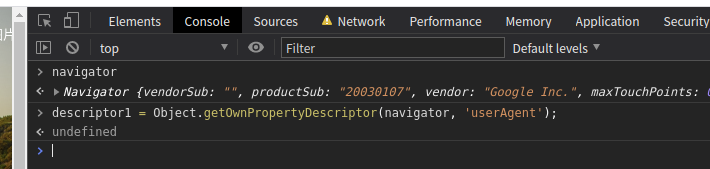

# 补环境框架

调试框架要有封装的思想，功能单一，可扩展性强，js调试框架，监控所有的环境代理，在自己伪造的环境代理，任意代理，包座代理不会被检测，某些对象不能完美被伪造利用谷歌开源浏览器，进行修改内核代码.
    
## 原型方法被检测
    
检测tostring方法，检测node环境，基于原型连的检测，基于dom环境的检测
    
**检测举例: `Object.getOwnPropertyDescriptor`**

静态方法返回一个对象，该对象描述给定对象上特定属性（即直接存在于对象上而不在对象的原型链中的属性）的配置。返回的对象是可变的，但对其进行更改不会影响原始属性的配置。

在node中运行Object.getOwnPropertyDescriptor
```javascript
navigator = {
    userAgent: "Mozilla/5.0 (X11; Linux x86_64) AppleWebKit/537.36 (KHTML, like Gecko) Chrome/87.0.4280.141 Safari/537.36"
};

const descriptor1 = Object.getOwnPropertyDescriptor(navigator, 'userAgent');
console.log(descriptor1);
```
会出现

    {
      value: 'Mozilla/5.0 (X11; Linux x86_64) AppleWebKit/537.36 (KHTML, like Gecko) Chrome/87.0.4280.141 Safari/537.36',
      writable: true,
      enumerable: true,
      configurable: true
    }
    
浏览器中运行，这里打印的 undefined，说明再浏览器中是拿不到这个值。



而在node环境中有返回值，这就存在被检测的情况，这样就需要hook`getOwnPropertyDescriptor`方法
```javascript
navigator = {
    userAgent: "Mozilla/5.0 (X11; Linux x86_64) AppleWebKit/537.36 (KHTML, like Gecko) Chrome/87.0.4280.141 Safari/537.36"
};

Object.getOwnPropertyDescriptor_ = Object.getOwnPropertyDescriptor;

// hook
Object.getOwnPropertyDescriptor = function (o,p) {
    // 判断检测的对象是navigator就返回空
    if(navigator.toString() == '[object Navigator]'){
        return undefined;
    }
    // 不是就正常返回
    Object.getOwnPropertyDescriptor_.apply(this, arguments)
};

const descriptor1 = Object.getOwnPropertyDescriptor(navigator, 'userAgent');
console.log(descriptor1);
```
## Proxy 代理是什么，要拦截js操作
    
Proxy 也就是代理，可以帮助我们完成很多事情，例如对数据的处理，对构造函数的处理，对数据的验证，说白了，
就是在我们访问对象前添加了一层拦截，可以过滤很多操作，而这些过滤，由你来定义。

    # 官方文档
    https://developer.mozilla.org/zh-CN/docs/Web/JavaScript/Reference/Global_Objects/Proxy
    
尝试监听window取值和设置值

`handler.get() `方法用于拦截对象的读取属性操作。` handler.set()` 方法是设置属性值操作的捕获器。

```javascript
window = this;
var navigator = {
    userAgent: "Mozilla/5.0 (X11; Linux x86_64) AppleWebKit/537.36 (KHTML, like Gecko) Chrome/87.0.4280.141 Safari/537.36"
};


window = new Proxy(window, {
    // obj 那个对象， prop哪个属性，value设置的值
    set(obj, prop, value){
        console.log('set', obj, prop, value);
        return Reflect.set(...arguments);
    },
    get(obj, prop, receiver){
        console.log('get', obj, prop, receiver);
        return target[prop];
    }
});

window.ayf1 = 111;
window.ayf2 = 222;
window.ayf3 = 333;
window.ayf4 = window.ayf3
console.log('结果', window)
```
    
打印输出

    set {} ayf1 111
    set { ayf1: 111 } ayf2 222
    set { ayf1: 111, ayf2: 222 } ayf3 333
    get { ayf1: 111, ayf2: 222, ayf3: 333 } ayf3 { ayf1: 111, ayf2: 222, ayf3: 333 }
    set { ayf1: 111, ayf2: 222, ayf3: 333 } ayf4 333
    结果 { ayf1: 111, ayf2: 222, ayf3: 333, ayf4: 333 }
    
关于检测后代理的检测不到先代理，简单理解事先开启外挂在开启游戏，游戏就检测不到外挂，先开游戏在开启外挂，游戏已经
加载了外挂，就会拦截你的外挂。

补环境时候就可以利用Proxy代理的特性，监听navigator，document，location看看混淆的js代码到底干了什么事！

案例代码

```javascript
window = this;

// 更改window名字,因为node环境中默认是global
Object.defineProperties(window, {
    [Symbol.toStringTag]:{
        value: "window",
        configurable: true
    }
});

function vmProxy(o){
    return new Proxy(o, {
        // obj 那个对象， prop哪个属性，value设置的值
        set(obj, prop, value){
            console.log('set', obj, prop, value);
            return Reflect.set(...arguments);
        },
        get(obj, prop, receiver){
            console.log('get', obj, prop, receiver);
            return target[prop];
        }
    });
}

navigator = vmProxy(class navigator{})
document = vmProxy(class document{})
location = vmProxy(class location{})
window = vmProxy(window)
```

## toString方法被检测

nodejs中执行
```javascript
var location = {};
location.assign = function assign(){
    return 'https://www.baidu.com/'
};
console.log(location.assign + '')
```
返回
```javascript
function assign(){
    return 'https://www.baidu.com/'
}
```

浏览器中执行
```javascript
location.assign + ''
```
返回
```javascript
'function assign() { [native code] }'
```
会发现nodejs中执行和浏览器中执行不一样，这里就需要hook`toString`方法。

```javascript
window = this;
var location = {};
location.assign = function assign(){
    return 'https://www.baidu.com/'
};
console.log('修改前返回：' + '\n' + location.assign + '')

// 补环境的自定义方法，通过toString方法被检测
;(() => {
    'use strict';
    const $toString = Function.toString
    const myFunction_toString_symbol = Symbol('('.concat('', ')_', (Math.random() + '').toString(36)))
    const myToString = function () {
        return typeof this == 'function' && this[myFunction_toString_symbol] || $toString.call(this)
    }

    function set_native(func, key, value) {
        Object.defineProperty(func, key, {
            "enumerable": false,
            'configurable': true,
            'writable': true,
            'value': value
        })
    }

    delete Function.prototype['toString'];// 删除原型链上的toString
    set_native(Function.prototype, 'toString', myToString);// 自己定义一个getter方法
    // 套娃给 toString 方法设置一个 toString
    set_native(Function.prototype.toString, myFunction_toString_symbol, 'function toString(){ [native code] }')
    this.func_set_natvie = (func) => {
        set_native(func, myFunction_toString_symbol, `function ${myFunction_toString_symbol, func.name || ''}() { [native code] }`)
    }
}).call(this);

window.func_set_natvie(location.assign)

console.log('修改后返回：' + '\n' + location.assign + '')
```

返回内容:

```javascript
修改前返回：
function assign(){
    return 'https://www.baidu.com/'
}
修改后返回：
function assign() { [native code] }
```

和浏览器中返回的内容一样。

