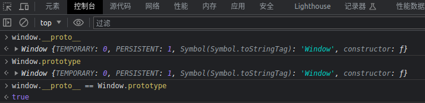
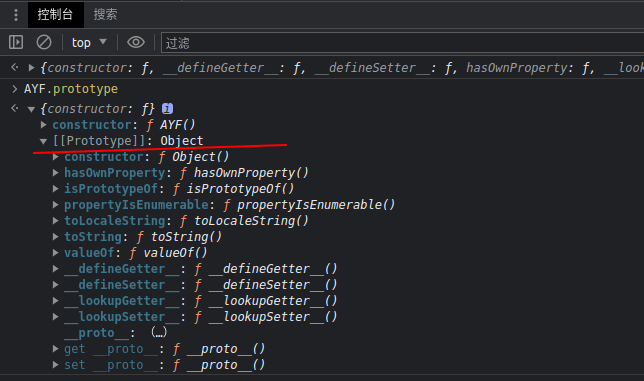

# 补环境

1.调试环境

2.在环境框架中直接运行某js文件，补修改原js文件

## 自己写一个浏览器

1.BOM 浏览器实现的代码历史记录浏览器版本信息之类的

2.DOM 根据id取元素

3.网络请求 xhr jsonp jsonp_3213123({ayf:1})

4.跨窗口worker

目的： 运行环境

难点：如何找到缺少的那些环境，如何很好的实现环境代码

伪造：我给你啥，你能正确返回啥可以了

## vm2 纯净的v8环境

脱离了nodejs的v8环境，防止检测到nodejs环境

https://github.com/patriksimek/vm2
```javascript
var fs = require('fs');
const {VM} = require('vm2');
const vm = new VM();
var data = fs.readFileSync('./src/code.js', 'utf8')
vm.run(data)
```

调试沙盒代码
```javascript
const {VM, VMScript} = require('vm2');
const fs = require('fs');
// 运行的code代码
const file = `${__dirname}/code.js`;

// 需要补的window环境
const windowfile = `${__dirname}/window.js`;
const vm = new VM();

//VMScript调试
const script = new VMScript(fs.readFileSync(windowfile)+fs.readFileSync(file), "我正在调试的代码");
vm.run(script);
```
## 实例还是原型
```javascript
var a = {} // a是实例
var b = class b{}//实例
var c = new (function (){})//实例
var d = Object()//实例
var e = Object.create({})//实例
function xx(){} //方法也是对象，方法即是实例也是原型
```
简单的举例`window.__proto__ == Window.prototype`

window.__proto__是Window原型


Window.prototype是Window原型



所以`window.__proto__ == Window.prototype`

在.__proto__就是父亲的原型，直到null


## 加深理解原型链的关系

定义一个方法AYF，new 这个AYF方法生成实例ayf
```javascript
function AYF(){

}

var ayf = new AYF;
```
实例ayf通过`.__proto__`访问原型，这里可以看到构造函数AYF和下面的原型Prototype，这里可以通过构造函数AYF访问实例ayf的原型。


这里得到的结论是构造函数的原型（prototype）== 实例的__proto__

**提问:修改AYF的原型的原型，下面案例代码**

错误示范，这里将 {} 对象的实例赋值给了AYF的原型的原型
```javascript
function AYF(){

}

var ayf = new AYF;

AYF.prototype.__proto__ = {}
```

所以打印出来是这样的


应该是将Object对象原型赋值给AYF.prototype.__proto__，而不是对象实例赋值

那么拿到实例原型就是`({}).__proto__`
```javascript
function AYF(){
    
}

var ayf = new AYF;

AYF.prototype.__proto__ = ({}).__proto__
```


理解就到这了