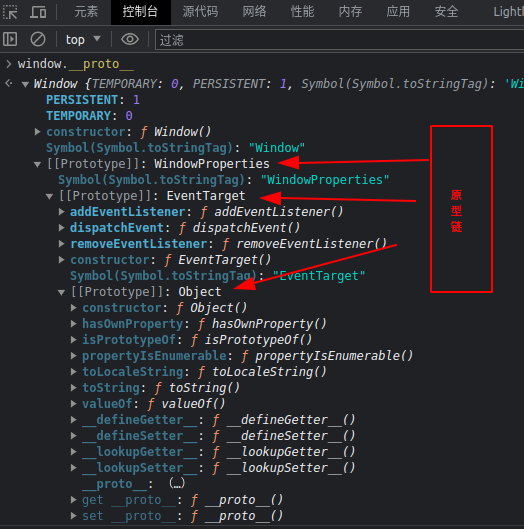
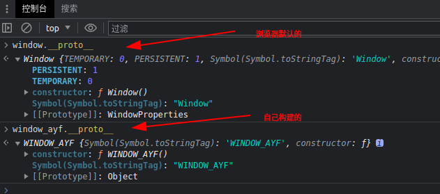
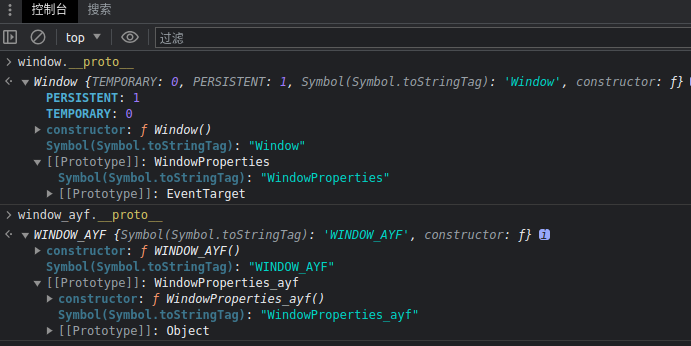
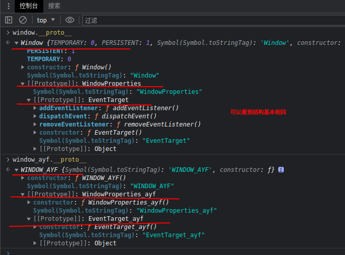

项目参考：js逆向之模拟浏览器环境

    https://hexo-fanchangrui.vercel.app/2022/08/05/js%E9%80%86%E5%90%91%E4%B9%8B%E6%A8%A1%E6%8B%9F%E6%B5%8F%E8%A7%88%E5%99%A8%E7%8E%AF%E5%A2%83/

# 补环境框架实现
```
.
├── CatVm2                                       文件目录
│   ├── browser                                  浏览器环境
│   │    ├── HTMLElements
│   │    │     ├── htmlDivElement.js
│   │    │     ├── htmlElements.node.js
│   │    ├── document.js
│   │    ├── eventTarget.js
│   │    ├── history.js
│   │    ├── htmlDocument.js
│   │    ├── location.js
│   │    ├── mimeType.js
│   │    ├── mimeTypeArray.js
│   │    ├── navigator.js
│   │    ├── plugin.js
│   │    ├── pluginArray.js
│   │    ├── screen.js
│   │    ├── storage.js
│   │    ├── window.js                           window环境
│   │    ├── windowProperties.js
│   │── tools
│   │    ├── memory.js                           框架运行内存
│   │    ├── node.js                             将工具代码组合
│   │    ├── print.js                            框架日志功能
│   │    ├── proxy.js                            框架代理功能
│   │    ├── safefunction.js                     补环境的自定义方法
│   │    ├── tools.js                            更改浏览器某些参数
│   │─── catvm2.node.js                          补环境的拼接代码
├── code.js                                      原代码
├── index.js                                     启动代码
├── README.md                                    文档
```

## 补window环境，原型链



先尝试补一个window原型WINDOW_AYF

```javascript
function WINDOW_AYF(){}

window_ayf = {};

window_ayf.__proto__ = WINDOW_AYF.prototype;

Object.defineProperties(WINDOW_AYF.prototype,{
    [Symbol.toStringTag]:{
        value:'WINDOW_AYF',
        configurable:true,
    }
})
```
控制台对比效果



在构建原型`WindowProperties_ayf`

```javascript
function WINDOW_AYF(){}

window_ayf = {};

window_ayf.__proto__ = WINDOW_AYF.prototype;

Object.defineProperties(WINDOW_AYF.prototype,{
    [Symbol.toStringTag]:{
        value:'WINDOW_AYF',
        configurable:true,
    }
})

function WindowProperties_ayf(){}

WINDOW_AYF.prototype.__proto__ = WindowProperties_ayf.prototype;

Object.defineProperties(WindowProperties_ayf.prototype,{
    [Symbol.toStringTag]:{
        value:'WindowProperties_ayf',
        configurable:true,
    }
})
```
控制台对比效果



最后构建原型`EventTarget_ayf`

```javascript
function WINDOW_AYF(){}

window_ayf = {};

window_ayf.__proto__ = WINDOW_AYF.prototype;

Object.defineProperties(WINDOW_AYF.prototype,{
    [Symbol.toStringTag]:{
        value:'WINDOW_AYF',
        configurable:true,
    }
})

function WindowProperties_ayf(){}

WINDOW_AYF.prototype.__proto__ = WindowProperties_ayf.prototype;

Object.defineProperties(WindowProperties_ayf.prototype,{
    [Symbol.toStringTag]:{
        value:'WindowProperties_ayf',
        configurable:true,
    }
})

function EventTarget_ayf(){}

WindowProperties_ayf.prototype.__proto__ = EventTarget_ayf.prototype;

Object.defineProperties(EventTarget_ayf.prototype,{
    [Symbol.toStringTag]:{
        value:'EventTarget_ayf',
        configurable:true,
    }
})
```
控制台对比效果


