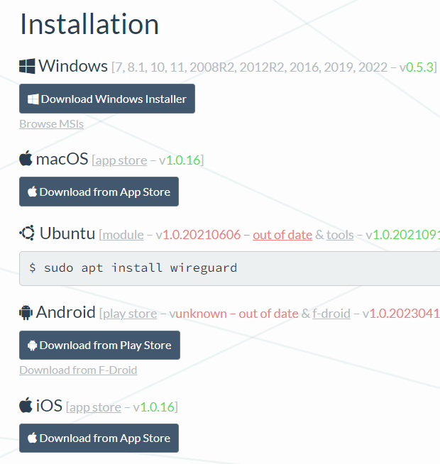
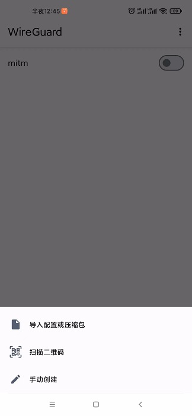
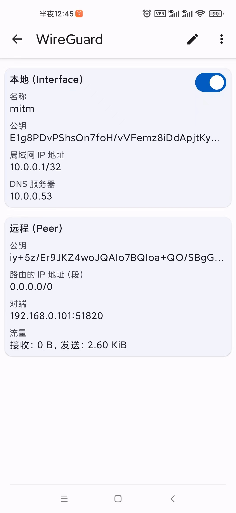
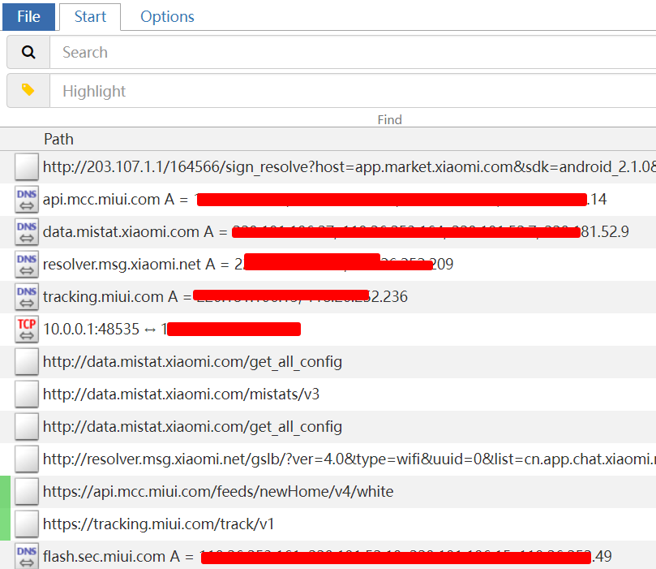

# WireGuard（透明代理）

WireGuard是一个易于配置、快速且安全的开源 VPN，它利用了最新的加密技术。目的是提供一种更快、更简单、更精简的通用 VPN，它可以轻松地在树莓派这类低端设备到高端服务器上部署。

mitmproxy 运行一个内部 WireGuard 服务器，可以使用 WireGuard 客户端连接到该设备：

## 前提条件：

1. mitmdump mitmweb mitmproxy 版本大于 9.0.0

2. Python3.9以上

## WireGuard服务端配置

命令行运行

    mitmweb --mode wireguard
    
可以看到扫码页面

## WireGuard客户端配置
在目标设备上安装 WireGuard 客户端。

    
    下载地址：https://www.wireguard.com/install/

将配置文件加入客户端，扫一扫

配置完成，启动

看一下效果

## 远程抓包

同理也可以部署在服务器上，进行远程抓包

1. 对端ip设置成服务器ip
2. 服务器开启udp端口访问权限