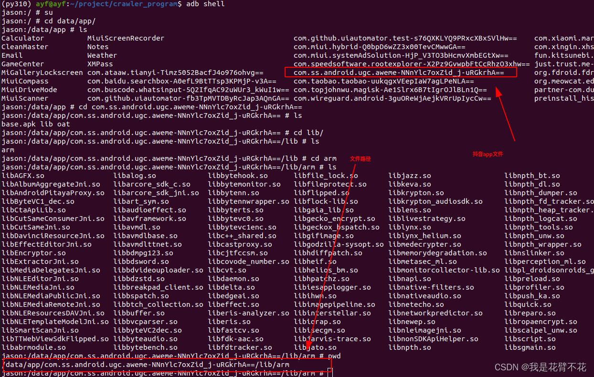
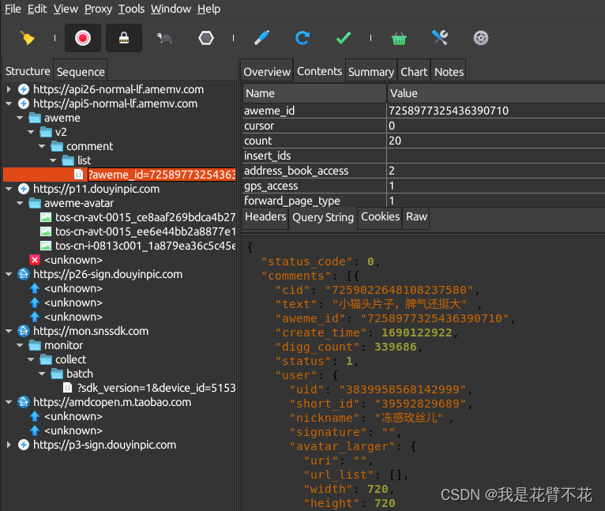

# 抖音app抓包记录

魔改抖音各版本下载地址下载地址：

    https://pan.lanzoub.com/b0f199a5a

豌豆荚各版本：

    https://www.wandoujia.com/apps/7461948/history

`libsscronet.so`文件下载

    链接: https://pan.baidu.com/s/1zr4QVF--sSBEYTHf4lxabg 提取码: bjam

## 原理：修改检测so文件`libsscronet.so`

1.将修改好的`libsscronet.so`文件放入手机data目录下
```bash
adb push /home/ayf/project/app/douyin24.6.0/libsscronet.so /data/
```
2.找到目标文件路径



3.将`libsscronet.so`文件复制到`/lib/arm`目录下
```bash
cp libsscronet.so /data/app/com.ss.android.ugc.aweme-NNnYlc7oxZid_j-uRGkrhA==/lib/arm
```
4.进入`/lib/arm`目录修改so文件权限
```bash
cd /data/app/com.ss.android.ugc.aweme-NNnYlc7oxZid_j-uRGkrhA==/lib/arm
chgrp system libsscronet.so
chown system libsscronet.so
chmod 777 libsscronet.so
```
5.抓包效果



**来源**

具体的`libsscronet.so`文件和对应的安卓安装包可以搜索微信公众号：阿蛇 爬虫spider获取，原作者会经常更新。