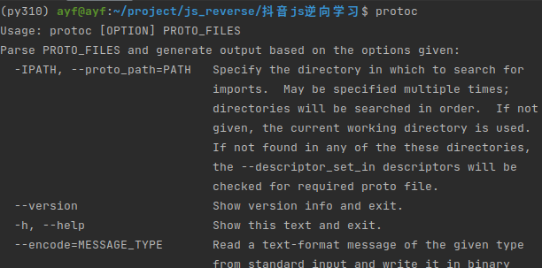
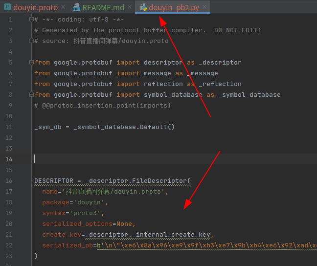
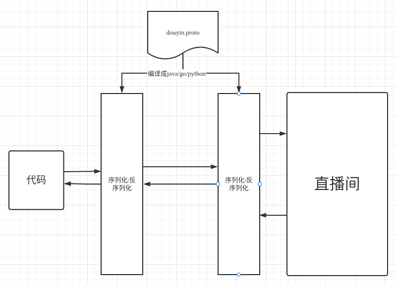

# 抖音直播间弹幕

打开抖音直播间（测试地址 https://live.douyin.com/80017709309 ）如何抓取评论弹幕，通过分析可以看到这样一个二进制文件。


再破解二进制文件前先了解一下什么是`.proto`文件

## 一、`.proto`文件编译成`.py`文件

安装`protobuf`

    sudo apt  install protobuf-compiler

测试效果



编写`proto`结构体对象，有点类似于创建了一个数据库结构

```proto
syntax = "proto3";

package douyin;

message HeadersList {
    string key = 1;
    string value = 2;
}

message PushFrame {
    uint64 seqId = 1;
    uint64 logId = 2;
    uint64 service = 3;
    uint64 method = 4;
    repeated HeadersList headersList = 5;
    string payloadEncoding = 6;
    string payloadType = 7;
    bytes payload = 8;
}
```

将`proto`文件编译成`py`文件

    protoc --python_out=. ./抖音直播间弹幕/douyin.proto

会生成`douyin_pb2.py`文件，后续操作时用的就是这个文件



如何调用`douyin_pb2.py`文件，这里我们对照`douyin.proto`文件编写调用文件

1.将数据序列化

```python
from douyin_pb2 import PushFrame, Response, ChatMessage

p = PushFrame()
p.seqId = 1000
p.logId = 2000

# 序列化
info = p.SerializeToString()
print(info)
```

打印的效果，二进制文件

    序列化后的二进制数据：b'\x08\xe8\x07\x10\xd0\x0f'

2.将数据反序列化

```python
info = b'\x08\xe8\x07\x10\xd0\x0f'
p = PushFrame()
p.ParseFromString(info)
print(p.seqId)
print(p.logId)
```

打印的效果

    反序列化后的真实数据：1000 , 2000

## 二、反序列化抖音数据


## 三、websocket 连接

直播间弹幕是实时响应的，这样数据显示方式用websocket协议最方便，但也是最容易破解的。

## 四、数据流过程


