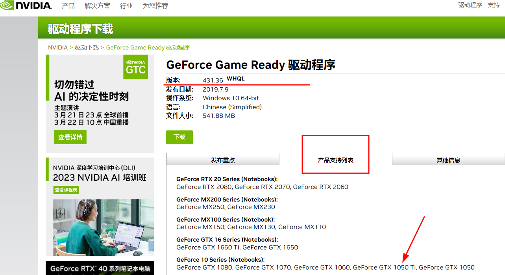
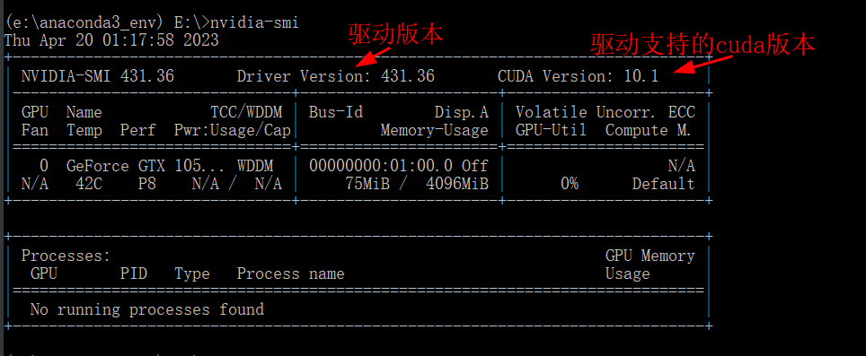
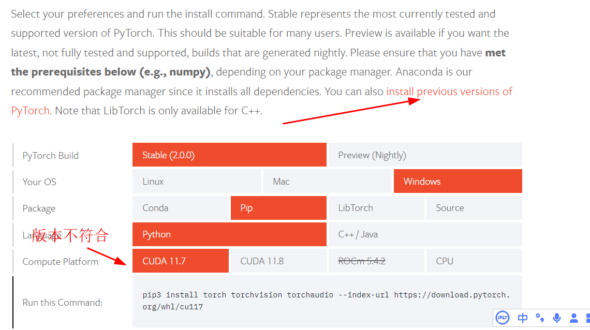
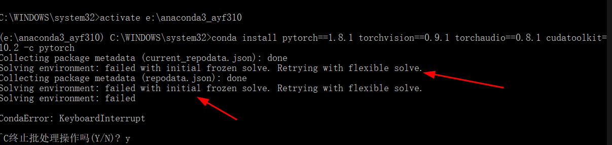
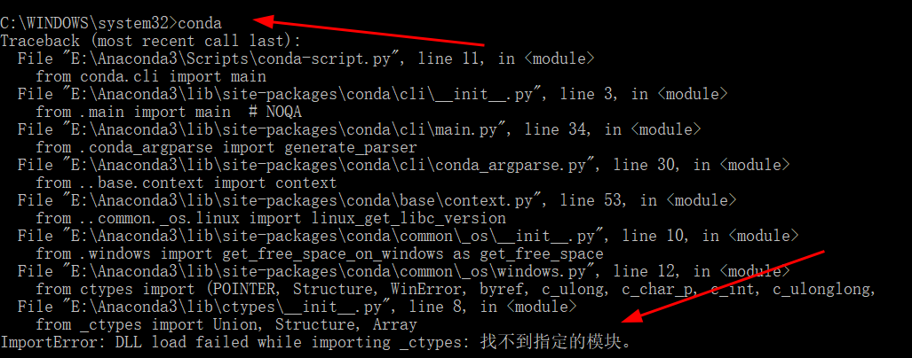

# 知识点：python版本，pytorch版本，显卡驱动支持的CUDA版本，安装Anaconda

安装pytorch最大的难点就是版本兼容问题，python版本，pytorch版本，显卡驱动支持的CUDA版本不管是那个版本对不上都会报错

## 首先解决显卡问题

我的笔记本显卡是1050Ti，显卡驱动版本是397.64，怎么才能知道驱动版本是397.64，`cmd`输入`nvidia-smi`

如果Driver Version小于400先更新显卡驱动

那么这里就需要更新显卡驱动，去nvidia官方网站下载

    https://www.nvidia.cn/Download/driverResults.aspx/148666/cn/

我这里下载的显卡驱动版本是431.36，这里我尝试过500的显卡驱动，但发现电脑承受不了，散热风扇声音很大。

下载下来exe文件，安装双击下一步，下一步就OK了

再次`cmd`输入`nvidia-smi`查看显卡版本和显卡驱动支持的CUDA版本

到这里显卡驱动问题就搞定了

## 安装Anaconda

去官方网站下载exe文件，这里一定要先清理干净原先的py环境，否则可能会出现python环境冲突

    https://www.anaconda.com/

这里要注意的是，在安装的时候，勾选`创建系统环境变量`

进入cmd执行以下代码，这里我用的python版本是3.7，如果装了python3.10后期就报错
    
    # 先在e盘下创建一个anaconda3_env文件夹
    # 创建虚拟环境并安装基础工具
    windows: conda create --prefix=e:\anaconda3_env python=3.7
    ubuntu: conda create -n 环境名称 python=3.8
    # 进入虚拟环境
    conda activate e:\anaconda3_env
    # 列出虚拟环境
    conda env list
    # 退出虚拟环境
    conda deactivate
    # 删除虚拟环境
    conda remove --all --prefix "e:\anaconda3_env"

## 安装pytorch

    https://pytorch.org/get-started/locally/

进入官网复制一条安装命令，由于官方网站首页给出的安装命令不试用老版本，CUDA是11.7，而我现在需要的是CUDA Version: 10.1

进入历史版本页面搜索CUDA 10.1

复制命令执行，等待执行结束

这个时候可能出现的报错`failed with initial frozen solve. Retrying with flexible solve`

更新conda环境

    # 查看版本
    conda -V
    # 更新conda环境
    conda update -n base conda
    # 更新conda的所有包
    conda update -n base -c defaults conda

在更新的过程中报错`ImportError: DLL load failed while importing _ctypes`

网上找了很多方法，最后发现是anaconda2023版本问题，我直接降低版本安装

    https://repo.anaconda.com/archive/

我测试很多个版本，发现版本之间确实存在兼容问题，选择合适自己本机版本才是上策

做完这些之后，再用conda install xxx就不会有上面的问题了。

最后测试

    import torch
    print(torch.cuda.is_available())

返回 True 就证明安装成功了

这里再次出现报错：找不到指定模块

我这里直接下载Visual Studio Community软件

    https://visualstudio.microsoft.com/zh-hans/vs/community/

勾选默认，安装就OK了