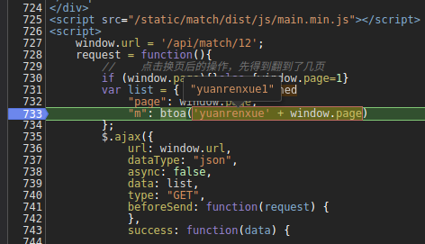

## 任务：抓取这5页的数字，计算加和并提交结果

    https://match.yuanrenxue.com/match/12
    
查看请求地址

    https://match.yuanrenxue.com/api/match/12?page=1&m=eXVhbnJlbnh1ZTE%3D
    
其中m是加密参数

    m=eXVhbnJlbnh1ZTE%3D

打断点调试

    "m": btoa('yuanrenxue' + window.page)

很简单,直接上python代码

[最后代码实现](实例12.py "js代码4")
