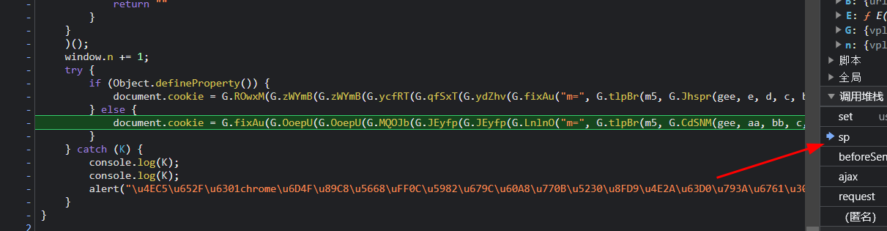
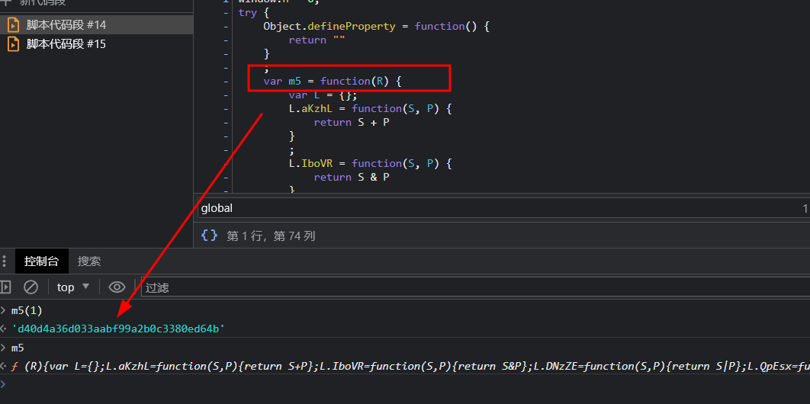
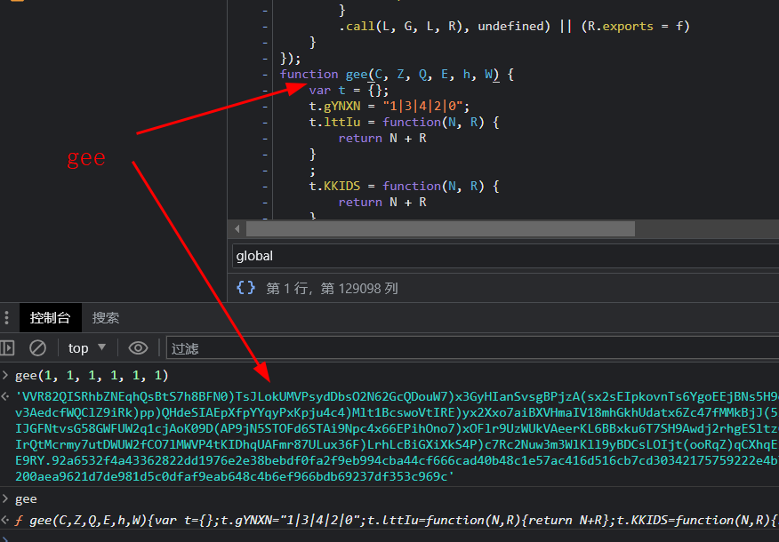

## hook cookie mz=

```javascript
// ==UserScript==
// @name        hook cookie
// @namespace   http://tampermonkey.net/
// @version     0.1
// @description pass
// @author      ayf
// @run-at      document-start
// @match       *://*/*
// @grant       none
// ==/UserScript==

(function () {
    'use strict';
    Object.defineProperty(document, "cookie", {
        set:function(val){
            console.log('hook cookie')
            if(val.indexOf("mz=") != -1){
                debugger;
            }
            return val;
        }
    })
})();
```

cookie生成

```javascript
document['\x63\x6f' + '\x6f\x6b' + '\x69\x65'] = G['\x6e\x4d' + '\x48\x69' + '\x44'](G['\x4e\x75' + '\x6d\x4b' + '\x4a'] + b64_zw, G['\x5a\x44' + '\x4b\x62' + '\x76']);
```

还原后

```javascript
document['cookie'] = mz=' + b64_zw + ';path=/';
```

b64_zw生成

```javascript
b64_zw = G['\x63\x57' + '\x51\x54' + '\x54'](btoa, z)
```

还原后

```javascript
b64_zw = btoa(z)
```

b64_zw生成

```javascript
z = [navigator['\x61\x70' + '\x70\x43' + '\x6f\x64' + '\x65\x4e' + '\x61\x6d' + '\x65'], navigator['\x61\x70' + '\x70\x4e' + '\x61\x6d' + '\x65'], navigator['\x61\x70' + '\x70\x56' + '\x65\x72' + '\x73\x69' + '\x6f\x6e'], navigator['\x63\x6f' + '\x6e\x6e' + '\x65\x63' + '\x74\x69' + '\x6f\x6e'], navigator['\x63\x6f' + '\x6f\x6b' + '\x69\x65' + '\x45\x6e' + '\x61\x62' + '\x6c\x65' + '\x64'], navigator['\x64\x6f' + '\x4e\x6f' + '\x74\x54' + '\x72\x61' + '\x63\x6b'], navigator['\x67\x65' + '\x6f\x6c' + '\x6f\x63' + '\x61\x74' + '\x69\x6f' + '\x6e'], navigator['\x68\x61' + '\x72\x64' + '\x77\x61' + '\x72\x65' + '\x43\x6f' + '\x6e\x63' + '\x75\x72' + '\x72\x65' + '\x6e\x63' + '\x79'], navigator['\x6c\x61' + '\x6e\x67' + '\x75\x61' + '\x67\x65'], navigator['\x6c\x61' + '\x6e\x67' + '\x75\x61' + '\x67\x65' + '\x73'], navigator['\x6d\x61' + '\x78\x54' + '\x6f\x75' + '\x63\x68' + '\x50\x6f' + '\x69\x6e' + '\x74\x73'], navigator['\x6d\x65' + '\x64\x69' + '\x61\x43' + '\x61\x70' + '\x61\x62' + '\x69\x6c' + '\x69\x74' + '\x69\x65' + '\x73'], navigator['\x6d\x65' + '\x64\x69' + '\x61\x53' + '\x65\x73' + '\x73\x69' + '\x6f\x6e'], navigator['\x6d\x69' + '\x6d\x65' + '\x54\x79' + '\x70\x65' + '\x73'], navigator['\x6f\x6e' + '\x4c\x69' + '\x6e\x65'], navigator['\x70\x65' + '\x72\x6d' + '\x69\x73' + '\x73\x69' + '\x6f\x6e' + '\x73'], navigator['\x70\x6c' + '\x61\x74' + '\x66\x6f' + '\x72\x6d'], navigator['\x70\x6c' + '\x75\x67' + '\x69\x6e' + '\x73'], navigator['\x70\x72' + '\x6f\x64' + '\x75\x63' + '\x74'], navigator['\x70\x72' + '\x6f\x64' + '\x75\x63' + '\x74\x53' + '\x75\x62'], navigator['\x75\x73' + '\x65\x72' + '\x41\x63' + '\x74\x69' + '\x76\x61' + '\x74\x69' + '\x6f\x6e'], navigator['\x75\x73' + '\x65\x72' + '\x41\x67' + '\x65\x6e' + '\x74'], navigator['\x76\x65' + '\x6e\x64' + '\x6f\x72'], navigator['\x76\x65' + '\x6e\x64' + '\x6f\x72' + '\x53\x75' + '\x62'], navigator['\x77\x65' + '\x62\x6b' + '\x69\x74' + '\x50\x65' + '\x72\x73' + '\x69\x73' + '\x74\x65' + '\x6e\x74' + '\x53\x74' + '\x6f\x72' + '\x61\x67' + '\x65'], navigator['\x77\x65' + '\x62\x6b' + '\x69\x74' + '\x54\x65' + '\x6d\x70' + '\x6f\x72' + '\x61\x72' + '\x79\x53' + '\x74\x6f' + '\x72\x61' + '\x67\x65'], screen['\x61\x76' + '\x61\x69' + '\x6c\x48' + '\x65\x69' + '\x67\x68' + '\x74'], screen['\x61\x76' + '\x61\x69' + '\x6c\x4c' + '\x65\x66' + '\x74'], screen['\x61\x76' + '\x61\x69' + '\x6c\x54' + '\x6f\x70'], screen['\x61\x76' + '\x61\x69' + '\x6c\x57' + '\x69\x64' + '\x74\x68'], screen['\x63\x6f' + '\x6c\x6f' + '\x72\x44' + '\x65\x70' + '\x74\x68'], screen['\x68\x65' + '\x69\x67' + '\x68\x74'], screen['\x6f\x72' + '\x69\x65' + '\x6e\x74' + '\x61\x74' + '\x69\x6f' + '\x6e'], screen['\x70\x69' + '\x78\x65' + '\x6c\x44' + '\x65\x70' + '\x74\x68'], screen['\x77\x69' + '\x64\x74' + '\x68'], document['\x6c\x6f' + '\x63\x61' + '\x74\x69' + '\x6f\x6e']['\x61\x6e' + '\x63\x65' + '\x73\x74' + '\x6f\x72' + '\x4f\x72' + '\x69\x67' + '\x69\x6e' + '\x73'], document['\x6c\x6f' + '\x63\x61' + '\x74\x69' + '\x6f\x6e']['\x61\x73' + '\x73\x69' + '\x67\x6e'], document['\x6c\x6f' + '\x63\x61' + '\x74\x69' + '\x6f\x6e']['\x68\x61' + '\x73\x68'], document['\x6c\x6f' + '\x63\x61' + '\x74\x69' + '\x6f\x6e']['\x68\x6f' + '\x73\x74'], document['\x6c\x6f' + '\x63\x61' + '\x74\x69' + '\x6f\x6e']['\x68\x6f' + '\x73\x74' + '\x6e\x61' + '\x6d\x65'], document['\x6c\x6f' + '\x63\x61' + '\x74\x69' + '\x6f\x6e']['\x68\x72' + '\x65\x66'], document['\x6c\x6f' + '\x63\x61' + '\x74\x69' + '\x6f\x6e']['\x6f\x72' + '\x69\x67' + '\x69\x6e'], document['\x6c\x6f' + '\x63\x61' + '\x74\x69' + '\x6f\x6e']['\x70\x61' + '\x74\x68' + '\x6e\x61' + '\x6d\x65'], document['\x6c\x6f' + '\x63\x61' + '\x74\x69' + '\x6f\x6e']['\x70\x6f' + '\x72\x74'], document['\x6c\x6f' + '\x63\x61' + '\x74\x69' + '\x6f\x6e']['\x70\x72' + '\x6f\x74' + '\x6f\x63' + '\x6f\x6c'], document['\x6c\x6f' + '\x63\x61' + '\x74\x69' + '\x6f\x6e']['\x72\x65' + '\x6c\x6f' + '\x61\x64'], document['\x6c\x6f' + '\x63\x61' + '\x74\x69' + '\x6f\x6e']['\x72\x65' + '\x70\x6c' + '\x61\x63' + '\x65'], document['\x6c\x6f' + '\x63\x61' + '\x74\x69' + '\x6f\x6e']['\x73\x65' + '\x61\x72' + '\x63\x68'], document['\x6c\x6f' + '\x63\x61' + '\x74\x69' + '\x6f\x6e']['\x74\x6f' + '\x53\x74' + '\x72\x69' + '\x6e\x67'], document['\x6c\x6f' + '\x63\x61' + '\x74\x69' + '\x6f\x6e']['\x76\x61' + '\x6c\x75' + '\x65\x4f' + '\x66']],
```

还原后

```javascript
b64_zw = btoa(z)
```

z生成
```javascript
z = [navigator['\x61\x70' + '\x70\x43' + '\x6f\x64' + '\x65\x4e' + '\x61\x6d' + '\x65'], navigator['\x61\x70' + '\x70\x4e' + '\x61\x6d' + '\x65'], navigator['\x61\x70' + '\x70\x56' + '\x65\x72' + '\x73\x69' + '\x6f\x6e'], navigator['\x63\x6f' + '\x6e\x6e' + '\x65\x63' + '\x74\x69' + '\x6f\x6e'], navigator['\x63\x6f' + '\x6f\x6b' + '\x69\x65' + '\x45\x6e' + '\x61\x62' + '\x6c\x65' + '\x64'], navigator['\x64\x6f' + '\x4e\x6f' + '\x74\x54' + '\x72\x61' + '\x63\x6b'], navigator['\x67\x65' + '\x6f\x6c' + '\x6f\x63' + '\x61\x74' + '\x69\x6f' + '\x6e'], navigator['\x68\x61' + '\x72\x64' + '\x77\x61' + '\x72\x65' + '\x43\x6f' + '\x6e\x63' + '\x75\x72' + '\x72\x65' + '\x6e\x63' + '\x79'], navigator['\x6c\x61' + '\x6e\x67' + '\x75\x61' + '\x67\x65'], navigator['\x6c\x61' + '\x6e\x67' + '\x75\x61' + '\x67\x65' + '\x73'], navigator['\x6d\x61' + '\x78\x54' + '\x6f\x75' + '\x63\x68' + '\x50\x6f' + '\x69\x6e' + '\x74\x73'], navigator['\x6d\x65' + '\x64\x69' + '\x61\x43' + '\x61\x70' + '\x61\x62' + '\x69\x6c' + '\x69\x74' + '\x69\x65' + '\x73'], navigator['\x6d\x65' + '\x64\x69' + '\x61\x53' + '\x65\x73' + '\x73\x69' + '\x6f\x6e'], navigator['\x6d\x69' + '\x6d\x65' + '\x54\x79' + '\x70\x65' + '\x73'], navigator['\x6f\x6e' + '\x4c\x69' + '\x6e\x65'], navigator['\x70\x65' + '\x72\x6d' + '\x69\x73' + '\x73\x69' + '\x6f\x6e' + '\x73'], navigator['\x70\x6c' + '\x61\x74' + '\x66\x6f' + '\x72\x6d'], navigator['\x70\x6c' + '\x75\x67' + '\x69\x6e' + '\x73'], navigator['\x70\x72' + '\x6f\x64' + '\x75\x63' + '\x74'], navigator['\x70\x72' + '\x6f\x64' + '\x75\x63' + '\x74\x53' + '\x75\x62'], navigator['\x75\x73' + '\x65\x72' + '\x41\x63' + '\x74\x69' + '\x76\x61' + '\x74\x69' + '\x6f\x6e'], navigator['\x75\x73' + '\x65\x72' + '\x41\x67' + '\x65\x6e' + '\x74'], navigator['\x76\x65' + '\x6e\x64' + '\x6f\x72'], navigator['\x76\x65' + '\x6e\x64' + '\x6f\x72' + '\x53\x75' + '\x62'], navigator['\x77\x65' + '\x62\x6b' + '\x69\x74' + '\x50\x65' + '\x72\x73' + '\x69\x73' + '\x74\x65' + '\x6e\x74' + '\x53\x74' + '\x6f\x72' + '\x61\x67' + '\x65'], navigator['\x77\x65' + '\x62\x6b' + '\x69\x74' + '\x54\x65' + '\x6d\x70' + '\x6f\x72' + '\x61\x72' + '\x79\x53' + '\x74\x6f' + '\x72\x61' + '\x67\x65'], screen['\x61\x76' + '\x61\x69' + '\x6c\x48' + '\x65\x69' + '\x67\x68' + '\x74'], screen['\x61\x76' + '\x61\x69' + '\x6c\x4c' + '\x65\x66' + '\x74'], screen['\x61\x76' + '\x61\x69' + '\x6c\x54' + '\x6f\x70'], screen['\x61\x76' + '\x61\x69' + '\x6c\x57' + '\x69\x64' + '\x74\x68'], screen['\x63\x6f' + '\x6c\x6f' + '\x72\x44' + '\x65\x70' + '\x74\x68'], screen['\x68\x65' + '\x69\x67' + '\x68\x74'], screen['\x6f\x72' + '\x69\x65' + '\x6e\x74' + '\x61\x74' + '\x69\x6f' + '\x6e'], screen['\x70\x69' + '\x78\x65' + '\x6c\x44' + '\x65\x70' + '\x74\x68'], screen['\x77\x69' + '\x64\x74' + '\x68'], document['\x6c\x6f' + '\x63\x61' + '\x74\x69' + '\x6f\x6e']['\x61\x6e' + '\x63\x65' + '\x73\x74' + '\x6f\x72' + '\x4f\x72' + '\x69\x67' + '\x69\x6e' + '\x73'], document['\x6c\x6f' + '\x63\x61' + '\x74\x69' + '\x6f\x6e']['\x61\x73' + '\x73\x69' + '\x67\x6e'], document['\x6c\x6f' + '\x63\x61' + '\x74\x69' + '\x6f\x6e']['\x68\x61' + '\x73\x68'], document['\x6c\x6f' + '\x63\x61' + '\x74\x69' + '\x6f\x6e']['\x68\x6f' + '\x73\x74'], document['\x6c\x6f' + '\x63\x61' + '\x74\x69' + '\x6f\x6e']['\x68\x6f' + '\x73\x74' + '\x6e\x61' + '\x6d\x65'], document['\x6c\x6f' + '\x63\x61' + '\x74\x69' + '\x6f\x6e']['\x68\x72' + '\x65\x66'], document['\x6c\x6f' + '\x63\x61' + '\x74\x69' + '\x6f\x6e']['\x6f\x72' + '\x69\x67' + '\x69\x6e'], document['\x6c\x6f' + '\x63\x61' + '\x74\x69' + '\x6f\x6e']['\x70\x61' + '\x74\x68' + '\x6e\x61' + '\x6d\x65'], document['\x6c\x6f' + '\x63\x61' + '\x74\x69' + '\x6f\x6e']['\x70\x6f' + '\x72\x74'], document['\x6c\x6f' + '\x63\x61' + '\x74\x69' + '\x6f\x6e']['\x70\x72' + '\x6f\x74' + '\x6f\x63' + '\x6f\x6c'], document['\x6c\x6f' + '\x63\x61' + '\x74\x69' + '\x6f\x6e']['\x72\x65' + '\x6c\x6f' + '\x61\x64'], document['\x6c\x6f' + '\x63\x61' + '\x74\x69' + '\x6f\x6e']['\x72\x65' + '\x70\x6c' + '\x61\x63' + '\x65'], document['\x6c\x6f' + '\x63\x61' + '\x74\x69' + '\x6f\x6e']['\x73\x65' + '\x61\x72' + '\x63\x68'], document['\x6c\x6f' + '\x63\x61' + '\x74\x69' + '\x6f\x6e']['\x74\x6f' + '\x53\x74' + '\x72\x69' + '\x6e\x67'], document['\x6c\x6f' + '\x63\x61' + '\x74\x69' + '\x6f\x6e']['\x76\x61' + '\x6c\x75' + '\x65\x4f' + '\x66']]
```

还原后
```javascript
z = [
    navigator['appCodeName'],
    navigator['appName'],
    navigator['appVersion'],
    navigator['connection'],
    navigator['cookieEnabled'],
    navigator['doNotTrack'],
    navigator['geolocation'],
    navigator['hardwareConcurrency'],
    navigator['language'],
    navigator['languages'],
    navigator['maxTouchPoints'],
    navigator['mediaCapabilities'],
    navigator['mediaSession'],
    navigator['mimeTypes'],
    navigator['onLine'],
    navigator['permissions'],
    navigator['platform'],
    navigator['plugins'],
    navigator['product'],
    navigator['productSub'],
    navigator['userActivation'],
    navigator['userAgent'],
    navigator['vendor'],
    navigator['vendorSub'],
    navigator['webkitPersistentStorage'],
    navigator['webkitTemporaryStorage'],
    screen['availHeight'],
    screen['availLeft'],
    screen['availTop'],
    screen['availWidth'],
    screen['colorDepth'],
    screen['height'],
    screen['orientation'],
    screen['pixelDepth'],
    screen['width'],
    document['location']['ancestorOrigins'],
    document['location']['assign'],
    document['location']['hash'],
    document['location']['host'],
    document['location']['hostname'],
    document['location']['href'],
    document['location']['origin'],
    document['location']['pathname'],
    document['location']['port'],
    document['location']['protocol'],
    document['location']['reload'],
    document['location']['replace'],
    document['location']['search'],
    document['location']['toString'],
    document['location']['valueOf']
]
```
## 删除检测代码

格式化检测1
```javascript
var _0x5b597e = function() {
    var _0x1ca6f6 = new RegExp("\\w+ *\\(\\) *{\\w+ *['|\"].+['|\"];? *}");

    return _0x1ca6f6.test(_0x338243.removeCookie.toString());
};
```
还原后
```javascript
var _0x5b597e = function() {
    var _0x1ca6f6 = new RegExp("");

    return _0x1ca6f6.test(_0x338243.removeCookie.toString());
};
```
格式化检测2
```javascript
this.YPtKGA = "\\w+ *\\(\\) *{\\w+ *";
this.FFSDOr = "['|\"].+['|\"];? *}";
```
还原后
```javascript
this.YPtKGA = "";
this.FFSDOr = "";
```

## hook cookie m=
```javascript
// ==UserScript==
// @name        hook cookie
// @namespace   http://tampermonkey.net/
// @version     0.1
// @description pass
// @author      ayf
// @run-at      document-start
// @match       *://*/*
// @grant       none
// ==/UserScript==

(function () {
    'use strict';
    Object.defineProperty(document, "cookie", {
        set:function(val){
            console.log('hook cookie')
            if(val.indexOf("m=") != -1){
                debugger;
            }
            return val;
        }
    })
})();
```
加密点


cookie生成
```javascript
document.cookie = G.fixAu(G.OoepU(G.OoepU(G.MQOJb(G.JEyfp(G.JEyfp(G.LnlnO("m=", G.tlpBr(m5, G.CdSNM(gee, aa, bb, c, d, e, b64_zw))), "|"), b), "|") + a, "|"), window.n), G.ZDKbv)
```
还原后
```javascript
document.cookie = "m=" + m5(gee(aa, bb, c, d, e, b64_zw)) + "|" + b + "|" + a +"|" + window.n + ';path=/';
```
m5生成


gee生成


node环境运行

报错
```javascript
ReferenceError: navigator is not defined
```

补环境
```javascript
navigator = {};
navigator.appCodeName = 'Mozilla';
navigator.cookieEnabled = true;
```

报错
```javascript
ReferenceError: CanvasCaptureMediaStreamTrack is not defined
```
CanvasCaptureMediaStreamTrack检测
```javascript
try {
    bp = eval("CanvasCaptureMediaStreamTrack");
    var cb = cP << 24 | cP << 16 | cP << 8 | cP;
    var cu = [];
} catch (cm) {
    console.log(cm);
    console.log(cm);
    console.log(cm);
    var cb = 0;
    var cu = [];
}
```
删除无效部分

```javascript
var cb = cP << 24 | cP << 16 | cP << 8 | cP;
var cu = [];
```

aa 生成
```javascript
a = Date.parse(new Date) * 8;
p = G.cWQTT(E, G.tlpBr(parseInt, G.BtdNq(a, 8)));
aa = m5(p);
```

还原后
```javascript
a = Date.parse(new Date) * 8;
p = E(parseInt(a / 8));
aa = m5(p);
```

E 生成
```javascript
function E(K) {
    var Y = {};
    Y.omDMx = G.vplbC;
    Y.CuLuB = function(h, b) {
        return G.TcSyJ(h, b)
    }
    ;
    Y.OPnPG = function(h, b) {
        return G.bOtEk(h, b)
    }
    ;
    Y.PtKem = function(h, b) {
        return G.vwmjl(h, b)
    }
    ;
    Y.eZkFz = function(h, b) {
        return G.vwmjl(h, b)
    }
    ;
    Y.kXFxj = function(h, b) {
        return h + b
    }
    ;
    Y.AKZTZ = function(h, b) {
        return h + b
    }
    ;
    Y.JYVAM = function(h, b) {
        return G.ykolN(h, b)
    }
    ;
    Y.gJsFT = function(h, b) {
        return G.Wmydc(h, b)
    }
    ;
    Y.xiQWv = function(h, b) {
        return h + b
    }
    ;
    Y.pSnMY = function(h, b) {
        return G.xkAVN(h, b)
    }
    ;
    Y.SgOqf = function(h, b) {
        return G.UnFsY(h, b)
    }
    ;
    Y.wxVwq = "jsencrypt";
    var x = Y;
    function d(h, b) {
        var F = x.omDMx.split("|");
        var H = 0;
        while (!![]) {
            switch (F[H++]) {
            case "0":
                var D = b;
                continue;
            case "1":
                var u = new I;
                continue;
            case "2":
                var Q = u.encode(h, D);
                continue;
            case "3":
                if (x.CuLuB(m5[x.OPnPG(x.PtKem(x.eZkFz("to", "St"), "ri"), "ng")]()[x.kXFxj(x.AKZTZ("inde", "xO"), "f")]("\n"), -(x.JYVAM(1507, x.gJsFT(-311, -11)) + -4927)))
                    while (!![]) {
                        console.log(x.xiQWv(x.pSnMY(x.pSnMY(x.pSnMY("\u751F\u800C", "\u4E3A\u866B"), "\uFF0C\u6211"), "\u5F88\u62B1"), "\u6B49"))
                    }
                continue;
            case "4":
                return Q;
            case "5":
                var I = x.SgOqf(_n, x.wxVwq);
                continue;
            }
            break
        }
    }
    return result = G.UMXqo(d, K, K),
    result
}
```

还原后
```javascript

```