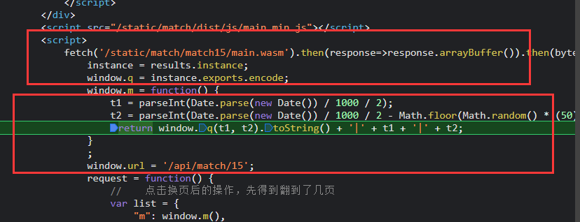

# 任务十五：抓取这5页的数字，计算加和并提交结果

查看请求地址发现如下

    https://match.yuanrenxue.com/api/match/15?m=17374380%7C825234721%7C825234684&page=1
    https://match.yuanrenxue.com/api/match/15?m=17369573%7C825234719%7C825234683&page=2
    
其中的 m 是个变量值

开始扣代码，发现如下内容

    t1 = parseInt(Date.parse(new Date()) / 1000 / 2);
    t2 = parseInt(Date.parse(new Date()) / 1000 / 2 - Math.floor(Math.random() * (50) + 1));
    return window.q(t1, t2).toString() + '|' + t1 + '|' + t2;

这里面存在 window.q 是由 results.instance 产生

    instance = results.instance;
    window.q = instance.exports.encode;
    
对 results.instance 开始分析

    fetch('/static/match/match15/main.wasm').then(response=>response.arrayBuffer()).then(bytes=>WebAssembly.instantiate(bytes)).then(results=>{
    
发现是 /static/match/match15/main.wasm 通过请求链接

    https://match.yuanrenxue.com/static/match/match15/main.wasm

获得 main.wasm 文件

    WebAssembly规范描述了两种格式，第一种是.wasm文件的紧凑二进制格式，这是WebAssembly代码的常规输出格式。第二种是文本格式（WAT-WebAssembly文本格式），它与二进制格式非常相似，但设计为人类可读。
    
    以下是一个非常简单的"hello world" WebAssembly模块（WAT格式）：
    
    (module
      (func (result i32)
        (i32.const 42)
      )
      (export "helloWorld" (func 0))
    )
    上面代码导出的单个函数并允许从JavaScript调用它，返回一个常量值'42'。

python代码

    import time
    import math
    import random
    import pywasm
    import requests
    import json
    
    
    t1 = int(int(time.time())/2)
    t2 = int(int(time.time())/2 - math.floor(random.random() * 50 + 1))
    print(t1, t2)
    # window.q(t1, t2).toString() + '|' + t1 + '|' + t2
    wasm = pywasm.load("./main.wasm")
    sign = wasm.exec("encode", [t1, t2])
    m = str(sign) + '|' + str(t1) + '|' + str(t2)
    print(m)
    sum_value = 0
    for i in range(1, 6):
        Headers = {
            "User-Agent": "yuanrenxue.project",
            "cookie": f"sessionid=1u2ghdn3n2kg56t7kq0opn9ljixfisau;",
        }
        res = requests.get(url=f"https://match.yuanrenxue.com/api/match/15?m={m}&page={i}", headers=Headers)
        res_dict = json.loads(res.text)
        for j in res_dict.get('data'):
            sum_value += j.get('value')
    
    print(sum_value)
