# 猿人学第16题-webpack-调试跳转-指纹-window删除陷阱-纯手撕版

**老版本反爬**

    打开f12发现直接跳转到首页

        https://blog.csdn.net/sonichty/article/details/106337097

    添加新书签，网址为以下JS：

        javascript:window.addEventListener('beforeunload', function (e) { e.preventDefault();e.returnValue = '' });

网页加载完后，点击这个书签注入JS

**新反爬是控制台无限输出**


油猴插件解决问题
```javascript
// ==UserScript==
// @name        hook setInterval debugger console
// @namespace   http://tampermonkey.net/
// @version     0.1
// @description pass
// @author      ayf
// @run-at      document-start
// @match       *://*/*
// @grant       none
// ==/UserScript==

(function() {
    var new_setInterval=setInterval;
    window.setInterval=function(a,b){
        if(a.toString().indexOf("debugger")!=-1)
        {
            return null;
        }
        if(a.toString().indexOf("console.log")!=-1)
        {
            return null;
        }
        if(a.toString().indexOf("console.clear")!=-1)
        {
            return null;
        }
        new_setInterval(a,b);
    }
})();
```

下面开始查请求内容

    https://match.yuanrenxue.com/api/match/16?page=1&m=yRGKX8mcMrTseFH04e67aa2178c08b2cbead16007e5bd66DSJ6YzK5KF&t=1650734803000
    https://match.yuanrenxue.com/api/match/16?page=1&m=x6SpyZZMNySDd7td1f3ce3d0c4c6bde96f904d2d8a428aaYDCZS2Sdxk&t=1650734804000
    https://match.yuanrenxue.com/api/match/16?page=1&m=x2BFAdXwr7d4G6md1f3ce3d0c4c6bde96f904d2d8a428aaBDe5nNDkmX&t=1650734805000

`m`就是一个变量值，这里直接控制台调试

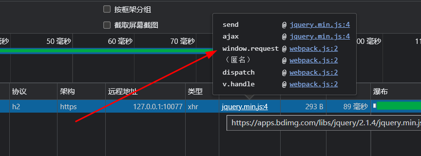

开始打断点，找到加密点

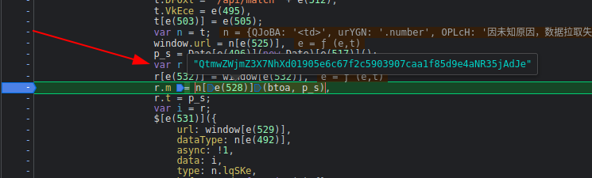

这里可以看到`btoa`编码加密
```javascript
r.m = n[e(528)](btoa, p_s)
```
用正常浏览器测试

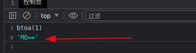

用当前环境测试

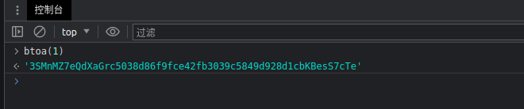

这里就可以知道函数`btoa`是被魔改过的，查看主体逻辑

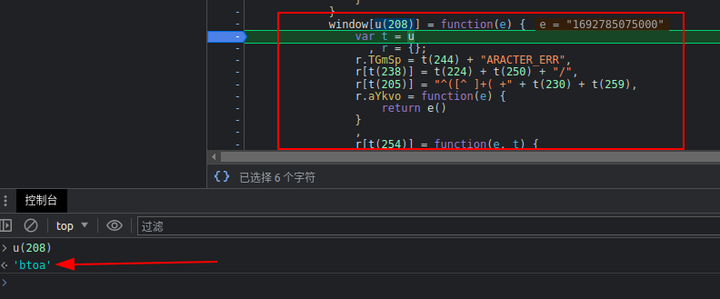

找到主逻辑，这里的`u(208)`就是`btoa`

```javascript
window[u(208)] = function(e) {
    var t = u
      , r = {};
    r.TGmSp = t(244) + "ARACTER_ERR",
    r[t(238)] = t(224) + t(250) + "/",
    r[t(205)] = "^([^ ]+( +" + t(230) + t(259),
    r.aYkvo = function(e) {
        return e()
    }
    ,
    r[t(254)] = function(e, t) {
        return e % t
    }
    ,
    r.evetF = function(e, t) {
        return e >> t
    }
    ,
    r.GfTek = t(196),
    r[t(260)] = function(e, t) {
        return e << t
    }
    ,
    r[t(229)] = function(e, t) {
        return e | t
    }
    ,
    r[t(242)] = function(e, t) {
        return e << t
    }
    ,
    r[t(228)] = function(e, t) {
        return e & t
    }
    ,
    r[t(207)] = function(e, t) {
        return e << t
    }
    ,
    r[t(202)] = function(e, t) {
        return e & t
    }
    ,
    r.jdwcO = function(e, t) {
        return e === t
    }
    ,
    r.kPdGe = t(231),
    r[t(195)] = t(213),
    r[t(201)] = function(e, t) {
        return e & t
    }
    ,
    r[t(206)] = function(e, t) {
        return e == t
    }
    ,
    r[t(219)] = function(e, t) {
        return e + t
    }
    ,
    r[t(220)] = function(e, t) {
        return e(t)
    }
    ;
    var i = r;
    if (/([^\u0000-\u00ff])/.test(e))
        throw new Error(i.TGmSp);
    for (var o, a, s, l = 0, c = []; l < e[t(261)]; ) {
        switch (a = e[t(237)](l),
        s = i.kukBH(l, 6)) {
        case 0:
            delete window,
            delete document,
            c[t(246)](f[t(245)](i[t(212)](a, 2)));
            break;
        case 1:
            try {
                "WhHMm" === i[t(198)] || n.g && c[t(246)](f[t(245)](i.pHtmC(2 & o, 3) | i.evetF(a, 4)))
            } catch (e) {
                c[t(246)](f[t(245)](i[t(229)](i.cVCcp(3 & o, 4), a >> 4)))
            }
            break;
        case 2:
            c[t(246)](f[t(245)](i[t(229)](i[t(242)](15 & o, 2), i.evetF(a, 6)))),
            c[t(246)](f[t(245)](i[t(228)](a, 63)));
            break;
        case 3:
            c[t(246)](f[t(245)](i[t(212)](a, 3)));
            break;
        case 4:
            c.push(f[t(245)](i[t(229)](i[t(207)](i.OWUOc(o, 4), 6), i[t(212)](a, 6))));
            break;
        case 5:
            c[t(246)](f[t(245)](i[t(229)](i[t(207)](i[t(202)](o, 15), 4), a >> 8))),
            c.push(f.charAt(i[t(202)](a, 63)))
        }
        o = a,
        l++
    }
    return 0 == s ? i[t(226)](i[t(241)], i[t(195)]) || (c[t(246)](f[t(245)](i[t(201)](o, 3) << 4)),
    c.push("FM")) : i.eMnqD(s, 1) && (c[t(246)](f[t(245)]((15 & o) << 2)),
    c[t(246)]("K")),
    i[t(219)](i.aQCDK(d(15), window.md5(c[t(234)](""))), i[t(220)](d, 10))
}
```
仔细观察代码，发现大量出现`t(226)`，**函数字面量**，这里我尝试用AST解混淆.

进入这个`t`查看具体的干了什么！

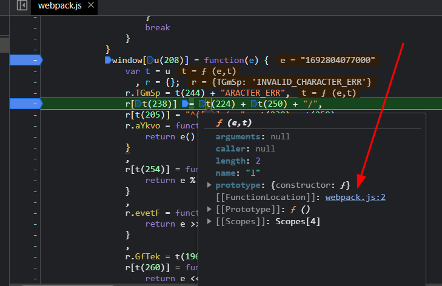

可以看到通过函数`_0x34e7[e -= 188]`拿到了数组中的字符串

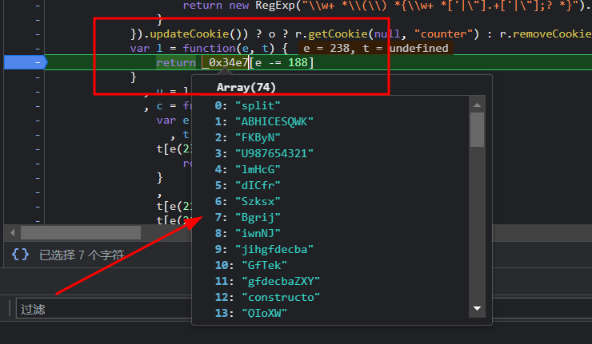

这就比较简单了，编写`ast`插件，把所有`t(数字)`这样的函数全部替换

```javascript
const fs = require('fs');
const parser = require("@babel/parser");
const traverse = require("@babel/traverse").default;
const types = require("@babel/types");
const generator = require("@babel/generator").default;

// 元代码
process.argv.length > 2 ? encodeFile = process.argv[2] : encodeFile = "./encode.js";
// 被重新编译后的代码
process.argv.length > 3 ? decodeFile = process.argv[3] : decodeFile = "./decodeResult.js";

let sourceCode = fs.readFileSync(encodeFile, {encoding: "utf-8"});
let ast = parser.parse(sourceCode);

var e;
_0x34e7 = ['split', 'ABHICESQWK', 'FKByN', 'U987654321', 'lmHcG', 'dICfr', 'Szksx', 'Bgrij', 'iwnNJ', 'jihgfdecba', 'GfTek', 'gfdecbaZXY', 'constructo', 'QIoXW', 'jLRMs', 'AqLWq', '0zyxwvutsr', 'TKgNw', 'eMnqD', 'thjIz', 'btoa', 'MNPQRSTWXY', 'oPsqh', 'niIlq', 'evetF', 'LVZVH', 'fYWEX', 'kmnprstwxy', 'aYkvo', 'tsrqpomnlk', 'HfLqY', 'aQCDK', 'lGBLj', 'test', '3210zyxwvu', 'QWK2Fi', 'return /" ', 'hsJtK', 'jdwcO', 'SlFsj', 'OWUOc', 'LCaAn', '[^ ]+)+)+[', 'FAVYf', '2Fi+987654', 'floor', 'join', 'EuwBW', 'OXYrZ', 'charCodeAt', 'SkkHG', 'iYuJr', 'GwoYF', 'kPdGe', 'cVCcp', 'INQRH', 'INVALID_CH', 'charAt', 'push', 'apply', 'lalCJ', 'kTcRS', '+ this + "', 'ykpOn', 'gLnjm', 'gmBaq', 'kukBH', 'dvEWE', 'SFKLi', '^([^ ]+( +', 'qpomnlkjih', '^ ]}', 'pHtmC', 'length']
l = function(e, t) {
    return _0x34e7[e -= 188]
};

const callToLiteral =
    {
        CallExpression(path) {
            // 拿到callee节点和arguments节点
            let {callee, arguments} = path.node;
            // 判断callee的节点类型 和 判断arguments是否只有一个参数
            if (!types.isIdentifier(callee) || arguments.length != 1) {
                return;
            }
            // 获得函数名
            let name = callee.name;
            // 检查数组 ['e', 't', 'o', 'u'] 是否包含变量 name 的值
            // 判断数组中第一个元素的类型是否是NumericLiteral
            if (!['t'].includes(name) || !types.isNumericLiteral(arguments[0])) {
                return 0;
            }
            // 获取NumericLiteral的值
            let value = l(arguments[0].value);
            // 替换节点值
            path.replaceWith(types.valueToNode(value));
        }
    };

traverse(ast, callToLiteral);

let {code} = generator(ast, opts = {jsescOption: {"minimal": true}});

fs.writeFile(decodeFile, code, (err) => {
});
```
编译后的效果
```javascript
function dddd(e) {
  var t = u,
    r = {};
  r.TGmSp = "INVALID_CH" + "ARACTER_ERR", r["SkkHG"] = "return /\" " + "+ this + \"" + "/", r["TKgNw"] = "^([^ ]+( +" + "[^ ]+)+)+[" + "^ ]}", r.aYkvo = function (e) {
    return e();
  }, r["kukBH"] = function (e, t) {
    return e % t;
  }, r.evetF = function (e, t) {
    return e >> t;
  }, r.GfTek = "iwnNJ", r["pHtmC"] = function (e, t) {
    return e << t;
  }, r["LCaAn"] = function (e, t) {
    return e | t;
  }, r["cVCcp"] = function (e, t) {
    return e << t;
  }, r["OWUOc"] = function (e, t) {
    return e & t;
  }, r["thjIz"] = function (e, t) {
    return e << t;
  }, r["jLRMs"] = function (e, t) {
    return e & t;
  }, r.jdwcO = function (e, t) {
    return e === t;
  }, r.kPdGe = "FAVYf", r["Bgrij"] = "LVZVH", r["QIoXW"] = function (e, t) {
    return e & t;
  }, r["eMnqD"] = function (e, t) {
    return e == t;
  }, r["aQCDK"] = function (e, t) {
    return e + t;
  }, r["lGBLj"] = function (e, t) {
    return e(t);
  };
  var i = r;
  if (/([^\u0000-\u00ff])/.test(e)) throw new Error(i.TGmSp);
  for (var o, a, s, l = 0, c = []; l < e["length"];) {
    switch (a = e["charCodeAt"](l), s = i.kukBH(l, 6)) {
      case 0:
        delete window, delete document, c["push"](f["charAt"](i["evetF"](a, 2)));
        break;
      case 1:
        try {
          "WhHMm" === i["GfTek"] || n.g && c["push"](f["charAt"](i.pHtmC(2 & o, 3) | i.evetF(a, 4)));
        } catch (e) {
          c["push"](f["charAt"](i["LCaAn"](i.cVCcp(3 & o, 4), a >> 4)));
        }
        break;
      case 2:
        c["push"](f["charAt"](i["LCaAn"](i["cVCcp"](15 & o, 2), i.evetF(a, 6)))), c["push"](f["charAt"](i["OWUOc"](a, 63)));
        break;
      case 3:
        c["push"](f["charAt"](i["evetF"](a, 3)));
        break;
      case 4:
        c.push(f["charAt"](i["LCaAn"](i["thjIz"](i.OWUOc(o, 4), 6), i["evetF"](a, 6))));
        break;
      case 5:
        c["push"](f["charAt"](i["LCaAn"](i["thjIz"](i["jLRMs"](o, 15), 4), a >> 8))), c.push(f.charAt(i["jLRMs"](a, 63)));
    }
    o = a, l++;
  }
  return 0 == s ? i["jdwcO"](i["kPdGe"], i["Bgrij"]) || (c["push"](f["charAt"](i["QIoXW"](o, 3) << 4)), c.push("FM")) : i.eMnqD(s, 1) && (c["push"](f["charAt"]((15 & o) << 2)), c["push"]("K")), i["aQCDK"](i.aQCDK(d(15), window.md5(c["join"](""))), i["lGBLj"](d, 10));
}
```
放入浏览器控制台尝试运行，出现报错u不存在，删除即可。

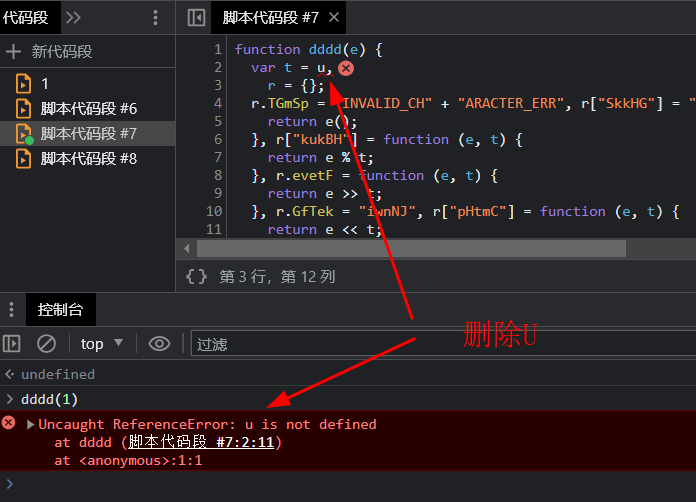

再次运行发现，d不存在，需要补d函数

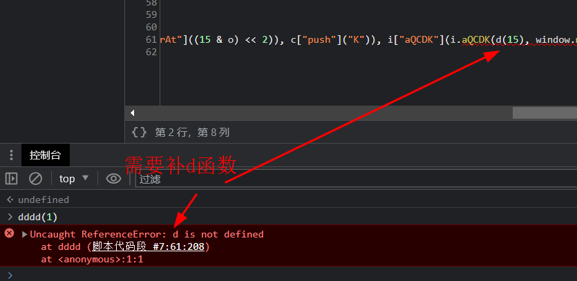

查看d函数内容

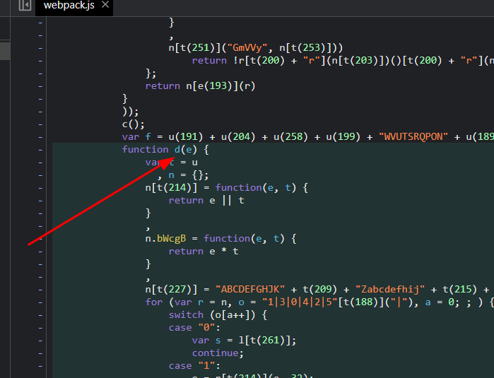

d函数也存在`t(数字)`这样字面量，放入ast中重新编译，再次运行，发现缺少md5函数

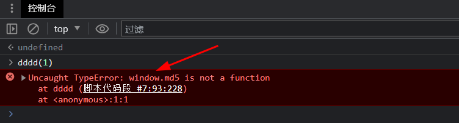

进行补md5函数

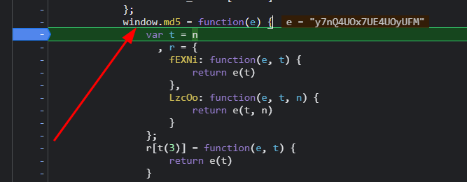

通过分析发现同样存在类似`t(数字)`这样字面量，不过这次需要替换函数增加`'c', 't', 'r', 'n', 'l'`ast代码修改如下
```javascript
if (!['c', 't', 'r', 'n', 'l'].includes(name) || !types.isNumericLiteral(arguments[0])) {
    return 0;
}
```
ast编译后的md5代码
```javascript
function md5(e) {
    var t,
        r = {
            fEXNi: function (e, t) {
                return e(t);
            },
            LzcOo: function (e, t, n) {
                return e(t, n);
            }
        };
    r["vyNVU"] = function (e, t) {
        return e(t);
    }, r.wEOgn = function (e, t, n) {
        return e(t, n);
    }, r["YcDFe"] = function (e, t, n) {
        return e(t, n);
    }, r["HiEZt"] = function (e, t) {
        return e == t;
    }, r["zYRlD"] = function (e, t) {
        return e(t);
    }, r["pagBT"] = "abc", r.oBesn = "900150983c" + "d24fb0d696" + "3f7d28e17f" + "72", r["WNzfT"] = "3|6|1|4|7|" + "5|0|2", r["iXQwu"] = function (e, t) {
        return e < t;
    }, r["nsaps"] = "14|67|61|3" + "0|43|57|4|" + "9|24|10|56" + "|55|13|12|" + "60|53|21|5" + "4|69|41|26" + "|49|71|11|" + "35|68|33|4" + "2|28|6|36|" + "51|8|0|65|" + "18|38|15|2" + "0|45|44|19" + "|37|22|27|" + "25|34|1|2|" + "39|40|47|6" + "2|29|23|64" + "|46|5|3|50" + "|31|63|48|" + "52|59|66|7" + "0|58|16|32" + "|7|17", r["JRihE"] = function (e, t, n, r, i, o, a, s) {
        return e(t, n, r, i, o, a, s);
    }, r["JFqRJ"] = function (e, t) {
        return e + t;
    }, r["PbrnX"] = function (e, t, n, r, i, o, a, s) {
        return e(t, n, r, i, o, a, s);
    }, r["jGSEC"] = function (e, t, n, r, i, o, a, s) {
        return e(t, n, r, i, o, a, s);
    }, r["Lmhlz"] = function (e, t) {
        return e + t;
    }, r["XfWkD"] = function (e, t, n, r, i, o, a, s) {
        return e(t, n, r, i, o, a, s);
    }, r["wKeAM"] = function (e, t) {
        return e + t;
    }, r["pviAr"] = function (e, t, n) {
        return e(t, n);
    }, r["IKbhW"] = function (e, t) {
        return e + t;
    }, r["xcQTI"] = function (e, t) {
        return e + t;
    }, r["bolvy"] = function (e, t, n) {
        return e(t, n);
    }, r["PlAEw"] = function (e, t) {
        return e + t;
    }, r.lZISZ = function (e, t, n, r, i, o, a, s) {
        return e(t, n, r, i, o, a, s);
    }, r.Iekey = function (e, t, n, r, i, o, a, s) {
        return e(t, n, r, i, o, a, s);
    }, r.AAZoR = function (e, t) {
        return e + t;
    }, r["UXeVn"] = function (e, t, n, r, i, o, a, s) {
        return e(t, n, r, i, o, a, s);
    }, r.UlhBp = function (e, t) {
        return e + t;
    }, r.yMPhx = function (e, t, n, r, i, o, a, s) {
        return e(t, n, r, i, o, a, s);
    }, r["HHkBN"] = function (e, t) {
        return e + t;
    }, r["yGmJD"] = function (e, t) {
        return e + t;
    }, r["aFxRD"] = function (e, t, n) {
        return e(t, n);
    }, r.kHuTw = function (e, t, n, r, i, o, a, s) {
        return e(t, n, r, i, o, a, s);
    }, r["YLwOK"] = function (e, t, n, r, i, o, a, s) {
        return e(t, n, r, i, o, a, s);
    }, r["FcXlo"] = function (e, t, n, r, i, o, a, s) {
        return e(t, n, r, i, o, a, s);
    }, r["QgSUn"] = function (e, t) {
        return e + t;
    }, r["koePJ"] = function (e, t) {
        return e + t;
    }, r["wvVCN"] = function (e, t, n, r, i, o, a, s) {
        return e(t, n, r, i, o, a, s);
    }, r["VyzBI"] = function (e, t) {
        return e + t;
    }, r["lvwPz"] = function (e, t) {
        return e + t;
    }, r.YpeFX = function (e, t) {
        return e + t;
    }, r["nCrbn"] = function (e, t, n, r, i, o, a, s) {
        return e(t, n, r, i, o, a, s);
    }, r.prrXX = function (e, t) {
        return e + t;
    }, r.kaQlD = function (e, t) {
        return e + t;
    }, r.qtIDJ = function (e, t, n, r, i, o, a, s) {
        return e(t, n, r, i, o, a, s);
    }, r.xGAWc = function (e, t) {
        return e + t;
    }, r["VaXsK"] = function (e, t, n, r, i, o, a, s) {
        return e(t, n, r, i, o, a, s);
    }, r["WMqBp"] = function (e, t) {
        return e + t;
    }, r["fmdcS"] = function (e, t, n, r, i, o, a, s) {
        return e(t, n, r, i, o, a, s);
    }, r["XBcOb"] = function (e, t) {
        return e + t;
    }, r["ZXsFi"] = function (e, t) {
        return e + t;
    }, r["NNXUu"] = function (e, t, n, r, i, o, a, s) {
        return e(t, n, r, i, o, a, s);
    }, r["UAFHv"] = function (e, t) {
        return e + t;
    }, r["sFtiw"] = function (e, t, n, r, i, o, a, s) {
        return e(t, n, r, i, o, a, s);
    }, r["MFmWH"] = function (e, t) {
        return e + t;
    }, r["mdsJQ"] = function (e, t, n, r, i, o, a, s) {
        return e(t, n, r, i, o, a, s);
    }, r["bRLIN"] = function (e, t, n, r, i, o, a, s) {
        return e(t, n, r, i, o, a, s);
    }, r["WQCAS"] = function (e, t, n, r, i, o, a, s) {
        return e(t, n, r, i, o, a, s);
    }, r.TXzzv = function (e, t) {
        return e + t;
    }, r.NNVLf = function (e, t, n, r, i, o, a, s) {
        return e(t, n, r, i, o, a, s);
    }, r["ihcci"] = function (e, t) {
        return e + t;
    }, r["SUrST"] = function (e, t, n, r, i, o, a, s) {
        return e(t, n, r, i, o, a, s);
    }, r["rvloG"] = function (e, t) {
        return e + t;
    }, r.MXnIN = function (e, t) {
        return e >> t;
    }, r["BQgZQ"] = function (e, t) {
        return e << t;
    }, r.nqEyg = function (e, t) {
        return e % t;
    }, r.kaXPV = function (e, t) {
        return e >>> t;
    }, r["BtzmV"] = function (e, t, n) {
        return e(t, n);
    }, r["eSwEi"] = function (e, t, n) {
        return e(t, n);
    }, r["dbmfK"] = function (e, t, n) {
        return e(t, n);
    }, r["rNapo"] = function (e, t) {
        return e | t;
    }, r["YhaCC"] = function (e, t) {
        return e & t;
    }, r["FcYqi"] = function (e, t, n, r, i, o, a) {
        return e(t, n, r, i, o, a);
    }, r.ZpUiH = function (e, t) {
        return e & t;
    }, r["tsNzQ"] = function (e, t) {
        return e ^ t;
    }, r["FDiNG"] = function (e, t) {
        return e ^ t;
    }, r["WzbFA"] = function (e, t) {
        return e | t;
    }, r["IWxBE"] = function (e, t) {
        return e > t;
    }, r["hBKtU"] = function (e, t) {
        return e(t);
    }, r["WNIsZ"] = function (e, t, n) {
        return e(t, n);
    }, r["uhJgH"] = function (e, t) {
        return e(t);
    }, r["wnDlW"] = function (e, t) {
        return e + t;
    }, r.FDfcp = function (e, t) {
        return e * t;
    }, r["xgzfr"] = function (e, t) {
        return e + t;
    }, r["iqfMz"] = function (e, t) {
        return e & t;
    }, r.DdHPB = function (e, t) {
        return e >> t;
    }, r.abYok = function (e, t) {
        return e | t;
    }, r["vRqUp"] = function (e, t) {
        return e << t;
    }, r["NLOsy"] = function (e, t) {
        return e & t;
    }, r["wQPIq"] = function (e, t) {
        return e - t;
    }, r["rrdPR"] = function (e) {
        return e();
    }, r.YVBwM = function (e, t) {
        return e << t;
    }, r["Yvoqt"] = function (e, t) {
        return e & t;
    }, r["HYhpy"] = function (e, t) {
        return e / t;
    }, r["ucisR"] = function (e, t) {
        return e * t;
    }, r["LjyKQ"] = "0123456789" + "abcdef", r["zObVA"] = function (e, t) {
        return e >> t;
    }, r["kZhzK"] = function (e, t) {
        return e + t;
    }, r["wWwRM"] = function (e, t) {
        return e >> t;
    }, r["KxKIe"] = function (e, t) {
        return e * t;
    }, r["ljkOt"] = "ABCDEFGHIJ" + "KLMNOPQRST" + "UVWXYZabcdefghijklmn" + "opqrstuvwx" + "yz01234567" + "89+/", r["fwCDC"] = function (e, t) {
        return e * t;
    }, r.KIXRL = function (e, t) {
        return e << t;
    }, r["goEwl"] = function (e, t) {
        return e % t;
    }, r["yWGcu"] = function (e, t) {
        return e << t;
    }, r["lNWda"] = function (e, t) {
        return e >> t;
    }, r.jZUAt = function (e, t) {
        return e >> t;
    }, r["LAIPf"] = function (e, t) {
        return e + t;
    }, r["grCxb"] = function (e, t) {
        return e % t;
    }, r["EQEzR"] = function (e, t) {
        return e * t;
    }, r["Myvqp"] = function (e, t) {
        return e < t;
    }, r.mfuQZ = function (e, t) {
        return e + t;
    }, r["PnITs"] = function (e, t) {
        return e * t;
    }, r["Rtsed"] = function (e, t) {
        return e(t);
    };
    var i = r;
    function o(e, n) {
        for (var r = t, o = i.WNzfT["split"]("|"), a = 0;;) {
            switch (o[a++]) {
                case "0":
                    for (var d = 0; i.iXQwu(d, e.length); d += 16) for (var p = i["nsaps"]["split"]("|"), h = 0;;) {
                        switch (p[h++]) {
                            case "0":
                                w = i["JRihE"](l, w, b, x, T, e[d + 2], 9, -51403784);
                                continue;
                            case "1":
                                x = u(x, T, w, b, e[d + 6], 23, 76029189);
                                continue;
                            case "2":
                                b = i["JRihE"](u, b, x, T, w, e[i.JFqRJ(d, 9)], 4, -640364487);
                                continue;
                            case "3":
                                T = i["PbrnX"](c, T, w, b, x, e[d + 10], 15, -1051523);
                                continue;
                            case "4":
                                T = s(T, w, b, x, e[i.JFqRJ(d, 2)], 17, 606105819);
                                continue;
                            case "5":
                                w = i["jGSEC"](c, w, b, x, T, e[i["Lmhlz"](d, 3)], 10, -1894446606);
                                continue;
                            case "6":
                                w = i.XfWkD(l, w, b, x, T, e[i.wKeAM(d, 14)], 9, -1019803690);
                                continue;
                            case "7":
                                T = i.pviAr(f, T, v);
                                continue;
                            case "8":
                                b = i.XfWkD(l, b, x, T, w, e[i["IKbhW"](d, 13)], 5, -1444681467);
                                continue;
                            case "9":
                                x = i["XfWkD"](s, x, T, w, b, e[i["xcQTI"](d, 3)], 22, -1044525330);
                                continue;
                            case "10":
                                w = s(w, b, x, T, e[i["xcQTI"](d, 5)], 12, 1200080426);
                                continue;
                            case "11":
                                x = i["XfWkD"](l, x, T, w, b, e[i["xcQTI"](d, 0)], 20, -373897302);
                                continue;
                            case "12":
                                w = i["XfWkD"](s, w, b, x, T, e[i["xcQTI"](d, 9)], 12, -1958435417);
                                continue;
                            case "13":
                                b = i.XfWkD(s, b, x, T, w, e[i.xcQTI(d, 8)], 7, 1770035416);
                                continue;
                            case "14":
                                var m = b;
                                continue;
                            case "15":
                                w = i["XfWkD"](u, w, b, x, T, e[i.xcQTI(d, 8)], 11, -2022574463);
                                continue;
                            case "16":
                                b = f(b, m);
                                continue;
                            case "17":
                                w = i["bolvy"](f, w, g);
                                continue;
                            case "18":
                                x = l(x, T, w, b, e[i["PlAEw"](d, 12)], 20, -1921207734);
                                continue;
                            case "19":
                                w = i["lZISZ"](u, w, b, x, T, e[d + 4], 11, 1272893353);
                                continue;
                            case "20":
                                T = i["Iekey"](u, T, w, b, x, e[i.PlAEw(d, 11)], 16, 1839030562);
                                continue;
                            case "21":
                                b = s(b, x, T, w, e[i["AAZoR"](d, 12)], 7, 1804550682);
                                continue;
                            case "22":
                                x = u(x, T, w, b, e[i["AAZoR"](d, 10)], 23, -1094730640);
                                continue;
                            case "23":
                                T = i["UXeVn"](c, T, w, b, x, e[d + 14], 15, -1416354905);
                                continue;
                            case "24":
                                b = s(b, x, T, w, e[i["AAZoR"](d, 4)], 7, -176418897);
                                continue;
                            case "25":
                                w = i.UXeVn(u, w, b, x, T, e[d + 0], 11, -358537222);
                                continue;
                            case "26":
                                b = i.UXeVn(l, b, x, T, w, e[i["UlhBp"](d, 1)], 5, -165796510);
                                continue;
                            case "27":
                                b = i.UXeVn(u, b, x, T, w, e[i["UlhBp"](d, 13)], 4, 681279174);
                                continue;
                            case "28":
                                b = i["yMPhx"](l, b, x, T, w, e[i["HHkBN"](d, 9)], 5, 568446438);
                                continue;
                            case "29":
                                w = i.yMPhx(c, w, b, x, T, e[d + 7], 10, 11261161415);
                                continue;
                            case "30":
                                var g = w;
                                continue;
                            case "31":
                                b = c(b, x, T, w, e[i.yGmJD(d, 8)], 6, 1873313359);
                                continue;
                            case "32":
                                x = i.aFxRD(f, x, y);
                                continue;
                            case "33":
                                T = i["yMPhx"](l, T, w, b, x, e[i["yGmJD"](d, 15)], 14, -660478335);
                                continue;
                            case "34":
                                T = i.kHuTw(u, T, w, b, x, e[d + 3], 16, -722881979);
                                continue;
                            case "35":
                                b = i["YLwOK"](l, b, x, T, w, e[i["yGmJD"](d, 5)], 5, -701520691);
                                continue;
                            case "36":
                                T = l(T, w, b, x, e[i["yGmJD"](d, 3)], 14, -187363961);
                                continue;
                            case "37":
                                T = i["FcXlo"](u, T, w, b, x, e[i.QgSUn(d, 7)], 16, -155497632);
                                continue;
                            case "38":
                                b = i.FcXlo(u, b, x, T, w, e[i.koePJ(d, 5)], 4, -378558);
                                continue;
                            case "39":
                                w = i["FcXlo"](u, w, b, x, T, e[i["koePJ"](d, 12)], 11, -421815835);
                                continue;
                            case "40":
                                T = i["wvVCN"](u, T, w, b, x, e[i["VyzBI"](d, 15)], 16, 530742520);
                                continue;
                            case "41":
                                x = i.wvVCN(s, x, T, w, b, e[d + 15], 22, 1236531029);
                                continue;
                            case "42":
                                x = i["wvVCN"](l, x, T, w, b, e[i["lvwPz"](d, 4)], 20, -405537848);
                                continue;
                            case "43":
                                b = i["wvVCN"](s, b, x, T, w, e[i.lvwPz(d, 0)], 7, -680976936);
                                continue;
                            case "44":
                                b = i["wvVCN"](u, b, x, T, w, e[i["YpeFX"](d, 1)], 4, -1530992060);
                                continue;
                            case "45":
                                x = i.nCrbn(u, x, T, w, b, e[i["prrXX"](d, 14)], 23, -35311556);
                                continue;
                            case "46":
                                b = c(b, x, T, w, e[i["kaQlD"](d, 12)], 6, 1700485571);
                                continue;
                            case "47":
                                x = i["nCrbn"](u, x, T, w, b, e[i.kaQlD(d, 2)], 23, -995338651);
                                continue;
                            case "48":
                                T = c(T, w, b, x, e[d + 6], 15, -1560198380);
                                continue;
                            case "49":
                                w = i["qtIDJ"](l, w, b, x, T, e[i["xGAWc"](d, 6)], 9, -1069501632);
                                continue;
                            case "50":
                                x = i["VaXsK"](c, x, T, w, b, e[i["WMqBp"](d, 1)], 21, -2054922799);
                                continue;
                            case "51":
                                x = i.fmdcS(l, x, T, w, b, e[d + 8], 20, 1163531501);
                                continue;
                            case "52":
                                x = i["fmdcS"](c, x, T, w, b, e[i["XBcOb"](d, 13)], 21, 1309151649);
                                continue;
                            case "53":
                                x = i["fmdcS"](s, x, T, w, b, e[i["ZXsFi"](d, 11)], 22, -1990404162);
                                continue;
                            case "54":
                                w = i["NNXUu"](s, w, b, x, T, e[i["UAFHv"](d, 13)], 12, -40341101);
                                continue;
                            case "55":
                                x = i.sFtiw(s, x, T, w, b, e[i.UAFHv(d, 7)], 22, -45705983);
                                continue;
                            case "56":
                                T = i.sFtiw(s, T, w, b, x, e[i.MFmWH(d, 6)], 17, -1473231341);
                                continue;
                            case "57":
                                w = i["sFtiw"](s, w, b, x, T, e[i.MFmWH(d, 1)], 12, -389564586);
                                continue;
                            case "58":
                                x = c(x, T, w, b, e[i["MFmWH"](d, 9)], 21, -343485551);
                                continue;
                            case "59":
                                b = i["mdsJQ"](c, b, x, T, w, e[i["MFmWH"](d, 4)], 6, -145523070);
                                continue;
                            case "60":
                                T = i.bRLIN(s, T, w, b, x, e[i["MFmWH"](d, 10)], 17, -42063);
                                continue;
                            case "61":
                                var v = T;
                                continue;
                            case "62":
                                b = i["WQCAS"](c, b, x, T, w, e[d + 0], 6, -198630844);
                                continue;
                            case "63":
                                w = i["WQCAS"](c, w, b, x, T, e[i["TXzzv"](d, 15)], 10, -30611744);
                                continue;
                            case "64":
                                x = c(x, T, w, b, e[d + 5], 21, -57434055);
                                continue;
                            case "65":
                                T = i["NNVLf"](l, T, w, b, x, e[i["TXzzv"](d, 7)], 14, 1735328473);
                                continue;
                            case "66":
                                w = i["NNVLf"](c, w, b, x, T, e[i["ihcci"](d, 11)], 10, -1120210379);
                                continue;
                            case "67":
                                var y = x;
                                continue;
                            case "68":
                                w = i["SUrST"](l, w, b, x, T, e[d + 10], 9, 38016083);
                                continue;
                            case "69":
                                T = i["SUrST"](s, T, w, b, x, e[i["ihcci"](d, 14)], 17, -1502002290);
                                continue;
                            case "70":
                                T = i.SUrST(c, T, w, b, x, e[i["ihcci"](d, 2)], 15, 718787259);
                                continue;
                            case "71":
                                T = l(T, w, b, x, e[i["rvloG"](d, 11)], 14, 643717713);
                                continue;
                        }
                        break;
                    }
                    continue;
                case "1":
                    var b = 1732584193;
                    continue;
                case "2":
                    return Array(b, x, T, w);
                case "3":
                    e[i.MXnIN(n, 5)] |= i["BQgZQ"](128, i["nqEyg"](n, 32));
                    continue;
                case "4":
                    var x = -271733879;
                    continue;
                case "5":
                    var w = 271733878;
                    continue;
                case "6":
                    e[i.BQgZQ(i["kaXPV"](n + 64, 9), 4) + 14] = n;
                    continue;
                case "7":
                    var T = -1732584194;
                    continue;
            }
            break;
        }
    }
    function a(e, n, r, o, a, s) {
        var l = t;
        return f(i.BtzmV(d, i["eSwEi"](f, i.dbmfK(f, n, e), i["dbmfK"](f, o, s)), a), r);
    }
    function s(e, n, r, o, s, l, u) {
        var c = t;
        return a(i["rNapo"](i["YhaCC"](n, r), i["YhaCC"](~n, o)), e, n, s, l, u);
    }
    function l(e, n, r, o, s, l, u) {
        var c = t;
        return i["FcYqi"](a, i["rNapo"](i.ZpUiH(n, o), i.ZpUiH(r, ~o)), e, n, s, l, u);
    }
    function u(e, n, r, o, s, l, u) {
        return i["FcYqi"](a, i.tsNzQ(n ^ r, o), e, n, s, l, u);
    }
    function c(e, n, r, o, s, l, u) {
        var c = t;
        return i["FcYqi"](a, i["FDiNG"](r, i["WzbFA"](n, ~o)), e, n, s, l, u);
    }
    function f(e, n) {
        var r = t,
            o = i["xgzfr"](65535 & e, i.iqfMz(n, 65535)),
            a = i["xgzfr"](e >> 16, i["DdHPB"](n, 16)) + i["DdHPB"](o, 16);
        return i["abYok"](i["vRqUp"](a, 16), i["NLOsy"](o, 65535));
    }
    function d(e, n) {
        var r = t;
        return i.abYok(e << n, e >>> i["wQPIq"](32, n));
    }
    function p(e) {
        for (var n = t, r = i["rrdPR"](Array), o = i["wQPIq"](i.vRqUp(1, 16), 1), a = 0; a < i.FDfcp(e["length"], 16); a += 16) r[i["DdHPB"](a, 5)] |= i["YVBwM"](i["Yvoqt"](e["charCodeAt"](i["HYhpy"](a, 16)), o), i["nqEyg"](a, 32));
        return r;
    }
    function h(e) {
        for (var n = t, r = i["LjyKQ"], o = "", a = 0; i.iXQwu(a, i["ucisR"](e["length"], 4)); a++) o += i.xgzfr(r["charAt"](15 & i["zObVA"](e[i["zObVA"](a, 2)], i["kZhzK"](i["ucisR"](a % 4, 8), 4))), r["charAt"](15 & i.wWwRM(e[a >> 2], i["KxKIe"](a % 4, 8))));
        return o;
    }
    return i["Rtsed"](function (e) {
        var n = t;
        return i["fEXNi"](h, i["LzcOo"](o, i.vyNVU(p, e), 16 * e["length"]));
    }, e);
}

console.log(md5(1));
```
浏览器控制台执行效果

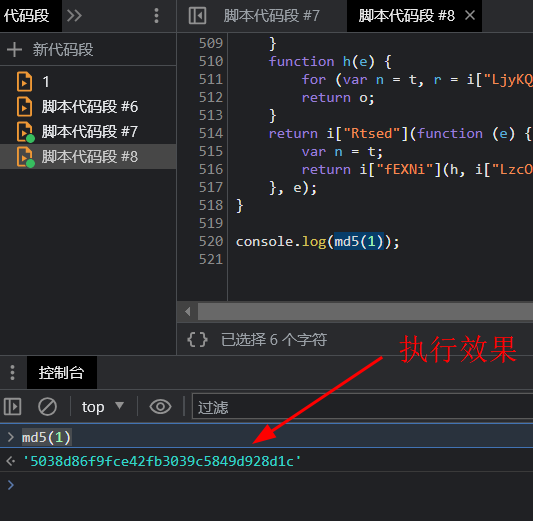

原站点环境执行效果

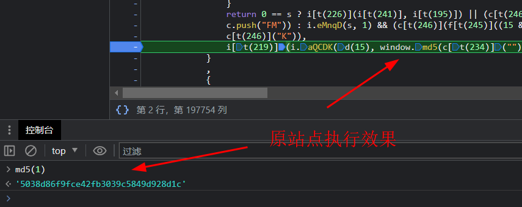

将所有的js代码在本地nodejs环境中运行，报错`ReferenceError: window is not defined`这里需要补环境`window = global;`

并且删除`delete window, delete document,`在nodejs环境中是不存在window和document。


再次执行正常返回加密字符串

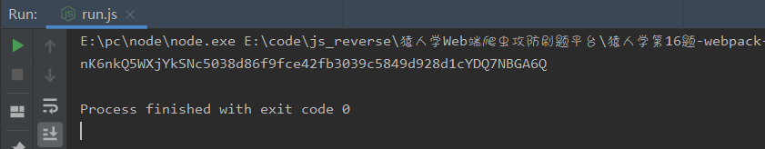

尝试编写python代码，发现无法正确执行，回头继续排查问题，如下图：这里有个`try catch`断点调试`n.g`返回的是`Window{window: Window, self: Window, document: document, name: '', location: Location,…}`
当然再nodejs中是不存在`Window`，代码就会走`catch`。

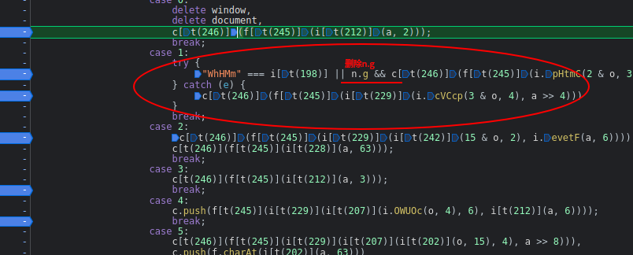

最后删除`n.g`，重新执行python，效果如下。