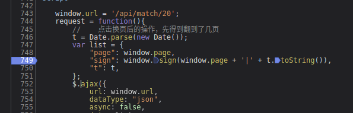
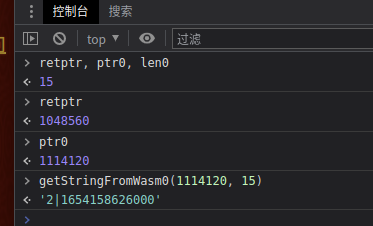
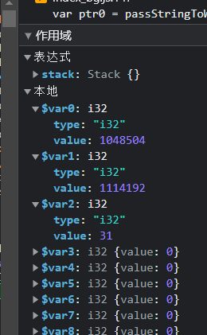
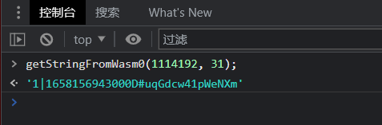

## 知识点

观察请求地址

    https://match.yuanrenxue.com/api/match/20?page=2&sign=73781942400dd0fd60a21f6edb33505b&t=1654067452000

找到加密位置打上断点

进入sign函数，发现是 getStringFromWasm0 函数返回数据

    return getStringFromWasm0(r0, r1);

控制台调试 getStringFromWasm0

放开断点在调试一次

这里的 r0 和 r1是固定不变的，但是每次运行加密出来的值是不同的，说明这是一个指针

继续追进入

    function getStringFromWasm0(ptr, len) {
        return cachedTextDecoder.decode(getUint8Memory0().subarray(ptr, ptr + len));
    }

getUint8Memory0().subarray(ptr, ptr + len) 返回 Uint8Array 数组

    Uint8Array 数组类型表示一个 8 位无符号整型数组，创建时内容被初始化为 0。创建完后，可以以对象的方式或使用数组下标索引的方式引用数组中的元素。

打印
    
    Uint8Array(32) [98, 48, 100, 102, 52, 57, 102, 49, 56, 54, 55, 52, 101, 97, 50, 102, 57, 97, 52, 98, 98, 100, 102, 49, 48, 55, 97, 50, 55, 54, 50, 52, buffer: ArrayBuffer(1179648), byteLength: 32, byteOffset: 1114360, length: 32, Symbol(Symbol.toStringTag): 'Uint8Array']
    
cachedTextDecoder.decode 这是一个解码函数，不是真正的加密地点

    _index_bg_wasm__WEBPACK_IMPORTED_MODULE_0__["sign"](retptr, ptr0, len0);

测试加密点

通过内存里面指针经过还原得到我们想要的结果

对 _index_bg_wasm__WEBPACK_IMPORTED_MODULE_0__ 的断点，进入函数内部

    (func $sign (;71;) (export "sign") (param $var0 i32) (param $var1 i32) (param $var2 i32)
        (local $var3 i32) (local $var4 i32) (local $var5 i32) (local $var6 i32) (local $var7 i32) (local $var8 i32) (local $var9 i32) (local $var10 i32) (local $var11 i32) (local $var12 i32) (local $var13 i32) (local $var14 i32) (local $var15 i32) (local $var16 i32) (local $var17 i32) (local $var18 i32) (local $var19 i32) (local $var20 i32) (local $var21 i32) (local $var22 i32) (local $var23 i32) (local $var24 i32) (local $var25 i32) (local $var26 i32) (local $var27 i32) (local $var28 i32) (local $var29 i32) (local $var30 i32) (local $var31 i32) (local $var32 i32) (local $var33 i32) (local $var34 i32) (local $var35 i32) (local $var36 i64)
        global.get $global0
        local.set $var3
        i32.const 80
        local.set $var4
        local.get $var3
        local.get $var4
        i32.sub

export "sign" 就是函数名sign，(param $var0 i32) (param $var1 i32) (param $var2 i32)就是传递的3个参数

查看作用域 

用前面的解密函数进行测试，其中的15就是15位

对所有包含sign的地方断点，一个个找加密位置

    (func $match_twenty::sign::MD5::hash::hd3cc2e6ebf304f6f (;13;) (param $var0 i32) (param $var1 i32) (param $var2 i32)
        (local $var3 i32) (local $var4 i32) (local $var5 i32) (local $var6 i32) (local $var7 i32) (local $var8 i32) (local $var9 i32) (local $var10 i32) (local $var11 i32) (local $var12 i32) (local $var13 i32) (local $var14 i32) (local $var15 i32) (local $var16 i32) (local $var17 i32) (local $var18 i32) (local $var19 i32) (local $var20 i32) (local $var21 i32) (local $var22 i32) (local $var23 i32) (local $var24 i32) (local $var25 i32) (local $var26 i32) (local $var27 i32) (local $var28 i32) (local $var29 i32) (local $var30 i32) (local $var31 i32) (local $var32 i32) (local $var33 i32) (local $var34 i32) (local $var35 i32) (local $var36 i32) (local $var37 i32) (local $var38 i32) (local $var39 i32) (local $var40 i32) (local $var41 i32) (local $var42 i32) (local $var43 i32) (local $var44 i32) (local $var45 i32) (local $var46 i32) (local $var47 i32) (local $var48 i32) (local $var49 i32) (local $var50 i32) (local $var51 i32) (local $var52 i32) (local $var53 i32) (local $var54 i32) (local $var55 i32) (local $var56 i32) (local $var57 i32) (local $var58 i32) (local $var59 i32) (local $var60 i32) (local $var61 i32) (local $var62 i32) (local $var63 i32) (local $var64 i32) (local $var65 i32) (local $var66 i32) (local $var67 i32) (local $var68 i32) (local $var69 i32) (local $var70 i32) (local $var71 i32) (local $var72 i32) (local $var73 i32) (local $var74 i32) (local $var75 i32) (local $var76 i32) (local $var77 i32) (local $var78 i32) (local $var79 i32) (local $var80 i32) (local $var81 i32) (local $var82 i32) (local $var83 i32) (local $var84 i32) (local $var85 i32) (local $var86 i32) (local $var87 i32) (local $var88 i32) (local $var89 i32) (local $var90 i32) (local $var91 i32) (local $var92 i32) (local $var93 i32) (local $var94 i32) (local $var95 i32) (local $var96 i32) (local $var97 i32) (local $var98 i32) (local $var99 i32) (local $var100 i32) (local $var101 i32) (local $var102 i32) (local $var103 i32) (local $var104 i32) (local $var105 i32) (local $var106 i32) (local $var107 i32) (local $var108 i32) (local $var109 i32) (local $var110 i32) (local $var111 i32) (local $var112 i32) (local $var113 i32) (local $var114 i32) (local $var115 i32) (local $var116 i32) (local $var117 i32) (local $var118 i32) (local $var119 i32) (local $var120 i32) (local $var121 i32) (local $var122 i32) (local $var123 i32) (local $var124 i32) (local $var125 i32) (local $var126 i32) (local $var127 i32) (local $var128 i32) (local $var129 i32) (local $var130 i32) (local $var131 i32) (local $var132 i32) (local $var133 i32) (local $var134 i32) (local $var135 i32) (local $var136 i32) (local $var137 i32) (local $var138 i32) (local $var139 i32) (local $var140 i32) (local $var141 i32) (local $var142 i32) (local $var143 i32) (local $var144 i32) (local $var145 i32) (local $var146 i32) (local $var147 i32) (local $var148 i32) (local $var149 i32) (local $var150 i32) (local $var151 i32) (local $var152 i32) (local $var153 i32) (local $var154 i32) (local $var155 i32) (local $var156 i32) (local $var157 i32) (local $var158 i32) (local $var159 i32) (local $var160 i32) (local $var161 i32) (local $var162 i32) (local $var163 i32) (local $var164 i32) (local $var165 i32) (local $var166 i32) (local $var167 i32) (local $var168 i32) (local $var169 i32) (local $var170 i32) (local $var171 i32) (local $var172 i32) (local $var173 i32) (local $var174 i32) (local $var175 i32) (local $var176 i32) (local $var177 i32) (local $var178 i32) (local $var179 i32) (local $var180 i32) (local $var181 i32) (local $var182 i32) (local $var183 i32) (local $var184 i32) (local $var185 i32) (local $var186 i32) (local $var187 i32) (local $var188 i32) (local $var189 i32) (local $var190 i32) (local $var191 i32) (local $var192 i32) (local $var193 i32) (local $var194 i32) (local $var195 i32) (local $var196 i32) (local $var197 i32) (local $var198 i32) (local $var199 i32) (local $var200 i32) (local $var201 i32) (local $var202 i32) (local $var203 i32) (local $var204 i32) (local $var205 i32) (local $var206 i32) (local $var207 i32) (local $var208 i32) (local $var209 i32) (local $var210 i32) (local $var211 i32) (local $var212 i32) (local $var213 i32) (local $var214 i32) (local $var215 i32) (local $var216 i32) (local $var217 i32) (local $var218 i32) (local $var219 i32) (local $var220 i32) (local $var221 i32) (local $var222 i32) (local $var223 i32) (local $var224 i32) (local $var225 i32) (local $var226 i32) (local $var227 i32) (local $var228 i32) (local $var229 i32) (local $var230 i32) (local $var231 i32) (local $var232 i32) (local $var233 i32) (local $var234 i32) (local $var235 i32) (local $var236 i32) (local $var237 i32) (local $var238 i32) (local $var239 i32) (local $var240 i32) (local $var241 i32) (local $var242 i32) (local $var243 i32) (local $var244 i32) (local $var245 i32) (local $var246 i32) (local $var247 i32) (local $var248 i32) (local $var249 i32) (local $var250 i32) (local $var251 i32) (local $var252 i32) (local $var253 i32) (local $var254 i32) (local $var255 i32) (local $var256 i32) (local $var257 i32) (local $var258 i32) (local $var259 i32) (local $var260 i32) (local $var261 i32) (local $var262 i32) (local $var263 i32) (local $var264 i32) (local $var265 i32) (local $var266 i32) (local $var267 i32) (local $var268 i32) (local $var269 i32) (local $var270 i32) (local $var271 i32) (local $var272 i32) (local $var273 i32) (local $var274 i32) (local $var275 i32) (local $var276 i32) (local $var277 i32) (local $var278 i32) (local $var279 i32) (local $var280 i32) (local $var281 i32) (local $var282 i32) (local $var283 i32) (local $var284 i32) (local $var285 i32) (local $var286 i32) (local $var287 i32) (local $var288 i32) (local $var289 i32) (local $var290 i32) (local $var291 i32) (local $var292 i32) (local $var293 i32) (local $var294 i32) (local $var295 i32) (local $var296 i32) (local $var297 i32) (local $var298 i32) (local $var299 i32) (local $var300 i32) (local $var301 i32) (local $var302 i32) (local $var303 i32) (local $var304 i32) (local $var305 i32) (local $var306 i32) (local $var307 i32) (local $var308 i32) (local $var309 i32) (local $var310 i32) (local $var311 i32) (local $var312 i32) (local $var313 i32) (local $var314 i32) (local $var315 i32) (local $var316 i32) (local $var317 i32) (local $var318 i32) (local $var319 i32) (local $var320 i32) (local $var321 i32) (local $var322 i32) (local $var323 i32) (local $var324 i32) (local $var325 i32) (local $var326 i32) (local $var327 i32) (local $var328 i32) (local $var329 i32) (local $var330 i32) (local $var331 i32) (local $var332 i32) (local $var333 i32) (local $var334 i32) (local $var335 i32) (local $var336 i32) (local $var337 i32) (local $var338 i32) (local $var339 i32) (local $var340 i32) (local $var341 i32) (local $var342 i32) (local $var343 i32) (local $var344 i32) (local $var345 i32) (local $var346 i32) (local $var347 i32) (local $var348 i32) (local $var349 i32) (local $var350 i32) (local $var351 i32) (local $var352 i32) (local $var353 i32) (local $var354 i32) (local $var355 i32) (local $var356 i32) (local $var357 i32) (local $var358 i32) (local $var359 i32) (local $var360 i32) (local $var361 i32) (local $var362 i32) (local $var363 i32) (local $var364 i32) (local $var365 i32) (local $var366 i32) (local $var367 i32) (local $var368 i32) (local $var369 i32) (local $var370 i32) (local $var371 i32) (local $var372 i32) (local $var373 i32) (local $var374 i32) (local $var375 i32) (local $var376 i32) (local $var377 i32) (local $var378 i32) (local $var379 i32) (local $var380 i32) (local $var381 i32) (local $var382 i32) (local $var383 i32) (local $var384 i32) (local $var385 i32) (local $var386 i32) (local $var387 i32) (local $var388 i32) (local $var389 i32) (local $var390 i32) (local $var391 i32) (local $var392 i32) (local $var393 i32) (local $var394 i32) (local $var395 i32) (local $var396 i32) (local $var397 i32) (local $var398 i32) (local $var399 i32) (local $var400 i32) (local $var401 i32) (local $var402 i32) (local $var403 i32) (local $var404 i32) (local $var405 i32) (local $var406 i32) (local $var407 i32) (local $var408 i32) (local $var409 i32) (local $var410 i32) (local $var411 i32) (local $var412 i32) (local $var413 i32) (local $var414 i32) (local $var415 i32) (local $var416 i32) (local $var417 i32) (local $var418 i32) (local $var419 i32) (local $var420 i32) (local $var421 i32) (local $var422 i32) (local $var423 i32) (local $var424 i32) (local $var425 i32) (local $var426 i32) (local $var427 i32) (local $var428 i32) (local $var429 i32) (local $var430 i32) (local $var431 i32) (local $var432 i32) (local $var433 i32) (local $var434 i32) (local $var435 i32) (local $var436 i32) (local $var437 i32) (local $var438 i32) (local $var439 i32) (local $var440 i32) (local $var441 i32) (local $var442 i32) (local $var443 i32) (local $var444 i32) (local $var445 i32) (local $var446 i32) (local $var447 i32) (local $var448 i32) (local $var449 i32) (local $var450 i32) (local $var451 i32) (local $var452 i32) (local $var453 i32) (local $var454 i32) (local $var455 i32) (local $var456 i32) (local $var457 i32) (local $var458 i32) (local $var459 i32) (local $var460 i32) (local $var461 i32) (local $var462 i32) (local $var463 i32) (local $var464 i32) (local $var465 i32) (local $var466 i32) (local $var467 i32) (local $var468 i32) (local $var469 i32) (local $var470 i32) (local $var471 i32) (local $var472 i32) (local $var473 i32) (local $var474 i32) (local $var475 i32) (local $var476 i32) (local $var477 i32) (local $var478 i32) (local $var479 i32) (local $var480 i32) (local $var481 i32) (local $var482 i32) (local $var483 i32) (local $var484 i32) (local $var485 i32) (local $var486 i32) (local $var487 i32) (local $var488 i32) (local $var489 i32) (local $var490 i32) (local $var491 i32) (local $var492 i32) (local $var493 i32) (local $var494 i32) (local $var495 i32) (local $var496 i32) (local $var497 i32) (local $var498 i32) (local $var499 i32) (local $var500 i32) (local $var501 i32) (local $var502 i32) (local $var503 i32) (local $var504 i32) (local $var505 i32) (local $var506 i32) (local $var507 i32) (local $var508 i32) (local $var509 i32) (local $var510 i32) (local $var511 i32) (local $var512 i32) (local $var513 i32) (local $var514 i32) (local $var515 i32) (local $var516 i32) (local $var517 i32) (local $var518 i32) (local $var519 i32) (local $var520 i32) (local $var521 i32) (local $var522 i32) (local $var523 i32) (local $var524 i32) (local $var525 i32) (local $var526 i32) (local $var527 i32) (local $var528 i32) (local $var529 i32) (local $var530 i32) (local $var531 i32) (local $var532 i32) (local $var533 i32) (local $var534 i32) (local $var535 i32) (local $var536 i32) (local $var537 i32) (local $var538 i32) (local $var539 i32) (local $var540 i32) (local $var541 i32) (local $var542 i32) (local $var543 i32) (local $var544 i32) (local $var545 i32) (local $var546 i32) (local $var547 i32) (local $var548 i32) (local $var549 i32) (local $var550 i32) (local $var551 i32) (local $var552 i32) (local $var553 i32) (local $var554 i32) (local $var555 i32) (local $var556 i32) (local $var557 i32) (local $var558 i32) (local $var559 i32) (local $var560 i32) (local $var561 i32) (local $var562 i32) (local $var563 i32) (local $var564 i32) (local $var565 i32) (local $var566 i32) (local $var567 i32) (local $var568 i32) (local $var569 i32) (local $var570 i32) (local $var571 i32) (local $var572 i32) (local $var573 i32) (local $var574 i32) (local $var575 i32) (local $var576 i32) (local $var577 i32) (local $var578 i32) (local $var579 i32) (local $var580 i32) (local $var581 i32) (local $var582 i32) (local $var583 i32) (local $var584 i32) (local $var585 i32) (local $var586 i32) (local $var587 i32) (local $var588 i32) (local $var589 i32) (local $var590 i32) (local $var591 i32) (local $var592 i32) (local $var593 i32) (local $var594 i32) (local $var595 i32) (local $var596 i32) (local $var597 i32) (local $var598 i32) (local $var599 i32) (local $var600 i32) (local $var601 i32) (local $var602 i32) (local $var603 i32) (local $var604 i32) (local $var605 i32) (local $var606 i32) (local $var607 i32) (local $var608 i32) (local $var609 i32) (local $var610 i32) (local $var611 i32) (local $var612 i32) (local $var613 i32) (local $var614 i32) (local $var615 i32) (local $var616 i32) (local $var617 i32) (local $var618 i32) (local $var619 i32) (local $var620 i32) (local $var621 i32) (local $var622 i32) (local $var623 i32) (local $var624 i32) (local $var625 i32) (local $var626 i32) (local $var627 i32) (local $var628 i32) (local $var629 i32) (local $var630 i32) (local $var631 i32) (local $var632 i32) (local $var633 i32) (local $var634 i32) (local $var635 i32) (local $var636 i32) (local $var637 i32) (local $var638 i32) (local $var639 i32) (local $var640 i32) (local $var641 i32) (local $var642 i32) (local $var643 i32) (local $var644 i32) (local $var645 i32) (local $var646 i32) (local $var647 i32) (local $var648 i32) (local $var649 i32) (local $var650 i32) (local $var651 i32) (local $var652 i32) (local $var653 i32) (local $var654 i32) (local $var655 i32) (local $var656 i32) (local $var657 i32) (local $var658 i32) (local $var659 i32) (local $var660 i32) (local $var661 i32) (local $var662 i32) (local $var663 i32) (local $var664 i32) (local $var665 i32) (local $var666 i32) (local $var667 i32) (local $var668 i32) (local $var669 i32) (local $var670 i32) (local $var671 i32) (local $var672 i32) (local $var673 i32) (local $var674 i32) (local $var675 i32) (local $var676 i32) (local $var677 i32) (local $var678 i32) (local $var679 i32) (local $var680 i32) (local $var681 i32) (local $var682 i32) (local $var683 i32) (local $var684 i32) (local $var685 i32) (local $var686 i32) (local $var687 i32) (local $var688 i32) (local $var689 i32) (local $var690 i32) (local $var691 i32) (local $var692 i32) (local $var693 i32) (local $var694 i32) (local $var695 i32) (local $var696 i32) (local $var697 i32) (local $var698 i32) (local $var699 i32) (local $var700 i32) (local $var701 i32) (local $var702 i32) (local $var703 i32) (local $var704 i32) (local $var705 i32) (local $var706 i32) (local $var707 i32) (local $var708 i32) (local $var709 i32) (local $var710 i32) (local $var711 i32) (local $var712 i32) (local $var713 i32) (local $var714 i32) (local $var715 i32) (local $var716 i32) (local $var717 i32) (local $var718 i32) (local $var719 i32) (local $var720 i32) (local $var721 i32) (local $var722 i32) (local $var723 i32) (local $var724 i32) (local $var725 i32) (local $var726 i32) (local $var727 i32) (local $var728 i32) (local $var729 i32) (local $var730 i32) (local $var731 i32) (local $var732 i32) (local $var733 i32) (local $var734 i32) (local $var735 i32) (local $var736 i32) (local $var737 i32) (local $var738 i32) (local $var739 i32) (local $var740 i32) (local $var741 i32) (local $var742 i32) (local $var743 i32) (local $var744 i32) (local $var745 i32) (local $var746 i32) (local $var747 i32) (local $var748 i32) (local $var749 i32) (local $var750 i32) (local $var751 i32) (local $var752 i32) (local $var753 i32) (local $var754 i32) (local $var755 i32) (local $var756 i32) (local $var757 i32) (local $var758 i32) (local $var759 i32) (local $var760 i32) (local $var761 i32) (local $var762 i32) (local $var763 i32) (local $var764 i32) (local $var765 i32) (local $var766 i32) (local $var767 i32) (local $var768 i32) (local $var769 i32) (local $var770 i32) (local $var771 i32) (local $var772 i32) (local $var773 i32) (local $var774 i32) (local $var775 i32) (local $var776 i32) (local $var777 i32) (local $var778 i32) (local $var779 i32) (local $var780 i32) (local $var781 i32) (local $var782 i32) (local $var783 i32) (local $var784 i32) (local $var785 i32) (local $var786 i32) (local $var787 i32) (local $var788 i32) (local $var789 i32) (local $var790 i32) (local $var791 i32) (local $var792 i32) (local $var793 i32) (local $var794 i32) (local $var795 i32) (local $var796 i32) (local $var797 i32) (local $var798 i32) (local $var799 i32) (local $var800 i32) (local $var801 i32) (local $var802 i32) (local $var803 i32) (local $var804 i32) (local $var805 i32) (local $var806 i32) (local $var807 i32) (local $var808 i32) (local $var809 i32) (local $var810 i32) (local $var811 i32) (local $var812 i32) (local $var813 i32) (local $var814 i32) (local $var815 i32) (local $var816 i32) (local $var817 i32) (local $var818 i32) (local $var819 i32) (local $var820 i32) (local $var821 i32) (local $var822 i32) (local $var823 i32) (local $var824 i32) (local $var825 i32) (local $var826 i32) (local $var827 i32) (local $var828 i32) (local $var829 i32) (local $var830 i32) (local $var831 i32) (local $var832 i32) (local $var833 i32) (local $var834 i32) (local $var835 i32) (local $var836 i32) (local $var837 i32) (local $var838 i32) (local $var839 i32) (local $var840 i32) (local $var841 i32) (local $var842 i32) (local $var843 i32) (local $var844 i32) (local $var845 i32) (local $var846 i32) (local $var847 i32) (local $var848 i32) (local $var849 i32) (local $var850 i32) (local $var851 i32) (local $var852 i32) (local $var853 i32) (local $var854 i32) (local $var855 i32) (local $var856 i32) (local $var857 i32) (local $var858 i32) (local $var859 i32) (local $var860 i32) (local $var861 i32) (local $var862 i32) (local $var863 i32) (local $var864 i32) (local $var865 i32) (local $var866 i32) (local $var867 i32) (local $var868 i32) (local $var869 i32) (local $var870 i32) (local $var871 i32) (local $var872 i32) (local $var873 i32) (local $var874 i32) (local $var875 i32) (local $var876 i32) (local $var877 i32) (local $var878 i32) (local $var879 i32) (local $var880 i32) (local $var881 i32) (local $var882 i32) (local $var883 i32) (local $var884 i32) (local $var885 i32) (local $var886 i32) (local $var887 i32) (local $var888 i32) (local $var889 i32) (local $var890 i32) (local $var891 i32) (local $var892 i32) (local $var893 i32) (local $var894 i32) (local $var895 i32) (local $var896 i32) (local $var897 i32) (local $var898 i32) (local $var899 i32) (local $var900 i32) (local $var901 i32) (local $var902 i32) (local $var903 i32) (local $var904 i32) (local $var905 i32) (local $var906 i32) (local $var907 i32) (local $var908 i32) (local $var909 i32) (local $var910 i32) (local $var911 i32) (local $var912 i32) (local $var913 i32) (local $var914 i32) (local $var915 i32) (local $var916 i32) (local $var917 i32) (local $var918 i32) (local $var919 i32) (local $var920 i32) (local $var921 i32) (local $var922 i32) (local $var923 i32) (local $var924 i32) (local $var925 i32) (local $var926 i32) (local $var927 i32) (local $var928 i32) (local $var929 i32) (local $var930 i32) (local $var931 i32) (local $var932 i32) (local $var933 i32) (local $var934 i32) (local $var935 i32) (local $var936 i32) (local $var937 i32) (local $var938 i32) (local $var939 i32) (local $var940 i32) (local $var941 i32) (local $var942 i32) (local $var943 i32) (local $var944 i32) (local $var945 i32) (local $var946 i32) (local $var947 i32) (local $var948 i32) (local $var949 i32) (local $var950 i32) (local $var951 i32) (local $var952 i32) (local $var953 i32) (local $var954 i32) (local $var955 i32) (local $var956 i32) (local $var957 i32) (local $var958 i32) (local $var959 i32) (local $var960 i32) (local $var961 i32) (local $var962 i32) (local $var963 i32) (local $var964 i32) (local $var965 i32) (local $var966 i32) (local $var967 i32) (local $var968 i32) (local $var969 i32) (local $var970 i32) (local $var971 i32) (local $var972 i32) (local $var973 i32) (local $var974 i32) (local $var975 i32) (local $var976 i32) (local $var977 i32) (local $var978 i32) (local $var979 i32) (local $var980 i32) (local $var981 i32) (local $var982 i32) (local $var983 i32) (local $var984 i32) (local $var985 i32) (local $var986 i32) (local $var987 i32) (local $var988 i32) (local $var989 i32) (local $var990 i32) (local $var991 i32) (local $var992 i32) (local $var993 i32) (local $var994 i32) (local $var995 i32) (local $var996 i32) (local $var997 i32) (local $var998 i32) (local $var999 i32) (local $var1000 i32) (local $var1001 i32) (local $var1002 i32) (local $var1003 i32) (local $var1004 i32) (local $var1005 i32) (local $var1006 i32) (local $var1007 i32) (local $var1008 i32) (local $var1009 i32) (local $var1010 i32) (local $var1011 i32) (local $var1012 i32) (local $var1013 i32) (local $var1014 i32) (local $var1015 i32) (local $var1016 i32) (local $var1017 i32) (local $var1018 i32) (local $var1019 i32) (local $var1020 i32) (local $var1021 i32) (local $var1022 i32) (local $var1023 i32) (local $var1024 i32) (local $var1025 i32) (local $var1026 i32) (local $var1027 i32) (local $var1028 i32) (local $var1029 i32) (local $var1030 i32) (local $var1031 i32) (local $var1032 i32) (local $var1033 i32) (local $var1034 i32) (local $var1035 i32) (local $var1036 i32) (local $var1037 i32) (local $var1038 i32) (local $var1039 i32) (local $var1040 i32) (local $var1041 i32) (local $var1042 i32) (local $var1043 i32) (local $var1044 i32) (local $var1045 i32) (local $var1046 i32) (local $var1047 i32) (local $var1048 i32) (local $var1049 i32) (local $var1050 i32) (local $var1051 i32) (local $var1052 i32) (local $var1053 i32) (local $var1054 i32) (local $var1055 i32) (local $var1056 i32) (local $var1057 i32) (local $var1058 i32) (local $var1059 i32) (local $var1060 i32) (local $var1061 i32) (local $var1062 i32) (local $var1063 i32) (local $var1064 i32) (local $var1065 i32) (local $var1066 i32) (local $var1067 i32) (local $var1068 i32) (local $var1069 i32) (local $var1070 i32) (local $var1071 i32) (local $var1072 i32) (local $var1073 i32) (local $var1074 i32) (local $var1075 i32) (local $var1076 i32) (local $var1077 i32) (local $var1078 i32) (local $var1079 i32) (local $var1080 i32) (local $var1081 i32) (local $var1082 i32) (local $var1083 i32) (local $var1084 i32) (local $var1085 i32) (local $var1086 i32) (local $var1087 i32) (local $var1088 i32) (local $var1089 i32) (local $var1090 i32) (local $var1091 i32) (local $var1092 i32) (local $var1093 i32) (local $var1094 i32) (local $var1095 i32) (local $var1096 i32) (local $var1097 i32) (local $var1098 i32) (local $var1099 i32) (local $var1100 i32) (local $var1101 i32) (local $var1102 i32) (local $var1103 i32) (local $var1104 i32) (local $var1105 i32) (local $var1106 i32) (local $var1107 i32) (local $var1108 i32) (local $var1109 i32) (local $var1110 i32) (local $var1111 i32) (local $var1112 i32) (local $var1113 i32) (local $var1114 i32) (local $var1115 i32) (local $var1116 i32) (local $var1117 i32) (local $var1118 i32) (local $var1119 i32) (local $var1120 i32) (local $var1121 i32) (local $var1122 i32) (local $var1123 i32) (local $var1124 i32) (local $var1125 i32) (local $var1126 i32) (local $var1127 i32) (local $var1128 i32) (local $var1129 i32) (local $var1130 i32) (local $var1131 i32) (local $var1132 i32) (local $var1133 i32) (local $var1134 i32) (local $var1135 i32) (local $var1136 i32) (local $var1137 i32) (local $var1138 i32) (local $var1139 i32) (local $var1140 i32) (local $var1141 i32) (local $var1142 i32) (local $var1143 i32) (local $var1144 i32) (local $var1145 i32) (local $var1146 i32) (local $var1147 i32) (local $var1148 i32) (local $var1149 i32) (local $var1150 i32) (local $var1151 i32) (local $var1152 i32) (local $var1153 i32) (local $var1154 i32) (local $var1155 i32) (local $var1156 i32) (local $var1157 i32) (local $var1158 i32) (local $var1159 i32) (local $var1160 i32) (local $var1161 i32) (local $var1162 i32) (local $var1163 i32) (local $var1164 i32) (local $var1165 i32) (local $var1166 i32) (local $var1167 i32) (local $var1168 i32) (local $var1169 i32) (local $var1170 i32) (local $var1171 i32) (local $var1172 i32) (local $var1173 i32) (local $var1174 i32) (local $var1175 i32) (local $var1176 i32) (local $var1177 i32) (local $var1178 i32) (local $var1179 i32) (local $var1180 i32) (local $var1181 i32) (local $var1182 i32) (local $var1183 i32) (local $var1184 i32) (local $var1185 i32) (local $var1186 i32) (local $var1187 i32) (local $var1188 i32) (local $var1189 i32) (local $var1190 i32) (local $var1191 i32) (local $var1192 i32) (local $var1193 i32) (local $var1194 i32) (local $var1195 i32) (local $var1196 i32) (local $var1197 i32) (local $var1198 i32) (local $var1199 i32) (local $var1200 i32) (local $var1201 i32) (local $var1202 i32) (local $var1203 i32) (local $var1204 i32) (local $var1205 i32) (local $var1206 i32) (local $var1207 i32) (local $var1208 i32) (local $var1209 i64) (local $var1210 i64) (local $var1211 i64) (local $var1212 i64) (local $var1213 i64) (local $var1214 i64) (local $var1215 i64) (local $var1216 i64) (local $var1217 i64) (local $var1218 i64)
        global.get $global0

这里的作用域变了，变成31位

调试发现

多运行几次发现加密参数 #uqGdcw41pWeNXm 是不变

最后用在线md5测试，比对数据发现成功。
