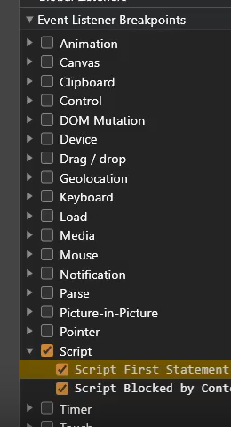

# 知识点

cookie生成的js代码是通过接口返回，script标签直接执行，需要用到 script 断点

在控制台手动 hook cookie，出现设置cookie时直接暂停
    
    // 当 document 设置 cookie 的时候，将进入 debuuger
    Object.defineProperty(document, "cookie", {set:function(){debugger;}})
    
    // 方案二
    Object.defineProperty(document, "cookie", {
        set:function(var){
                console.log(var);
                debugger;
            }
        })

ob混淆是压缩过的，在解压缩运行的时候会出现卡死的情况，如下图进行了格式化检测

解决方法将检测代码删除或者恢复js压缩格式

console.log() 报错出现,说明console.log()被改写了

解决方法，替换变量
    
    //开始
    myconsole = console;
    
    //结束
    console = myconsole;

navigator 没有定义

    window = global;
    window.navigator = {};
