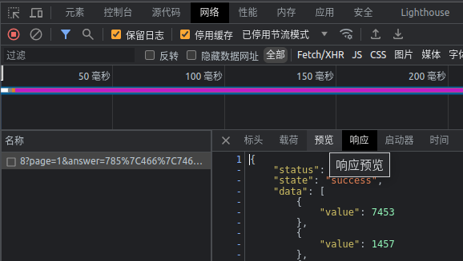
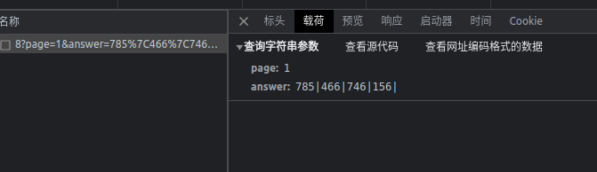
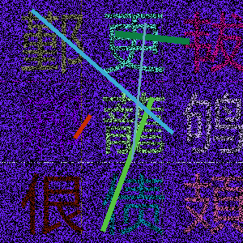
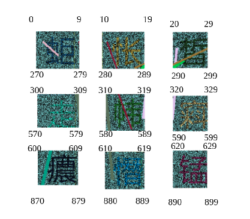
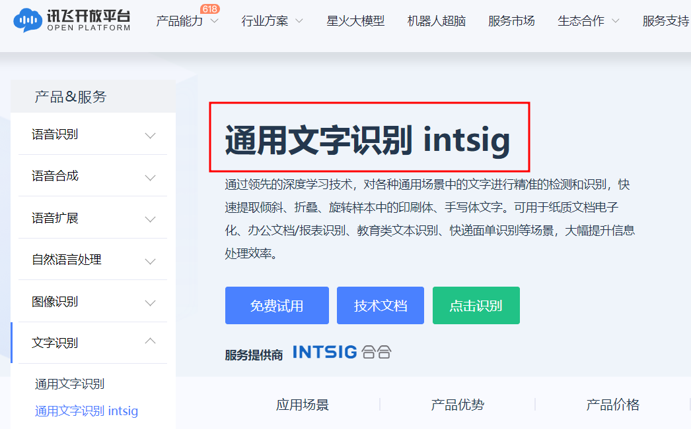
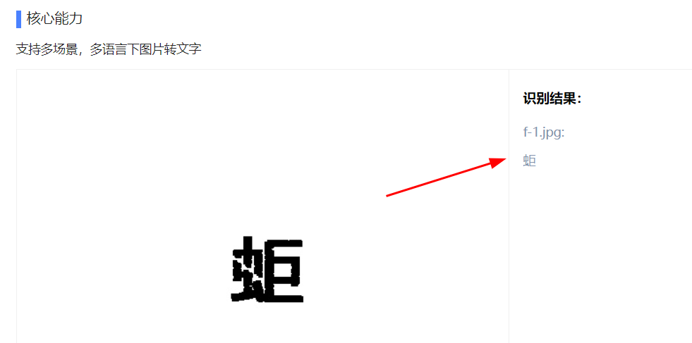

# 知识点:图像识别、去除干扰线、降噪、机器学习、headers请求顺序

## 一、解决点选坐标问题

需要的破解的验证码图片

查看响应内容，可以正常返回明文的数据，那就证明搞定验证码就可以解开这道题目。

再查看请求内容，存在请求参数`answer`，仔细观察你会发现请求内容`785|466|746|156|`类似于点选验证码的坐标。

这里我用审查元素查看点选验证码的`html`，不难发现！这不就是div组合成的一个矩阵。

多次点击验证图片的坐标，做了下面这张图，可以清楚的知道图片具体的坐标范围

由此推断，图片和对应的值

    第1个图片坐标值可以是（0～9）
    第2个图片坐标值可以是（10～19）
    第3个图片坐标值可以是（20～29）
    第4个图片坐标值可以是（300～309）
    第5个图片坐标值可以是（310～319）
    第6个图片坐标值可以是（320～329）
    第7个图片坐标值可以是（600～609）
    第8个图片坐标值可以是（610～619）
    第9个图片坐标值可以是（620～629）

这里就可以写一个python方法作为调用

    def coordinate(num):
        coordinate_dict = {
            1: random.randint(0, 9),
            2: random.randint(10, 19),
            3: random.randint(20, 29),
            4: random.randint(300, 309),
            5: random.randint(310, 319),
            6: random.randint(320, 329),
            7: random.randint(600, 609),
            8: random.randint(610, 619),
            9: random.randint(620, 629)
        }
        return coordinate_dict.get(num)

## 二、图像去噪点处理

### 选出rgp颜色最多2个，进行降噪处理

    def noise_image(img_file):
        """选出rgp颜色最多2个，进行降噪处理"""
        img = Image.open(img_file)
        # colors所有像素rgb值，counts对应的数量
        colors, counts = np.unique(np.array(img).reshape(-1, 3), axis=0, return_counts=True)
        # 排序
        ct = np.sort(counts)
        # 找到出现最多的2种颜色的个数
        top2_counts = ct[-2:].tolist()
        # 找到出现最多的2种颜色的下标
        subscript_list = []
        for k, v in list(enumerate(counts, start=0)):
            if v in top2_counts:
                subscript_list.append(k)
        # 找到出现最多的2种颜色的rgb值
        for subscript in subscript_list:
            color = colors[subscript]
            # 去除颜色
            turn_white(img, color[0], color[1], color[2])
        return img

### 移除干扰线条

    def interference(img_file):
        """移除干扰线条"""
        img = Image.open(img_file)
        # 读取图片高，宽
        height, width = img.height, img.width
        # 首先创建一个空列表,用来存放出现在间隔当中的像素点
        line_list = []
        # 两个for循环,遍历9000次
        for x in range(width):
            for y in range(height):
                r, g, b = img.getpixel((x, y))
                if 0 < y < 10 or 96 < y < 105 or 199 < y < 209 or 292 < y < 299:
                    line_list.append([r, g, b])
                if 0 < x < 20 or 109 < x < 120 or 209 < x < 220:
                    line_list.append([r, g, b])
    
        arr = np.array(line_list)
        line_list = np.array(list(set([tuple(t) for t in arr])))
        # 处理像素 RGB 值
        for line in line_list:
            r = line[0]
            g = line[1]
            b = line[2]
            if not (r == 255 and g == 255 and b == 255):
                turn_white(img, r, g, b)
        return img

### 灰度转换

    def binary(img_file, standard=205):
        """灰度转换"""
        img = Image.open(img_file)
        img = img.convert('L')
        pixels = img.load()
        for x in range(img.width):
            for y in range(img.height):
                if pixels[x, y] > standard:
                    pixels[x, y] = 255
                else:
                    pixels[x, y] = 0
        return img

### 增强字体显示效果

    def enhance(img_file):
        """增强字体显示效果"""
        img = cv2.imread(img_file, 0)
        kernel = np.ones((2, 3), 'uint8')
        img = cv2.erode(img, kernel, iterations=2)
        return img

### 图片切割成单个字体便于识别

    def image_clip(img_file):
        """图片切割成单个字体便于识别"""
        img = cv2.imread(img_file, 0)
        clip_imgs = []
        num = 1
        for y in range(0, 300, 100):
            for x in range(10, 300, 100):
                # 裁剪坐标为[y0:y1, x0:x1]
                cropped = img[y:y + 100, x:x + 100]
                clip_imgs.append(cropped)
                cv2.imwrite(f"./img_a/f-{num}.jpg", cropped)
                num += 1
        return clip_imgs

图片1

图片2

## 三、图像识别/机器学习

测试百度ocr、ddddocr、还尝试了自己训练模型，效果都不是很好，菜是原罪啊！最后发现科大讯飞ocr对这些生僻字识别效果还是不错的。

效果

## headers请求顺序

验证码处理完了你会发现，还是不能正常返回数据，这大概率就是`headers`问题

    HEADERS = {
        'Proxy-Connection': 'keep-alive',
        'Accept': 'application/json, text/javascript, */*; q=0.01',
        'User-Agent': 'yuanrenxue.project',
        'X-Requested-With': 'XMLHttpRequest',
        'Referer': 'http://match.yuanrenxue.com/match/8',
        'Accept-Language': 'zh-CN,zh;q=0.9'
    }
    SESSION = requests.session()
    SESSION.headers = HEADERS

    req = SESSION.get(self.url)