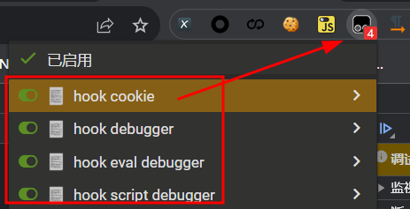
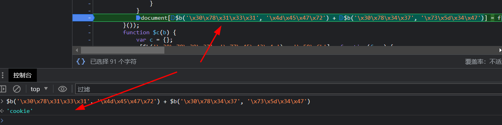
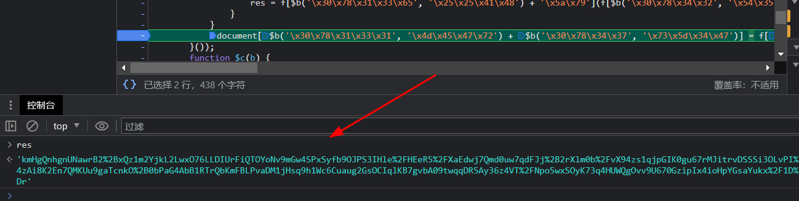
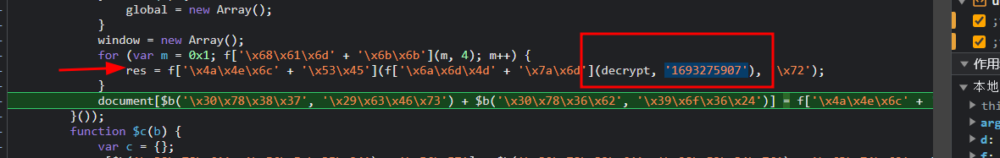
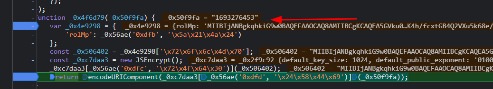
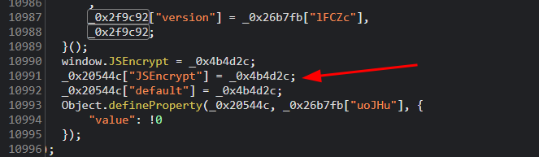
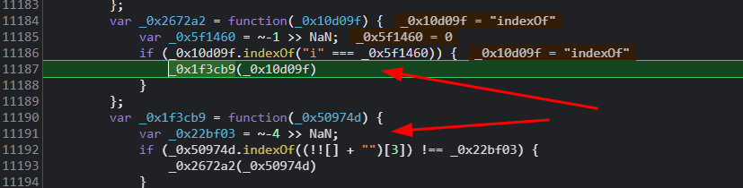

# 猿人学第9题js混淆-动态cookie2

## 找到cookie加密点
先用油猴插件hook如下



这里就找到了cookie设置的位置



源代码：
```javascript
document[$b('\x30\x78\x31\x33\x31', '\x4d\x45\x47\x72') + $b('\x30\x78\x34\x37', '\x73\x5d\x34\x47')] = f[$b('\x30\x78\x38\x30', '\x4c\x61\x25\x6c') + '\x5a\x79'](f[$b('\x30\x78\x31\x33\x34', '\x6f\x63\x67\x33') + '\x4c\x45']('\x6d\x3d', f['\x4d\x72\x56' + '\x52\x70'](m, 0x1)[$b('\x30\x78\x31\x30\x38', '\x2a\x46\x4b\x62') + $b('\x30\x78\x38\x64', '\x6a\x39\x52\x61') + '\x6e\x67']()), res) + f['\x63\x79\x66' + '\x57\x56'];
```

修改后
```javascript
document['cookie'] = 'm=' + '2' +  res  + '; path=/';
```



这里的`res`就是要得到的关键值cookie。

继续向上找：



```javascript
res = f[$b('\x30\x78\x31\x33\x65', '\x25\x25\x41\x48') + '\x5a\x79'](f[$b('\x30\x78\x34\x32', '\x54\x35\x5b\x4f') + '\x41\x42'](decrypt, '1693274196'), '\x72');
```

修改后
```javascript
res = decrypt('1693276453') + 'r';
```

通过控制台可以看出函数`decrypt`是udc.js文件生成的。

继续进入，打上断点，可以看到这样一段代码
```javascript
function _0x4f6d79(_0x50f9fa) {
    var _0x4e9298 = {
        'rolMp': _0x56ae('0xdfb', '\x5a\x21\x4a\x24')
    };
    const _0x506402 = _0x4e9298['\x72\x6f\x6c\x4d\x70'];
    const _0xc7daa3 = new JSEncrypt();
    _0xc7daa3[_0x56ae('0xdfc', '\x72\x4f\x64\x30')](_0x506402);
    return encodeURIComponent(_0xc7daa3[_0x56ae('0xdfd', '\x24\x58\x44\x69')](_0x50f9fa));
}
```
经过调试发现传入的值`_0x50f9fa`就是`decrypt('1693276453')`传入的字符串时间戳



目前还原后的代码就是
```javascript
function decrypt(_0x50f9fa) {
    const _0x506402 = 'MIIBIjANBgkqhkiG9w0BAQEFAAOCAQ8AMIIBCgKCAQEA5GVku07yXCndaMS1evPIPyWwhbdWMVRqL4qg4OsKbzyTGmV4YkG8H0hwwrFLuPhqC5tL136aaizuL/lN5DRRbePct6syILOLLCBJ5J5rQyGr00l1zQvdNKYp4tT5EFlqw8tlPkibcsd5Ecc8sTYa77HxNeIa6DRuObC5H9t85ALJyDVZC3Y4ES/u61Q7LDnB3kG9MnXJsJiQxm1pLkE7Zfxy29d5JaXbbfwhCDSjE4+dUQoq2MVIt2qVjZSo5Hd/bAFGU1Lmc7GkFeLiLjNTOfECF52ms/dks92Wx/glfRuK4h/fcxtGB4Q2VXu5k68e/2uojs6jnFsMKVe+FVUDkQIDAQAB';
    const _0xc7daa3 = new JSEncrypt();
    _0xc7daa3['setPublicKey'](_0x506402);
    return encodeURIComponent(_0xc7daa3['encrypt'](_0x50f9fa));
}

res = decrypt('1693276453') + 'r';

document = {};
document['cookie'] = 'm=' + '2' +  res  + '; path=/';
console.log(document);
```

## 找出`JSEncrypt`加密生成逻辑

先将`udc.js`中的代码，用`v_jstools`进行16进制转成10进制，全局搜索就找到`JSEncrypt`赋值点，



`JSEncrypt`是通过_0x4b4d2c生成的

为了方便调试用本地文件替换线上`udc.js`

## 去除格式化检测代码

第一处
```javascript
var _0x2bf8cc = function() {
    var _0x393c59 = new RegExp("\\w+ *\\(\\) *{\\w+ *['|\"].+['|\"];? *}");
    return _0x393c59.test(_0x9a4b8c.removeCookie.toString());
};
```
修改成
```javascript
var _0x2bf8cc = function() {
    var _0x393c59 = new RegExp("");
    return _0x393c59.test(_0x9a4b8c.removeCookie.toString());
};
```
第二处
```javascript
var _0x39e88c = function() {
    var _0x5ea72e = new RegExp("\\w+ *\\(\\) *{\\w+ *['|\"].+['|\"];? *}");
    return !_0x5ea72e.test(_0x3b5e10.toString());
};
```
修改成
```javascript
var _0x39e88c = function() {
    var _0x5ea72e = new RegExp("");
    return !_0x5ea72e.test(_0x3b5e10.toString());
};
```
第三处
```javascript
var _0x569c5b = function(_0x201582) {
    this.rc4Bytes = _0x201582;
    this.states = [1, 0, 0];

    this.newState = function() {
        return "newState";
    }
    ;

    this.firstState = "\\w+ *\\(\\) *{\\w+ *";
    this.secondState = "['|\"].+['|\"];? *}";
};

_0x569c5b.prototype.checkState = function() {
    var _0x225f13 = new RegExp(this.firstState + this.secondState);
    return this.runState(_0x225f13.test(this.newState.toString()) ? --this.states[1] : --this.states[0]);
}
```
修改成
```javascript
var _0x569c5b = function(_0x201582) {
    this.rc4Bytes = _0x201582;
    this.states = [1, 0, 0];

    this.newState = function() {
        return "newState";
    };

    this.firstState = "";
    this.secondState = "";
};

_0x569c5b.prototype.checkState = function() {
    var _0x225f13 = new RegExp(this.firstState + this.secondState);
    return this.runState(_0x225f13.test(this.newState.toString()) ? --this.states[1] : --this.states[0]);
}
```
再次运行报错`Maximum call stack size exceeded`，调试发现出现死循环



删除多余代码如下：

```javascript
var _0x2672a2 = function(_0x10d09f) {};
var _0x1f3cb9 = function(_0x50974d) {};
```

再次运行断点到了 `debugger`
```javascript
if (_0x41a2bf[_0x56ae("0xe73", "XiWX")](("" + _0x457d14 / _0x457d14)[_0x41a2bf[_0x56ae("0xe74", "j3cf")]], 1) || _0x41a2bf[_0x56ae("0xe75", "Q(dc")](_0x41a2bf[_0x56ae("0xe76", "gfNe")](_0x457d14, 20), 0)) {
    debugger
} else {
    debugger
}
```
修改后
```javascript
if (_0x41a2bf['LRGDx'](("" + _0x457d14 / _0x457d14)['length'], 1) || (_0x457d14 % 20) === 0) {

} else {

}
```