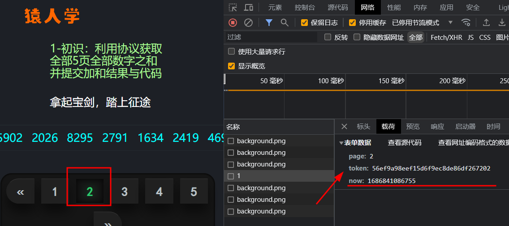
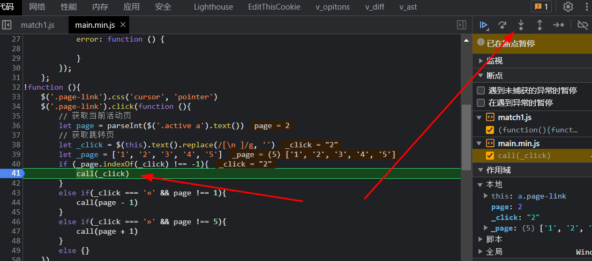
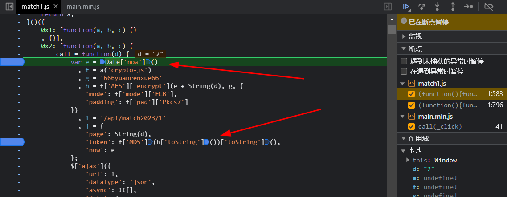
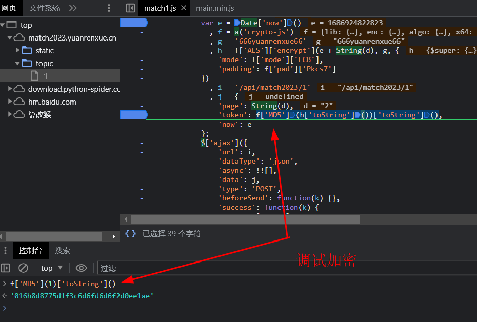
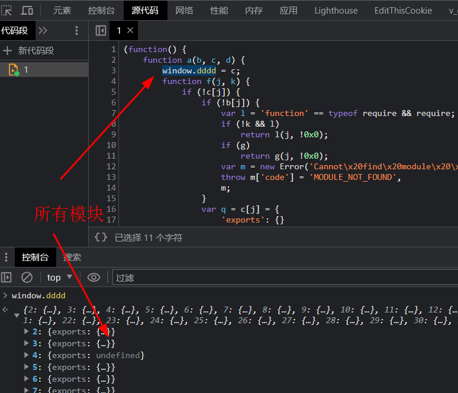
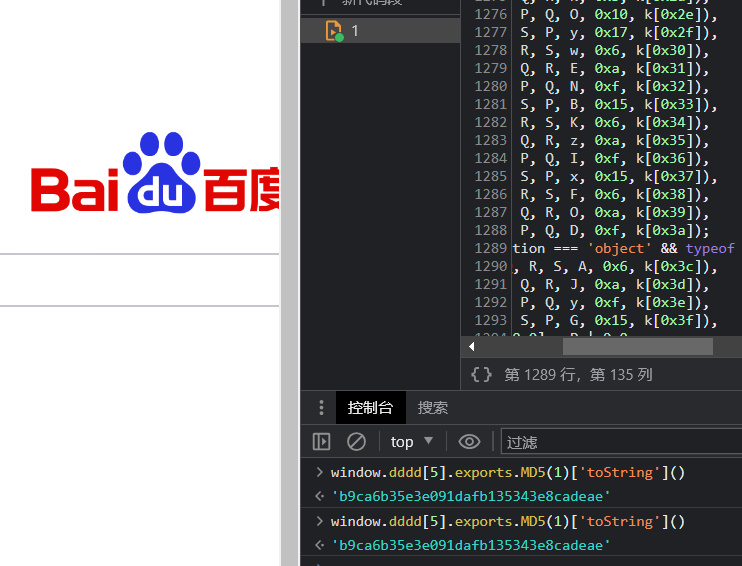
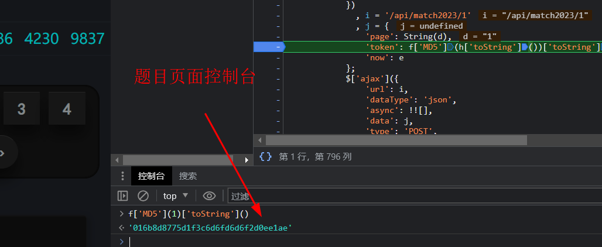
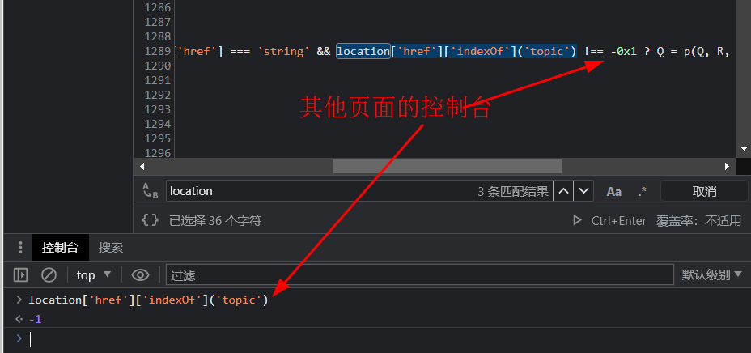
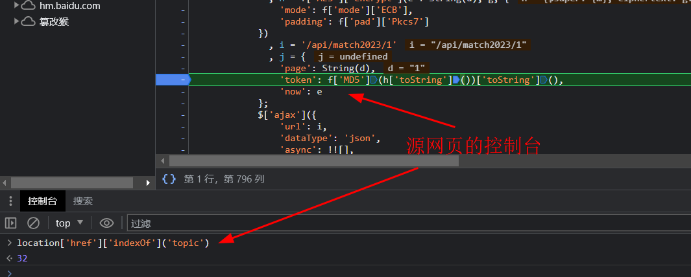
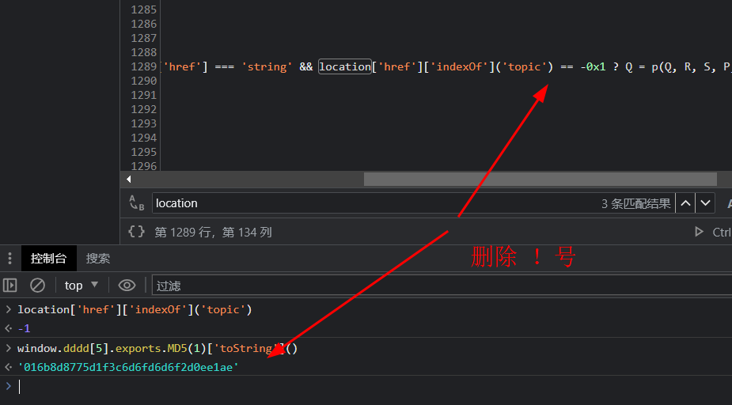

# 知识点: AES算法魔改，环境检测

第二届猿人学js逆向大赛，本以为送分题分分钟搞定，没想到第一题就这么难。

查看请求存在`token`加密参数，接下就是打断点找到加密点破解

直接进入下一步函数

可以看到如下代码

    var e = Date['now']()
      , f = a('crypto-js')
      , g = '666yuanrenxue66'
      , h = f['AES']['encrypt'](e + String(d), g, {
        'mode': f['mode']['ECB'],
        'padding': f['pad']['Pkcs7']
    })
      , i = '/api/match2023/1'
      , j = {
        'page': String(d),
        'token': f['MD5'](h['toString']())['toString'](),
        'now': e
    };

可以清楚的看到`AES`加密和`md5`加密，控制台调试了一下发现加密是魔改过的。

接下来不要急着去扣加密代码，仔细看整段js代码

发现这就是`browserify`打包，类似于`webpack`打包,这就比较简单了

直接扣下全部代码，在模块加载处插入`window.dddd = c;`，控制台输出`window.dddd;`就可以查看全部的模块

先解决md5加密问题，找到模块位置，尝试控制台输出

**浏览器控制台**

**源代码控制台**

经测试发现，明文1加密后值是不同的，这里就要思考一个问题，同样的浏览器环境，为什么加密值不同。

我这里总结2种情况，一是当前页面的网址不同，二是代码没有压缩。

有了猜想就开始执行，搜索`location['href']`

对比

对比发现，在加密中存在判断当前网址的代码

将`location['href']['indexOf']('topic') !== -0x1`改成`location['href']['indexOf']('topic') == -0x1`

测试一下

成功打印出相同的密文，以此类推`AES`加密也存在环境检测的代码，删除或者改写就OK了