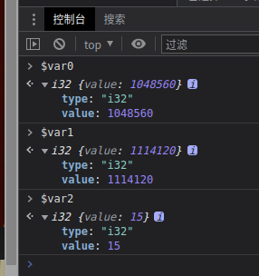

## 知识点

观察请求地址

    https://match.yuanrenxue.com/api/match/20?page=2&sign=73781942400dd0fd60a21f6edb33505b&t=1654067452000

找到加密位置打上断点

进入sign函数，发现是 getStringFromWasm0 函数返回数据

    return getStringFromWasm0(r0, r1);

控制台调试 getStringFromWasm0

放开断点在调试一次

这里的 r0 和 r1是固定不变的，但是每次加密出来的值是不同的，说明这是一个指针

继续追进入

    function getStringFromWasm0(ptr, len) {
        return cachedTextDecoder.decode(getUint8Memory0().subarray(ptr, ptr + len));
    }

getUint8Memory0().subarray(ptr, ptr + len) 返回 Uint8Array 数组

    Uint8Array 数组类型表示一个 8 位无符号整型数组，创建时内容被初始化为 0。创建完后，可以以对象的方式或使用数组下标索引的方式引用数组中的元素。

打印
    
    Uint8Array(32) [98, 48, 100, 102, 52, 57, 102, 49, 56, 54, 55, 52, 101, 97, 50, 102, 57, 97, 52, 98, 98, 100, 102, 49, 48, 55, 97, 50, 55, 54, 50, 52, buffer: ArrayBuffer(1179648), byteLength: 32, byteOffset: 1114360, length: 32, Symbol(Symbol.toStringTag): 'Uint8Array']
    
cachedTextDecoder.decode 这是一个解码函数，不是真正的加密地点

    _index_bg_wasm__WEBPACK_IMPORTED_MODULE_0__["sign"](retptr, ptr0, len0);

测试加密点

通过内存里面指针经过还原得到我们想要的结果

对 _index_bg_wasm__WEBPACK_IMPORTED_MODULE_0__ 的断点，进入函数内部

    (func $sign (;71;) (export "sign") (param $var0 i32) (param $var1 i32) (param $var2 i32)
        (local $var3 i32) (local $var4 i32) (local $var5 i32) (local $var6 i32) (local $var7 i32) (local $var8 i32) (local $var9 i32) (local $var10 i32) (local $var11 i32) (local $var12 i32) (local $var13 i32) (local $var14 i32) (local $var15 i32) (local $var16 i32) (local $var17 i32) (local $var18 i32) (local $var19 i32) (local $var20 i32) (local $var21 i32) (local $var22 i32) (local $var23 i32) (local $var24 i32) (local $var25 i32) (local $var26 i32) (local $var27 i32) (local $var28 i32) (local $var29 i32) (local $var30 i32) (local $var31 i32) (local $var32 i32) (local $var33 i32) (local $var34 i32) (local $var35 i32) (local $var36 i64)
        global.get $global0
        local.set $var3
        i32.const 80
        local.set $var4
        local.get $var3
        local.get $var4
        i32.sub

export "sign" 就是函数名sign，(param $var0 i32) (param $var1 i32) (param $var2 i32)就是传递的3个参数

