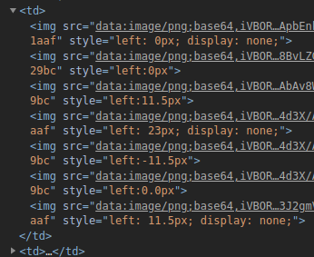

## 任务4：采集这5页的全部数字，计算加和并提交结果

    https://match.yuanrenxue.com/match/4

先请求测试

    info: "<td>
    

style="left: 0px; display: none;" 

    display 为css样式的隐藏,不显示
    left 向左的偏移量
    
通过图片的收集寻找出对应的0~9图片数字

    "data:image/png;base64,iVBORw0KGgoAAAANSUhEUgAAABQAAAAdCAYAAACqhkzFAAAAAXNSR0IArs4c6QAAAARnQU1BAACxjwv8YQUAAAAJcEhZcwAADsQAAA7EAZUrDhsAAAMTSURBVEhLrZY/TBNRHMe/bY82LeGA0Dp4NTGYqO1gdKEMwmQcGh38M5CQlGDSwWiMAwwYg2iCJsZJQ9CJ0ETsQMJgwuagLIUFXIAFXNoYcqDloLRXrq3v7v3aXktbSPCTXO77fZRvf/feu9+r5dz5iwX8R+oESigMPka6/wb2vSJUBx+1QoVD3kTz7DScb+f4YBVHA6U+ZKLPsON1IE9DtbDLP9AxEIawRgOEle4cKYSD+ZeQq8IcKquMXTbyOllPL7aiEWgSDRCmQAnahyHsiGQZruUvkIKXcObyFeM62zcOd1ylvwJ5MYDkuxA5Tjlw8A2S12iyGM7YODrujsFqfqTFCJw9L+CWyTPS3QPIBMgwKFBC9n4AaW4AdQVtQxEy1czBObkIJznAi9TDO6SLgVIYqt9QBq5YFEKCTC2momg2VXngD5bmnAc+uIqUIXQUOL/X3hJl5mHfUEgzPJ04pMUxAnN+CYeG1UlAmCLZANtqAk2kARG5m1zxQI9paWUZAsmGsArLnxOh0ZSxwCBypjwo2zQPxzCTgJ2kTtbbZ9zZ/7pRKO8WOOWqrX9iePyJiqnNGgTTuhRhgT5o5kc+JaeosDYssHbpx+OtXEziSIWqx0fqOFpg7ns2Zd24s8B1WE0V5h2mJW/ELTc0kjo2Zcm4s8ClikCIlR+si59tZpL66yosc2U8clM8bhgDkfVFUzuqR569rqXOqG7CPsOlEWiJJSraUaa/i3Q9upC94CHNCtr4WXoN+aJMzcFlakd73eGG5wnuhZHykmZ1tnx9TboYqDfNWLxoWDvqhfK+h0w1Pcg87cUBOavMmu1HMoxShuXJNNpNi7N3ewLJTyEUzIdQIIT0wgQ7EcmzxWifZMcEOZ3KY3Qwgp3RQOnbOfqJx5XGtlSOS4aK1tlHEIcXyHNsrW0dY6SBFX0ufShc70S21OwE5AR+lb+ZVfb5OVpGviGTTkHeSmBfScJqtdX55SAFoY0OsMXxISM6SvvNrshwrS7A9WoENupyv+O/oGm831sslno/RU6OsvsHu3+3yQH/AOyW6SvqnweCAAAAAElFTkSuQmCC": 0,
    "data:image/png;base64,iVBORw0KGgoAAAANSUhEUgAAABUAAAAcCAYAAACOGPReAAAAAXNSR0IArs4c6QAAAARnQU1BAACxjwv8YQUAAAAJcEhZcwAADsQAAA7EAZUrDhsAAAD0SURBVEhLY5RVUPvPQGXABKUJAA2GvzP3Mry6f5PhzfI4qBhuQNjQqD6Gzxc3Mjxzk2H4CRUiBHAYKs3wP7Gd4evhSwzPWr0ZPvBBhYkEqIaaBzL8nrmS4f3FfQzP6oIY3smwM/yFSpECkAyNY/g2q4PhhZsBwxegy/5BRZlfP2HgIdbfUIAnTD8xCGyuZ5AyW8jATqmhzD9fMwjumsUgbWPKwJu3AipKGkAydC8DZ24sg5SGDQNPei8D01OoMBkAydCnDIyHTkHZlAE8YUo+GDWU+mAEGfq46RCUhQAUGypbZwdlIcBoRFEfjBpKfUADQxkYAKYHOb9g+7HMAAAAAElFTkSuQmCC": 1,
    "data:image/png;base64,iVBORw0KGgoAAAANSUhEUgAAABQAAAAdCAYAAACqhkzFAAAAAXNSR0IArs4c6QAAAARnQU1BAACxjwv8YQUAAAAJcEhZcwAADsQAAA7EAZUrDhsAAAKCSURBVEhLrZZLaBNRFIb/PDp5SFMxjqVOAjYLNUGUbhI3cdEGwaAgbmopWFIQBEUwFhQVldIqCuqilLoymEVVlCqWuNdVXRk31Y1uTKAQMRI0ycQk453JaWaSJjYPPxjmnJPwcefOuSfROXftlvAfaSAUIIXOITfuR9bBQzQBZfqEEzPgVuPY8uIeuMXPVK2lVnjoCrKzJ5F2mKqSZpi/xGCfCEOfpAKhCkPz+HEpgN9sRVpMoqjcJZMJBSVS0Wfeoz94CkaNVE93wOOqygyZr9i+cBnOwT3YsXe/cvUPDsMxHcPWTOU7MmWbD+m5i5RVUIUKGfQt38DOA0dgufuSauskoYuE0RuchV0jzQ8FIAqUMFShmIB9+jhs559SoQnJKKwLcZgpBVwoTFLIUIXXTsMaqdvhZjz8qBECRYeXog2P3CoJts8UMko2F0UdC90o2ihkcAl1mzoTnnGh0kwyGRhXKWR0IBRQOOZGnjL57RsjFDLaF87MI+1Ru9+ysgSOYpn2hKEovo+71RMjfoJtKkpJhRaFAsozr5C67kOOKvLe2e+cBVfXaZsLhSD+LD3DGluZum8p5RA06tt/C4/exK83D7A2xKNEJT07UfzV0aaHoImQHnFuDGlNv8kja2BkBObF5ieqgdDf8BG3PboAPrBx/tVTN7H9KMTuI+WxVQesIRUHPzWKnndU2ATNCgUUn9TKrB8eY8DbukxGFYZu4+dBVWZZYXPvxC3oKG8VEnqRn1R7rCfBfi/Gahu2VSpC3wRyDiViiOhdDre9snUqwsOCZnqkYHhLYSfIb9n5+psESerq6nvOPMylrLDEa7q3C7L7hrVt0z1Fu9Dor0g3AH8BJlTqZkAngxQAAAAASUVORK5CYII=": 2,
    "data:image/png;base64,iVBORw0KGgoAAAANSUhEUgAAABQAAAAdCAYAAACqhkzFAAAAAXNSR0IArs4c6QAAAARnQU1BAACxjwv8YQUAAAAJcEhZcwAADsQAAA7EAZUrDhsAAALaSURBVEhLrZVPSBRRHMe/O+rOuuaUyRoyBlGQfw5lh9xTekg8qIdMKSsQFKRAD0WUROhBCIlSBD1YQsJKQSB1iRa8VRf1Up4UQiNcRVw1nXVdx3V3euP+ZnZmR9EVP/CY3/vx5sPMe+/3nu3suYsKjhGrUCxB5GErNssKERIEyDzlIYOX/MgY+4r0zm5w85ROwCRU2j1Yu+fGhi7ZG072Iau3Bc6BacrE4ejJ6EKgySyzy+yrdptpIKJ8HlbahrHZKFImjnEcIeHU6FuIlfk4U3AJObstH2L9C7hmJKTQKEBg0h7sUE/DJLT5x5FbeRWZ99kcTVFSY9wDR/kN5Pxkn6vBFyPUTjFhEPYjs6YBqYkiE/NIfTeODOqpyEUNFMUwCNmy7bNyJr5M787pfuwxhwfhh+1YhWIxtgWKGXafh6IYSQuVjssIUgxMwdFLIZGc8IEHKxV5iFL3xGg37AnzfnAtu68jUlYFueIa1i4IiFDaOfYa2XcGqRfHKnzlxVzdeepYSZVmkfXyERwfrGWnktQvc7If6T62yrxhVRKwCvX6jTet3KK8C4EiN5Y6hrEw6YV811rLhzwPRSi19dhqqmFCFzvINPzI7rwN51B8ZQ4pNNA4iNW2UgTpVOL835Fb0qz/atL7EEPNyPrm01+MutwIPaUOI3khw9Y5aTggeISu1FN8RCHm5YQX7fQ8qlDk9WpR4eRlinQhW37rDtgXpc1Yz2xrsYtLg4StCHz+iHD1IazVPQgY6hnSLzgGKGbov6y4irHY58W/T13YKS2grIHCGoTfeLHcV4V1w9V6+v0zwz2j78MuSH9uYp2SKhwbnKbvYB5hJjHOmyo7OdIC4ckP6segL5wAb7rR1Jd5dslrzSxLYQeE6/ktXbYVCmJp0YfghpRQKbWPsVVXjs0iEWGBxzalVXhZQtrMFJwj/eCHJigbY2FuFpFI7EJNvvT2wPf3NxRF1QD/AbAv8WdRHzjKAAAAAElFTkSuQmCC": 3,
    "data:image/png;base64,iVBORw0KGgoAAAANSUhEUgAAABUAAAAbCAYAAACTHcTmAAAAAXNSR0IArs4c6QAAAARnQU1BAACxjwv8YQUAAAAJcEhZcwAADsQAAA7EAZUrDhsAAAHHSURBVEhLrZW9LwNhHMe/WrT10mrKVE2EROIfUAuTTQxMLISBQSxeIjQSTZRIsYgYhYVRIrWzaCxiMjFVoqjWaatPaR9Pe09bbfT6XHKf5Mn9vne9T+55fs/1qhxtnRRqWD1DcLILSR5Nfg+aR495ktHxoyBDiA8WhOVQJaXeKUgtPCggLrXPs6dsxzePSghLU9sjiBh4qICYtG8fUo8Z6UxNXlEvZc+WRUDaC+LpR5SnhssLGHldjopS6l1BpFWuda9XsEwH5KCAstS5iU/WHHkLSbAerAmtl8JvupH0DOCDN8d4e4q6wyc5VKCslHrdCHdwI7mHZXZHrgX4X9r3d9oElvMN1Io9ZJZ/pL1IeIbz06598KFx8UYOgpRI7fg52UWIdzszbev4Mqp4FKVYOrGJSG6Ts27btmZUTTtHQcrWUVpy4otHk39PuNulyFL7GOJ7hXWsCfhgK/mPVAOTstfwaAEhMz9DHmF1zalexyIcbj81UUqh0TBdr9OS7muDDoRAz4ZBxajmN2dggqJrepKE+g8fWFPvXPkeaPDhE0MzaeIrhpfnAGJRSTvp+1sQJBFHOBTUTppOp7LHzM7STGpusvEK+AUL4d3X/AgqvQAAAABJRU5ErkJggg==": 4,
    "data:image/png;base64,iVBORw0KGgoAAAANSUhEUgAAABUAAAAcCAYAAACOGPReAAAAAXNSR0IArs4c6QAAAARnQU1BAACxjwv8YQUAAAAJcEhZcwAADsQAAA7EAZUrDhsAAAIxSURBVEhLrZU/aBNRHMe/bWKexnoiaSg0FSSCaAfFwT+L7dKloUs7OqRVcHBwcZOCiCAOhk4dxAwdHFRwEEoRSjvoZNqhdDE4tC7aIYmWvOiV1941vnf51dy7S0ou6Qfu+P5+B9/7/e7e+72us+cuVHHE+EzF0jcUzlPQCjyH/itphChUdKub+bcCXv4tVQr7hsp0hmNqWXsob5ek6kWVqUxneNpPw1yfxi+nWo7Y02uIzjkPAuFUWucSrKNqvzEcoUWSAdFNbyewSxJK/SQZEN1U+0kCXaSCopvGGfZJgsv2SQbFY2rI+jqn+Y/ipbYr1dap/WYVWzfra0q98f/nkDDBcWwjj+j7WbC5Fcr6aV6pxG2oEMzAn8EbKDx+ja31jxBytTRCM7WNepVhIWRl6qKEB9tIovDsA8w7fuPWR9/QPezenQAfTmKHUg5iE32To4jkKJYc2r7G5ywiU6PoTWUQK7rKZ0lU7o9TUKN10wPyWUQfLOA0hQrz6jhs0orgporcI0TXXNUacVgkFe2ZSsI/iqT8tG162DBv23RvYICURG4K3xkVmKEZmIOkJWqXhUkrgpsm0tjJjKBCoRqRp+afkK7hMr2I6tgt0g1IXIf94h22l6dRkiPygMjXtzj5kgLCtaOeg3+fQNnR/u1pMaatRUVkYwHxyYfo9pwQTdpncnjol24o0PMpg74Rv6HCZbqC41/y6OG1QeKdpSGZO1HcRGz+FRKpyzgzlaUnXoB/3J2gmVZucHAAAAAASUVORK5CYII=": 5,
    "data:image/png;base64,iVBORw0KGgoAAAANSUhEUgAAABUAAAAdCAYAAABFRCf7AAAAAXNSR0IArs4c6QAAAARnQU1BAACxjwv8YQUAAAAJcEhZcwAADsQAAA7EAZUrDhsAAANLSURBVEhLrZZNSFRRFMf/48e8UZtRktFkRsiEdCIKVwaikrlJbZG0MEGDwEWUIPaBQoiIZIJGG4mikoyyIBJKW4gbs4W66WOhtlAXzixq/HzGjG/8eN0378yb+5w3qdAPLnPOmXf/nHfvOfc+U+bR4zL+M/sTrW6F71Ih/CfskAQB2xQ2SyLMU5OwPr+HuEEPRfcSddXB96QeK04BOxQyZg7pWedhJi+GfiOp7sHqwC0s7RKMkyQIwaGfzGdmLFrUAbGlFOsC+ZBwaLwfjqoSZOSeQlpw5MBR1oQjw3NIoKdCGLz+Rfgn72PRTq7khr2tFpbX4TWLwJULTM+QY5Cp/PgGlkOCEJHauYegAieosEuUbUyxU1tDy9c3SOzdQ9AAvWh7ObeOblg7u8k+GJyoA4E8FzbJi5mdhGWCnAPCiVZhM5tMRuLsAFkHJyxakcu6hWy2QcL4pGpW3IR/6AsWZ35iYV4dnvkfWBp7C/+dMvWZ3SglFRzPpuR4WZYRHAtyWsFZ2fFhVha0mPEQFkbljALSoBHO1G7V1hMIQG54Cu+FY6zsVcyhTiI/hOQswq9PfdhyUIChiW7bbWQpOLDOBANMMknppLIcpIc6KasEzrYhJIv0KGPHlo/VrlrydBvFI2CDNXfyu+s4fLkVMdMUDuKBqbcRtvr3SA69BsN/phIByjaKKPvDPQLr7THyDPjcDOuwmxNwYaNBtaKKWse7YSI7GqbO70giWyHgVJdAE431covESipuah/t6fkGMzdNsruCv+FMveuIJzMavpMlEItryIskdGaERYc9XLnYsO0kk2Mr1YG1c3XkRZLgVXc0LDoxAYF7lY28yMm20ZfIbCkij5GfD4mrxFhRPQK5jepjR52XbEW0XCuRaOxcO40/ZLP1g+Wj2tqcKHMesZuRbKVEVl506O4eHRU9WCvWTnPEz47BMqjaOlFMNLJSErVgILsSiyMPsJ3Pp5yLnfY+LHeVclm6kdLWrJWgwR1VCGmkB7+z9V2u9H5wErv3uUZiiEh5xZK5G24UfaZBxiBcaUL6lIhYiigEFLFdgjHsUkztrNEJKvz7Y6K6A76rhfA5lS+TUB1KrHQ8SBztR8LDPpgMemR/nz0HAvgL80YzEyuMQpQAAAAASUVORK5CYII=": 6,
    "data:image/png;base64,iVBORw0KGgoAAAANSUhEUgAAABQAAAAeCAYAAAAsEj5rAAAAAXNSR0IArs4c6QAAAARnQU1BAACxjwv8YQUAAAAJcEhZcwAADsQAAA7EAZUrDhsAAAHhSURBVEhLrZY9LANhGMf/PprDVQkxyFXSVCKIwYStiZoqhoqEhTCQWCwiBBEDiUTMBpOJhKQDkw1L1YDFxoSlBi2tlurrrn2uH9xX2/sll/6f4X557n3e903LWhxtDCZSTr/mIXXY4thgjSHGwEp76o7amOkdmih8BHcMlDAULz4DW3htSlf8+RIaJn3Fd8i2ZxAiGeK3sK34UrE4oTCP6JAT31TWneyg8jmdixKyNQ/eOCqCF7AuBKgoRigs48NlR5LK+rP1PEnBwuRmfnf8Kn0rUZhQWEfEJU/if3cSBQmTmwN4o6zUnYRxobh2kb5sd7X+PcWXDQvZohthee3EfWedy042F4PCCXzmTLbGf4hKyn8xJtwYRthGGU/gd9OnQgkDwh7EXB2ZU2G5v0TVFRUK6At7xxCzUxbhb/YoKaMrTM724J2yNIxqha2Si47Qi1hndqtw9wHFYUS7+hF2jaeytnDKi2jGFwfv36GcT6JRQMg9ncqaF+zPwTVe+mi84uc2t4+qbhcZjQ49+GrN7BVYHu50ZRLqwt5BxLLLh6qHfUraqAtHnIhSFG8CcGfa05VRFSZahcxRQ/wZllPKOqgIPfi2yzeBSPAVFRT1UBF2I5GzflzwEWWU9TD5zxLwC1sVsHrJiVs0AAAAAElFTkSuQmCC": 7,
    "data:image/png;base64,iVBORw0KGgoAAAANSUhEUgAAABQAAAAdCAYAAACqhkzFAAAAAXNSR0IArs4c6QAAAARnQU1BAACxjwv8YQUAAAAJcEhZcwAADsQAAA7EAZUrDhsAAANtSURBVEhLrZXfS1NhGMe/rumZbR4nOcO2IA1CvQi8UW8y8EJqZCR1IQiKwvRCuiqTfomtkkrqIpN+EFSGNaFECL0IbzQvnH/A6EavNiinJVubO/5a73nPs51zNqf04wPjfJ8X9uV5n/d93ifr8JFjcfxHMhueuYS1dieiFTZIgoAtvihBCAVhnptErvshDAG+qGMHwzJsvh7Cj5MO9vfMGCQ/Ckb6sP/2F1pRMNCXsGPz/Vt8TzEzSiwz/qMFxrbgwEr7I0Tb7LSioDe8OYSVGhHbFOYEZ1DcVIfisuMo4r86ONxTyEsai1jpGcK6xlNj6MRaQznWKTL4p1BU5YLRqy1UAFmvumDtGEN+wlQoR7SnigKd4Qls2EiyDVs/dSGLojRmrsIyF6QAiFQ0ktIaslokspMzMT4gmQFDMEyK1ZO+MqqhL4x9JFn1EK8m+Yeohl4vu2Ok4UCsWa1LOmw3FaWkAbNfvTqaGg4jd86fXAjX34JUS0EK8YGX+FlBARZhfjpJWmfIbnlnHwoX6PiEUiy9mEVkwIV4ubKEWheksVksXSilekvI/9APwcsDTnqn2JsQ81zDikPQFTsdCXmf+2Ht9FCsoMuQE/DAdHkQBeqt2BHz9CDy3XozmZQM7dh+Pozlen3rGViUzRa22COxSWsycj8fcLfA9E69/JoM5T4exTeNWe7CBA6x1rOXKK1XXCK33gSsdBvkfg7eHdX1s5phG8ustxprPJCL3QWxW/+SJLE7Ib25h6WjghKHvCh2tsDIEqUMqxBrT5ixa+3zZDaTCUxCaPXAmtiKWI1f1M+KYXUr1hxcMSRYpvtJ70KgH7k+tdLhGhe/FYphvV1zCHv3cQLjguYlsjn4gSmGooANLv4N+TAUw2AIVF5GIbbaSO7BlqOQFEMK8cdFMRxZhIkLGRGRBhfp3XAhVimSZkbBgMYw8AQmH1ecWGVH2qzQEo3kYfVUGKvqtpA35+EPsmLIDiLn/hQsSsBgs6J3HKHHLYin+p5n47XtLMLP3MleN7DZY+me51rXevE741huLkeM4gQ5bOIp40BgM5qLJAZpEYUdpyHMUKx8FLJunIPtutpaCdZZD8vDPtXM5J/BwUbVTGaHQS9Thu0rF9kUrELEJmKDGSW2J7DTzPbNwzIyiOyPX2lVJYPh3wL8BvLZG6cpuRANAAAAAElFTkSuQmCC": 8,
    "data:image/png;base64,iVBORw0KGgoAAAANSUhEUgAAABQAAAAcCAYAAABh2p9gAAAAAXNSR0IArs4c6QAAAARnQU1BAACxjwv8YQUAAAAJcEhZcwAADsQAAA7EAZUrDhsAAAMzSURBVEhLpZZPSBRhGMYfV9dpdV3UHDVXIw1KDUwJVy/VLTAVWugQRJqUpxAkFyuMIBMPWRGYiCGGC7J0KCRKL13Si9pBvKiH9NIYoavgqKvjujt9M/OuM+uustUPvpn3edl9eL/3+7Mbl3fqjIxoFDnhb76Bzcoi7No47FI6QRJxbHYKKQOdSPi8RFmdKIZ2BDt6sHazCNuUiY4E67cXSLvtJq1hojdhx57nPX4fMDOxL3OSMiihwmHzchu8njrSGmGGclc/Vit5BEibxEXw7bdgzy9BZqEyziLP5UH6Cn2AsV3ZBF+DnVTYlBuxNe/CGqcpSHPIdl6DeY60EXsdfCNtWLVp0rQyhhOORrU6vcKOamyEzNgUU4fuRTdTWHIj6fUkLCSDfCl2GrR433CvuAB+ipXqLM8iVzCMd29gFSiGDb4rWi/J0IE9fr88QFhEAoWHMwWzIFLMeplbAaV3ZFiIIPXjb4gXvBQx+Ax1MfUeGuEM1cYKZzMauhFv2Arg2X6k8CgCuRkUKaQgWGOo0CwYHLlS+LocJA7B3oKdMmOfOMi8wdDUy84nxQrrtU8h1egbNpyLkAbr9T1rQO/h5EtYJ0Q9wRVguXsYG30tCFwq1HJ2B4KtPdiY6cfyac3NrD4VJMQpk1ROij7uyJk/dmTIcgxjXT7+aUK27OsFOZN56BWqjIOrf4isWRHxlImOiLSh+0iaJqnCKmTPA4aMpREkVpcjx/UWGdOLSBZDNw0booC0iY/IuVoO6+NxoJjXbyVRK+LwCzYGAp7v+FWprbR5dhDZ1Z1RKowZB/y5+rbhhK/qO2bD/FMncb7kHClGRT07vxRDgGVgSo1iNrTZUnChrIQUm26zA5sUm4QZcJNa/G89bHDD+6SCFkRCem8Vkp9r1114hfbDToaBmlcQH4TMgMSFL0giM4Vww2Z2AqaGsd3qpIQB5We1bxTe7mqsh46ctIjU9kfq/gsRPuWuUfy8XkCCrRzbexTBz0yCpBRMzCzDdRfcgd/mIxdFYveiNsLNOGEMWc6qCDOFA4vCbu7WJmzXOrDF21SjEBz7x2Bm/xisQ90wf5inbCT/dVIiAf4ApbEnkB6qHqsAAAAASUVORK5CYII=": 9

接下来就是对图片显示混淆,我们需要判断是否为隐藏

打断点尝试寻找css样式渲染代码

    $(j_key).css('display', 'none');
    
j_key 的值是 ".d09288f99deb1477f74e2dcb7aa51aaf",很显然就是这段代码做的渲染

那么 d09288f99deb1477f74e2dcb7aa51aaf 怎么来的?

    var j_key = '.' + hex_md5(btoa(data.key + data.value).replace(/=/g, ''));
    
其中的 data.key 和 data.value就是接口返回的数据

    info: "<td>> 5] |= 0x80 << ((len) % 32);
        x[(((len + 64) >>> 9) << 4) + 14] = len;
        var a = 1732584193;
        var b = -271733879;
        var c = -1732584194;
        var d = 271733878;
        for (var i = 0; i < x.length; i += 16) {
            var olda = a;
            var oldb = b;
            var oldc = c;
            var oldd = d;
            a = md5_ff(a, b, c, d, x[i + 0], 7, -680876936);
            d = md5_ff(d, a, b, c, x[i + 1], 12, -389564586);
            c = md5_ff(c, d, a, b, x[i + 2], 17, 606105819);
            b = md5_ff(b, c, d, a, x[i + 3], 22, -1044525330);
            a = md5_ff(a, b, c, d, x[i + 4], 7, -176418897);
            d = md5_ff(d, a, b, c, x[i + 5], 12, 1200080426);
            c = md5_ff(c, d, a, b, x[i + 6], 17, -1473231341);
            b = md5_ff(b, c, d, a, x[i + 7], 22, -45705983);
            a = md5_ff(a, b, c, d, x[i + 8], 7, 1770035416);
            d = md5_ff(d, a, b, c, x[i + 9], 12, -1958414417);
            c = md5_ff(c, d, a, b, x[i + 10], 17, -42063);
            b = md5_ff(b, c, d, a, x[i + 11], 22, -1990404162);
            a = md5_ff(a, b, c, d, x[i + 12], 7, 1804603682);
            d = md5_ff(d, a, b, c, x[i + 13], 12, -40341101);
            c = md5_ff(c, d, a, b, x[i + 14], 17, -1502002290);
            b = md5_ff(b, c, d, a, x[i + 15], 22, 1236535329);
            a = md5_gg(a, b, c, d, x[i + 1], 5, -165796510);
            d = md5_gg(d, a, b, c, x[i + 6], 9, -1069501632);
            c = md5_gg(c, d, a, b, x[i + 11], 14, 643717713);
            b = md5_gg(b, c, d, a, x[i + 0], 20, -373897302);
            a = md5_gg(a, b, c, d, x[i + 5], 5, -701558691);
            d = md5_gg(d, a, b, c, x[i + 10], 9, 38016083);
            c = md5_gg(c, d, a, b, x[i + 15], 14, -660478335);
            b = md5_gg(b, c, d, a, x[i + 4], 20, -405537848);
            a = md5_gg(a, b, c, d, x[i + 9], 5, 568446438);
            d = md5_gg(d, a, b, c, x[i + 14], 9, -1019803690);
            c = md5_gg(c, d, a, b, x[i + 3], 14, -187363961);
            b = md5_gg(b, c, d, a, x[i + 8], 20, 1163531501);
            a = md5_gg(a, b, c, d, x[i + 13], 5, -1444681467);
            d = md5_gg(d, a, b, c, x[i + 2], 9, -51403784);
            c = md5_gg(c, d, a, b, x[i + 7], 14, 1735328473);
            b = md5_gg(b, c, d, a, x[i + 12], 20, -1926607734);
            a = md5_hh(a, b, c, d, x[i + 5], 4, -378558);
            d = md5_hh(d, a, b, c, x[i + 8], 11, -2022574463);
            c = md5_hh(c, d, a, b, x[i + 11], 16, 1839030562);
            b = md5_hh(b, c, d, a, x[i + 14], 23, -35309556);
            a = md5_hh(a, b, c, d, x[i + 1], 4, -1530992060);
            d = md5_hh(d, a, b, c, x[i + 4], 11, 1272893353);
            c = md5_hh(c, d, a, b, x[i + 7], 16, -155497632);
            b = md5_hh(b, c, d, a, x[i + 10], 23, -1094730640);
            a = md5_hh(a, b, c, d, x[i + 13], 4, 681279174);
            d = md5_hh(d, a, b, c, x[i + 0], 11, -358537222);
            c = md5_hh(c, d, a, b, x[i + 3], 16, -722521979);
            b = md5_hh(b, c, d, a, x[i + 6], 23, 76029189);
            a = md5_hh(a, b, c, d, x[i + 9], 4, -640364487);
            d = md5_hh(d, a, b, c, x[i + 12], 11, -421815835);
            c = md5_hh(c, d, a, b, x[i + 15], 16, 530742520);
            b = md5_hh(b, c, d, a, x[i + 2], 23, -995338651);
            a = md5_ii(a, b, c, d, x[i + 0], 6, -198630844);
            d = md5_ii(d, a, b, c, x[i + 7], 10, 1126891415);
            c = md5_ii(c, d, a, b, x[i + 14], 15, -1416354905);
            b = md5_ii(b, c, d, a, x[i + 5], 21, -57434055);
            a = md5_ii(a, b, c, d, x[i + 12], 6, 1700485571);
            d = md5_ii(d, a, b, c, x[i + 3], 10, -1894986606);
            c = md5_ii(c, d, a, b, x[i + 10], 15, -1051523);
            b = md5_ii(b, c, d, a, x[i + 1], 21, -2054922799);
            a = md5_ii(a, b, c, d, x[i + 8], 6, 1873313359);
            d = md5_ii(d, a, b, c, x[i + 15], 10, -30611744);
            c = md5_ii(c, d, a, b, x[i + 6], 15, -1560198380);
            b = md5_ii(b, c, d, a, x[i + 13], 21, 1309151649);
            a = md5_ii(a, b, c, d, x[i + 4], 6, -145523070);
            d = md5_ii(d, a, b, c, x[i + 11], 10, -1120210379);
            c = md5_ii(c, d, a, b, x[i + 2], 15, 718787259);
            b = md5_ii(b, c, d, a, x[i + 9], 21, -343485551);
            a = safe_add(a, olda);
            b = safe_add(b, oldb);
            c = safe_add(c, oldc);
            d = safe_add(d, oldd)
        }
        return Array(a, b, c, d)
    }
    function md5_cmn(q, a, b, x, s, t) {
        return safe_add(bit_rol(safe_add(safe_add(a, q), safe_add(x, t)), s), b)
    }
    function md5_ff(a, b, c, d, x, s, t) {
        return md5_cmn((b & c) | ((~b) & d), a, b, x, s, t)
    }
    function md5_gg(a, b, c, d, x, s, t) {
        return md5_cmn((b & d) | (c & (~d)), a, b, x, s, t)
    }
    function md5_hh(a, b, c, d, x, s, t) {
        return md5_cmn(b ^ c ^ d, a, b, x, s, t)
    }
    function md5_ii(a, b, c, d, x, s, t) {
        return md5_cmn(c ^ (b | (~d)), a, b, x, s, t)
    }
    function core_hmac_md5(key, data) {
        var bkey = str2binl(key);
        if (bkey.length > 16)
            bkey = core_md5(bkey, key.length * chrsz);
        var ipad = Array(16)
          , opad = Array(16);
        for (var i = 0; i < 16; i++) {
            ipad[i] = bkey[i] ^ 0x36363636;
            opad[i] = bkey[i] ^ 0x5C5C5C5C
        }
        var hash = core_md5(ipad.concat(str2binl(data)), 512 + data.length * chrsz);
        return core_md5(opad.concat(hash), 512 + 128)
    }
    function safe_add(x, y) {
        var lsw = (x & 0xFFFF) + (y & 0xFFFF);
        var msw = (x >> 16) + (y >> 16) + (lsw >> 16);
        return (msw << 16) | (lsw & 0xFFFF)
    }
    function bit_rol(num, cnt) {
        return (num << cnt) | (num >>> (32 - cnt))
    }
    function str2binl(str) {
        var bin = Array();
        var mask = (1 << chrsz) - 1;
        for (var i = 0; i < str.length * chrsz; i += chrsz)
            bin[i >> 5] |= (str.charCodeAt(i / chrsz) & mask) << (i % 32);
        return bin
    }
    function binl2str(bin) {
        var str = "";
        var mask = (1 << chrsz) - 1;
        for (var i = 0; i < bin.length * 32; i += chrsz)
            str += String.fromCharCode((bin[i >> 5] >>> (i % 32)) & mask);
        return str
    }
    function binl2hex(binarray) {
        var hex_tab = hexcase ? "0123456789ABCDEF" : "0123456789abcdef";
        var str = "";
        for (var i = 0; i < binarray.length * 4; i++) {
            str += hex_tab.charAt((binarray[i >> 2] >> ((i % 4) * 8 + 4)) & 0xF) + hex_tab.charAt((binarray[i >> 2] >> ((i % 4) * 8)) & 0xF)
        }
        return str
    }
    function binl2b64(binarray) {
        var tab = "ABCDEFGHIJKLMNOPQRSTUVWXYZabcdefghijklmnopqrstuvwxyz0123456789+/";
        var str = "";
        for (var i = 0; i < binarray.length * 4; i += 3) {
            var triplet = (((binarray[i >> 2] >> 8 * (i % 4)) & 0xFF) << 16) | (((binarray[i + 1 >> 2] >> 8 * ((i + 1) % 4)) & 0xFF) << 8) | ((binarray[i + 2 >> 2] >> 8 * ((i + 2) % 4)) & 0xFF);
            for (var j = 0; j < 4; j++) {
                if (i * 8 + j * 6 > binarray.length * 32)
                    str += b64pad;
                else
                    str += tab.charAt((triplet >> 6 * (3 - j)) & 0x3F)
            }
        }
        return str
    }

这以上内容都准备好后,请求数据,翻译图片内容,组成数据,发现数字的顺序是错误的.

这里涉及到偏移量  left: 11.5px,仔细观察,没一个图片偏移量都是11.5倍数

    第一张图片就是 11.5*0
    第二张图片就是 11.5*1
    第三张图片就是 11.5*2
    第四张图片就是 11.5*3

然后 left 参数就是控制其图片位置,几次操作发现 left 和图片位置存在的关系是

    left - 当前图片标签所有存在位置 = 真实图片的位置

图片案例
    
   left1 = 0 ===>   0+0=0
   left2 = 11.5 ===>   11.5+11.5=23
   left3 = -11.5 ===>   -11.5+11.5*2=11.5
   left4 = 0 ===>   0+11.5*3=34.5
   
排序就是
    
    left1,left3,left2,left4
    

## 最后代码实现

[最后代码实现](实例1.py "js代码4")
    
