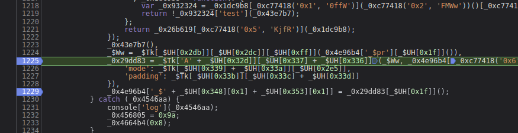

## 知识点

油猴hook是注意 //@run-at      document-start 表示页面加载之前

hook cookie

Cookie之所以要新增一个包含固定字符串的判断是因为，cookie经常被修改，这样会断很多次，而我们只想让他断在固定cookie块被设置的时候，因此这么写

hook m

    // ==UserScript==
    // @name        Hook Cookie
    // @namespace   http://tampermonkey.net/
    // @version     0.1
    // @description pass
    // @author      ayf
    // @run-at      document-start
    // @match        *://match.yuanrenxue.com/*
    // @grant       none
    // ==/UserScript==
    
    (function () {
        'use strict';
        Object.defineProperty(document, "cookie", {
            set:function(val){
                console.log(11111)
                if(val.indexOf("m") != -1){
                    debugger;
                }
                return val;
            }
        })
    })();

hook RM4hZBv0dDon443M

    // 方案二 indexOf() 方法可返回某个指定的字符串值在字符串中首次出现的位置。
    
    // ==UserScript==
    // @name        Hook Cookie
    // @namespace   http://tampermonkey.net/
    // @version     0.1
    // @description pass
    // @author      ayf
    // @run-at      document-start
    // @match        *://match.yuanrenxue.com/*
    // @grant       none
    // ==/UserScript==
    
    (function () {
        'use strict';
        Object.defineProperty(document, "cookie", {
            set:function(val){
                console.log(11111)
                if(val.indexOf("RM4hZBv0dDon443M") != -1){
                    debugger;
                }
                return val;
            }
        })
    })();

hook window

    // ==UserScript==
    // @name        Hook window
    // @namespace   http://tampermonkey.net/
    // @version     0.1
    // @description pass
    // @author      ayf
    // @run-at      document-start
    // @match        *://match.yuanrenxue.com/*
    // @grant       none
    // ==/UserScript==
    
    (function () {
        'use strict';
        Object.defineProperty(window, "_$ss", {
            set:function(val){
                console.log(11111)
                console.warn("hook _$ss", val)
                debugger;
                return val;
            }
        })
    })();

这里 hook  "RM4hZBv0dDon443M" 找到 _0x4e96b4['_$ss'] 生成的加密参数

    _0x29dd83 = _$Tk['A' + _$UH[0x32d]][_$UH[0x337] + _$UH[0x336]](_$Ww, _0x4e96b4[_0xc77418('0x6', 'OCbs')], {
        'mode': _$Tk[_$UH[0x339] + _$UH[0x33a]][_$UH[0x2e5]],
        'padding': _$Tk[_$UH[0x33b]][_$UH[0x33c] + _$UH[0x33d]]
    }),
    _0x4e96b4['_$' + _$UH[0x348][0x1] + _$UH[0x353][0x1]] = _0x29dd83[_$UH[0x1f]]();
    
解混淆

    _0x29dd83 = _$Tk['AES']['encrypt'](_$Ww, _0x4e96b4['_$qF'], {
        'mode': _$Tk['mode']['ECB'],
        'padding': _$Tk['pad']['Pkcs7']
    });
    
    ss = _0x29dd83['toString']();
    console.log(ss);
    
这里就很熟悉了 AES加密，贴一段加密代码

    const CryptoJS = require("crypto-js");
    
    let value = "123456"; //待加密的字符串
    let secret_value = "af25-87hk-a35v-5"; //密匙 16位
    let iv_value = "af25-87hk-a35v-5"; // 初始向量 initial vector 16位
    
    // 密匙和向量处理
    let secret = CryptoJS.enc.Utf8.parse(secret_value);
    let iv = CryptoJS.enc.Utf8.parse(iv_value);
    
    // 加密
    let encrypted = CryptoJS.AES.encrypt(value, secret, {
        iv: iv,
        // mode 支持 CBC, CFB,CTB,ECB,OFB,OFB, 默认CBC
        mode: CryptoJS.mode.CBC,
    
        // NoPadding, zeropadding 默认Pkcs7 即 pkcs5
        padding: CryptoJS.pad.Pkcs7
    });
    
    // 将加密结果转换为字符串
    encrypted = encrypted.toString();
    
    // 解密，传入密文，密钥盒向量设置加密与填充模式
    let decrypted = CryptoJS.AES.decrypt(encrypted, secret, {
        iv: iv,
        // mode 支持 CBC, CFB,CTB,ECB,OFB,OFB, 默认CBC
        mode: CryptoJS.mode.CBC,
    
        // NoPadding, zeropadding 默认Pkcs7 即 pkcs5
        padding: CryptoJS.pad.Pkcs7
    });
    
    // 将解密结果转换为utf8字符串
    decrypted = CryptoJS.enc.Utf8.stringify(decrypted);
    
    console.log(value);
    console.log(encrypted);
    console.log(decrypted);

_$Ww是明文， _0x4e96b4['_$qF']是密钥

### 测试一下是否是 标准的 CryptoJS js库

    const CryptoJS = require("crypto-js");
    _$Tk = CryptoJS;
    window = global;
    _0x4e96b4 = window;
    
    _0x4e96b4['_$pr'] = [
        "d91dfb71a14b4b8dbab7a83b4db3c930",
        "795fef1417a874c0a518372c686c4114",
        "4da402cd8daa5909a9dcfdf931f0b269",
        "f7071d9eb5acc11a29da60f508c0b048",
        "c7740dc325c12af5fd95695e53b1cda9"
    ];
    
    
    _0x4e96b4['_$qF'] = {
        "words": [
            1297373489,
            1299857785,
            1330930554,
            1297373490
        ],
        "sigBytes": 16
    };
    
    _$Ww = _$Tk['enc']['Utf8']['parse'](_0x4e96b4['_$pr']['toString']());
    _0x29dd83 = _$Tk['AES']['encrypt'](_$Ww, _0x4e96b4['_$qF'], {
        'mode': _$Tk['mode']['ECB'],
        'padding': _$Tk['pad']['Pkcs7']
    });
    
    ss = _0x29dd83['toString']();
    console.log(ss);
    
结果是和浏览器执行的一样

    ywOWQQGsmlZnSRHpvOlsrLICIWP6VMt8UIHjTAjAkll06leu+va5tUF+blZKgfe2Mo64p2Gj/BC1icBOTqxDYpjF3RuhCvddBo6uEXzqkMpnk9ReYWyfFmCgkAsgTD8aOEwbL+AhReaAp/90AsvN2bFF2NmhpP2FUDAIUTnl9zIBicVGN97W/CjLNJVhEfTvif6zf7StT68TwDwgNgnj8VfaN47rQFftK7oApF/5CA4=

### 先解决密钥的问题

顺藤摸瓜 _0x4e96b4['_$qF']

    // 密钥
    _0x35bb1d = Date;
    function _0x2d5f5b() {
        return new _0x35bb1d()['valueOf']();
    }
    _$yw = _0x2d5f5b()['toString']();
    _0x4e96b4['_$is'] = _$yw;
    _0x4e96b4['_$qF'] = CryptoJS['enc']['Utf8']['parse'](_0x4e96b4['btoa'](_0x4e96b4['_$is'])['slice'](0, 16));

### 解决明文 _$Ww

继续看代码

    _$Ww = _$Tk['enc']['Utf8']['parse'](_0x4e96b4['_$pr']['toString']());
    
实例代码

    let secret = CryptoJS.enc.Utf8.parse(secret_value);

处理明文 _$Ww

    _$Ww = _$Tk['enc']['Utf8']['parse'](_0x4e96b4['_$pr']['toString']());

搜索 _0x4e96b4['_$pr'] 打上断点

    
找到 _$Wa 生成方法

    _$Wa = _0x12eaf3();
    _0x3d0f3f[_$Fe] = 'm=' + _0x474032(_$Wa) + ';\x20path=/';
    _0x4e96b4['_$pr']['push'](_0x474032(_$Wa));
    
开始扣代码

    const CryptoJS = require("crypto-js");
    _$Tk = CryptoJS;
    window = global;
    _0x4e96b4 = window;
    
    _0x4e96b4['_$pr'] = [];
    
    _$Wa = 1653016793000;
    // _0x3d0f3f[_$Fe] = 'm=' + _0x474032(_$Wa) + ';\x20path=/';
    _0x4e96b4['_$pr']['push'](_0x474032(_$Wa));
    
    _$Ww = _$Tk['enc']['Utf8']['parse'](_0x4e96b4['_$pr']['toString']());
    _0x29dd83 = _$Tk['AES']['encrypt'](_$Ww, _0x4e96b4['_$qF'], {
        'mode': _$Tk['mode']['ECB'],
        'padding': _$Tk['pad']['Pkcs7']
    });
    
    ss = _0x29dd83['toString']();
    console.log(ss);

### 报错 ReferenceError: history is not defined

window.history属性指向History对象，它表示当前窗口的浏览历史。

    https://www.jianshu.com/p/bbc2f9552c06
    
history 是在浏览器里才有的函数

    try {
        op = _0x4e96b4['$_zw'][_$UH[0x6c]];
    } catch (_0x58af26) {
        var _0x3b7935 = 0x0;
        for (var _0x1badc3 = 0x0; _0x1badc3 < 0xf4240; _0x1badc3++) {
            _0x3b7935 = _0x3b7935 + _0x1badc3[_$UH[0x1f]]();
            history['pushState'](0x0, 0x0, _0x3b7935);
        }
    }

这里的 try catch 语法，对 op = _0x4e96b4['$_zw'][_$UH[0x6c]]; 进行断点

    op = 26;
    
这里写死，直接过！

