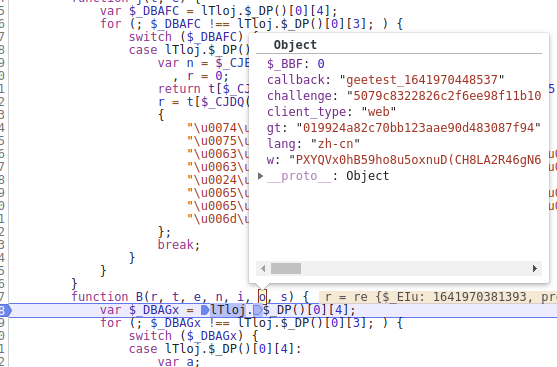

## 知识点 atob，魔改的md5，环境指纹，crypto-js，hook cookie

### 解题

网上有2篇介绍的文章，但最最关键的点都没有写出来，

直接说明了主要破解cookie中的`m=`和`RM4hZBv0dDon443M=`

油猴插件`hook cookie`

很容易就找到`RM4hZBv0dDon443M=`加密点

调试内存栈，就会发现`_0x4e96b4['_$ss']`是加密位置

全局搜索`_0x4e96b4['_$`找到赋值位置

仔细观察这断代码是不是`crypto-js`加密，mode是`ECB`，padding是`Pkcs7`

    _$Ww = _$Tk[_$UH[0x2db]][_$UH[0x2dc]][_$UH[0xff]](_0x4e96b4['_$pr'][_$UH[0x1f]]()),
    _0x29dd83 = _$Tk['A' + _$UH[0x32d]][_$UH[0x337] + _$UH[0x336]](_$Ww, _0x4e96b4[_0xc77418('0x6', 'OCbs')], {
        'mode': _$Tk[_$UH[0x339] + _$UH[0x33a]][_$UH[0x2e5]],
        'padding': _$Tk[_$UH[0x33b]][_$UH[0x33c] + _$UH[0x33d]]
    }),
    _0x4e96b4['_$' + _$UH[0x348][0x1] + _$UH[0x353][0x1]] = _0x29dd83[_$UH[0x1f]]();

通过上面的代码就需要找到`_0x4e96b4['_$pr']`和`_0x4e96b4[_0xc77418('0x6', 'OCbs')]`

这里的`_0x4e96b4[_0xc77418('0x6', 'OCbs')]`改写成`_0x4e96b4["_$qF"]`

全局搜索找到`_0x4e96b4['_$qF']`，这样能确定的是CryptoJS加密密钥是时间戳

在看看`_0x4e96b4['_$pr']`加密值，是数组

尝试写死2个参数，一点点扣代码改写

其中`btoa`和`atob`是需要自己补的，node中没有`btoa`和`atob`函数

结果输出

    pr = [
        "b2148c31fb09c98f90ce78424d6cdd58",
        "3be88c860ec6fc7e4e33fe7a167d02dd",
        "0be14faf5221bbdefdede418b077ca60",
        "9c2b5781ba44e92f5e4b3f4d7951b899",
        "08aca52cf82f1e26cc1f4dd35db9795e"
    ];
    dada_time = "1678253268764";

