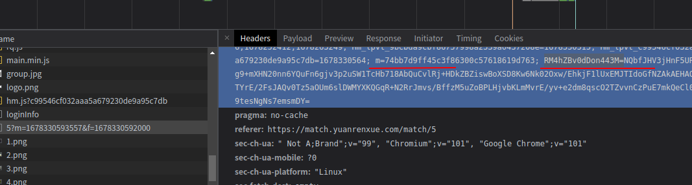
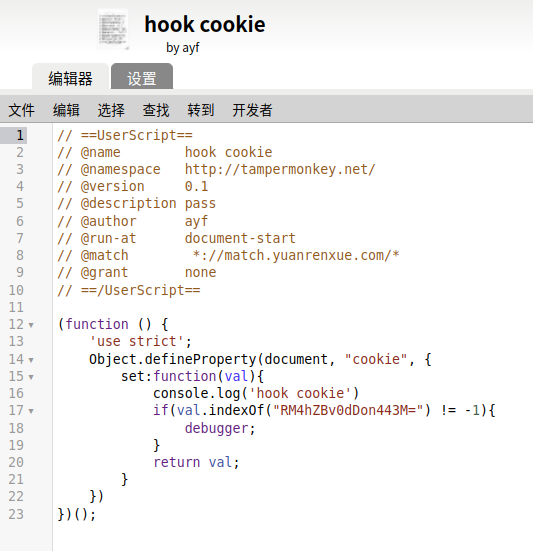
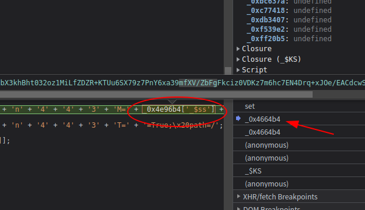
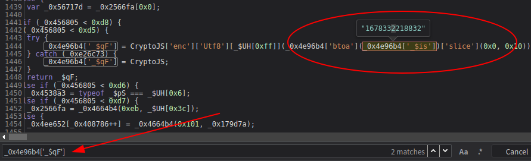
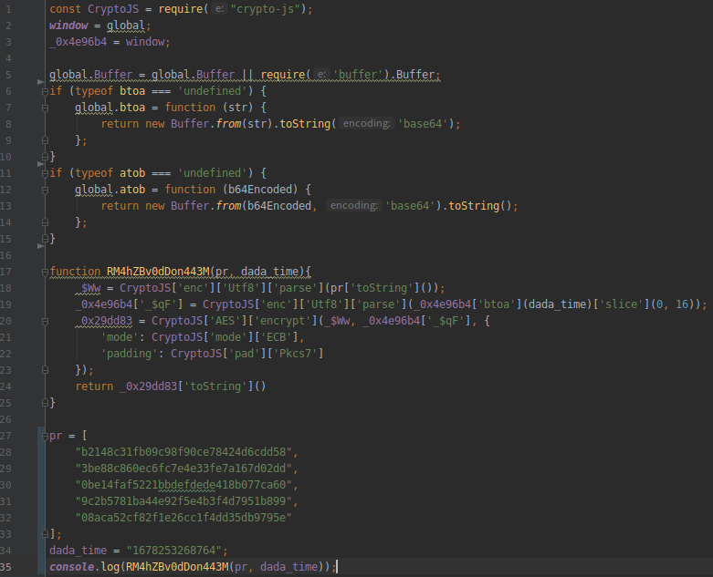
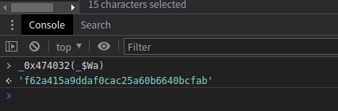
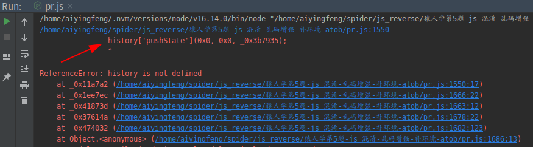
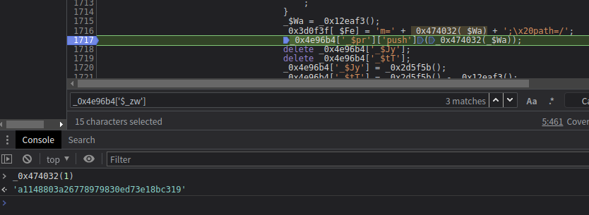
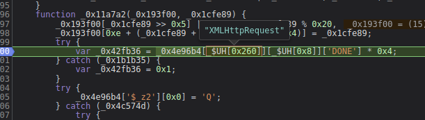

## 知识点 atob，魔改的md5，环境指纹，crypto-js，hook cookie，md5加盐

网上有2篇介绍的文章，但最最关键的点都没有写出来，直接说明了主要破解cookie中的`RM4hZBv0dDon443M=`

### 解题一：RM4hZBv0dDon443M的值是怎么来的

油猴插件`hook cookie`

很容易就找到`RM4hZBv0dDon443M=`加密点

调试内存栈，就会发现`_0x4e96b4['_$ss']`是加密位置

全局搜索`_0x4e96b4['_$`找到赋值位置

仔细观察这断代码发现是`crypto-js`加密，mode是`ECB`，padding是`Pkcs7`

    _$Ww = _$Tk[_$UH[0x2db]][_$UH[0x2dc]][_$UH[0xff]](_0x4e96b4['_$pr'][_$UH[0x1f]]()),
    _0x29dd83 = _$Tk['A' + _$UH[0x32d]][_$UH[0x337] + _$UH[0x336]](_$Ww, _0x4e96b4[_0xc77418('0x6', 'OCbs')], {
        'mode': _$Tk[_$UH[0x339] + _$UH[0x33a]][_$UH[0x2e5]],
        'padding': _$Tk[_$UH[0x33b]][_$UH[0x33c] + _$UH[0x33d]]
    }),
    _0x4e96b4['_$' + _$UH[0x348][0x1] + _$UH[0x353][0x1]] = _0x29dd83[_$UH[0x1f]]();

通过上面的代码就需要找到`_0x4e96b4['_$pr']`和`_0x4e96b4[_0xc77418('0x6', 'OCbs')]`

这里的`_0x4e96b4[_0xc77418('0x6', 'OCbs')]`改写成`_0x4e96b4["_$qF"]`

全局搜索找到`_0x4e96b4['_$qF']`，这样能确定的是CryptoJS加密密钥是时间戳

在看看`_0x4e96b4['_$pr']`加密值，是数组

尝试写死2个参数，一点点扣代码改写

其中`btoa`和`atob`是需要自己补的，node中没有`btoa`和`atob`函数

结果输出

### 解题二：_0x4e96b4['_$pr']生成

全局搜索`_0x4e96b4['_$pr']`所有涉及的地方都打上断点

可以看到`_0x4e96b4['_$pr']`push了一个`_0x474032(_$Wa)`,并且尝试打印`_0x474032(_$Wa)`，看着像一段md5，其中参数`_$Wa`是时间戳

接下来的逻辑复制代码缺啥补啥，从这段代码开始

    _0x474032(_$Wa)

注意点一：报错`ReferenceError: history is not defined`

仔细阅读发现,报错的真正原因是`_0x4e96b4['$_zw']`未定义

    try {
        op = _0x4e96b4['$_zw']['length'];
    } catch (_0x58af26) {
        var _0x3b7935 = 0x0;
        for (var _0x1badc3 = 0x0; _0x1badc3 < 0xf4240; _0x1badc3++) {
            _0x3b7935 = _0x3b7935 + _0x1badc3[_$UH[0x1f]]();
            history['pushState'](0x0, 0x0, _0x3b7935);
        }
    }

控制台打印出来看看，`明说了，这个数组是指纹`，那么这里要搞定指纹是如何生成的

全局搜索`$_zw`,仔细阅读代码，发现指纹就是从这里产生的

    window.$_zw = [];
    window.$_zw.push(15796);
    window.$_zw.push('NTEyMDAsNTE0NTYsNTE3MTIsNTE5NjgsNTIyMjQsNTI0ODAsNTI3MzYsNTI5OTIsMTMxMDcyLDEzMTMyOCwxMzE1ODQsMTMxODQwLDEzMjA5NiwxMzIzNTIsMTMyNjA4LDEzMjg2NCwxMzMxMjAsMTMzMzc2LDEzMzYzMiwxMzM4ODgsMTM0MTQ0LDEzNDQwMCwxMzQ2NTYsMTM0OTEyLDE0MzM2MCwxNDM2MTYsMTQzODcyLDE0NDEyOCwxNDQzODQsMTQ0NjQwLDE0NDg5NiwxNDUxNTIsMTQ1NDA4LDE0NTY2NCwxNDU5MjAsMTQ2MTc2LDE0NjQzMiwxNDY2ODgsMTQ2OTQ0LDE0NzIwMCwxNzIwMzIsMTcyMjg4LDE3MjU0NCwxNzI4MDAsMTczMDU2LDE3MzMxMiwxNzM1NjgsMTczODI0LDE3NDA4MCwxNzQzMzYsMTc0NTkyLDE3NDg0OCwxNzUxMDQsMTc1MzYwLDE3NTYxNiwxNzU4NzIsMTc2MTI4LDE3NjM4NCwxNzY2NDAsMTc2ODk2LDE3NzE1MiwxNzc0MDgsMTc3NjY0LDE3NzkyMCwxNzgxNzYsMTc4NDMyLDE3ODY4OCwxNzg5NDQsMTc5MjAwLDE3OTQ1NiwxNzk3MTIsMTc5OTY4LDE4NDMyMCwxODQ1NzYsMjI1MjgwLDIyNTUzNiwyMjU3OTIsMjI2MDQ4LDIyNjMwNCwyMjY4MTYsMjI3MDcyLDIyNzg0MCwyMjgwOTYsMjI4MzUyLDIyODYwOCwyMjkxMjAsMjMwOTEyLDIzMTQyNCwyMzE2ODAsMjMxOTM2LDIzMjQ0OCwyMzI5NjAsMjMzMjE2LDIzMzQ3MiwyMzM3MjgsMjMzOTg0LDIzNDI0MCwyMzQ0OTYsMjM0NzUyLDIzNTAwOCwyMzUyNjQsMjM1NTIwLDIzNTc3NiwyMzYwMzIsMjM2Mjg4LDIzNjU0NCwyMzY4MDAsMjM3MDU2LDIzNzMxMiwyNTM5NTIsMjU0MjA4LDI1NDQ2NCwyNTQ3MjAsMjU0OTc2LDI1NTIzMiwyNTU0ODgsMjU1NzQ0LDI1NjAwMCwyNTYyNTYsMjU2NTEyLDI1Njc2OCwyNTcwMjQsMjU3MjgwLDI1NzUzNiwyNTc3OTIsMjY2MjQwLDI2NjQ5NiwyNjY3NTIsMjY3MDA4LDI2NzI2NCwyNjc1MjAsMjY3Nzc2LDI2ODAzMiwyNjgyODgsMjY4NTQ0LDI2ODgwMCwyNjkwNTYsMjY5MzEyLDI2OTU2OCwyNjk4MjQsMjcwMDgwLDI3MDMzNiwyNzA1OTIsMjcwODQ4LDI3MTEwNCwyNzEzNjAsMjcxNjE2LDI3MTg3MiwyNzIxMjgsMjcyMzg0LDI3MjY0MCwyNzI4OTYsMjczMTUyLDI3MzQwOCwyNzM2NjQsMjczOTIwLDI3NDE3NiwyNzQ0MzIsMjc0Njg4LDI3NDk0NCwyNzUyMDAsMjc1NDU2LDI3NTcxMiwyNzU5NjgsMjc2MjI0LDI3NjQ4MCwyNzY3MzYsMjc2OTkyLDI3NzI0OCwyNzc1MDQsMjc3NzYwLDI3ODAxNiwyNzgyNzIsMjc4NTI4LDI3ODc4NCwyNzkwNDAsMjc5Mjk2LDI3OTU1MiwyNzk4MDgsMjgwMDY0LDI4MDMyMCwyODA1NzYsMjgwODMyLDI4MTA4OCwyODEzNDQsMjgxNjAwLDI4MTg1NiwyODIxMTIsMjgyMzY4LDI4MjYyNCwyODI4ODAsMjgzMTM2LDI4MzM5MiwyODM2NDgsMjgzOTA0LDI4NDE2MCwyODQ0MTYsMjg0NjcyLDI4NDkyOCwyODUxODQsMjg1NDQwLDI4NTY5NiwyODU5NTIsMjg2MjA4LDI4NjQ2NCwyODY3MjAsMjg2OTc2LDI4NzIzMiwyODc0ODgsMjg3NzQ0LDI4ODAwMCwyODgyNTYsMjg4NTEyLDI4ODc2OCwyODkwMjQsMjg5MjgwLDI4OTUzNiwyODk3OTIsMjkwMDQ4LDI5MDMwNCwyOTA1NjAsMjkwODE2LDI5MTA3MiwyOTEzMjgsMjkxNTg0LDI5MTg0MCwyOTIwOTYsMjkyMzUyLDI5MjYwOCwyOTI4NjQsMjkzMTIwLDI5MzM3NiwyOTM2MzIsMjkzODg4LDI5NDE0NCwyOTQ0MDAsMjk0NjU2LDI5NDkxMiwyOTUxNjgsMjk3NDcyLDI5NzcyOCwyOTc5ODQsMjk4MjQwLDI5ODQ5NiwyOTg3NTIsMjk5MDA4LDI5OTI2NCwyOTk1MjAsMjk5Nzc2LDMwMDAzMiwzMDAyODgsMzAwNTQ0LDMwMDgwMCwzMDEwNTYsMzAxMzEyLDMwMTU2OCwzMDE4MjQsMzAyMDgwLDMwMjMzNiwzMDI1OTIsMzAyODQ4LDMwMzEwNCwzMDMzNjAsMzAzNjE2LDMwMzg3MiwzMDQxMjgsMzA0Mzg0LDMwNDY0MCwzMDQ4OTYsMzA1MTUyLDMwNTQwOCwzMDU2NjQsMzA1OTIwLDMwNjE3NiwzMDY0MzIsMzA2Njg4LDMwNjk0NCwzMDcyMDAsMzA3NDU2LDMwNzcxMiwzMDc5NjgsMzA4MjI0LDMwODQ4MCwzMDg3MzYsMzA4OTkyLDMwOTI0OCwzMDk1MDQsMzA5NzYwLDMxMDAxNiwzMTAyNzIsMzEwNTI4LDMxMDc4NCwzMTEwNDAsMzExMjk2LDMxMTU1MiwzMTE4MDgsMzEyMDY0LDMxMjMyMCwzMTI1NzYsMzEyODMyLDMxMzA4OCwzMTMzNDQsMzEzNjAwLDMxMzg1NiwzMTQxMTIsMzE0MzY4LDMxNDYyNCwzMTQ4ODAsMzE1MTM2LDMxNTM5MiwzMTU2NDgsMzE1OTA0LDMxNjE2MCwzMTY0MTYsMzE2NjcyLDMxNjkyOCwzMTcxODQsMzE3NDQwLDMxNzY5NiwzMTc5NTIsMzE4MjA4LDMxODQ2NCwzMTg3MjAsMzE4OTc2LDMxOTIzMiwzMTk0ODgsMzE5NzQ0LDMyMDAwMCwzMjAyNTYsMzIwNTEyLDMyMDc2OCwzMjEwMjQsMzIxMjgwLDMyMTUzNiwzMjE3OTIsMzIyMDQ4LDMyMjMwNCwzMjI1NjAsMzIyODE2LDMyMzA3MiwzMjMzMjgsMzIzNTg0LDMyMzg0MCwzMjQwOTYsMzI0MzUyLDMyNDYwOCwzMjQ4NjQsMzI1MTIwLDMyNTM3NiwzMjU2MzIsMzI1ODg4LDMyNjE0NCwzMjY0MDAsMzI2NjU2LDMyNjkxMiwzMjcxNjgsMzI3NDI0LDMyNzY4MCwzMjc5MzYsMzI4MTkyLDMyODQ0OCwzMjg3MDQsMzI4OTYwLDMyOTIxNiwzMjk0NzIsMzI5NzI4LDMyOTk4NCwzMzAyNDAsMzMwNDk2LDMzMDc1MiwzMzEwMDgsMzMxMjY0LDMzMTUyMCwzMzE3NzYsMzMyMDMyLDMzMjI4OCwzMzI1NDQsMzMyODAwLDMzMzA1NiwzMzMzMTIsMzMzNTY4LDMzMzgyNCwzMzQwODAsMzM0MzM2LDMzNDU5MiwzMzQ4NDgsMzM1MTA0LDMzNTM2MCwzMzU2MTYsMzM1ODcyLDMzNjEyOCwzMzYzODQsMzM2NjQwLDMzNjg5NiwzMzcxNTIsMzM3NDA4LDMzNzY2NCwzMzc5MjAsMzM4MTc2LDMzODQzMiwzMzg2ODgsMzM4OTQ0LDMzOTIwMCwzMzk0NTYsMzM5NzEyLDM0MDIyNCwzNDA0ODAsMzQwNzM2LDM0MDk5MiwzNDEyNDgsMzQxNTA0LDM0MTc2MCwzNDIwMTYsMzQyMjcyLDM0MjUyOCwzNDI3ODQsMzQzMDQwLDM0MzI5NiwzNDM1NTIsMzQzODA4LDM0NDA2NCwzNDQzMjAsMzQ0NTc2LDM0NDgzMiwzNDUwODgsMzQ1MzQ0LDM0NTYwMCwzNDU4NTYsMzQ2MTEyLDM0NjM2OCwzNDY2MjQsMzQ2ODgwLDM0NzEzNiwzNDczOTIsMzQ3NjQ4LDM0NzkwNCwzNDgxNjAsMzQ4NDE2LDM0ODY3MiwzNDg5MjgsMzQ5MTg0LDM0OTQ0MCwzNDk2OTYsMzUwNDY0LDM1MjI1NiwzNTI1MTIsMzUyNzY4LDM1MzAyNCwzNTMyODAsMzUzNTM2LDM1Mzc5MiwzNTQwNDgsMzU0MzA0LDM1NDU2MCwzNTQ4MTYsMzU1MDcyLDM1NTMyOCwzNTU1ODQsMzU1ODQwLDM1NjA5NiwzNTYzNTIsMzU2NjA4LDM1Njg2NCwzNTcxMjAsMzU3Mzc2LDM1NzYzMiwzNTc4ODgsMzU4MTQ0LDM1ODQwMCwzNTg2NTYsMzU4OTEyLDM1OTE2OCwzNTk0MjQsMzU5NjgwLDM1OTkzNiwzNjAxOTIsMzYwNDQ4LDM2MDcwNCwzNjA5NjAsMzYxMjE2LDM2MTQ3MiwzNjE3MjgsMzYxOTg0LDM2MjI0MCwzNjI0OTYsMzg5MTIwLDM4OTM3NiwzODk2MzIsNDAxNDA4LDQwMTY2NCw0MDE5MjAsNDAyMTc2LDQwMjQzMiw0MDI2ODgsNDAyOTQ0LDQwMzIwMCw0MDM0NTYsNDAzNzEyLDQwMzk2OCw0MDQyMjQsNDA0NDgwLDQwNDczNiw0MDQ5OTIsNDA1MjQ4LDQwNTUwNCw0MDU3NjAsNDA2MDE2LDQwNjI3Miw0MDY1MjgsNDA2Nzg0LDQwNzA0MCw0MDcyOTYsNDA3NTUyLDQwNzgwOCw0MDgwNjQsNDA4MzIwLDQwODU3Niw0MDg4MzIsNDA5MDg4LDQwOTM0NCw0MDk2MDAsNDA5ODU2LDQxMDExMiw0MTAzNjgsNDEwNjI0LDQxMDg4MCw0MTExMzYsNDExMzkyLDQxMTY0OCw0MTE5MDQsNDEyMTYwLDQyMTM3Niw0MjE2MzIsNDIyMTQ0LDQyMjQwMCw0MjI2NTYsNDIyOTEyLDQyMzE2OCw0MjM0MjQsNDIzNjgwLDQyMzkzNiw0MjQxOTIsNDI0NDQ4LDQyNDcwNCw0MjQ5NjAsNDI1MjE2LDQyNTQ3Miw0MjU3MjgsNDI1OTg0LDQyNjI0MCw0MjY0OTYsNDI2NzUyLDQyNzAwOCw0MjcyNjQsNDI3NTIwLDQyNzc3Niw0MjgwMzIsNDI4Mjg4LDQyODU0NCw0Mjg4MDAsNDI5MDU2LDQyOTMxMiw0Mjk1NjgsNDI5ODI0LDQzMDA4MCw0MzAzMzYsNDMwNTkyLDQzMDg0OCw0MzExMDQsNDMxMzYwLDQzMTYxNiw0MzE4NzIsNDMyMTI4LDQzMjM4NCw0MzI2NDAsNDMyODk2LDQzMzE1Miw0MzM0MDgsNDMzNjY0LDQzMzkyMCw0MzQxNzYsNDM0NDMyLDQzNDY4OCw0MzQ5NDQsNDM1MjAwLDQzNTQ1Niw0MzU3MTIsNDM1OTY4LDQzNjIyNCw0MzY0ODAsNDM2NzM2LDQzNjk5Miw0MzcyNDgsNDM3NTA0LDQzNzc2MCw0MzgwMTYsNDM4MjcyLDQzODUyOCw0Mzg3ODQsNDM5MDQwLDQzOTI5Niw0Mzk1NTIsNDM5ODA4LDQ0MDA2NCw0NDAzMjAsNDQwNTc2LDQ0MDgzMiw0NDEwODgsNDQxMzQ0LDQ0MTYwMCw0NDE4NTYsNDQyMTEyLDQ0MjM2OCw0NDI2MjQsNDQyODgwLDQ0MzEzNiw0NDMzOTIsNDQzNjQ4LDQ0MzkwNCw0NDQxNjAsNDQ0NDE2LDQ0NDY3Miw0NDQ5MjgsNDQ1MTg0LDQ0NTQ0MCw0NDU2OTYsNDQ1OTUyLDQ0NjIwOCw0NDY0NjQsNDQ2NzIwLDQ0Njk3Niw0NDcyMzIsNDQ3NzQ0LDQ1MTg0MCw0NTIwOTYsNDU0MTQ0LDQ1NDQwMCw0NTcyMTYsNDU3NDcyLDQ1NzcyOCw0NTg0OTYsNDYyODQ4LDQ2MzM2MCw0NjM2MTYsNDYzODcyLDQ2NDEyOCw0NjQzODQsNDY0NjQwLDQ2NDg5Niw0NjUxNTIsNDY1NDA4LDQ2NTY2NCw0NjU5MjAsNDY2MTc2LDQ2NjQzMiw0NjY2ODgsNDY2OTQ0LDQ2NzIwMCw0Njc0NTYsNDY3NzEyLDQ2Nzk2OCw0NjgyMjQsNDY4NDgwLDQ2ODczNiw0Njg5OTIsNDY5MjQ4LDQ2OTUwNCw0Njk3NjAsNDcwMDE2LDQ3MDI3Miw0NzA1MjgsNDcwNzg0LDQ3ODQ2NCw0Nzg3MjAsNDc4OTc2LDQ3OTIzMiw0Nzk0ODgsNDc5NzQ0LDQ4MDAwMCw0ODAyNTYsNDgwNTEyLDQ4MDc2OCw0ODEwMjQsNDgxMjgwLDQ4MTUzNiw0ODE3OTIsNDgyMDQ4LDQ4MjMwNCw0ODI1NjAsNDgyODE2LDQ4MzA3Miw0ODMzMjgsNDgzNTg0LDQ4Mzg0MCw0ODQwOTYsNDg0MzUyLDQ4NDYwOCw0ODQ4NjQsNDg1MTIwLDQ4NTM3Niw0ODU2MzIsNDg1ODg4LDQ4NjE0NCw0ODY0MDAsNDg2NjU2LDQ4NjkxMiw0ODcxNjgsNDg3NDI0LDQ4NzY4MCw0ODc5MzYsNDg4MTkyLDQ4ODQ0OCw0ODg3MDQsNDg4OTYwLDQ4OTIxNiw0ODk0NzIsNDg5NzI4LDQ4OTk4NCw0OTAyNDAsNDkwNDk2LDQ5MDc1Miw0OTEwMDgsNDkxMjY0LDQ5MTUyMCw0OTE3NzYsNDkyMDMyLDQ5MjI4OCw0OTI1NDQsNDkyODAwLDQ5MzA1Niw0OTMzMTIsNDkzNTY4LDQ5MzgyNCw0OTQwODAsNDk0MzM2LDQ5NDU5Miw0OTQ4NDgsNDk1MTA0LDQ5NTM2MCw0OTU2MTYsNDk1ODcyLDQ5NjEyOCw0OTYzODQsNDk2NjQwLDQ5Njg5Niw0OTcxNTIsNDk3NDA4LDQ5NzY2NCw0OTc5MjAsNDk4MTc2LDQ5ODQzMiw0OTg2ODgsNDk4OTQ0LDQ5OTIwMCw0OTk0NTYsNDk5NzEyLDQ5OTk2OCw1MDAyMjQsNTAwNDgwLDUwMDczNiw1MDA5OTIsNTE2MDk2LDUxNjM1Miw1MTY2MDgsNTE2ODY0LDUxNzEyMCw1MTczNzYsNTE3NjMyLDUxNzg4OCw1MTgxNDQsNTE4NDAwLDUxODY1Niw1MjQyODgsNTI0NTQ0LDUyNDgwMCw1MjUwNTYsNTI1MzEyLDUyNTU2OCw1MjU4MjQsNTI2MDgwLDUyNjMzNiw1MjY1OTIsNTI2ODQ4LDUyNzEwNCw1MjczNjAsNTI3NjE2LDUyNzg3Miw1MjgxMjgsNTI4Mzg0LDUyODY0MCw1Mjg4OTYsNTI5MTUyLDUyOTQwOCw1Mjk2NjQsNTMwOTQ0LDUzMzUwNCw1MzQ1MjgsNTQwNjcyLDU0MDkyOCw1NDExODQsNTQxNDQwLDU0MTY5Niw1NDE5NTIsNTQyMjA4LDU0MjQ2NCw1NDI3MjAsNTQyOTc2LDU0MzIzMiw1NDM0ODgsNTQzNzQ0LDU0NDAwMCw1NDQyNTYsNTQ0NTEyLDU0NDc2OCw1NDUwMjQsNTQ1MjgwLDU0NTUzNiw1NDU3OTIsNTQ2MDQ4LDU0NjMwNCw1NDY1NjAsNTQ2ODE2LDU0ODg2NCw1NDkxMjAsNTQ5Mzc2LDU0OTYzMiw1NDk4ODgsNTUwMTQ0LDU1MDQwMCw1NTA2NTYsNTUwOTEyLDU1MTE2OCw1NTE0MjQsNTUyOTYwLDU1MzIxNiw1NTM0NzIsNTUzNzI4LDU1Mzk4NCw1NTQyNDAsNTU0NDk2LDU1NDc1Miw1NTUwMDgsNTU1MjY0LDU1NTUyMCw1NTU3NzYsNTU2MDMyLDU1NjI4OCw1NTY1NDQsNTU2ODAwLDU1NzA1Niw1NTczMTIsNTU3NTY4LDU1NzgyNCw1NTgwODAsNTU4MzM2LDU1ODU5Miw1NTg4NDgsNTU5MzYwLDU1OTYxNiw1NTk4NzIsNTYwMTI4LDU2MDM4NCw1NjA2NDAsNTY1MjQ4LDU2NTUwNCw1NjU3NjAsNTY2MDE2LDU2NjI3Miw1NjY1MjgsNTY2Nzg0LDU2NzA0MCw1NjcyOTYsNTY3NTUyLDU2NzgwOCw1NjgwNjQsNTY4MzIwLDU2ODU3Niw1Njg4MzIsNTY5MDg4LDU2OTM0NCw1Njk2MDAsNTY5ODU2LDU3MDExMiw1NzAzNjgsNTcwNjI0LDU3MDg4MCw1NzExMzYsNTcxMzkyLDU3MTY0OCw1NzE5MDQsNTcyMTYwLDU3MjQxNiw1NzI2NzIsNTcyOTI4LDU3MzE4NCw1NzM0NDAsNTczNjk2LDU3Mzk1Miw1NzQyMDgsNTc0NDY0LDU3NDcyMCw1NzQ5NzYsNTc1MjMyLDU3NTQ4OCw1NzU3NDQsNTkwODQ4LDU5MTEwNCw1OTEzNjAsNTkxNjE2LDU5MTg3Miw1OTIxMjgsNTkyMzg0LDU5MjY0MCw1OTI4OTYsNTkzMTUyLDU5MzQwOCw1OTM2NjQsNTkzOTIwLDU5NDE3Niw1OTQ0MzIsNTk0Njg4LDU5NDk0NCw1OTUyMDAsNTk1NDU2LDU5NTcxMiw1OTU5NjgsNTk2MjI0LDU5NjQ4MCw1OTY3MzYsNTk2OTkyLDU5NzI0OCw1OTc1MDQsNTk3NzYwLDU5ODAxNiw1OTgyNzIsNTk4NTI4LDU5ODc4NCw1OTkwNDAsNTk5Mjk2LDU5OTU1Miw1OTk4MDgsNjAwMDY0LDYwMDMyMCw2MDA1NzYsNjAwODMyLDYwMTA4OCw2MDEzNDQsNjAxNjAwLDYwMTg1Niw2MDIxMTIsNjAyMzY4LDYwMjYyNCw2MDI4ODAsNjAzMTM2LDYwMzM5Miw2MDM2NDgsNjAzOTA0LDYwNDE2MCw2MDQ0MTYsNjA1NDQwLDYxMDMwNCw2MTIzNTIsNjEyNjA4LDYxMjg2NCw2MTMxMjAsNjEzMzc2LDYxMzYzMiw2MTM4ODgsNjE0MTQ0LDYxNDQwMCw2MTQ2NTYsNjE4NzUyLDYxOTAwOCw2MTkyNjQsNjE5NTIwLDYxOTc3Niw2MjAwMzIsNjIwMjg4LDYyMDU0NCw2MjA4MDAsNjIxMDU2LDYyMTMxMiw2MjE1NjgsNjIxODI0LDYyMjA4MCw2MjIzMzYsNjIyNTkyLDYyMzg3Miw2MjQxMjgsNjI0Mzg0LDYyNDY0MCw2MjQ4OTYsNjI1MTUyLDYyNTQwOCw2MjU2NjQsNjI2NDMyLDYyNjY4OCw2Mjc0NTYsNjI3NzEyLDYyNzk2OCw2MjgyMjQsNjI4NDgwLDYyODczNiw2Mjg5OTIsNjI5MjQ4LDYyOTUwNCw2Mjk3NjAsNjMwMDE2LDYzMDI3Miw2MzA1MjgsNjMwNzg0LDYzMTA0MCw2MzEyOTYsNjMxNTUyLDYzMTgwOCw2MzIwNjQsNjMyMzIwLDYzMjU3Niw2MzI4MzIsNjMzMzQ0LDYzMzYwMCw2MzM4NTYsNjM0MTEyLDYzNDM2OCw2MzQ2MjQsNjM0ODgwLDYzNTM5Miw2MzY0MTYsNjM2NjcyLDYzNjkyOCw2MzcxODQsNjM4MjA4LDY0MjU2MCw2NDYxNDQsNjQ2NDAwLDY0NjkxMiw2NDcxNjgsNjQ3NDI0LDY1MTI2NCw2NTE1MjAsNjU0MzM2LDY1NjY0MCw2NTY4OTYsNjU3MTUyLDY1NzQwOCw2NTc2NjQsNjU3OTIwLDY1OTIwMCw2NTk0NTYsNjYwMjI0LDY2MDQ4MCw2NjA3MzYsNjYwOTkyLDY2MTI0OCw2NjE1MDQsNjYxNzYwLDY2MjAxNiw2NjIyNzIsNjYyNTI4LDY2Mjc4NCw2NjMwNDAsNjYzMjk2LDY2MzU1Miw2NjM4MDgsNjY0MDY0LDY2NDMyMCw2NjQ1NzYsNjY0ODMyLDY2NTA4OCw2NjUzNDQsNjY1NjAwLDY2NjExMiw2NjYzNjgsNjY2NjI0LDY2Njg4MCw2NjcxMzYsNjY3MzkyLDY2NzY0OCw2NjgxNjAsNjY4NDE2LDY2ODkyOCw2NjkxODQsNjY5Njk2LDY2OTk1Miw2NzgxNDQsNjc4NDAwLDY3ODY1Niw2Nzg5MTIsNjc5NDI0LDY4NDU0NCw2ODQ4MDAsNjg1MDU2LDY4OTQwOCw2ODk2NjQsNjg5OTIwLDY5MDE3Niw2OTA0MzIsNjkwNjg4LDY5MDk0NCw2OTEyMDAsNjkxNDU2LDY5MTk2OCw2OTIyMjQsNjkyNDgwLDY5Mjk5Miw2OTMyNDgsNjkzNTA0LDY5Mzc2MCw2OTQwMTYsNjk0MjcyLDY5NDUyOCw2OTQ3ODQsNjk1MDQwLDY5NTI5Niw2OTU1NTIsNjk1ODA4LDY5NjA2NCw2OTYzMjAsNjk2NTc2LDY5NjgzMiw2OTcwODgsNjk3MzQ0LDY5NzYwMCw2OTc4NTYsNjk4MTEyLDY5ODM2OCw2OTg4ODAsNjk5MTM2LDY5OTM5Miw2OTk2NDgsNjk5OTA0LDcwMDE2MCw3MDA0MTYsNzAwOTI4LDcwMTE4NCw3MDE2OTYsNzAxOTUyLDcwMjIwOCw3MDI0NjQsNzAyNzIwLDcwMzc0NCw3MDg2MDgsNzEyNzA0LDcxMjk2MCw3MTkxMDQsNzIyMTc2LDcyMjQzMiw3MjI2ODgsNzIyOTQ0LDcyMzIwMCw3MjM0NTYsNzIzNzEyLDcyMzk2OCw3MjQ3MzYsNzI0OTkyLDcyNTc2MCw3MjYwMTYsNzI2MjcyLDcyNjUyOCw3MjY3ODQsNzI3MDQwLDcyNzI5Niw3Mjc1NTIsNzI3ODA4LDcyODA2NCw3MjgzMjAsNzI4NTc2LDcyODgzMiw3MjkwODgsNzI5MzQ0LDcyOTYwMCw3Mjk4NTYsNzMwMTEyLDczMDM2OCw3MzA2MjQsNzMwODgwLDczMTEzNiw3MzE2NDgsNzMxOTA0LDczMjE2MCw3MzI0MTYsNzMyNjcyLDczMjkyOCw3MzMxODQsNzMzNjk2LDczMzk1Miw3MzQ0NjQsNzM0NzIwLDczNDk3Niw3MzUyMzIsNzM1NDg4LDczNjUxMiw3NDQ0NDgsNzQ0NzA0LDc0NTIxNiw3NDU0NzIsNzQ1NzI4LDc0OTgyNCw3NTQ0MzIsNzU0OTQ0LDc1NTIwMCw3NTU0NTYsNzU1NzEyLDc1NTk2OCw3NTYyMjQsNzU3MjQ4LDc1NzUwNCw3NTc3NjAsNzU4MjcyLDc1ODUyOCw3NTg3ODQsNzU5MDQwLDc2MDA2NCw3NjAzMjAsNzYwODMyLDc2MTM0NCw3NjE2MDAsNzYyNjI0LDc2Mjg4MCw3NjM5MDQsNzY0MTYwLDc2NDQxNiw3NjU0NDAsNzY1Njk2LDc2NTk1Miw3NjYyMDgsNzY2NDY0LDc2NjcyMCw3NjY5NzYsNzY3MjMyLDc2NzQ4OCw3Njc3NDQsNzY4MDAwLDc2ODI1Niw3NzQxNDQsNzg3NzEyLDc4Nzk2OCw3ODgyMjQsNzg4NDgwLDc4ODczNiw3ODg5OTIsNzg5MjQ4LDc4OTUwNCw3OTAwMTYsNzkwMjcyLDc5MDUyOCw3OTEwNDAsNzkxMjk2LDc5MTU1Miw3OTE4MDgsNzkyMDY0LDc5MjMyMCw3OTI1NzYsNzkyODMyLDc5MzA4OCw3OTMzNDQsNzkzNjAwLDc5Mzg1Niw3OTQxMTIsNzk0MzY4LDc5NDYyNCw3OTQ4ODAsNzk1MTM2LDc5NTM5Miw3OTU2NDgsNzk1OTA0LDc5NjE2MCw3OTY0MTYsNzk2NjcyLDc5NzE4NCw3OTc0NDAsNzk3Njk2LDc5Nzk1Miw3OTgyMDgsNzk4NDY0LDc5ODcyMCw3OTg5NzYsNzk5MjMyLDc5OTQ4OCw3OTk3NDQsODAwMDAwLDgwMDI1Niw4MDA1MTIsODAwNzY4LDgwMTAyNCw4MDIwNDgsODA4OTYwLDgwOTIxNiw4MDk0NzIsODEwMjQwLDgxMTAwOCw4MTEyNjQsODE5MjAwLDgyMDQ4MCw4MjA3MzYsODIwOTkyLDgyMTI0OCw4MjE1MDQsODIxNzYwLDgyMjAxNiw4MjIyNzIsODIyNzg0LDgyMzA0MCw4MjMyOTYsODIzODA4LDgyNDA2NCw4MjQzMjAsODI0NTc2LDgyNDgzMiw4MjUwODgsODI1MzQ0LDgyNTYwMCw4MjU4NTYsODI2MTEyLDgyNjM2OCw4MjY2MjQsODI2ODgwLDgyNzEzNiw4MjczOTIsODI3NjQ4LDgyNzkwNCw4MjgxNjAsODI4NDE2LDgyODY3Miw4Mjg5MjgsODI5MTg0LDgyOTQ0MCw4Mjk5NTIsODMwMjA4LDgzMDQ2NCw4MzA3MjAsODMwOTc2LDgzMTIzMiw4MzE0ODgsODMxNzQ0LDgzMjAwMCw4MzIyNTYsODMyNzY4LDgzMzAyNCw4MzMyODAsODMzNTM2LDgzMzc5Miw4MzQ4MTYsODQzMDA4LDg0MzI2NCw4NDM3NzYsODQ0MDMyLDg0ODEyOCw4NDgzODQsODUyOTkyLDg1MzI0OCw4NTM1MDQsODUzNzYwLDg1NDAxNiw4NTQyNzIsODU0NTI4LDg1NDc4NCw4NTUwNDAsODU1NTUyLDg1NTgwOCw4NTYwNjQsODU2NTc2LDg1NjgzMiw4NTcwODgsODU3MzQ0LDg1NzYwMCw4NTc4NTYsODU4MTEyLDg1ODM2OCw4NTg2MjQsODU4ODgwLDg1OTEzNiw4NTkzOTIsODU5NjQ4LDg1OTkwNCw4NjAxNjAsODYwNDE2LDg2MDY3Miw4NjA5MjgsODYxMTg0LDg2MTQ0MCw4NjE2OTYsODYxOTUyLDg2MjIwOCw4NjI0NjQsODYyNzIwLDg2Mjk3Niw4NjMyMzIsODYzNDg4LDg2Mzc0NCw4NjQwMDAsODY0MjU2LDg2NDUxMiw4NjQ3NjgsODY1MDI0LDg2NTI4MCw4NjU1MzYsODY1NzkyLDg2NjA0OCw4NjYzMDQsODY2NTYwLDg2NjgxNiw4Njc1ODQsODcxOTM2LDg3MzQ3Miw4NzM3MjgsODczOTg0LDg3NjI4OCw4NzY1NDQsODc2ODAwLDg4MzIwMCw4ODM0NTYsODgzNzEyLDg4Mzk2OCw4ODQyMjQsODg0NDgwLDg4NjAxNiw4ODYyNzIsODg2NTI4LDg4Njc4NCw4ODcwNDAsODg3Mjk2LDg4NzU1Miw4ODc4MDgsODg4MDY0LDg4ODMyMCw4ODg1NzYsODg4ODMyLDg4OTA4OCw4ODkzNDQsODg5NjAwLDg4OTg1Niw4OTAxMTIsODkwMzY4LDg5MTM5Miw4OTE2NDgsODkxOTA0LDg5MjE2MCw4OTI0MTYsODkyNjcyLDg5MjkyOCw4OTMxODQsODkzNDQwLDg5MzY5Niw4OTM5NTIsODk0MjA4LDg5NDQ2NCw4OTQ3MjAsODk0OTc2LDg5NTIzMiw4OTU0ODgsODk1NzQ0LDg5NjAwMCw4OTYyNTYsODk2NTEyLDg5Njc2OCw4OTcwMjQsODk3MjgwLDg5Nzc5Miw4OTgwNDgsODk4MzA0LDg5ODU2MCw4OTg4MTYsODk5MDcyLDg5OTMyOCw4OTk1ODQsODk5ODQwLDkwMDM1Miw5MDExMjAsOTAxMzc2LDkwMTYzMiw5MDE4ODgsOTAyMTQ0LDkwMjQwMCw5MDI2NTYsOTE3NzYwLDkxODAxNiw5MTgyNzIsOTE4NTI4LDkxODc4NCw5MTkwNDAsOTE5Mjk2LDkxOTU1Miw5MTk4MDgsOTIwMDY0LDkyMDMyMCw5MjA1NzYsOTIwODMyLDkyMTA4OCw5MjEzNDQsOTIxNjAwLDkyMTg1Niw5MjIxMTIsOTIyMzY4LDkyMjYyNCw5MjI4ODAsOTIzMTM2LDkyMzM5Miw5MjM2NDgsOTIzOTA0LDkyNDE2MCw5MjQ0MTYsOTI0NjcyLDkyNDkyOCw5MjUxODQsOTI1NDQwLDkyNTY5Niw5MjU5NTIsOTI2MjA4LDkyNjQ2NCw5MjY3MjAsOTI2OTc2LDkyNzIzMiw5Mjc0ODgsOTI3NzQ0LDkyODAwMCw5MjgyNTYsOTI4NTEyLDkyODc2OCw5MjkwMjQsOTI5MjgwLDkyOTUzNiw5Mjk3OTIsOTMwMzA0LDkzMDU2MCw5MzM4ODgsOTM0MTQ0LDkzNDQwMCw5MzQ2NTYsOTM0OTEyLDkzNTE2OCw5MzU0MjQsOTUwNTI4LDk1MDc4NCw5NTEyOTYsOTUxODA4LDk1MjA2NCw5NTIzMjAsOTUyNTc2LDk1MjgzMiw5NTMzNDQsOTUzNjAwLDk1Mzg1Niw5NTQxMTIsOTU0MzY4LDk1NDYyNCw5NTQ4ODAsOTU1MTM2LDk1NTM5Miw5NTU2NDgsOTU1OTA0LDk1NjE2MCw5NTY0MTYsOTU2NjcyLDk1NjkyOCw5NTcxODQsOTU3NDQwLDk1NzY5Niw5NTc5NTIsOTU4MjA4LDk1ODQ2NCw5NTg3MjAsOTU4OTc2LDk1OTIzMiw5NTk3NDQsOTYwMjU2LDk2MDUxMiw5NjA3NjgsOTYxMDI0LDk2MTI4MCw5NjE1MzYsOTYxNzkyLDk2MjA0OCw5NjIzMDQsOTYyNTYwLDk2MzA3Miw5NjMzMjgsOTY1ODg4LDk2NjY1Niw5NjY5MTIsOTY3MTY4LDk2NzQyNCw5Njc2ODAsOTY4MTkyLDk3MzgyNCw5NzQwODAsOTc0MzM2LDk3NDU5Miw5ODMwNDAsOTk5NDI0LDk5OTY4MCw5OTk5MzYsMTAwMDE5MiwxMDAwNDQ4LDEwMDA3MDQsMTAwMDk2MCwxMDAxMjE2LDEwMDE3MjgsMTAwMTk4NCwxMDAyMjQwLDEwMDI0OTYsMTAwMjc1MiwxMDAzMDA4LDEwMDMyNjQsMTAwMzUyMCwxMDAzNzc2LDEwMDQwMzIsMTAwNDI4OCwxMDA0NTQ0LDEwMDQ4MDAsMTAwNTA1NiwxMDA1MzEyLDEwMDU1NjgsMTAwNTgyNCwxMDA2MDgwLDEwMDYzMzYsMTAwNjU5MiwxMDA2ODQ4LDEwMDcxMDQsMTAwNzM2MCwxMDA3NjE2LDEwMDc4NzIsMTAwODEyOCwxMDA4Mzg0LDEwMDg2NDAsMTAwODg5NiwxMDA5MTUyLDEwMDk0MDgsMTAwOTY2NCwxMDA5OTIwLDEwMTAxNzYsMTAxMDQzMiwxMDEwNjg4LDEwMTc4NTYsMTAxODExMiwxMDE4MzY4LDEwMTg2MjQsMTAxODg4MCwxMDQ4NTc2LDEwNDg4MzIsMTA0OTA4OCwxMDQ5MzQ0LDEwNDk2MDAsMTA0OTg1NiwxMDUwMTEyLDEwNTAzNjgsMTA1MDYyNCwxMDUwODgwLDEwNTExMzYsMTA1MTM5MiwxMDUxNjQ4LDEwNTE5MDQsMTA1MjE2MCwxMDUyNDE2LDEwNTI2NzIsMTA1MjkyOCwxMDUzMTg0LDEwNTM0NDAsMTA1MzY5NiwxMDUzOTUyLDEwNTQyMDgsMTA1NDQ2NCwxMDU0NzIwLDEwNTQ5NzYsMTA1NTIzMiwxMDU1NDg4LDEwNTU3NDQsMTA1NjAwMCwxMDU2MjU2LDEwNTY1MTIsMTA1Njc2OCwxMDU3MDI0LDEwNTcyODAsMTA1NzUzNiwxMDU3NzkyLDEwNTgwNDgsMTA1ODMwNCwxMDU4NTYwLDEwNTg4MTYsMTA1OTA3MiwxMDU5MzI4');
    window.$_zw.push('51200,51456,51712,51968,52224,52480,52736,52992,131072,131328,131584,131840,132096,132352,132608,132864,133120,133376,133632,133888,134144,134400,134656,134912,143360,143616,143872,144128,144384,144640,144896,145152,145408,145664,145920,146176,146432,146688,146944,147200,172032,172288,172544,172800,173056,173312,173568,173824,174080,174336,174592,174848,175104,175360,175616,175872,176128,176384,176640,176896,177152,177408,177664,177920,178176,178432,178688,178944,179200,179456,179712,179968,184320,184576,225280,225536,225792,226048,226304,226816,227072,227840,228096,228352,228608,229120,230912,231424,231680,231936,232448,232960,233216,233472,233728,233984,234240,234496,234752,235008,235264,235520,235776,236032,236288,236544,236800,237056,237312,253952,254208,254464,254720,254976,255232,255488,255744,256000,256256,256512,256768,257024,257280,257536,257792,266240,266496,266752,267008,267264,267520,267776,268032,268288,268544,268800,269056,269312,269568,269824,270080,270336,270592,270848,271104,271360,271616,271872,272128,272384,272640,272896,273152,273408,273664,273920,274176,274432,274688,274944,275200,275456,275712,275968,276224,276480,276736,276992,277248,277504,277760,278016,278272,278528,278784,279040,279296,279552,279808,280064,280320,280576,280832,281088,281344,281600,281856,282112,282368,282624,282880,283136,283392,283648,283904,284160,284416,284672,284928,285184,285440,285696,285952,286208,286464,286720,286976,287232,287488,287744,288000,288256,288512,288768,289024,289280,289536,289792,290048,290304,290560,290816,291072,291328,291584,291840,292096,292352,292608,292864,293120,293376,293632,293888,294144,294400,294656,294912,295168,297472,297728,297984,298240,298496,298752,299008,299264,299520,299776,300032,300288,300544,300800,301056,301312,301568,301824,302080,302336,302592,302848,303104,303360,303616,303872,304128,304384,304640,304896,305152,305408,305664,305920,306176,306432,306688,306944,307200,307456,307712,307968,308224,308480,308736,308992,309248,309504,309760,310016,310272,310528,310784,311040,311296,311552,311808,312064,312320,312576,312832,313088,313344,313600,313856,314112,314368,314624,314880,315136,315392,315648,315904,316160,316416,316672,316928,317184,317440,317696,317952,318208,318464,318720,318976,319232,319488,319744,320000,320256,320512,320768,321024,321280,321536,321792,322048,322304,322560,322816,323072,323328,323584,323840,324096,324352,324608,324864,325120,325376,325632,325888,326144,326400,326656,326912,327168,327424,327680,327936,328192,328448,328704,328960,329216,329472,329728,329984,330240,330496,330752,331008,331264,331520,331776,332032,332288,332544,332800,333056,333312,333568,333824,334080,334336,334592,334848,335104,335360,335616,335872,336128,336384,336640,336896,337152,337408,337664,337920,338176,338432,338688,338944,339200,339456,339712,340224,340480,340736,340992,341248,341504,341760,342016,342272,342528,342784,343040,343296,343552,343808,344064,344320,344576,344832,345088,345344,345600,345856,346112,346368,346624,346880,347136,347392,347648,347904,348160,348416,348672,348928,349184,349440,349696,350464,352256,352512,352768,353024,353280,353536,353792,354048,354304,354560,354816,355072,355328,355584,355840,356096,356352,356608,356864,357120,357376,357632,357888,358144,358400,358656,358912,359168,359424,359680,359936,360192,360448,360704,360960,361216,361472,361728,361984,362240,362496,389120,389376,389632,401408,401664,401920,402176,402432,402688,402944,403200,403456,403712,403968,404224,404480,404736,404992,405248,405504,405760,406016,406272,406528,406784,407040,407296,407552,407808,408064,408320,408576,408832,409088,409344,409600,409856,410112,410368,410624,410880,411136,411392,411648,411904,412160,421376,421632,422144,422400,422656,422912,423168,423424,423680,423936,424192,424448,424704,424960,425216,425472,425728,425984,426240,426496,426752,427008,427264,427520,427776,428032,428288,428544,428800,429056,429312,429568,429824,430080,430336,430592,430848,431104,431360,431616,431872,432128,432384,432640,432896,433152,433408,433664,433920,434176,434432,434688,434944,435200,435456,435712,435968,436224,436480,436736,436992,437248,437504,437760,438016,438272,438528,438784,439040,439296,439552,439808,440064,440320,440576,440832,441088,441344,441600,441856,442112,442368,442624,442880,443136,443392,443648,443904,444160,444416,444672,444928,445184,445440,445696,445952,446208,446464,446720,446976,447232,447744,451840,452096,454144,454400,457216,457472,457728,458496,462848,463360,463616,463872,464128,464384,464640,464896,465152,465408,465664,465920,466176,466432,466688,466944,467200,467456,467712,467968,468224,468480,468736,468992,469248,469504,469760,470016,470272,470528,470784,478464,478720,478976,479232,479488,479744,480000,480256,480512,480768,481024,481280,481536,481792,482048,482304,482560,482816,483072,483328,483584,483840,484096,484352,484608,484864,485120,485376,485632,485888,486144,486400,486656,486912,487168,487424,487680,487936,488192,488448,488704,488960,489216,489472,489728,489984,490240,490496,490752,491008,491264,491520,491776,492032,492288,492544,492800,493056,493312,493568,493824,494080,494336,494592,494848,495104,495360,495616,495872,496128,496384,496640,496896,497152,497408,497664,497920,498176,498432,498688,498944,499200,499456,499712,499968,500224,500480,500736,500992,516096,516352,516608,516864,517120,517376,517632,517888,518144,518400,518656,524288,524544,524800,525056,525312,525568,525824,526080,526336,526592,526848,527104,527360,527616,527872,528128,528384,528640,528896,529152,529408,529664,530944,533504,534528,540672,540928,541184,541440,541696,541952,542208,542464,542720,542976,543232,543488,543744,544000,544256,544512,544768,545024,545280,545536,545792,546048,546304,546560,546816,548864,549120,549376,549632,549888,550144,550400,550656,550912,551168,551424,552960,553216,553472,553728,553984,554240,554496,554752,555008,555264,555520,555776,556032,556288,556544,556800,557056,557312,557568,557824,558080,558336,558592,558848,559360,559616,559872,560128,560384,560640,565248,565504,565760,566016,566272,566528,566784,567040,567296,567552,567808,568064,568320,568576,568832,569088,569344,569600,569856,570112,570368,570624,570880,571136,571392,571648,571904,572160,572416,572672,572928,573184,573440,573696,573952,574208,574464,574720,574976,575232,575488,575744,590848,591104,591360,591616,591872,592128,592384,592640,592896,593152,593408,593664,593920,594176,594432,594688,594944,595200,595456,595712,595968,596224,596480,596736,596992,597248,597504,597760,598016,598272,598528,598784,599040,599296,599552,599808,600064,600320,600576,600832,601088,601344,601600,601856,602112,602368,602624,602880,603136,603392,603648,603904,604160,604416,605440,610304,612352,612608,612864,613120,613376,613632,613888,614144,614400,614656,618752,619008,619264,619520,619776,620032,620288,620544,620800,621056,621312,621568,621824,622080,622336,622592,623872,624128,624384,624640,624896,625152,625408,625664,626432,626688,627456,627712,627968,628224,628480,628736,628992,629248,629504,629760,630016,630272,630528,630784,631040,631296,631552,631808,632064,632320,632576,632832,633344,633600,633856,634112,634368,634624,634880,635392,636416,636672,636928,637184,638208,642560,646144,646400,646912,647168,647424,651264,651520,654336,656640,656896,657152,657408,657664,657920,659200,659456,660224,660480,660736,660992,661248,661504,661760,662016,662272,662528,662784,663040,663296,663552,663808,664064,664320,664576,664832,665088,665344,665600,666112,666368,666624,666880,667136,667392,667648,668160,668416,668928,669184,669696,669952,678144,678400,678656,678912,679424,684544,684800,685056,689408,689664,689920,690176,690432,690688,690944,691200,691456,691968,692224,692480,692992,693248,693504,693760,694016,694272,694528,694784,695040,695296,695552,695808,696064,696320,696576,696832,697088,697344,697600,697856,698112,698368,698880,699136,699392,699648,699904,700160,700416,700928,701184,701696,701952,702208,702464,702720,703744,708608,712704,712960,719104,722176,722432,722688,722944,723200,723456,723712,723968,724736,724992,725760,726016,726272,726528,726784,727040,727296,727552,727808,728064,728320,728576,728832,729088,729344,729600,729856,730112,730368,730624,730880,731136,731648,731904,732160,732416,732672,732928,733184,733696,733952,734464,734720,734976,735232,735488,736512,744448,744704,745216,745472,745728,749824,754432,754944,755200,755456,755712,755968,756224,757248,757504,757760,758272,758528,758784,759040,760064,760320,760832,761344,761600,762624,762880,763904,764160,764416,765440,765696,765952,766208,766464,766720,766976,767232,767488,767744,768000,768256,774144,787712,787968,788224,788480,788736,788992,789248,789504,790016,790272,790528,791040,791296,791552,791808,792064,792320,792576,792832,793088,793344,793600,793856,794112,794368,794624,794880,795136,795392,795648,795904,796160,796416,796672,797184,797440,797696,797952,798208,798464,798720,798976,799232,799488,799744,800000,800256,800512,800768,801024,802048,808960,809216,809472,810240,811008,811264,819200,820480,820736,820992,821248,821504,821760,822016,822272,822784,823040,823296,823808,824064,824320,824576,824832,825088,825344,825600,825856,826112,826368,826624,826880,827136,827392,827648,827904,828160,828416,828672,828928,829184,829440,829952,830208,830464,830720,830976,831232,831488,831744,832000,832256,832768,833024,833280,833536,833792,834816,843008,843264,843776,844032,848128,848384,852992,853248,853504,853760,854016,854272,854528,854784,855040,855552,855808,856064,856576,856832,857088,857344,857600,857856,858112,858368,858624,858880,859136,859392,859648,859904,860160,860416,860672,860928,861184,861440,861696,861952,862208,862464,862720,862976,863232,863488,863744,864000,864256,864512,864768,865024,865280,865536,865792,866048,866304,866560,866816,867584,871936,873472,873728,873984,876288,876544,876800,883200,883456,883712,883968,884224,884480,886016,886272,886528,886784,887040,887296,887552,887808,888064,888320,888576,888832,889088,889344,889600,889856,890112,890368,891392,891648,891904,892160,892416,892672,892928,893184,893440,893696,893952,894208,894464,894720,894976,895232,895488,895744,896000,896256,896512,896768,897024,897280,897792,898048,898304,898560,898816,899072,899328,899584,899840,900352,901120,901376,901632,901888,902144,902400,902656,917760,918016,918272,918528,918784,919040,919296,919552,919808,920064,920320,920576,920832,921088,921344,921600,921856,922112,922368,922624,922880,923136,923392,923648,923904,924160,924416,924672,924928,925184,925440,925696,925952,926208,926464,926720,926976,927232,927488,927744,928000,928256,928512,928768,929024,929280,929536,929792,930304,930560,933888,934144,934400,934656,934912,935168,935424,950528,950784,951296,951808,952064,952320,952576,952832,953344,953600,953856,954112,954368,954624,954880,955136,955392,955648,955904,956160,956416,956672,956928,957184,957440,957696,957952,958208,958464,958720,958976,959232,959744,960256,960512,960768,961024,961280,961536,961792,962048,962304,962560,963072,963328,965888,966656,966912,967168,967424,967680,968192,973824,974080,974336,974592,983040,999424,999680,999936,1000192,1000448,1000704,1000960,1001216,1001728,1001984,1002240,1002496,1002752,1003008,1003264,1003520,1003776,1004032,1004288,1004544,1004800,1005056,1005312,1005568,1005824,1006080,1006336,1006592,1006848,1007104,1007360,1007616,1007872,1008128,1008384,1008640,1008896,1009152,1009408,1009664,1009920,1010176,1010432,1010688,1017856,1018112,1018368,1018624,1018880,1048576,1048832,1049088,1049344,1049600,1049856,1050112,1050368,1050624,1050880,1051136,1051392,1051648,1051904,1052160,1052416,1052672,1052928,1053184,1053440,1053696,1053952,1054208,1054464,1054720,1054976,1055232,1055488,1055744,1056000,1056256,1056512,1056768,1057024,1057280,1057536,1057792,1058048,1058304,1058560,1058816,1059072,1059328');
    window.$_zw.push(1681);
    window.$_zw.push(1681);
    window.$_zw.push(true);
    window.$_zw.push('明说了，这个数组是指纹');
    window.$_zw.push(Date);
    window.$_zw.push(String);
    window.$_zw.push(eval);
    window.$_zw.push(window);
    window.$_zw.push(document);
    window.$_zw.push(setInterval);
    window.$_zw.push('n.fn.init(42)');
    window.$_zw.push(Error);
    window.$_zw.push(Array);
    window.$_zw.push(Object);
    window.$_zw.push(unescape);
    window.$_zw.push(parseInt);
    window.$_zw.push(encodeURIComponent);
    window.$_zw.push(Function);
    window.$_zw.push([]);
    window.$_zw.push([]);
    window.$_zw.push(1678268345000);
    window.$_zw.push(1678268345000);
    window.$_zw.push(setInterval);

接下来继续缺啥，补啥，并且有些变量在不补的情况下程序是不会报错的，这里要注意一下

    var _0x1171c8 = 0x67452301;
    var _0x4dae05 = -0x10325477;
    var _0x183a1d = -0x67452302;
    var _0xcfa373 = 0x10325476;
    _0x4e96b4['_$tT'] = -172015004;
    _0x4e96b4['_$Jy'] = 461512024;
    _0x4e96b4['_$6_'] = 8821003647;
    _0x30bc70 = String;

当你能正常运行代码时，就需要对比加密值，这里用传入变量1作为参数运行

自然我自己编写程序打印出来的值也需要一样。

注意点二： `_0x4e96b4[_$UH[0x260]][_$UH[0x8]]`是 XMLHttpRequest在node中不存在的

这里直接改写成

    var _0x42fb36 = 4 * 4;

注意点三：因为在调试过程中你会发现`_0x4e96b4['_$pr']['push'](_0x474032(_$Wa));`会执行4次，最后在执行1次`_0x4e96b4['_$pr']['push'](_0x474032(_$yw));`

你会发现5个加密结果中只有第一个和最后一个是可以复现的，中间3个加密结果都是随机的

第1个md5对应的加盐

    _0x4e96b4['_$tT'] = -172015004;
    _0x4e96b4['_$Jy'] = 461512024;
    _0x4e96b4['_$6_'] = 8821003647;
    
第5个md5对应的加盐

    _0x4e96b4['_$tT'] = -660478335;
    _0x4e96b4['_$Jy'] = -405537848;
    _0x4e96b4['_$6_'] = -389564586;
