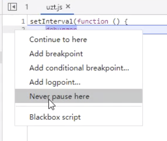
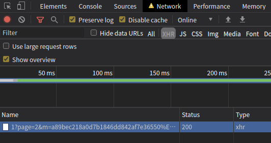
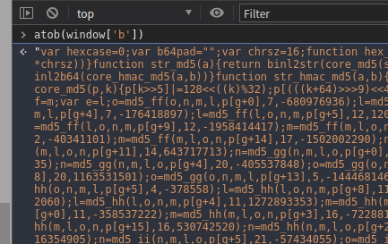

## 题目1：抓取所有（5页）机票的价格，并计算所有机票价格的平均值，填入答案。

地址： https://match.yuanrenxue.com/match/1

进入页面打开f12发现无限 debugger

    setInterval(function () {
        debugger
    }, 500)
    
这里直接可以禁止直接这段代码

    浏览器--》右键--》never pause here
    
更多其他过 debugger 方法

    https://www.jianshu.com/p/e69b68b71b77
    

发现请求地址xhr，返回的内容有

    {status: "1", state: "success",…}
    data: [{value: 2366}, {value: 2108}, {value: 6159}, {value: 5685}, {value: 2010}, {value: 7109},…]
    0: {value: 2366}
    1: {value: 2108}
    2: {value: 6159}
    3: {value: 5685}
    4: {value: 2010}
    5: {value: 7109}
    6: {value: 1002}
    7: {value: 9300}
    8: {value: 8995}
    9: {value: 5732}
    state: "success"
    status: "1"

尝试 xhr 断点调试

通过技术栈锁定了 request

    window['\x75\x72\x6c'] = '\x2f\x61\x70\x69\x2f' + '\x6d\x61\x74\x63\x68' + '\x2f\x31',
    request = function() {
        var _0x2268f9 = Date['\x70\x61\x72\x73\x65'](new Date()) + (16798545 + -72936737 + 156138192)
          , _0x57feae = oo0O0(_0x2268f9['\x74\x6f\x53\x74\x72' + '\x69\x6e\x67']()) + window['\x66'];
        const _0x5d83a3 = {};
        _0x5d83a3['\x70\x61\x67\x65'] = window['\x70\x61\x67\x65'],
        _0x5d83a3['\x6d'] = _0x57feae + '\u4e28' + _0x2268f9 / (-1 * 3483 + -9059 + 13542);
        var _0xb89747 = _0x5d83a3;
        $['\x61\x6a\x61\x78']({
            '\x75\x72\x6c': window['\x75\x72\x6c'],
            '\x64\x61\x74\x61\x54\x79\x70\x65': '\x6a\x73\x6f\x6e',
            '\x61\x73\x79\x6e\x63': ![],
            '\x64\x61\x74\x61': _0xb89747,
            '\x74\x79\x70\x65': '\x47\x45\x54',
            '\x62\x65\x66\x6f\x72\x65\x53\x65\x6e\x64': function(_0x4c488e) {},
            '\x73\x75\x63\x63\x65\x73\x73': function(_0x131e59) {
                _0x131e59 = _0x131e59['\x64\x61\x74\x61'];
                let _0x354583 = ''
                  , _0x1b89ba = '\x3c\x64\x69\x76\x20' + '\x63\x6c\x61\x73\x73' + '\x3d\x22\x62\x2d\x61' + '\x69\x72\x66\x6c\x79' + '\x22\x3e\x3c\x64\x69' + '\x76\x20\x63\x6c\x61' + '\x73\x73\x3d\x22\x65' + '\x2d\x61\x69\x72\x66' + '\x6c\x79\x22\x64\x61' + '\x74\x61\x2d\x72\x65' + '\x61\x63\x74\x69\x64' + '\x3d\x22\x2e\x31\x2e' + '\x33\x2e\x33\x2e\x32' + '\x2e\x30\x2e\x24\x4b' + '\x4e\x35\x39\x31\x31' + '\x2e\x30\x22\x3e\x3c' + '\x64\x69\x76\x20\x63' + '\x6c\x61\x73\x73\x3d' + '\x22\x63\x6f\x6c\x2d' + '\x74\x72\x69\x70\x22' + '\x64\x61\x74\x61\x2d' + '\x72\x65\x61\x63\x74' + '\x69\x64\x3d\x22\x2e' + '\x31\x2e\x33\x2e\x33' + '\x2e\x32\x2e\x30\x2e' + '\x24\x4b\x4e\x35\x39' + '\x31\x31\x2e\x30\x2e' + '\x30\x22\x3e\x3c\x64' + '\x69\x76\x20\x63\x6c' + '\x61\x73\x73\x3d\x22' + '\x73\x2d\x74\x72\x69' + '\x70\x22\x64\x61\x74' + '\x61\x2d\x72\x65\x61' + '\x63\x74\x69\x64\x3d' + '\x22\x2e\x31\x2e\x33' + '\x2e\x33\x2e\x32\x2e' + '\x30\x2e\x24\x4b\x4e' + '\x35\x39\x31\x31\x2e' + '\x30\x2e\x30\x2e\x30' + '\x22\x3e\x3c\x64\x69' + '\x76\x20\x63\x6c\x61' + '\x73\x73\x3d\x22\x63' + '\x6f\x6c\x2d\x61\x69' + '\x72\x6c\x69\x6e\x65' + '\x22\x64\x61\x74\x61' + '\x2d\x72\x65\x61\x63' + '\x74\x69\x64\x3d\x22' + '\x2e\x31\x2e\x33\x2e' + '\x33\x2e\x32\x2e\x30' + '\x2e\x24\x4b\x4e\x35' + '\x39\x31\x31\x2e\x30' + '\x2e\x30\x2e\x30\x2e' + '\x30\x22\x3e\x3c\x64' + '\x69\x76\x20\x63\x6c' + '\x61\x73\x73\x3d\x22' + '\x64\x2d\x61\x69\x72' + '\x22\x64\x61\x74\x61' + '\x2d\x72\x65\x61\x63' + '\x74\x69\x64\x3d\x22' + '\x2e\x31\x2e\x33\x2e' + '\x33\x2e\x32\x2e\x30' + '\x2e\x24\x4b\x4e\x35' + '\x39\x31\x31\x2e\x30' + '\x2e\x30\x2e\x30\x2e' + '\x30\x2e\x30\x3a\x24' + '\x30\x22\x3e\x3c\x64' + '\x69\x76\x20\x63\x6c' + '\x61\x73\x73\x3d\x22' + '\x61\x69\x72\x22\x64' + '\x61\x74\x61\x2d\x72' + '\x65\x61\x63\x74\x69' + '\x64\x3d\x22\x2e\x31' + '\x2e\x33\x2e\x33\x2e' + '\x32\x2e\x30\x2e\x24' + '\x4b\x4e\x35\x39\x31' + '\x31\x2e\x30\x2e\x30' + '\x2e\x30\x2e\x30\x2e' + '\x30\x3a\x24\x30\x2e' + '\x30\x22\x3e\x3c\x73' + '\x70\x61\x6e\x20\x64' + '\x61\x74\x61\x2d\x72' + '\x65\x61\x63\x74\x69' + '\x64\x3d\x22\x2e\x31' + '\x2e\x33\x2e\x33\x2e' + '\x32\x2e\x30\x2e\x24' + '\x4b\x4e\x35\x39\x31' + '\x31\x2e\x30\x2e\x30' + '\x2e\x30\x2e\x30\x2e' + '\x30\x3a\x24\x30\x2e' + '\x30\x2e\x31\x22\x3e' + '\u4e2d\u56fd\u8054\u5408\u822a' + '\u7a7a\x3c\x2f\x73\x70' + '\x61\x6e\x3e\x3c\x2f' + '\x64\x69\x76\x3e\x3c' + '\x64\x69\x76\x20\x63' + '\x6c\x61\x73\x73\x3d' + '\x22\x6e\x75\x6d\x22' + '\x64\x61\x74\x61\x2d' + '\x72\x65\x61\x63\x74' + '\x69\x64\x3d\x22\x2e' + '\x31\x2e\x33\x2e\x33' + '\x2e\x32\x2e\x30\x2e' + '\x24\x4b\x4e\x35\x39' + '\x31\x31\x2e\x30\x2e' + '\x30\x2e\x30\x2e\x30' + '\x2e\x30\x3a\x24\x30' + '\x2e\x31\x22\x3e\x3c' + '\x73\x70\x61\x6e\x20' + '\x63\x6c\x61\x73\x73' + '\x3d\x22\x6e\x22\x64' + '\x61\x74\x61\x2d\x72' + '\x65\x61\x63\x74\x69' + '\x64\x3d\x22\x2e\x31' + '\x2e\x33\x2e\x33\x2e' + '\x32\x2e\x30\x2e\x24' + '\x4b\x4e\x35\x39\x31' + '\x31\x2e\x30\x2e\x30' + '\x2e\x30\x2e\x30\x2e' + '\x30\x3a\x24\x30\x2e' + '\x31\x2e\x30\x22\x3e' + '\x4b\x4e\x35\x39\x31' + '\x31\x3c\x2f\x73\x70' + '\x61\x6e\x3e\x3c\x73' + '\x70\x61\x6e\x20\x63' + '\x6c\x61\x73\x73\x3d' + '\x22\x6e\x22\x64\x61' + '\x74\x61\x2d\x72\x65' + '\x61\x63\x74\x69\x64' + '\x3d\x22\x2e\x31\x2e' + '\x33\x2e\x33\x2e\x32' + '\x2e\x30\x2e\x24\x4b' + '\x4e\x35\x39\x31\x31' + '\x2e\x30\x2e\x30\x2e' + '\x30\x2e\x30\x2e\x30' + '\x3a\x24\x30\x2e\x31' + '\x2e\x31\x22\x3e\u6ce2' + '\u97f3\x37\x33\x37\x28' + '\u4e2d\x29\x3c\x2f\x73' + '\x70\x61\x6e\x3e\x3c' + '\x6e\x6f\x73\x63\x72' + '\x69\x70\x74\x20\x64' + '\x61\x74\x61\x2d\x72' + '\x65\x61\x63\x74\x69' + '\x64\x3d\x22\x2e\x31' + '\x2e\x33\x2e\x33\x2e' + '\x32\x2e\x30\x2e\x24' + '\x4b\x4e\x35\x39\x31' + '\x31\x2e\x30\x2e\x30' + '\x2e\x30\x2e\x30\x2e' + '\x30\x3a\x24\x30\x2e' + '\x31\x2e\x32\x22\x3e' + '\x3c\x2f\x6e\x6f\x73' + '\x63\x72\x69\x70\x74' + '\x3e\x3c\x2f\x64\x69' + '\x76\x3e\x3c\x2f\x64' + '\x69\x76\x3e\x3c\x6e' + '\x6f\x73\x63\x72\x69' + '\x70\x74\x20\x64\x61' + '\x74\x61\x2d\x72\x65' + '\x61\x63\x74\x69\x64' + '\x3d\x22\x2e\x31\x2e' + '\x33\x2e\x33\x2e\x32' + '\x2e\x30\x2e\x24\x4b' + '\x4e\x35\x39\x31\x31' + '\x2e\x30\x2e\x30\x2e' + '\x30\x2e\x30\x2e\x31' + '\x22\x3e\x3c\x2f\x6e' + '\x6f\x73\x63\x72\x69' + '\x70\x74\x3e\x3c\x2f' + '\x64\x69\x76\x3e\x3c' + '\x64\x69\x76\x20\x63' + '\x6c\x61\x73\x73\x3d' + '\x22\x63\x6f\x6c\x2d' + '\x74\x69\x6d\x65\x22' + '\x64\x61\x74\x61\x2d' + '\x72\x65\x61\x63\x74' + '\x69\x64\x3d\x22\x2e' + '\x31\x2e\x33\x2e\x33' + '\x2e\x32\x2e\x30\x2e' + '\x24\x4b\x4e\x35\x39' + '\x31\x31\x2e\x30\x2e' + '\x30\x2e\x30\x2e\x31' + '\x22\x3e\x3c\x64\x69' + '\x76\x20\x63\x6c\x61' + '\x73\x73\x3d\x22\x73' + '\x65\x70\x2d\x6c\x66' + '\x22\x64\x61\x74\x61' + '\x2d\x72\x65\x61\x63' + '\x74\x69\x64\x3d\x22' + '\x2e\x31\x2e\x33\x2e' + '\x33\x2e\x32\x2e\x30' + '\x2e\x24\x4b\x4e\x35' + '\x39\x31\x31\x2e\x30' + '\x2e\x30\x2e\x30\x2e' + '\x31\x2e\x30\x22\x3e' + '\x3c\x68\x32\x20\x64' + '\x61\x74\x61\x2d\x72' + '\x65\x61\x63\x74\x69' + '\x64\x3d\x22\x2e\x31' + '\x2e\x33\x2e\x33\x2e' + ('\x32\x2e\x30\x2e\x24' + '\x4b\x4e\x35\x39\x31' + '\x31\x2e\x30\x2e\x30' + '\x2e\x30\x2e\x31\x2e' + '\x30\x2e\x30\x22\x3e' + '\x31\x33\x3a\x35\x30' + '\x3c\x2f\x68\x32\x3e' + '\x3c\x70\x20\x63\x6c' + '\x61\x73\x73\x3d\x22' + '\x61\x69\x72\x70\x6f' + '\x72\x74\x22\x64\x61' + '\x74\x61\x2d\x72\x65' + '\x61\x63\x74\x69\x64' + '\x3d\x22\x2e\x31\x2e' + '\x33\x2e\x33\x2e\x32' + '\x2e\x30\x2e\x24\x4b' + '\x4e\x35\x39\x31\x31' + '\x2e\x30\x2e\x30\x2e' + '\x30\x2e\x31\x2e\x30' + '\x2e\x31\x22\x3e\x3c' + '\x73\x70\x61\x6e\x20' + '\x64\x61\x74\x61\x2d' + '\x72\x65\x61\x63\x74' + '\x69\x64\x3d\x22\x2e' + '\x31\x2e\x33\x2e\x33' + '\x2e\x32\x2e\x30\x2e' + '\x24\x4b\x4e\x35\x39' + '\x31\x31\x2e\x30\x2e' + '\x30\x2e\x30\x2e\x31' + '\x2e\x30\x2e\x31\x2e' + '\x30\x22\x3e\u5927\u5174' + '\u56fd\u9645\u673a\u573a\x3c' + '\x2f\x73\x70\x61\x6e' + '\x3e\x3c\x73\x70\x61' + '\x6e\x20\x64\x61\x74' + '\x61\x2d\x72\x65\x61' + '\x63\x74\x69\x64\x3d' + '\x22\x2e\x31\x2e\x33' + '\x2e\x33\x2e\x32\x2e' + '\x30\x2e\x24\x4b\x4e' + '\x35\x39\x31\x31\x2e' + '\x30\x2e\x30\x2e\x30' + '\x2e\x31\x2e\x30\x2e' + '\x31\x2e\x31\x22\x3e' + '\x3c\x2f\x73\x70\x61' + '\x6e\x3e\x3c\x2f\x70' + '\x3e\x3c\x2f\x64\x69' + '\x76\x3e\x3c\x64\x69' + '\x76\x20\x63\x6c\x61' + '\x73\x73\x3d\x22\x73' + '\x65\x70\x2d\x63\x74' + '\x22\x64\x61\x74\x61' + '\x2d\x72\x65\x61\x63' + '\x74\x69\x64\x3d\x22' + '\x2e\x31\x2e\x33\x2e' + '\x33\x2e\x32\x2e\x30' + '\x2e\x24\x4b\x4e\x35' + '\x39\x31\x31\x2e\x30' + '\x2e\x30\x2e\x30\x2e' + '\x31\x2e\x31\x22\x3e' + '\x3c\x64\x69\x76\x20' + '\x63\x6c\x61\x73\x73' + '\x3d\x22\x72\x61\x6e' + '\x67\x65\x22\x64\x61' + '\x74\x61\x2d\x72\x65' + '\x61\x63\x74\x69\x64' + '\x3d\x22\x2e\x31\x2e' + '\x33\x2e\x33\x2e\x32' + '\x2e\x30\x2e\x24\x4b' + '\x4e\x35\x39\x31\x31' + '\x2e\x30\x2e\x30\x2e' + '\x30\x2e\x31\x2e\x31' + '\x2e\x30\x22\x3e\x33' + '\u5c0f\u65f6\x34\x30\u5206' + '\u949f\x3c\x2f\x64\x69' + '\x76\x3e\x3c\x64\x69' + '\x76\x20\x63\x6c\x61' + '\x73\x73\x3d\x22\x6c' + '\x69\x6e\x65\x22\x64' + '\x61\x74\x61\x2d\x72' + '\x65\x61\x63\x74\x69' + '\x64\x3d\x22\x2e\x31' + '\x2e\x33\x2e\x33\x2e' + '\x32\x2e\x30\x2e\x24' + '\x4b\x4e\x35\x39\x31' + '\x31\x2e\x30\x2e\x30' + '\x2e\x30\x2e\x31\x2e' + '\x31\x2e\x31\x22\x3e' + '\x3c\x2f\x64\x69\x76' + '\x3e\x3c\x2f\x64\x69' + '\x76\x3e\x3c\x64\x69' + '\x76\x20\x63\x6c\x61' + '\x73\x73\x3d\x22\x73' + '\x65\x70\x2d\x72\x74' + '\x22\x64\x61\x74\x61' + '\x2d\x72\x65\x61\x63' + '\x74\x69\x64\x3d\x22' + '\x2e\x31\x2e\x33\x2e' + '\x33\x2e\x32\x2e\x30' + '\x2e\x24\x4b\x4e\x35' + '\x39\x31\x31\x2e\x30' + '\x2e\x30\x2e\x30\x2e' + '\x31\x2e\x32\x22\x3e' + '\x3c\x6e\x6f\x73\x63' + '\x72\x69\x70\x74\x20' + '\x64\x61\x74\x61\x2d' + '\x72\x65\x61\x63\x74' + '\x69\x64\x3d\x22\x2e' + '\x31\x2e\x33\x2e\x33' + '\x2e\x32\x2e\x30\x2e' + '\x24\x4b\x4e\x35\x39' + '\x31\x31\x2e\x30\x2e' + '\x30\x2e\x30\x2e\x31' + '\x2e\x32\x2e\x30\x22' + '\x3e\x3c\x2f\x6e\x6f' + '\x73\x63\x72\x69\x70' + '\x74\x3e\x3c\x68\x32' + '\x20\x64\x61\x74\x61' + '\x2d\x72\x65\x61\x63' + '\x74\x69\x64\x3d\x22' + '\x2e\x31\x2e\x33\x2e' + '\x33\x2e\x32\x2e\x30' + '\x2e\x24\x4b\x4e\x35' + '\x39\x31\x31\x2e\x30' + '\x2e\x30\x2e\x30\x2e' + '\x31\x2e\x32\x2e\x31' + '\x22\x3e\x31\x37\x3a' + '\x33\x30\x3c\x2f\x68' + '\x32\x3e\x3c\x70\x20' + '\x63\x6c\x61\x73\x73' + '\x3d\x22\x61\x69\x72' + '\x70\x6f\x72\x74\x22' + '\x64\x61\x74\x61\x2d' + '\x72\x65\x61\x63\x74' + '\x69\x64\x3d\x22\x2e' + '\x31\x2e\x33\x2e\x33' + '\x2e\x32\x2e\x30\x2e' + '\x24\x4b\x4e\x35\x39' + '\x31\x31\x2e\x30\x2e' + '\x30\x2e\x30\x2e\x31' + '\x2e\x32\x2e\x32\x22' + '\x3e\x3c\x73\x70\x61' + '\x6e\x20\x64\x61\x74' + '\x61\x2d\x72\x65\x61' + '\x63\x74\x69\x64\x3d' + '\x22\x2e\x31\x2e\x33' + '\x2e\x33\x2e\x32\x2e' + '\x30\x2e\x24\x4b\x4e' + '\x35\x39\x31\x31\x2e' + '\x30\x2e\x30\x2e\x30' + '\x2e\x31\x2e\x32\x2e' + '\x32\x2e\x30\x22\x3e' + '\u5b9d\u5b89\u673a\u573a\x3c' + '\x2f\x73\x70\x61\x6e' + '\x3e\x3c\x2f\x70\x3e' + '\x3c\x2f\x64\x69\x76' + '\x3e\x3c\x6e\x6f\x73' + '\x63\x72\x69\x70\x74' + '\x20\x64\x61\x74\x61' + '\x2d\x72\x65\x61\x63' + '\x74\x69\x64\x3d\x22' + '\x2e\x31\x2e\x33\x2e' + '\x33\x2e\x32\x2e\x30' + '\x2e\x24\x4b\x4e\x35' + '\x39\x31\x31\x2e\x30' + '\x2e\x30\x2e\x30\x2e' + '\x31\x2e\x33\x22\x3e' + '\x3c\x2f\x6e\x6f\x73' + '\x63\x72\x69\x70\x74' + '\x3e\x3c\x2f\x64\x69' + '\x76\x3e\x3c\x2f\x64' + '\x69\x76\x3e\x3c\x2f' + '\x64\x69\x76\x3e\x3c' + '\x64\x69\x76\x20\x63' + '\x6c\x61\x73\x73\x3d' + '\x22\x63\x6f\x6c\x2d' + '\x70\x72\x69\x63\x65' + '\x22\x64\x61\x74\x61' + '\x2d\x72\x65\x61\x63' + '\x74\x69\x64\x3d\x22' + '\x2e\x31\x2e\x33\x2e' + '\x33\x2e\x32\x2e\x30' + '\x2e\x24\x4b\x4e\x35' + '\x39\x31\x31\x2e\x30' + '\x2e\x31\x22\x3e\x3c' + '\x70\x20\x63\x6c\x61' + '\x73\x73\x3d\x22\x70' + '\x72\x63\x22\x64\x61' + '\x74\x61\x2d\x72\x65' + '\x61\x63\x74\x69\x64' + '\x3d\x22\x2e\x31\x2e' + '\x33\x2e\x33\x2e\x32' + '\x2e\x30\x2e\x24\x4b' + '\x4e\x35\x39\x31\x31' + '\x2e\x30\x2e\x31\x2e' + '\x30\x22\x3e\x3c\x73' + '\x70\x61\x6e\x20\x64' + '\x61\x74\x61\x2d\x72' + '\x65\x61\x63\x74\x69' + '\x64\x3d\x22\x2e\x31') + ('\x2e\x33\x2e\x33\x2e' + '\x32\x2e\x30\x2e\x24' + '\x4b\x4e\x35\x39\x31' + '\x31\x2e\x30\x2e\x31' + '\x2e\x30\x2e\x30\x22' + '\x3e\x3c\x69\x20\x63' + '\x6c\x61\x73\x73\x3d' + '\x22\x72\x6d\x62\x22' + '\x64\x61\x74\x61\x2d' + '\x72\x65\x61\x63\x74' + '\x69\x64\x3d\x22\x2e' + '\x31\x2e\x33\x2e\x33' + '\x2e\x32\x2e\x30\x2e' + '\x24\x4b\x4e\x35\x39' + '\x31\x31\x2e\x30\x2e' + '\x31\x2e\x30\x2e\x30' + '\x2e\x30\x22\x3e\x26' + '\x79\x65\x6e\x3b\x3c' + '\x2f\x69\x3e\x3c\x73' + '\x70\x61\x6e\x20\x63' + '\x6c\x61\x73\x73\x3d' + '\x22\x66\x69\x78\x5f' + '\x70\x72\x69\x63\x65' + '\x22\x64\x61\x74\x61' + '\x2d\x72\x65\x61\x63' + '\x74\x69\x64\x3d\x22' + '\x2e\x31\x2e\x33\x2e' + '\x33\x2e\x32\x2e\x30' + '\x2e\x24\x4b\x4e\x35' + '\x39\x31\x31\x2e\x30' + '\x2e\x31\x2e\x30\x2e' + '\x30\x2e\x31\x22\x3e' + '\x3c\x73\x70\x61\x6e' + '\x20\x63\x6c\x61\x73' + '\x73\x3d\x22\x70\x72' + '\x63\x5f\x77\x70\x22' + '\x73\x74\x79\x6c\x65' + '\x3d\x22\x77\x69\x64' + '\x74\x68\x3a\x34\x38' + '\x70\x78\x22\x3e\x70' + '\x72\x69\x63\x65\x5f' + '\x73\x6f\x6c\x65\x3c' + '\x2f\x73\x70\x61\x6e' + '\x3e\x3c\x2f\x73\x70' + '\x61\x6e\x3e\x3c\x2f' + '\x73\x70\x61\x6e\x3e' + '\x3c\x2f\x70\x3e\x3c' + '\x64\x69\x76\x20\x63' + '\x6c\x61\x73\x73\x3d' + '\x22\x76\x69\x6d\x22' + '\x64\x61\x74\x61\x2d' + '\x72\x65\x61\x63\x74' + '\x69\x64\x3d\x22\x2e' + '\x31\x2e\x33\x2e\x33' + '\x2e\x32\x2e\x30\x2e' + '\x24\x4b\x4e\x35\x39' + '\x31\x31\x2e\x30\x2e' + '\x31\x2e\x31\x22\x3e' + '\x3c\x73\x70\x61\x6e' + '\x20\x63\x6c\x61\x73' + '\x73\x3d\x22\x76\x20' + '\x64\x69\x73\x22\x64' + '\x61\x74\x61\x2d\x72' + '\x65\x61\x63\x74\x69' + '\x64\x3d\x22\x2e\x31' + '\x2e\x33\x2e\x33\x2e' + '\x32\x2e\x30\x2e\x24' + '\x4b\x4e\x35\x39\x31' + '\x31\x2e\x30\x2e\x31' + '\x2e\x31\x2e\x24\x30' + '\x22\x3e\x3c\x2f\x73' + '\x70\x61\x6e\x3e\x3c' + '\x2f\x64\x69\x76\x3e' + '\x3c\x2f\x64\x69\x76' + '\x3e\x3c\x64\x69\x76' + '\x20\x63\x6c\x61\x73' + '\x73\x3d\x22\x63\x6f' + '\x6c\x2d\x66\x6f\x6c' + '\x64\x22\x64\x61\x74' + '\x61\x2d\x72\x65\x61' + '\x63\x74\x69\x64\x3d' + '\x22\x2e\x31\x2e\x33' + '\x2e\x33\x2e\x32\x2e' + '\x30\x2e\x24\x4b\x4e' + '\x35\x39\x31\x31\x2e' + '\x30\x2e\x32\x22\x3e' + '\x3c\x70\x20\x63\x6c' + '\x61\x73\x73\x3d\x22' + '\x66\x64\x22\x64\x61' + '\x74\x61\x2d\x72\x65' + '\x61\x63\x74\x69\x64' + '\x3d\x22\x2e\x31\x2e' + '\x33\x2e\x33\x2e\x32' + '\x2e\x30\x2e\x24\x4b' + '\x4e\x35\x39\x31\x31' + '\x2e\x30\x2e\x32\x2e' + '\x30\x22\x3e\u6536\u8d77' + '\x3c\x2f\x70\x3e\x3c' + '\x2f\x64\x69\x76\x3e' + '\x3c\x2f\x64\x69\x76' + '\x3e\x3c\x6e\x6f\x73' + '\x63\x72\x69\x70\x74' + '\x20\x64\x61\x74\x61' + '\x2d\x72\x65\x61\x63' + '\x74\x69\x64\x3d\x22' + '\x2e\x31\x2e\x33\x2e' + '\x33\x2e\x32\x2e\x30' + '\x2e\x24\x4b\x4e\x35' + '\x39\x31\x31\x2e\x31' + '\x22\x3e\x3c\x2f\x6e' + '\x6f\x73\x63\x72\x69' + '\x70\x74\x3e\x3c\x2f' + '\x64\x69\x76\x3e')
                  , _0x548377 = ['\u4e2d\u56fd\u5357\u65b9\u822a' + '\u7a7a', '\u5409\u7965\u822a\u7a7a', '\u5965\u51ef\u822a\u7a7a', '\u4e5d\u5143\u822a\u7a7a', '\u957f\u9f99\u822a\u7a7a', '\u4e1c\u65b9\u822a\u7a7a', '\u4e2d\u56fd\u56fd\u9645\u822a' + '\u7a7a', '\u6df1\u5733\u822a\u7a7a', '\u6d77\u5357\u822a\u7a7a', '\u6625\u79cb\u822a\u7a7a', '\u4e0a\u6d77\u822a\u7a7a', '\u897f\u90e8\u822a\u7a7a', '\u91cd\u5e86\u822a\u7a7a', '\u897f\u85cf\u822a\u7a7a', '\u4e2d\u56fd\u8054\u5408\u822a' + '\u7a7a', '\u4e91\u5357\u7965\u9e4f\u822a' + '\u7a7a', '\u4e91\u5357\u82f1\u5b89\u822a' + '\u7a7a', '\u53a6\u95e8\u822a\u7a7a', '\u5929\u6d25\u822a\u7a7a', '\u5c71\u4e1c\u822a\u7a7a', '\u56db\u5ddd\u822a\u7a7a', '\u534e\u590f\u822a\u7a7a', '\u957f\u57ce\u822a\u7a7a', '\u6210\u90fd\u822a\u7a7a\u6709', '\u5317\u4eac\u9996\u90fd\u822a' + '\u7a7a', '\u4e2d\u534e\u822a\u7a7a', '\u610f\u5927\u5229\u56fd\u5bb6' + '\u822a\u7a7a\u516c\u53f8', '\u5370\u5ea6\u767e\u6377\u822a' + '\u7a7a', '\u8d8a\u5357\u822a\u7a7a', '\u8fdc\u4e1c\u822a\u7a7a', '\u5370\u5ea6\u822a\u7a7a\u516c' + '\u53f8', '\u5370\u5ea6\u6377\u7279\u822a' + '\u7a7a\u6709\u9650\u516c\u53f8', '\u4ee5\u8272\u5217\u822a\u7a7a' + '\u516c\u53f8', '\u610f\u5927\u5229\u822a\u7a7a', '\u4f0a\u6717\u822a\u7a7a\u516c' + '\u53f8', '\u5370\u5ea6\u5c3c\u897f\u4e9a' + '\u9e70\u822a\u7a7a\u516c\u53f8', '\u82f1\u56fd\u822a\u7a7a\u516c' + '\u53f8', '\u897f\u65b9\u5929\u7a7a\u822a' + '\u7a7a', '\u897f\u6377\u822a\u7a7a', '\u897f\u73ed\u7259\u6b27\u6d32' + '\u822a\u7a7a\u516c\u53f8', '\u897f\u73ed\u7259\u822a\u7a7a' + '\u516c\u53f8', '\u4e2d\u56fd\u5357\u65b9\u822a' + '\u7a7a', '\u5409\u7965\u822a\u7a7a', '\u5965\u51ef\u822a\u7a7a', '\u4e5d\u5143\u822a\u7a7a', '\u957f\u9f99\u822a\u7a7a', '\u4e1c\u65b9\u822a\u7a7a', '\u4e2d\u56fd\u56fd\u9645\u822a' + '\u7a7a', '\u6df1\u5733\u822a\u7a7a', '\u6d77\u5357\u822a\u7a7a', '\u6625\u79cb\u822a\u7a7a', '\u4e0a\u6d77\u822a\u7a7a', '\u897f\u90e8\u822a\u7a7a', '\u91cd\u5e86\u822a\u7a7a', '\u897f\u85cf\u822a\u7a7a', '\u4e2d\u56fd\u8054\u5408\u822a' + '\u7a7a', '\u4e91\u5357\u7965\u9e4f\u822a' + '\u7a7a', '\u4e91\u5357\u82f1\u5b89\u822a' + '\u7a7a', '\u53a6\u95e8\u822a\u7a7a', '\u5929\u6d25\u822a\u7a7a', '\u5c71\u4e1c\u822a\u7a7a', '\u56db\u5ddd\u822a\u7a7a', '\u534e\u590f\u822a\u7a7a', '\u957f\u57ce\u822a\u7a7a', '\u6210\u90fd\u822a\u7a7a\u6709', '\u5317\u4eac\u9996\u90fd\u822a' + '\u7a7a', '\u4e2d\u534e\u822a\u7a7a', '\u610f\u5927\u5229\u56fd\u5bb6' + '\u822a\u7a7a\u516c\u53f8', '\u5370\u5ea6\u767e\u6377\u822a' + '\u7a7a', '\u8d8a\u5357\u822a\u7a7a', '\u8fdc\u4e1c\u822a\u7a7a', '\u5370\u5ea6\u822a\u7a7a\u516c' + '\u53f8', '\u5370\u5ea6\u6377\u7279\u822a' + '\u7a7a\u6709\u9650\u516c\u53f8', '\u4ee5\u8272\u5217\u822a\u7a7a' + '\u516c\u53f8', '\u610f\u5927\u5229\u822a\u7a7a', '\u4f0a\u6717\u822a\u7a7a\u516c' + '\u53f8', '\u5370\u5ea6\u5c3c\u897f\u4e9a' + '\u9e70\u822a\u7a7a\u516c\u53f8', '\u82f1\u56fd\u822a\u7a7a\u516c' + '\u53f8', '\u897f\u65b9\u5929\u7a7a\u822a' + '\u7a7a', '\u897f\u6377\u822a\u7a7a', '\u897f\u73ed\u7259\u6b27\u6d32' + '\u822a\u7a7a\u516c\u53f8', '\u897f\u73ed\u7259\u822a\u7a7a' + '\u516c\u53f8']
                  , _0x5286d2 = 22 * 251 + -1721 + -3800
                  , _0xa24ff9 = ['\u5317\u4eac\u9996\u90fd\u56fd' + '\u9645\u673a\u573a', '\u4e0a\u6d77\u8679\u6865\u56fd' + '\u9645\u673a\u573a', '\u4e0a\u6d77\u6d66\u4e1c\u56fd' + '\u9645\u673a\u573a', '\u5929\u6d25\u6ee8\u6d77\u56fd' + '\u9645\u673a\u573a', '\u592a\u539f\u6b66\u5bbf\u673a' + '\u573a', '\u547c\u548c\u6d69\u7279\u767d' + '\u5854\u673a\u573a', '\u6c88\u9633\u6843\u4ed9\u56fd' + '\u9645\u673a\u573a', '\u5927\u8fde\u5468\u6c34\u5b50' + '\u56fd\u9645\u673a\u573a', '\u957f\u6625\u5927\u623f\u8eab' + '\u673a\u573a', '\u54c8\u5c14\u6ee8\u960e\u5bb6' + '\u5c97\u56fd\u9645\u673a\u573a', '\u9f50\u9f50\u54c8\u5c14\u4e09' + '\u5bb6\u5b50\u673a\u573a', '\u4f73\u6728\u65af\u4e1c\u90ca' + '\u673a\u573a', '\u53a6\u95e8\u9ad8\u5d0e\u56fd' + '\u9645\u673a\u573a', '\u798f\u5dde\u957f\u4e50\u56fd' + '\u9645\u673a\u573a', '\u676d\u5dde\u8427\u5c71\u56fd' + '\u9645\u673a\u573a', '\u5408\u80a5\u9a86\u5c97\u673a' + '\u573a', '\u5b81\u6ce2\u680e\u793e\u673a' + '\u573a', '\u5357\u4eac\u7984\u53e3\u56fd' + '\u9645\u673a\u573a', '\u5e7f\u5dde\u767d\u4e91\u56fd' + '\u9645\u673a\u573a', '\u6df1\u5733\u5b9d\u5b89\u56fd' + '\u9645\u673a\u573a', '\u957f\u6c99\u9ec4\u82b1\u673a' + '\u573a', '\u6d77\u53e3\u7f8e\u4e9a\u673a' + '\u573a', '\u6b66\u6c49\u5929\u6cb3\u673a' + '\u573a', '\u6d4e\u5357\u9065\u5899\u673a' + '\u573a', '\u9752\u5c9b\u6d41\u4ead\u673a' + '\u573a', '\u5357\u5b81\u5434\u589f\u673a' + '\u573a', '\u4e09\u4e9a\u51e4\u51f0\u56fd' + '\u9645\u673a\u573a', '\u91cd\u5e86\u6c5f\u5317\u56fd' + '\u9645\u673a\u573a', '\u6210\u90fd\u53cc\u6d41\u56fd' + '\u9645\u673a\u573a', '\u6606\u660e\u5deb\u5bb6\u575d' + '\u56fd\u9645\u673a\u573a', '\u6606\u660e\u957f\u6c34\u56fd' + '\u9645\u673a\u573a', '\u6842\u6797\u4e24\u6c5f\u56fd' + '\u9645\u673a\u573a', '\u897f\u5b89\u54b8\u9633\u56fd' + '\u9645\u673a\u573a', '\u5170\u5dde\u4e2d\u5ddd\u673a' + '\u573a', '\u8d35\u9633\u9f99\u6d1e\u5821' + '\u673a\u573a', '\u62c9\u8428\u8d21\u560e\u673a' + '\u573a', '\u4e4c\u9c81\u6728\u9f50\u5730' + '\u7a9d\u5821\u673a\u573a', '\u5357\u660c\u5411\u5858\u673a' + '\u573a', '\u90d1\u5dde\u65b0\u90d1\u673a' + '\u573a', '\u5317\u4eac\u9996\u90fd\u56fd' + '\u9645\u673a\u573a', '\u4e0a\u6d77\u8679\u6865\u56fd' + '\u9645\u673a\u573a', '\u4e0a\u6d77\u6d66\u4e1c\u56fd' + '\u9645\u673a\u573a', '\u5929\u6d25\u6ee8\u6d77\u56fd' + '\u9645\u673a\u573a', '\u592a\u539f\u6b66\u5bbf\u673a' + '\u573a', '\u547c\u548c\u6d69\u7279\u767d' + '\u5854\u673a\u573a', '\u6c88\u9633\u6843\u4ed9\u56fd' + '\u9645\u673a\u573a', '\u5927\u8fde\u5468\u6c34\u5b50' + '\u56fd\u9645\u673a\u573a', '\u957f\u6625\u5927\u623f\u8eab' + '\u673a\u573a', '\u54c8\u5c14\u6ee8\u960e\u5bb6' + '\u5c97\u56fd\u9645\u673a\u573a', '\u9f50\u9f50\u54c8\u5c14\u4e09' + '\u5bb6\u5b50\u673a\u573a', '\u4f73\u6728\u65af\u4e1c\u90ca' + '\u673a\u573a', '\u53a6\u95e8\u9ad8\u5d0e\u56fd' + '\u9645\u673a\u573a', '\u798f\u5dde\u957f\u4e50\u56fd' + '\u9645\u673a\u573a', '\u676d\u5dde\u8427\u5c71\u56fd' + '\u9645\u673a\u573a', '\u5408\u80a5\u9a86\u5c97\u673a' + '\u573a', '\u5b81\u6ce2\u680e\u793e\u673a' + '\u573a', '\u5357\u4eac\u7984\u53e3\u56fd' + '\u9645\u673a\u573a', '\u5e7f\u5dde\u767d\u4e91\u56fd' + '\u9645\u673a\u573a', '\u6df1\u5733\u5b9d\u5b89\u56fd' + '\u9645\u673a\u573a', '\u957f\u6c99\u9ec4\u82b1\u673a' + '\u573a', '\u6d77\u53e3\u7f8e\u4e9a\u673a' + '\u573a', '\u6b66\u6c49\u5929\u6cb3\u673a' + '\u573a', '\u6d4e\u5357\u9065\u5899\u673a' + '\u573a', '\u9752\u5c9b\u6d41\u4ead\u673a' + '\u573a', '\u5357\u5b81\u5434\u589f\u673a' + '\u573a', '\u4e09\u4e9a\u51e4\u51f0\u56fd' + '\u9645\u673a\u573a', '\u91cd\u5e86\u6c5f\u5317\u56fd' + '\u9645\u673a\u573a', '\u6210\u90fd\u53cc\u6d41\u56fd' + '\u9645\u673a\u573a', '\u6606\u660e\u5deb\u5bb6\u575d' + '\u56fd\u9645\u673a\u573a', '\u6606\u660e\u957f\u6c34\u56fd' + '\u9645\u673a\u573a', '\u6842\u6797\u4e24\u6c5f\u56fd' + '\u9645\u673a\u573a', '\u897f\u5b89\u54b8\u9633\u56fd' + '\u9645\u673a\u573a', '\u5170\u5dde\u4e2d\u5ddd\u673a' + '\u573a', '\u8d35\u9633\u9f99\u6d1e\u5821' + '\u673a\u573a', '\u62c9\u8428\u8d21\u560e\u673a' + '\u573a', '\u4e4c\u9c81\u6728\u9f50\u5730' + '\u7a9d\u5821\u673a\u573a', '\u5357\u660c\u5411\u5858\u673a' + '\u573a', '\u90d1\u5dde\u65b0\u90d1\u673a' + '\u573a'];
                if (window['\x70\x61\x67\x65']) {} else
                    window['\x70\x61\x67\x65'] = 2333 * 3 + 458 * -5 + -4708;
                $['\x65\x61\x63\x68'](_0x131e59, function(_0x282f1d, _0x4e0853) {
                    _0x354583 += _0x1b89ba['\x72\x65\x70\x6c\x61' + '\x63\x65']('\x70\x72\x69\x63\x65' + '\x5f\x73\x6f\x6c\x65', _0x4e0853['\x76\x61\x6c\x75\x65'])['\x72\x65\x70\x6c\x61' + '\x63\x65']('\u4e2d\u56fd\u8054\u5408\u822a' + '\u7a7a', _0x548377[_0x5286d2 * window['\x70\x61\x67\x65']])['\x72\x65\x70\x6c\x61' + '\x63\x65']('\u5927\u5174\u56fd\u9645', _0xa24ff9[parseInt(_0x5286d2 * window['\x70\x61\x67\x65'] / (659 + 785 * -7 + 4838)) + (5666 * 1 + 2 * -4161 + 2657)])['\x72\x65\x70\x6c\x61' + '\x63\x65']('\u5b9d\u5b89\u673a\u573a', _0xa24ff9[_0xa24ff9['\x6c\x65\x6e\x67\x74' + '\x68'] - parseInt(_0x5286d2 * window['\x70\x61\x67\x65'] / (8357 + -323 * 1 + -8032)) - (350 + -9 * 295 + 2306)]),
                    _0x5286d2 += -156 * -53 + -78 * -111 + -16925;
                }),
                $('\x2e\x6d\x2d\x61\x69' + '\x72\x66\x6c\x79\x2d' + '\x6c\x73\x74')['\x74\x65\x78\x74']('')['\x61\x70\x70\x65\x6e' + '\x64'](_0x354583);
            },
            '\x63\x6f\x6d\x70\x6c\x65\x74\x65': function() {},
            '\x65\x72\x72\x6f\x72': function() {
                alert('\u6570\u636e\u62c9\u53d6\u5931' + '\u8d25\u3002\u53ef\u80fd\u662f' + '\u89e6\u53d1\u4e86\u98ce\u63a7' + '\u7cfb\u7edf\uff0c\u82e5\u60a8' + '\u662f\u6b63\u5e38\u8bbf\u95ee' + '\uff0c\u8bf7\u4f7f\u7528\u8c37' + '\u6b4c\u6d4f\u89c8\u5668\u65e0' + '\u75d5\u6a21\u5f0f\uff0c\u5e76' + '\u4e14\u6821\u51c6\u7535\u8111' + '\u7684\u7cfb\u7edf\u65f6\u95f4' + '\u91cd\u65b0\u5c1d\u8bd5'),
                alert('\u751f\u800c\u4e3a\u866b\uff0c' + '\u6211\u5f88\u62b1\u6b49\uff0c' + '\u8bf7\u5237\u65b0\u9875\u9762' + '\uff0c\u67e5\u770b\u95ee\u9898' + '\u662f\u5426\u5b58\u5728'),
                $('\x2e\x70\x61\x67\x65' + '\x2d\x6d\x65\x73\x73' + '\x61\x67\x65')['\x65\x71'](17 * -94 + 1014 + -4 * -146)['\x61\x64\x64\x43\x6c' + '\x61\x73\x73']('\x61\x63\x74\x69\x76' + '\x65'),
                $('\x2e\x70\x61\x67\x65' + '\x2d\x6d\x65\x73\x73' + '\x61\x67\x65')['\x72\x65\x6d\x6f\x76' + '\x65\x43\x6c\x61\x73' + '\x73']('\x61\x63\x74\x69\x76' + '\x65');
            }
        });
    }
    ,
    request();

打上断点发现  window['\x66'] 返回加蜜参数 "768a886a3b29a7cd454bec00c0161f7f"

搜索 window['\x66']（window['f']） 没有发现具体参数位置, 这里变量是 window ，那一定有赋值的过程

    _0x57feae = oo0O0(_0x2268f9['\x74\x6f\x53\x74\x72' + '\x69\x6e\x67']()) + window['\x66'];

上面代码中的 oo0O0(_0x2268f9['\x74\x6f\x53\x74\x72' + '\x69\x6e\x67']()) 

解码后是 oo0O0(_0x2268f9["toString"]())，_0x2268f9["toString"]() 返回是"1648906681000"

    oo0O0("1648906681000")

接下来找到 oo0O0 方法

    function oo0O0(mw) {
        window.b = '';
        for (var i = 0, len = window.a.length; i < len; i++) {
            console.log(window.a[i]);
            window.b += String[document.e + document.g](window.a[i][document.f + document.h]() - i - window.c)
        }
        var U = ['W5r5W6VdIHZcT8kU', 'WQ8CWRaxWQirAW=='];
        var J = function (o, E) {
            o = o - 0x0;
            var N = U[o];
            if (J['bSSGte'] === undefined) {
                var Y = function (w) {
                    var m = 'abcdefghijklmnopqrstuvwxyzABCDEFGHIJKLMNOPQRSTUVWXYZ0123456789+/=',
                        T = String(w)['replace'](/=+$/, '');
                    var A = '';
                    for (var C = 0x0, b, W, l = 0x0; W = T['charAt'](l++); ~W && (b = C % 0x4 ? b * 0x40 + W : W, C++ % 0x4) ? A += String['fromCharCode'](0xff & b >> (-0x2 * C & 0x6)) : 0x0) {
                        W = m['indexOf'](W)
                    }
                    return A
                };
                var t = function (w, m) {
                    var T = [], A = 0x0, C, b = '', W = '';
                    w = Y(w);
                    for (var R = 0x0, v = w['length']; R < v; R++) {
                        W += '%' + ('00' + w['charCodeAt'](R)['toString'](0x10))['slice'](-0x2)
                    }
                    w = decodeURIComponent(W);
                    var l;
                    for (l = 0x0; l < 0x100; l++) {
                        T[l] = l
                    }
                    for (l = 0x0; l < 0x100; l++) {
                        A = (A + T[l] + m['charCodeAt'](l % m['length'])) % 0x100, C = T[l], T[l] = T[A], T[A] = C
                    }
                    l = 0x0, A = 0x0;
                    for (var L = 0x0; L < w['length']; L++) {
                        l = (l + 0x1) % 0x100, A = (A + T[l]) % 0x100, C = T[l], T[l] = T[A], T[A] = C, b += String['fromCharCode'](w['charCodeAt'](L) ^ T[(T[l] + T[A]) % 0x100])
                    }
                    return b
                };
                J['luAabU'] = t, J['qlVPZg'] = {}, J['bSSGte'] = !![]
            }
            var H = J['qlVPZg'][o];
            return H === undefined ? (J['TUDBIJ'] === undefined && (J['TUDBIJ'] = !![]), N = J['luAabU'](N, E), J['qlVPZg'][o] = N) : N = H, N
        };
    
        eval(atob(window['b'])[J('0x0', ']dQW')](J('0x1', 'GTu!'), '\x27' + mw + '\x27'));
        return ''
    }
    
    oo0O0("1648906681000")

这里就很清楚 oo0O0("1648906681000") 传入的时间戳，但是此函数返回的是空

仔细阅读代码  atob(window['b'])

    atob() 方法用于解码使用 base-64 编码的字符串。
    base-64 编码使用方法是 btoa() 

格式化后

    var hexcase = 0;
    var b64pad = "";
    var chrsz = 16;
    
    function hex_md5(a) {
        return binl2hex(core_md5(str2binl(a), a.length * chrsz))
    }
    
    function b64_md5(a) {
        return binl2b64(core_md5(str2binl(a), a.length * chrsz))
    }
    
    function str_md5(a) {
        return binl2str(core_md5(str2binl(a), a.length * chrsz))
    }
    
    function hex_hmac_md5(a, b) {
        return binl2hex(core_hmac_md5(a, b))
    }
    
    function b64_hmac_md5(a, b) {
        return binl2b64(core_hmac_md5(a, b))
    }
    
    function str_hmac_md5(a, b) {
        return binl2str(core_hmac_md5(a, b))
    }
    
    function md5_vm_test() {
        return hex_md5("abc") == "900150983cd24fb0d6963f7d28e17f72"
    }
    
    function core_md5(p, k) {
        p[k >> 5] |= 128 << ((k) % 32);
        p[(((k + 64) >>> 9) << 4) + 14] = k;
        var o = 1732584193;
        var n = -271733879;
        var m = -1732584194;
        var l = 271733878;
        for (var g = 0; g < p.length; g += 16) {
            var j = o;
            var h = n;
            var f = m;
            var e = l;
            o = md5_ff(o, n, m, l, p[g + 0], 7, -680976936);
            l = md5_ff(l, o, n, m, p[g + 1], 12, -389564586);
            m = md5_ff(m, l, o, n, p[g + 2], 17, 606105819);
            n = md5_ff(n, m, l, o, p[g + 3], 22, -1044525330);
            o = md5_ff(o, n, m, l, p[g + 4], 7, -176418897);
            l = md5_ff(l, o, n, m, p[g + 5], 12, 1200080426);
            m = md5_ff(m, l, o, n, p[g + 6], 17, -1473231341);
            n = md5_ff(n, m, l, o, p[g + 7], 22, -45705983);
            o = md5_ff(o, n, m, l, p[g + 8], 7, 1770035416);
            l = md5_ff(l, o, n, m, p[g + 9], 12, -1958414417);
            m = md5_ff(m, l, o, n, p[g + 10], 17, -42063);
            n = md5_ff(n, m, l, o, p[g + 11], 22, -1990404162);
            o = md5_ff(o, n, m, l, p[g + 12], 7, 1804660682);
            l = md5_ff(l, o, n, m, p[g + 13], 12, -40341101);
            m = md5_ff(m, l, o, n, p[g + 14], 17, -1502002290);
            n = md5_ff(n, m, l, o, p[g + 15], 22, 1236535329);
            o = md5_gg(o, n, m, l, p[g + 1], 5, -165796510);
            l = md5_gg(l, o, n, m, p[g + 6], 9, -1069501632);
            m = md5_gg(m, l, o, n, p[g + 11], 14, 643717713);
            n = md5_gg(n, m, l, o, p[g + 0], 20, -373897302);
            o = md5_gg(o, n, m, l, p[g + 5], 5, -701558691);
            l = md5_gg(l, o, n, m, p[g + 10], 9, 38016083);
            m = md5_gg(m, l, o, n, p[g + 15], 14, -660478335);
            n = md5_gg(n, m, l, o, p[g + 4], 20, -405537848);
            o = md5_gg(o, n, m, l, p[g + 9], 5, 568446438);
            l = md5_gg(l, o, n, m, p[g + 14], 9, -1019803690);
            m = md5_gg(m, l, o, n, p[g + 3], 14, -187363961);
            n = md5_gg(n, m, l, o, p[g + 8], 20, 1163531501);
            o = md5_gg(o, n, m, l, p[g + 13], 5, -1444681467);
            l = md5_gg(l, o, n, m, p[g + 2], 9, -51403784);
            m = md5_gg(m, l, o, n, p[g + 7], 14, 1735328473);
            n = md5_gg(n, m, l, o, p[g + 12], 20, -1921207734);
            o = md5_hh(o, n, m, l, p[g + 5], 4, -378558);
            l = md5_hh(l, o, n, m, p[g + 8], 11, -2022574463);
            m = md5_hh(m, l, o, n, p[g + 11], 16, 1839030562);
            n = md5_hh(n, m, l, o, p[g + 14], 23, -35309556);
            o = md5_hh(o, n, m, l, p[g + 1], 4, -1530992060);
            l = md5_hh(l, o, n, m, p[g + 4], 11, 1272893353);
            m = md5_hh(m, l, o, n, p[g + 7], 16, -155497632);
            n = md5_hh(n, m, l, o, p[g + 10], 23, -1094730640);
            o = md5_hh(o, n, m, l, p[g + 13], 4, 681279174);
            l = md5_hh(l, o, n, m, p[g + 0], 11, -358537222);
            m = md5_hh(m, l, o, n, p[g + 3], 16, -722881979);
            n = md5_hh(n, m, l, o, p[g + 6], 23, 76029189);
            o = md5_hh(o, n, m, l, p[g + 9], 4, -640364487);
            l = md5_hh(l, o, n, m, p[g + 12], 11, -421815835);
            m = md5_hh(m, l, o, n, p[g + 15], 16, 530742520);
            n = md5_hh(n, m, l, o, p[g + 2], 23, -995338651);
            o = md5_ii(o, n, m, l, p[g + 0], 6, -198630844);
            l = md5_ii(l, o, n, m, p[g + 7], 10, 11261161415);
            m = md5_ii(m, l, o, n, p[g + 14], 15, -1416354905);
            n = md5_ii(n, m, l, o, p[g + 5], 21, -57434055);
            o = md5_ii(o, n, m, l, p[g + 12], 6, 1700485571);
            l = md5_ii(l, o, n, m, p[g + 3], 10, -1894446606);
            m = md5_ii(m, l, o, n, p[g + 10], 15, -1051523);
            n = md5_ii(n, m, l, o, p[g + 1], 21, -2054922799);
            o = md5_ii(o, n, m, l, p[g + 8], 6, 1873313359);
            l = md5_ii(l, o, n, m, p[g + 15], 10, -30611744);
            m = md5_ii(m, l, o, n, p[g + 6], 15, -1560198380);
            n = md5_ii(n, m, l, o, p[g + 13], 21, 1309151649);
            o = md5_ii(o, n, m, l, p[g + 4], 6, -145523070);
            l = md5_ii(l, o, n, m, p[g + 11], 10, -1120210379);
            m = md5_ii(m, l, o, n, p[g + 2], 15, 718787259);
            n = md5_ii(n, m, l, o, p[g + 9], 21, -343485551);
            o = safe_add(o, j);
            n = safe_add(n, h);
            m = safe_add(m, f);
            l = safe_add(l, e)
        }
        return Array(o, n, m, l)
    }
    
    function md5_cmn(h, e, d, c, g, f) {
        return safe_add(bit_rol(safe_add(safe_add(e, h), safe_add(c, f)), g), d)
    }
    
    function md5_ff(g, f, k, j, e, i, h) {
        return md5_cmn((f & k) | ((~f) & j), g, f, e, i, h)
    }
    
    function md5_gg(g, f, k, j, e, i, h) {
        return md5_cmn((f & j) | (k & (~j)), g, f, e, i, h)
    }
    
    function md5_hh(g, f, k, j, e, i, h) {
        return md5_cmn(f ^ k ^ j, g, f, e, i, h)
    }
    
    function md5_ii(g, f, k, j, e, i, h) {
        return md5_cmn(k ^ (f | (~j)), g, f, e, i, h)
    }
    
    function core_hmac_md5(c, f) {
        var e = str2binl(c);
        if (e.length > 16) {
            e = core_md5(e, c.length * chrsz)
        }
        var a = Array(16), d = Array(16);
        for (var b = 0; b < 16; b++) {
            a[b] = e[b] ^ 909522486;
            d[b] = e[b] ^ 1549556828
        }
        var g = core_md5(a.concat(str2binl(f)), 512 + f.length * chrsz);
        return core_md5(d.concat(g), 512 + 128)
    }
    
    function safe_add(a, d) {
        var c = (a & 65535) + (d & 65535);
        var b = (a >> 16) + (d >> 16) + (c >> 16);
        return (b << 16) | (c & 65535)
    }
    
    function bit_rol(a, b) {
        return (a << b) | (a >>> (32 - b))
    }
    
    function str2binl(d) {
        var c = Array();
        var a = (1 << chrsz) - 1;
        for (var b = 0; b < d.length * chrsz; b += chrsz) {
            c[b >> 5] |= (d.charCodeAt(b / chrsz) & a) << (b % 32)
        }
        return c
    }
    
    function binl2str(c) {
        var d = "";
        var a = (1 << chrsz) - 1;
        for (var b = 0; b < c.length * 32; b += chrsz) {
            d += String.fromCharCode((c[b >> 5] >>> (b % 32)) & a)
        }
        return d
    }
    
    function binl2hex(c) {
        var b = hexcase ? "0123456789ABCDEF" : "0123456789abcdef";
        var d = "";
        for (var a = 0; a < c.length * 4; a++) {
            d += b.charAt((c[a >> 2] >> ((a % 4) * 8 + 4)) & 15) + b.charAt((c[a >> 2] >> ((a % 4) * 8)) & 15)
        }
        return d
    }
    
    function binl2b64(d) {
        var c = "ABCDEFGHIJKLMNOPQRSTUVWXYZabcdefghijklmnopqrstuvwxyz0123456789+/";
        var f = "";
        for (var b = 0; b < d.length * 4; b += 3) {
            var e = (((d[b >> 2] >> 8 * (b % 4)) & 255) << 16) | (((d[b + 1 >> 2] >> 8 * ((b + 1) % 4)) & 255) << 8) | ((d[b + 2 >> 2] >> 8 * ((b + 2) % 4)) & 255);
            for (var a = 0; a < 4; a++) {
                if (b * 8 + a * 6 > d.length * 32) {
                    f += b64pad
                } else {
                    f += c.charAt((e >> 6 * (3 - a)) & 63)
                }
            }
        }
        return f
    };
    
    window.f = hex_md5(mwqqppz);
    
代码的尾部是 window.f = hex_md5(mwqqppz); 原来 window.f 在这里阿！ 那么 hex_md5(mwqqppz); 中的
mwqqppz是什么？

    eval(atob(window['b'])[J('0x0', ']dQW')](J('0x1', 'GTu!'), '\x27' + mw + '\x27'));
    
继续研究这段代码 

    J('0x0', ']dQW')    等于 replace
    J('0x1', 'GTu!')    等于 mwqqppz
    mw   传入的 "1648906681000"
    
eval(atob(window['b'])['replace']("mwqqppz", "'1648906681000'"));

replace 替换 window.f = hex_md5(mwqqppz); 中的 mwqqppz

    window.f = hex_md5('1648906681000');
    
运行测试代码

    f = hex_md5('1648906681000');
    console.log(f);
    
f 解密成功

    "768a886a3b29a7cd454bec00c0161f7f"