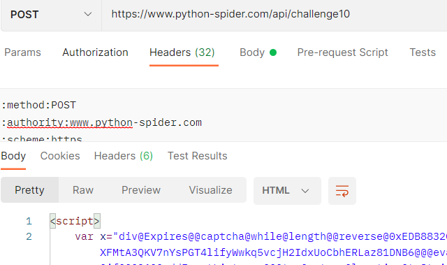

# 知识点：请求头的顺序导致请求失败

## 解题思路

浏览器可以正常返回数据，但是postman请求返回js乱码

1.浏览器header顺序是显示的顺序，不是请求发送的header顺序；

2.这里要通过Charles拦截请求地址，找到正确的header顺序；

3.由于python字典的特性，在使用requests包发起请求时候要用 requests.session() 去固定 headers 字典的顺序

    session = requests.session()
    headers = {
        'content-length': '6',
        'pragma': 'no-cache',
        'cache-control': 'no-cache',
        'sec-ch-ua': '"Not_A Brand";v="99", "Google Chrome";v="109", "Chromium";v="109"',
        'accept': 'application/json, text/javascript, */*; q=0.01',
        'content-type': 'application/x-www-form-urlencoded; charset=UTF-8',
        'x-requested-with': 'XMLHttpRequest',
        'sec-ch-ua-mobile': '?0',
        'user-agent': 'Mozilla/5.0 (Windows NT 10.0; Win64; x64) AppleWebKit/537.36 (KHTML, like Gecko) Chrome/109.0.0.0 Safari/537.36',
        'sec-ch-ua-platform': '"Windows"',
        'origin': 'https://www.python-spider.com',
        'sec-fetch-site': 'same-origin',
        'sec-fetch-mode': 'cors',
        'sec-fetch-dest': 'empty',
        'referer': 'https://www.python-spider.com/challenge/10',
        'accept-encoding': 'gzip, deflate, br',
        'accept-language': 'zh-CN,zh;q=0.9,en;q=0.8',
        'cookie': ''
    }
    session.headers = headers
    response = session.request("POST", url, data=payload)
