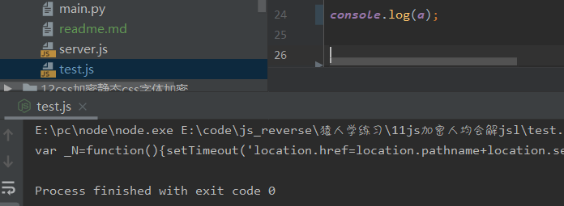
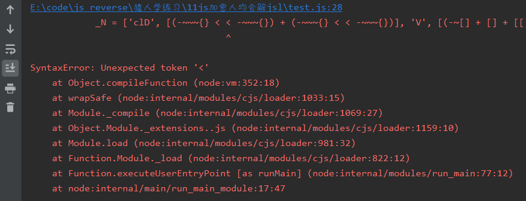
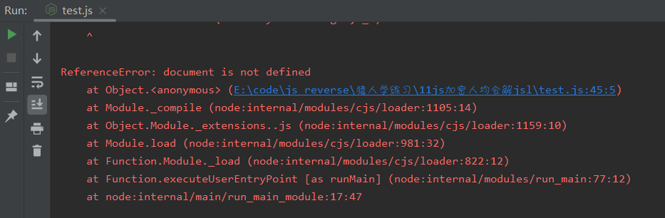
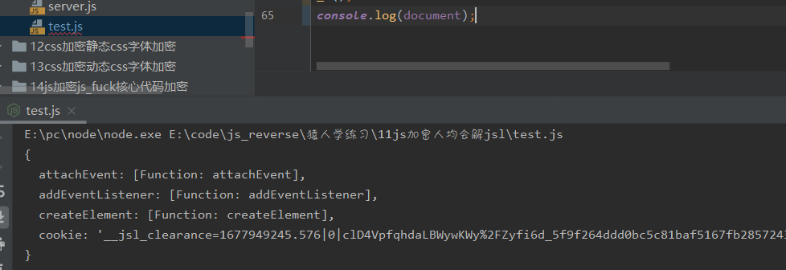

# 知识点：js生成cookie，js事件断点

## 解题思路

模拟请求地址，发现返回的是一串js

既然返回是js，那么直接事件断点

断点调试下一步，下一步，下一步，直到`https://www.python-spider.com/challenge/11`停下来

这里的会发现如下这段代码

    try {
        eval(y.replace(/\b\w+\b/g, function(y) {
            return x[f(y, z) - 1] || ("_" + y)
        }));
        break
    } catch (

把`eval`替换成`a = `,并在底部打印`a`函数

    try {
        a = (y.replace(/\b\w+\b/g, function(y) {
            return x[f(y, z) - 1] || ("_" + y)
        }));
        break
    } catch (

发现返回的是一串js，

复制出来执行一下试试，发现格式报错

继续执行，报错`document`不存在

开始补环境,缺啥补啥

    function createElement(){
        return {
            'innerHTML':'',
            'firstChild':{
                'href':'http://www.python-spider.com/challenge/11'
            }
        }
    }
    function  setTimeout (){ }
    document = {
        'attachEvent' : function(){},
        'addEventListener':function(){},
        'createElement':createElement,
    };

