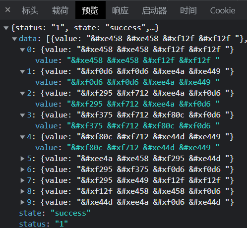
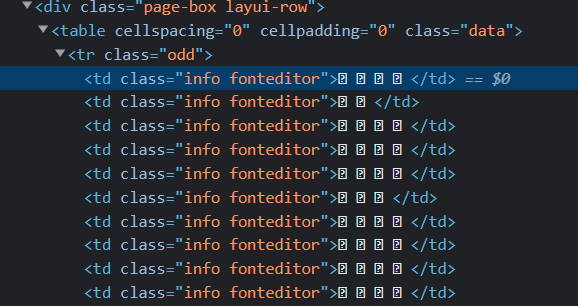
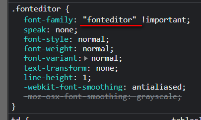
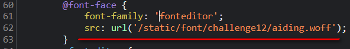
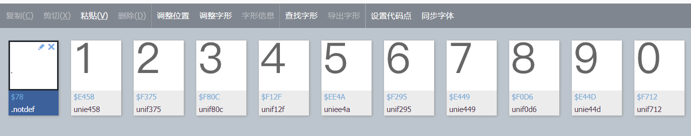

# 知识点：字体反爬

## 解题思路

查看请求链接

查看元素会看到，采集的数字都是`    `

观察`css`部分会发现`font-family: "fonteditor" !important;`

尝试全局搜索关键词`fonteditor`，发现字体的下载地址

将字体放到在线编辑器中查看，发现数字对应的编码和接口返回的结果存在对应关系

到这里就可以利用`python`的`fontTools`包进行解析操作

字体编辑器

    http://font.qqe2.com/

`Python | fontTools`的使用

    https://zhuanlan.zhihu.com/p/350807659
    
`Python`爬虫---刷新你的认知，字体反爬并没有那么简单

    https://zhuanlan.zhihu.com/p/99497149
