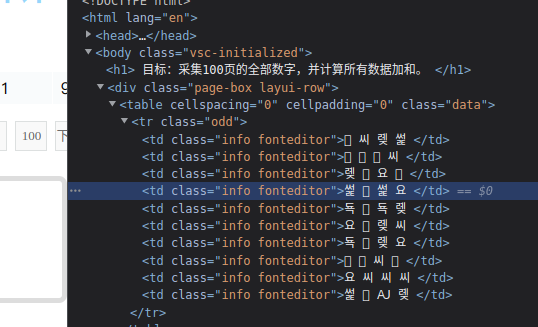
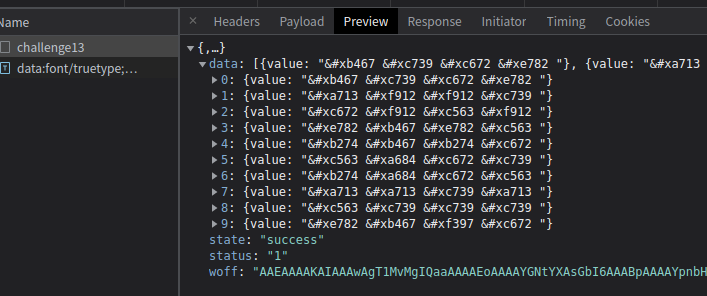
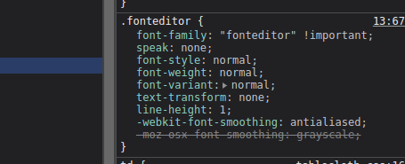
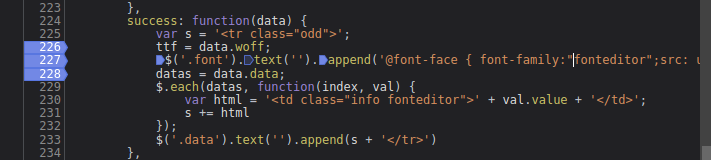
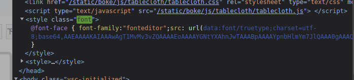
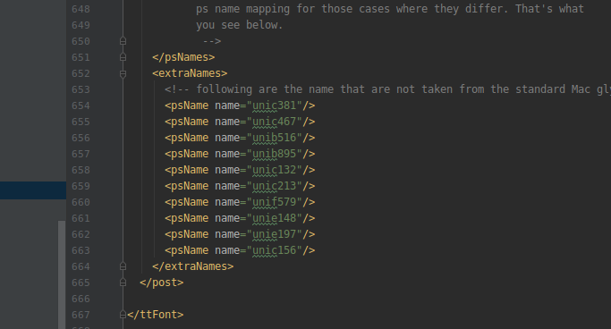

# 知识点：字体反爬

## 解题思路

查看请求链接

查看元素会看到，采集的数字都是`둧 윹 왲  `

观察`css`部分会发现`font-family: "fonteditor" !important;`

尝试全局搜索关键词`fonteditor`，发现字体生成代码

这里通过`$('.font').text('')`方法给`div class=font`设置`css`字体

    data:font/truetype;charset=utf-8;base64,+字符串

可以将字符串部分写入`woff/ttf`格式文件

    import base64
    with open('1.woff','wb') as f:
        f.write( base64.b64decode(jsobject["woff"]) )

先将字体用在线编辑器打开`https://font.qqe2.com/`

再将字体转成`xml`格式

    font = TTFont('./docs/aiding.woff')
    font.saveXML('./docs/movie.xml')

这里发现`post`节点中的`extraNames.psName`下标和显示的数字一样

      <psName name="unic381"/>  下标  1
      <psName name="unic467"/>  下标  2
      <psName name="unib516"/>  下标  3
      <psName name="unib895"/>  下标  4
      <psName name="unic132"/>  下标  5
      <psName name="unic213"/>  下标  6
      <psName name="unif579"/>  下标  7
      <psName name="unie148"/>  下标  8
      <psName name="unie197"/>  下标  9
      <psName name="unic156"/>  下标  10 就是 0

接下来就是编写代码问题了

## 参考学习

字体编辑器

    http://font.qqe2.com/

`Python | fontTools`的使用

    https://zhuanlan.zhihu.com/p/350807659
    
`Python`爬虫---刷新你的认知，字体反爬并没有那么简单

    https://zhuanlan.zhihu.com/p/99497149
