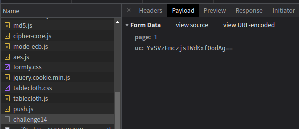
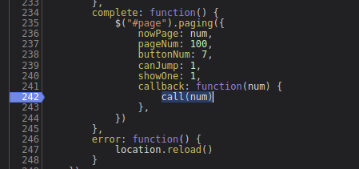
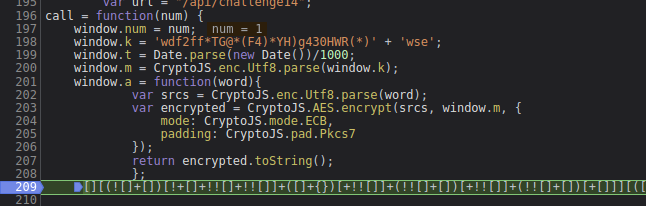
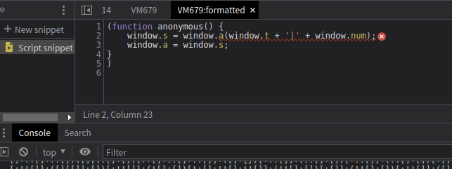

# 知识点： js fuck和CryptoJS

## 解题思路

查看请求链接

存在 uc 加密字段

断点进入

`call(num)`方法触发函数， num是page的页码

    call = function(num) {
        window.num = num;
        window.k = 'wdf2ff*TG@*(F4)*YH)g430HWR(*)' + 'wse';
        window.t = Date.parse(new Date())/1000;
        window.m = CryptoJS.enc.Utf8.parse(window.k);
        window.a = function(word){
                var srcs = CryptoJS.enc.Utf8.parse(word);
                var encrypted = CryptoJS.AES.encrypt(srcs, window.m, {
                    mode: CryptoJS.mode.ECB,
                    padding: CryptoJS.pad.Pkcs7
                });
                return encrypted.toString();
                };

继续调试代码，会发现`js fuck`乱码

在控制台用`.toString()`进入虚拟机空间

对比上下文，不难发现 `window.t + '|' + window.num` 就是加密前的原始值

加密方案是 `CryptoJS.mode.ECB` ， `CryptoJS.pad.Pkcs7`

密钥是 `'wdf2ff*TG@*(F4)*YH)g430HWR(*)' + 'wse'`

## 意外点

不知道为什么，翻页请求时会返回 `500` 错误

    <!doctype html>
    <html lang="en">
    <head>
      <title>Server Error (500)</title>
    </head>
    <body>
      <h1>Server Error (500)</h1>

    </body>
    </html>

但重复再次请求又是可以正常返回的，我这里的解决办法是`try.....except`