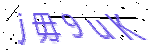
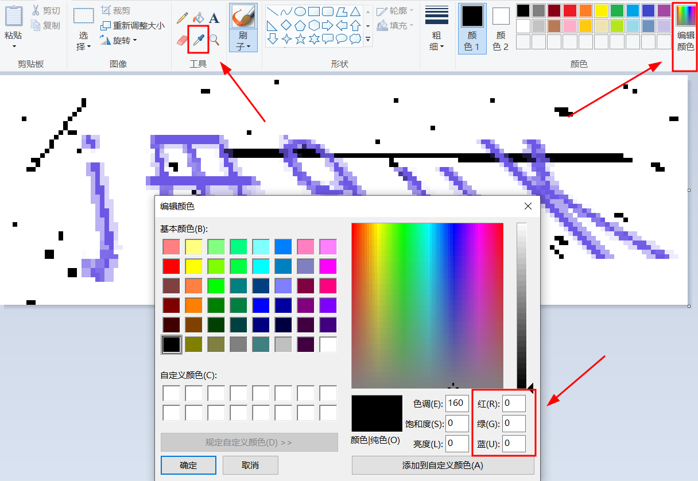
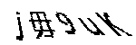

# 知识点： headers反爬，图片验证码，机器学习，图片验证码去噪点

## 解题思路

先来看一下图片验证码，为了提高识别的准确度就需要去掉噪点，用windows的画图工具打开

你会发现大部分噪点的r, g, b值都是0，0，0，也就是黑色

这就好处理了，将黑色部分全部变成白色

    # 将部分像素值变为纯白色
    if r == 0 and g == 0 and b == 0:
        img.putpixel((i, j), (255, 255, 255))

在将图片灰度转换，二值化

    img = img.convert('L')
    pixels = img.load()
    for x in range(img.width):
        for y in range(img.height):
            if pixels[x, y] > standard:
                pixels[x, y] = 255
            else:
                pixels[x, y] = 0

看一下效果图

接下来就和18题一样，利用百度ocr进行文字识别