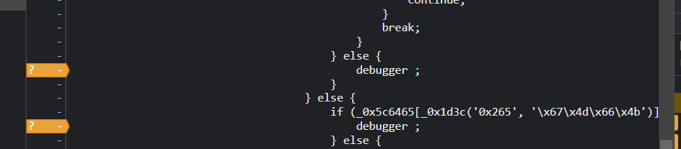
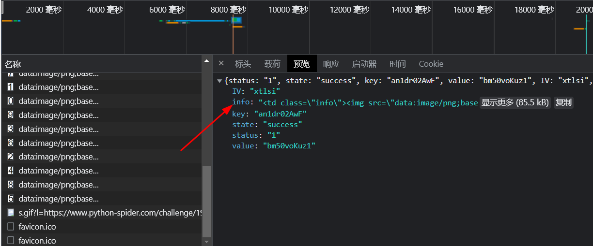
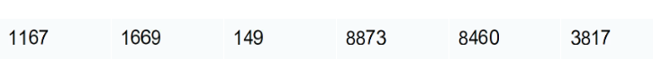
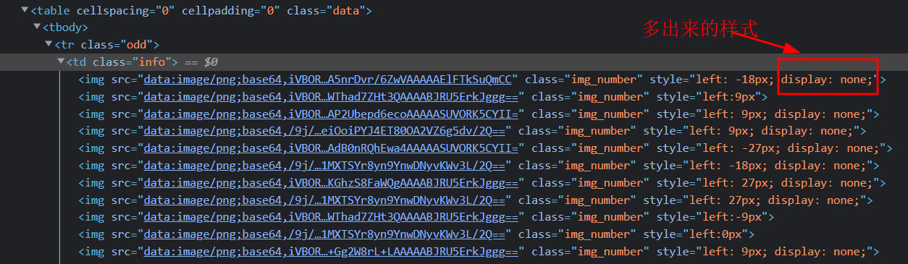
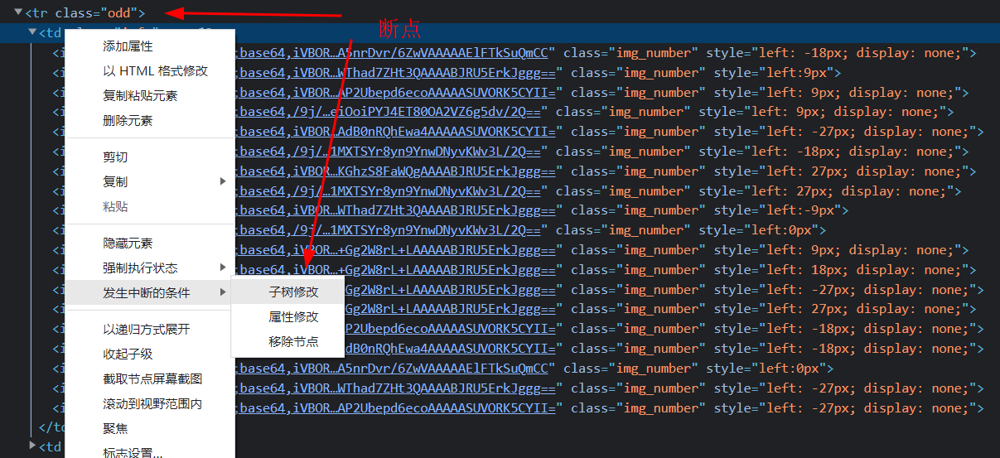
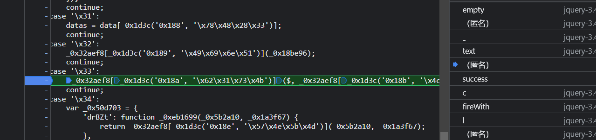
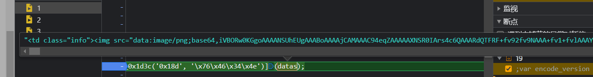
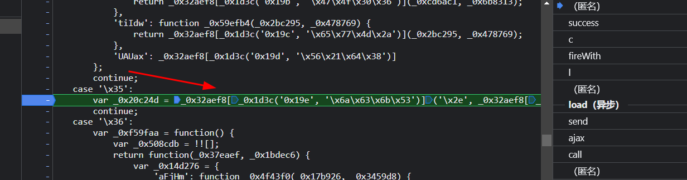
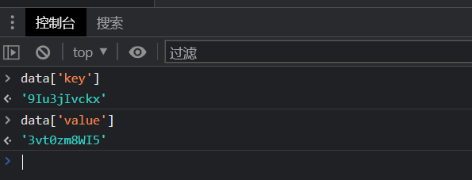
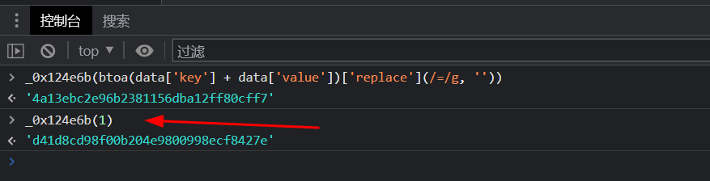

# 知识点：md5，图片识别，css位置偏移，ob混淆，debuger

## 解题思路

### 一、display: none解决思路

查看请求地址，这里有2个`debuger`直接过掉

发现接口challenge19中info字段是一段html

分析内容，发现用数字图片的方式显示内容

img标签内容`class="img_number 4a13ebc2e96b2381156dba12ff80cff7"`中的4a13ebc2e96b2381156dba12ff80cff7是一段加密字符串
`style="left:-18px"`中的left:-18px就是偏移量

    <td class=\"info\">
        
        
        
        
        
        
    </td>

查看审查元素，在审查元素中的html增加了`display: none;`css样式，但是这段代码不在接口challenge19返回结果中

html断点调试

进入断点可以找到这样一段js代码

其中的`datas`就是接口challenge19返回的html

利用控制台的打印改写js代码，如下，不难理解这就是jquery语法,将`datas`渲染到`class odd`中

    $('.odd')['text']('')['append'](datas);

仔细查看这时的变量`datas`还是没有添加`display: none;`内容

下面开始单步调试......单步调试....单步调试，找到如下图这段js代码

简单翻译一下

    var _0x20c24d = '.' + _0x124e6b(btoa(data['key'] + data['value'])['replace'](/=/g, ''));

发现`data['key'] + data['value']`就是接口challenge19返回的内容

`btoa`就是base64编码，

`_0x124e6b`就是md5加密，而且没有魔改过

返回的加密结果`4a13ebc2e96b2381156dba12ff80cff7`和html中`class="img_number`存在类似，这里就可以猜测如果`_0x124e6b`
加密后的值和`class="img_number`值相同，那么该img标签是`display: none;`

### 二、css位置偏移

css位置偏移如下，4张图片从上至下分别用`left=`+0，+9，+18，+27，得出的结果在把图片排序

### 三、图片识别

    ocr = ddddocr.DdddOcr(beta=True)
    src_num = ocr.classification(src)
